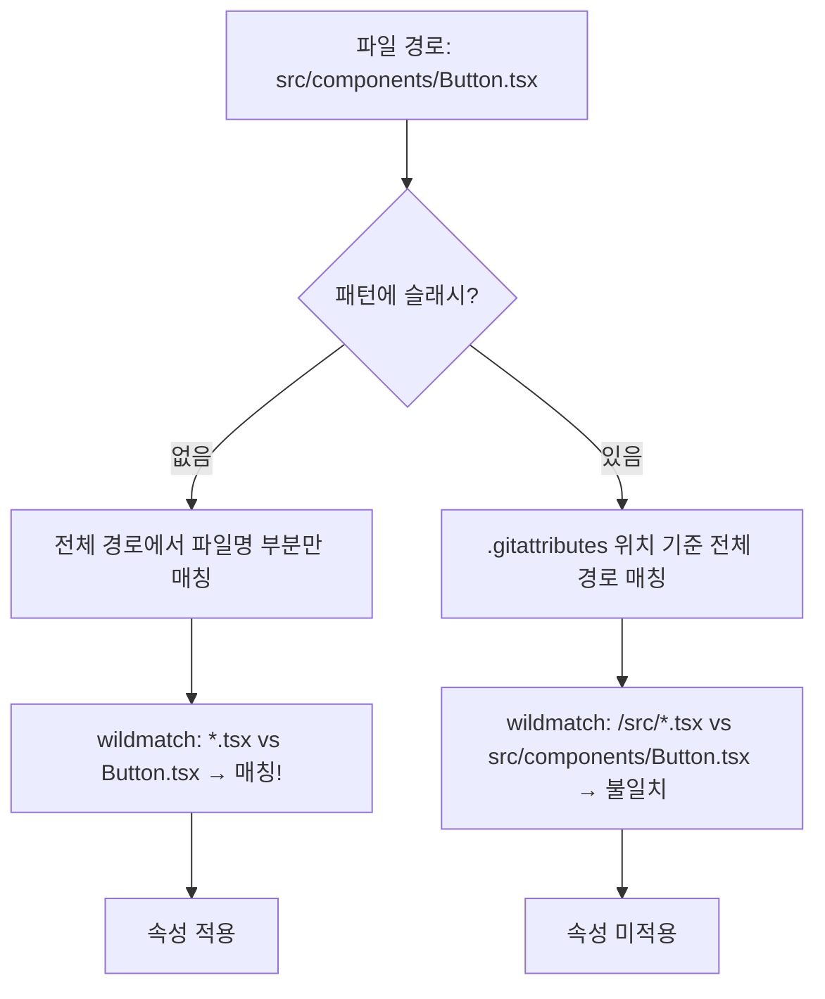
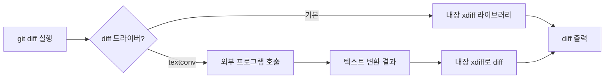
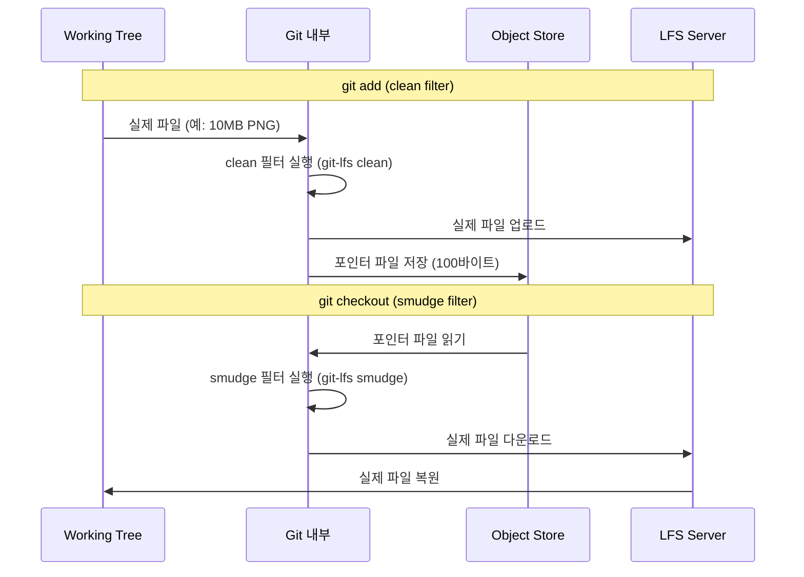

> 이전 글: [Git 해체분석기 #25: Sparse-checkout - 거대 모노레포 다루기](/posts/git-sparse-checkout/)


## 들어가며

`git diff`를 실행했을 때 Word 문서(.docx)가 바이너리로만 보이는 경험을 한 적이 있는가? 팀원마다 줄바꿈(CRLF vs LF) 때문에 merge conflict가 끊이지 않았던 기억은? 대용량 이미지 파일이 `.git/objects`를 점령해서 clone 속도가 거북이처럼 느려진 순간은?

이 모든 문제의 해결책이 `.gitattributes` 파일 하나에 담겨 있다.

`.gitattributes`는 Git에서 가장 저평가된 기능 중 하나다. 대부분의 개발자는 `.gitignore`는 잘 알지만, `.gitattributes`는 "LFS 설정할 때 한 번 건드려봤다" 정도로 넘어간다. 그러나 실제로는 Git의 핵심 동작—텍스트 처리, diff/merge 전략, 아카이브 동작—전부를 파일 단위로 제어할 수 있는 강력한 시스템이다.

오늘은 `.gitattributes`의 내장을 완전히 해부한다. 파일이 어떻게 파싱되는지, 패턴 매칭이 어떤 알고리즘으로 동작하는지, diff/merge 드라이버가 내부적으로 어떻게 연결되는지, LFS가 `.gitattributes`를 훅으로 삼는 원리까지.

---

## `.gitattributes` 파일 파싱: 내부 동작

### 어디서 읽히는가

Git이 `.gitattributes`를 읽는 위치는 다섯 곳이다:

```
1. $(prefix)/etc/gitattributes          ← 시스템 전역 (--system)
2. $XDG_CONFIG_HOME/git/attributes      ← XDG 규격
3. ~/.config/git/attributes             ← 사용자 전역 (--global)
4. $GIT_DIR/info/attributes             ← 저장소 로컬 (비공유)
5. .gitattributes                       ← 각 디렉터리 (공유됨, 커밋됨)
```

우선순위는 **낮은 번호가 낮다** (5번이 가장 높은 우선순위). 즉 워크트리 안의 `.gitattributes`가 전역 설정을 덮어쓴다.

`attr.c`의 `git_attr_system()` 함수를 보면 이 계층 구조가 명확히 드러난다:

```c
/* attr.c */
static void git_attr_system(void)
{
    /* GIT_ATTR_NOSYSTEM이 설정되면 시스템 파일 무시 */
    if (!git_attr_system_is_enabled())
        return;
    bootstrap_attr_stack(NULL, 0);
}
```

특히 디렉터리 안의 `.gitattributes`는 **해당 디렉터리와 그 하위**에만 적용된다. `src/`에 있는 `.gitattributes`는 `src/` 이하의 파일에만 적용되고, 루트의 `.gitattributes`는 전체에 적용된다.

### 파싱 알고리즘

파싱 로직은 `attr.c`의 `parse_attr_line()` 함수가 담당한다. 각 줄을 읽어 패턴과 속성 리스트로 분리하는 과정은 다음과 같다:

```c
/* attr.c - 단순화된 파싱 흐름 */
static int parse_attr_line(const char *line, const char *src,
                            int lineno, struct attr_stack *res)
{
    /* 1. 공백 및 주석(#) 건너뜀 */
    while (isspace(*line))
        line++;
    if (!*line || *line == '#')
        return 0;

    /* 2. 패턴 추출 (첫 번째 토큰) */
    /* 3. 속성 리스트 파싱:
       - "attr"    → SET (값=1)
       - "-attr"   → UNSET (값=0)
       - "!attr"   → UNSPECIFIED (없음)
       - "attr=val"→ STRING (특정 값)
    */
}
```

속성의 상태는 네 가지다:

| 표기 | 내부 상태 | 의미 |
|------|-----------|------|
| `text` | SET | 참(true) |
| `-text` | UNSET | 거짓(false) |
| `!text` | UNSPECIFIED | 정의 없음 |
| `text=auto` | STRING | 문자열 값 |

---

## 패턴 매칭 알고리즘

### `.gitignore`와 같지만 다르다

`.gitattributes`의 패턴은 `.gitignore`와 동일한 fnmatch 기반 문법을 사용하지만, 중요한 차이가 있다:

- `.gitignore`: 매칭되면 **무시**
- `.gitattributes`: 매칭되면 **속성 적용**

그리고 `.gitattributes`는 부정 패턴(`!`)을 지원하지 않는다.

### 매칭 우선순위: 마지막 규칙이 이긴다

```
# .gitattributes
*.md    text
*.md    -text
# → 결국 -text가 적용됨 (마지막 매칭 규칙)
```

동일 파일에 대해 여러 패턴이 매칭될 때는 **파일에서 나중에 나온 규칙**이 이긴다. 그러나 다른 `.gitattributes` 파일 간에는 **더 가까운(하위 디렉터리) 파일**이 이긴다.

`attr.c`의 `collect_some_attrs()` 함수를 보면, 스택 순서대로 속성을 적용하면서 이미 결정된 속성은 덮어쓰지 않는 방식을 취한다:

```c
/* attr.c */
static void collect_some_attrs(struct index_state *istate,
                               const char *path, struct attr_check *check)
{
    struct attr_stack *stk;
    int i, pathlen, rem, macroexpansion_enabled;

    /* 스택을 순서대로 순회: 더 구체적인(하위) 파일이 먼저 */
    for (stk = check->stack; stk; stk = stk->prev) {
        for (i = stk->num_matches - 1; i >= 0; i--) {
            /* 마지막 매칭 규칙이 우선 */
            const struct match_attr *a = stk->attrs[i];
            if (path_matches(a, path, pathlen, ...))
                apply_attrs(check, a);
        }
    }
}
```

### 경로 매칭: 슬래시의 의미

패턴에 슬래시가 있느냐 없느냐가 동작을 결정한다:

```
# 슬래시 없음 → 모든 디렉터리에서 매칭
*.jpg   binary

# 슬래시 있음 → 패턴 위치 기준 상대 경로
/docs/*.md   text

# 더블 스타 → 임의 깊이
**/*.generated   -diff
```

실제 경로 매칭은 `wildmatch.c`의 `wildmatch()` 함수로 수행된다. Git은 POSIX fnmatch 대신 자체 구현 wildmatch를 사용한다 — 크로스플랫폼 일관성을 위해:

```c
/* wildmatch.c */
int wildmatch(const char *pattern, const char *text, unsigned int flags)
{
    /* WM_PATHNAME: /를 특별히 취급 (디렉터리 경계) */
    /* WM_CASEFOLD: 대소문자 무시 */
    /* WM_UNICODE_CASE: 유니코드 케이스 폴딩 */
}
```



---

## text/binary 자동 감지: `text=auto`의 원리

### CRLF 지옥을 끝내는 방법

Windows는 CRLF(`\r\n`), Linux/macOS는 LF(`\n`)를 줄바꿈으로 사용한다. 크로스플랫폼 팀에서 이게 얼마나 골치 아픈지는 경험해본 사람만 안다. `.gitattributes`에서 이를 제어하는 두 속성이 있다:

- `text`: Git이 줄바꿈을 정규화한다 (체크인 시 LF로 저장)
- `eol`: 체크아웃 시 변환할 줄바꿈 방식 (`lf` 또는 `crlf`)

`text=auto`는 Git이 파일의 텍스트/바이너리 여부를 **자동 감지**해서 텍스트면 정규화를 적용하는 옵션이다.

### 자동 감지 알고리즘

자동 감지 로직은 `convert.c`의 `is_binary()` 함수에 있다:

```c
/* convert.c */
static int is_binary(unsigned long size, const char *data)
{
    /* 1. 파일 크기 0이면 텍스트로 간주 */
    if (!size)
        return 0;

    /* 2. 처음 8000바이트만 검사 (성능 최적화) */
    if (size > 8000)
        size = 8000;

    /* 3. NULL 바이트(\0)가 있으면 바이너리 */
    if (memchr(data, '\0', size))
        return 1;

    /* 4. long line 검사: 아주 긴 줄이 있으면 바이너리로 의심 */
    return 0;
}
```

핵심은 NULL 바이트 검사다. 텍스트 파일에는 `\0`이 없다. JPEG, PNG, ELF 실행파일 등 바이너리 파일에는 `\0`이 넘쳐난다.

```
# 이 한 줄이 CRLF 문제의 99%를 해결한다
* text=auto
```

실전 `.gitattributes` 예시:

```gitattributes
# 기본: 모든 파일 자동 감지
* text=auto

# 소스 코드: 항상 LF로 체크인, 체크아웃도 LF
*.py    text eol=lf
*.js    text eol=lf
*.ts    text eol=lf
*.go    text eol=lf

# Windows 배치 스크립트: CRLF 필요
*.bat   text eol=crlf
*.cmd   text eol=crlf

# 명백한 바이너리: 건드리지 않음
*.png   binary
*.jpg   binary
*.pdf   binary
*.zip   binary
```

`binary`는 사실 `-text -diff`의 축약어다. Git이 해당 파일을 바이너리로 취급하고, diff에서도 "Binary files differ"만 표시한다.

---

## diff/merge 드라이버 설정

### 사용자 정의 diff 드라이버

Git의 기본 diff는 줄 기반이다. 그러나 Word 문서, PDF, 데이터베이스 스키마 등은 줄 기반 diff가 의미 없다. 커스텀 diff 드라이버를 만들어 등록할 수 있다.

**예시: .docx 파일의 diff를 사람이 읽을 수 있게**

```gitattributes
# .gitattributes
*.docx  diff=word
```

```ini
# .git/config 또는 ~/.gitconfig
[diff "word"]
    textconv = docx2txt
    cachetextconv = true
```

여기서 `textconv`는 바이너리를 텍스트로 변환하는 외부 프로그램이다. `cachetextconv = true`는 변환 결과를 캐시해서 재사용한다.



`diff.c`에서 `run_textconv()` 함수가 외부 드라이버를 실행하고 결과를 파이프로 받아온다:

```c
/* diff.c */
static size_t fill_textconv(struct diff_driver *driver,
                             struct diff_filespec *df,
                             char **outbuf)
{
    /* 캐시 확인 */
    if (driver->textconv_cache && df->oid_valid) {
        *outbuf = notes_cache_get(driver->textconv_cache, ...);
        if (*outbuf)
            return strlen(*outbuf);
    }

    /* 외부 드라이버 실행 */
    run_command_v_opt(argv, RUN_COMMAND_NO_STDIN);
}
```

### 언어별 hunk 헤더: `xfuncname`

diff 출력에서 `@@ -10,5 +10,7 @@ function foo()` 같은 함수 컨텍스트 줄을 본 적이 있을 것이다. 이걸 제어하는 게 `xfuncname` 설정이다.

```gitattributes
*.py    diff=python
*.rs    diff=rust
*.java  diff=java
```

Git은 주요 언어에 대한 내장 패턴을 `userdiff.c`에 가지고 있다:

```c
/* userdiff.c */
static struct userdiff_driver builtin_drivers[] = {
    PATTERNS("python",
        "^[ \t]*((class|def)[ \t].*)$",
        /* ... */
    ),
    PATTERNS("rust",
        "^[[:space:]]*(pub[[:space:]]+)?"
        "(fn|struct|enum|impl|trait|mod)[[:space:]].*",
        /* ... */
    ),
    /* 수십 개의 언어 내장 */
};
```

이 정규식이 hunk 헤더의 컨텍스트 라인을 결정한다.

### 사용자 정의 merge 드라이버

merge conflict는 Git의 3-way merge가 어떻게 합칠지 판단 못할 때 발생한다. 특정 파일 타입에 대해서는 더 스마트한 merge 전략이 있을 수 있다.

```gitattributes
# package.json: 의미론적 merge 필요
package.json    merge=npm-merge-driver
package-lock.json merge=npm-merge-driver

# iOS 프로젝트 파일
*.pbxproj   merge=union
```

`union` merge 드라이버는 내장 드라이버로, 충돌 시 양쪽 변경사항을 모두 포함시킨다. Xcode 프로젝트 파일처럼 UUID 기반으로 구성된 파일에 유용하다.

커스텀 드라이버 설정:

```ini
[merge "npm-merge-driver"]
    name = npm merge driver
    driver = npx npm-merge-driver merge %O %A %B %L %P
    recursive = binary
```

드라이버가 받는 인수:
- `%O`: 공통 조상 (base)
- `%A`: 현재 브랜치 (ours)
- `%B`: 병합 브랜치 (theirs)
- `%L`: conflict 마커 크기
- `%P`: 병합 중인 파일의 경로명

merge 드라이버 실행은 `merge-recursive.c`와 `ll-merge.c`에서 처리된다:

```c
/* ll-merge.c */
static int ll_ext_merge(const struct ll_merge_driver *fn,
                         mmbuffer_t *result,
                         const char *path, ...)
{
    /* 임시 파일에 base/ours/theirs 저장 */
    /* 외부 드라이버 실행 */
    /* 드라이버 반환값 확인 (0=성공, 1=충돌, 기타=오류) */
}
```

---

## LFS와의 연동 원리

### LFS는 결국 `.gitattributes` 훅이다

Git LFS(Large File Storage)는 마법처럼 보이지만, 실제로는 `.gitattributes`의 `filter` 속성을 훅으로 사용한다.

`git lfs track "*.psd"`를 실행하면 딱 두 가지 일이 벌어진다:
1. `.gitattributes`에 한 줄 추가
2. `git config`에 필터 드라이버 등록

```gitattributes
# git lfs track 후 자동 추가됨
*.psd   filter=lfs diff=lfs merge=lfs -text
*.mp4   filter=lfs diff=lfs merge=lfs -text
*.zip   filter=lfs diff=lfs merge=lfs -text
```

```ini
# ~/.gitconfig (git lfs install이 추가)
[filter "lfs"]
    clean = git-lfs clean -- %f
    smudge = git-lfs smudge -- %f
    process = git-lfs filter-process
    required = true
```

### clean/smudge 필터의 동작

이것이 LFS의 핵심 트릭이다. Git은 두 방향으로 필터를 적용한다:



포인터 파일의 실제 내용:

```
version https://git-lfs.github.com/spec/v1
oid sha256:4d7a214614ab2935c943f9e0ff69d22eadbb8f32b1258daaa5e2ca24d17e2393
size 12345678
```

이 100바이트짜리 포인터가 `.git/objects`에 저장되고, 실제 파일은 LFS 서버(GitHub, GitLab, 자체 호스팅 등)에 저장된다.

### process 필터: 성능 최적화

`process = git-lfs filter-process`는 `clean`/`smudge`보다 효율적인 long-running process 방식이다. 파일마다 프로세스를 시작하는 대신, 하나의 프로세스가 Git과 지속적으로 통신한다.

프로토콜은 pkt-line 형식을 사용한다 (`pkt-line.c`의 `packet_write_fmt()` 등). Git 2.11에서 도입된 이 방식으로 LFS는 파일 수백 개를 처리할 때 훨씬 빠르게 동작한다.

---

## 언어별 diff 하이라이팅: Linguist 연동

### GitHub가 파일 언어를 감지하는 방법

GitHub는 저장소의 언어 통계를 표시한다. 이것도 `.gitattributes`로 제어할 수 있다. GitHub Linguist가 사용하는 속성들:

```gitattributes
# 특정 파일을 문서로 분류 (언어 통계에서 제외)
*.md    linguist-documentation=true
docs/   linguist-documentation=true

# 벤더링된 파일 제외
vendor/         linguist-vendored=true
node_modules/   linguist-vendored=true

# 생성된 파일 표시
*.min.js    linguist-generated=true
dist/       linguist-generated=true

# 언어 강제 지정
*.h     linguist-language=C

# 언어 통계에 강제 포함/제외
*.sql   linguist-detectable=true
```

Linguist는 별도의 Ruby 라이브러리지만, Git 저장소의 `.gitattributes`를 직접 파싱해서 이 속성들을 읽는다. GitHub 서버사이드에서 push 후 언어 감지를 실행할 때 이 파일을 기준으로 삼는다.

---

## export-ignore와 export-subst

### `git archive`를 정교하게 제어하기

`git archive`는 특정 커밋의 스냅샷을 zip이나 tar로 만드는 명령이다. 오픈소스 릴리즈 패키지를 만들 때 자주 쓴다. `export-ignore`와 `export-subst`는 이 동작을 제어하는 속성이다.

```gitattributes
# 개발 전용 파일 → 릴리즈 패키지에 포함하지 않음
.github/            export-ignore
.gitignore          export-ignore
tests/              export-ignore
docs/internal/      export-ignore
Makefile.dev        export-ignore
```

```bash
# 이렇게 만든 zip에는 .github/, tests/ 등이 없음
git archive --format=zip --prefix=mylib-1.0/ HEAD > mylib-1.0.zip
```

`archive.c`의 `write_archive_entry()` 함수는 각 파일을 처리할 때 `check_attr()`을 호출해서 `export-ignore` 속성이 SET인지 확인하고, SET이면 해당 파일을 건너뛴다:

```c
/* archive.c */
static int write_archive_entry(...)
{
    /* export-ignore 체크 */
    if (check_attr_export_ignore(path))
        return 0; /* 이 파일 건너뜀 */

    /* export-subst 처리 */
    if (check_attr_export_subst(path))
        apply_export_subst_filter(buf);

    /* 아카이브에 추가 */
    write_to_archive(buf);
}
```

### `export-subst`: 릴리즈에 메타데이터 주입

`export-subst`는 파일 안의 `$Format:...$ ` 플레이스홀더를 Git 정보로 치환한다. `$Format:`은 `git log --format=`과 같은 형식 지정자를 받는다:

```
# VERSION 파일 내용
$Format:%H$
$Format:Released on %ci by %an$
$Format:%D$
```

```gitattributes
VERSION     export-subst
```

```bash
git archive HEAD | tar xf - VERSION && cat VERSION
# 출력:
# a1b2c3d4e5f6789012345678901234567890abcd
# Released on 2026-02-18 09:00:00 +0900 by Gideok Kim
# HEAD -> main, tag: v1.2.3
```

아카이브를 생성할 때만 치환이 일어난다. 저장소 안에서는 원본 `$Format:...$ ` 텍스트가 유지된다.

---

## 속성 매크로: 복잡한 설정을 한 단어로

반복되는 속성 조합을 매크로로 정의할 수 있다. `[attr]`로 시작하는 줄이 매크로 정의다:

```gitattributes
# 매크로 정의
[attr]lockable  -diff -merge

# 매크로 사용
*.lock          lockable
Cargo.lock      lockable
package-lock.json lockable
yarn.lock       lockable
```

`binary` 자체도 사실 Git 내부에 정의된 매크로다:

```c
/* attr.c */
/* "binary" 매크로는 C 코드 레벨에서 하드코딩됨 */
/* binary = -diff -merge -text */
```

---

## 실전: 완전한 `.gitattributes` 템플릿

모든 개념을 통합한 실전 예시:

```gitattributes
# ===================================================
# .gitattributes - 프로젝트 전체 Git 동작 정의
# ===================================================

# 기본: 모든 파일 텍스트 자동 감지 + LF 정규화
* text=auto eol=lf

# ----- 소스 코드 -----
*.ts    text eol=lf diff=typescript
*.tsx   text eol=lf diff=typescript
*.js    text eol=lf
*.py    text eol=lf diff=python
*.go    text eol=lf
*.rs    text eol=lf diff=rust

# ----- Windows 전용 스크립트 -----
*.bat   text eol=crlf
*.cmd   text eol=crlf
*.ps1   text eol=crlf

# ----- 데이터/설정 파일 -----
*.json  text eol=lf
*.yaml  text eol=lf
*.toml  text eol=lf
*.xml   text eol=lf

# ----- 바이너리 (건드리지 않음) -----
*.png   binary
*.jpg   binary
*.gif   binary
*.ico   binary
*.pdf   binary
*.zip   binary
*.tar   binary

# ----- LFS 대상 (대용량 파일) -----
*.psd   filter=lfs diff=lfs merge=lfs -text
*.sketch filter=lfs diff=lfs merge=lfs -text
*.mp4   filter=lfs diff=lfs merge=lfs -text

# ----- 생성 파일 diff 제외 -----
*.min.js        -diff
dist/**         -diff
*.generated.*   -diff

# ----- 릴리즈 패키지 제외 -----
.github/            export-ignore
tests/              export-ignore
docs/internal/      export-ignore
*.test.ts           export-ignore
jest.config.js      export-ignore

# ----- GitHub Linguist -----
node_modules/       linguist-vendored=true
dist/               linguist-generated=true
*.md                linguist-documentation=true

# ----- merge 전략 -----
package-lock.json   merge=union
yarn.lock           merge=union
```

---

## 마치며

`.gitattributes`는 "파일 하나를 커밋에 추가하는 것"으로 팀 전체의 Git 동작을 통일시킬 수 있는 강력한 도구다. 주요 핵심을 정리하면:

1. **파싱 우선순위**: 하위 디렉터리의 `.gitattributes`가 상위보다 우선. 같은 파일 안에선 나중 규칙이 우선
2. **패턴 매칭**: fnmatch 기반 wildmatch. 슬래시 유무가 전역/상대 매칭을 결정
3. **text=auto**: NULL 바이트 기반 자동 감지. 처음 8000바이트만 검사
4. **diff/merge 드라이버**: `textconv`로 바이너리를 텍스트로 변환, 외부 도구를 merge 드라이버로 등록 가능
5. **LFS**: `filter=lfs`가 clean/smudge 훅을 달아 포인터 교환을 투명하게 처리
6. **export-ignore**: `git archive` 시 개발 전용 파일 제외. 릴리즈 패키지를 깔끔하게
7. **export-subst**: 아카이브 생성 시 `$Format:...$` 플레이스홀더를 Git 메타데이터로 치환

`.gitattributes`를 잘 설정한 저장소와 그렇지 않은 저장소의 차이는 팀이 커질수록 극명해진다. CRLF 충돌로 낭비하는 시간, 대용량 파일로 부풀어 오른 `.git/objects`, 쓸모없는 바이너리 diff — 이 모든 것이 파일 하나로 정리된다.

Git은 그 자체로 완성된 생태계다. `.gitattributes`는 그 생태계의 규칙판이다. 일찍 설정할수록 덜 고생한다.
