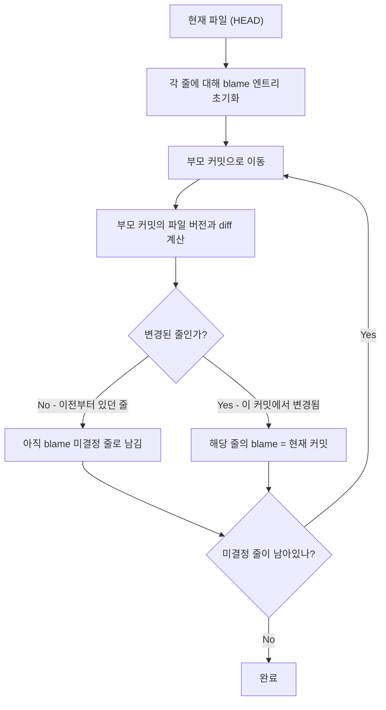
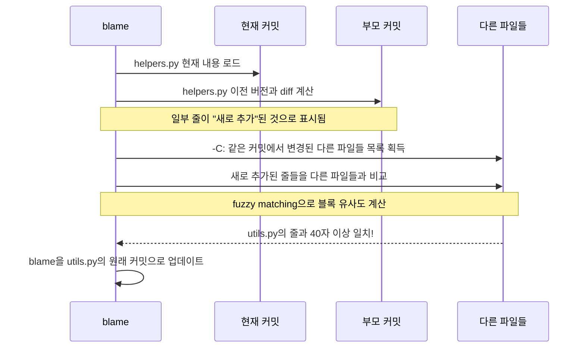

> "이 코드 누가 짠 거야?" — 그 사람이 바로 당신일 때의 침묵

## 들어가며

프로덕션에 버그가 터졌습니다. 에러 스택을 따라가다 보니 어떤 파일의 42번째 줄이 문제입니다. 코드를 열어보면 의문이 생깁니다.

```python
# 왜 여기서 갑자기 1을 더하는 거지?
result = calculate(value) + 1
```

`+1`은 왜 있을까요? 버그일까요, 아니면 어떤 엣지 케이스를 처리하기 위한 의도적인 코드일까요? 이걸 알아야 고칠 수 있는데, 커밋 메시지도 없고 주석도 없습니다.

이때 `git blame`이 등장합니다.

```bash
$ git blame -L 42,42 calculate.py
^a3f8c2e (김기덕 2025-11-03 14:22:31 +0900 42) result = calculate(value) + 1
```

커밋 해시, 작성자, 날짜, 줄 번호. 이제 그 커밋으로 가서 컨텍스트를 확인하면 됩니다. 하지만 `git blame`은 단순한 "범인 찾기" 도구가 아닙니다. 내부적으로는 꽤 정교한 알고리즘이 돌아가고 있습니다.

오늘은 `git blame`의 내장을 꺼내 봅니다.

---

## 1. git blame이 실제로 하는 일

### 기본 동작

`git blame <file>`을 실행하면 파일의 각 줄에 대해 "이 줄을 마지막으로 수정한 커밋"을 찾아냅니다. 출력 형식은 이렇습니다:

```
^a3f8c2e (김기덕        2025-11-03 14:22:31 +0900  42) result = calculate(value) + 1
│         │             │                           │
│         └─ 작성자     └─ 커밋 날짜               └─ 내용
└─ 커밋 해시 (앞 8자)
```

`^` 접두사는 "저장소 최초 커밋"을 의미합니다. 즉, 이 줄은 첫 커밋부터 변경되지 않았다는 뜻입니다.

### 내부 알고리즘: Pickaxe가 아니라 Diff Tracking

많은 사람들이 blame을 단순히 "각 줄을 마지막으로 수정한 커밋을 찾는 것"이라고 생각합니다. 맞긴 한데, **어떻게** 찾는지가 중요합니다.

Git blame의 핵심 알고리즘은 `blame.c`에 있습니다. 기본 흐름은 이렇습니다:



핵심은 **현재에서 과거로 거슬러 올라가며** diff를 계산한다는 점입니다. 각 커밋에서 "이 줄이 변경됐나?"를 확인하고, 변경된 줄의 blame을 확정합니다. 모든 줄의 blame이 확정되면 탐색을 멈춥니다.

### .git 내부에서 blame이 읽는 것들

`git blame`은 내부적으로 여러 Git 오브젝트를 순회합니다:

```bash
# blame 실행 시 Git이 접근하는 파일들
.git/
├── objects/           # ← blob, tree, commit 오브젝트
│   ├── pack/         # ← 패킹된 오브젝트 (대부분의 히스토리)
│   └── [loose]       # ← 최근 오브젝트들
├── refs/
│   └── heads/main    # ← 현재 브랜치 HEAD 위치
└── packed-refs       # ← 패킹된 레퍼런스
```

blame이 동작하는 순서를 실제 Git 오브젝트 레벨에서 보면:

```
1. HEAD → refs/heads/main → 커밋 해시 (e.g. a3f8c2e...)
2. commit object(a3f8c2e) → tree object 참조
3. tree object → blob object (파일 내용) 참조
4. blob object = 파일의 특정 버전 내용
5. 부모 커밋(parent)으로 이동 → 반복
```

각 커밋은 스냅샷이지, diff가 아닙니다. 그래서 blame은 **두 스냅샷 사이의 diff를 직접 계산**해야 합니다. 이게 blame이 히스토리가 길수록 느려지는 이유입니다.

```bash
# strace로 실제로 어떤 파일을 읽는지 확인 (macOS: dtruss)
$ strace -e openat git blame README.md 2>&1 | grep objects | head -10
openat(AT_FDCWD, ".git/objects/pack/pack-abc123.idx", ...)
openat(AT_FDCWD, ".git/objects/pack/pack-abc123.pack", ...)
```

---

## 2. -C와 -M: 복사와 이동을 추적하는 법

### 기본 blame의 한계

`git blame`의 가장 큰 약점은 **리팩토링에 약하다**는 점입니다.

```python
# utils.py에서 helpers.py로 함수를 그대로 복붙했다고 가정
```

코드가 `utils.py`에서 `helpers.py`로 이동됐다면, 기본 blame은 이동 커밋을 blame으로 찍습니다. 실제로 코드를 처음 작성한 커밋은 추적하지 못합니다.

```bash
$ git blame helpers.py
^b7c92af (리팩토링봇  2026-01-15 09:00:00 +0900  1) def calculate_tax(amount):
^b7c92af (리팩토링봇  2026-01-15 09:00:00 +0900  2)     return amount * 0.1
```

"리팩토링봇"이 이 코드를 작성한 게 아닌데, 이동 커밋이 blame으로 찍혔습니다.

### -M 옵션: 같은 파일 내 이동 추적

`-M` 옵션은 **같은 파일 내에서** 이동된 코드 블록을 감지합니다.

```bash
$ git blame -M helpers.py
```

내부적으로 `-M`은 현재 파일에서 "blame이 해당 커밋인 줄들"과 이전 버전의 줄들을 비교해 **이동된 블록**을 찾습니다. 임계값(기본 20줄)을 넘는 일치 블록이 있으면 이동으로 판단합니다.

```bash
# 임계값 조정 (숫자 = 이동으로 판단할 최소 줄 수)
$ git blame -M5 helpers.py   # 5줄 이상이면 이동으로 추적
```

### -C 옵션: 파일 간 복사/이동 추적

`-C`는 더 강력합니다. **다른 파일에서** 복사되거나 이동된 코드도 추적합니다.

```bash
$ git blame -C helpers.py
^a1e3f9c (김기덕  2025-09-10 16:45:22 +0900  1) def calculate_tax(amount):
^a1e3f9c (김기덕  2025-09-10 16:45:22 +0900  2)     return amount * 0.1
```

이제 진짜 원작자인 김기덕이 찍혔습니다. `-C`를 여러 번 쓰면 추적 범위가 넓어집니다:

```bash
$ git blame -C helpers.py        # 같은 커밋에서 수정된 파일들만 비교
$ git blame -CC helpers.py       # 파일이 생성된 커밋까지 비교
$ git blame -CCC helpers.py      # 모든 커밋에서 비교 (매우 느림)
```

### -C가 내부적으로 하는 일



내부적으로는 **유사도 기반 매칭**입니다. 완전히 동일한 줄만 추적하는 게 아니라, 일정 비율 이상 일치하면 "이동된 코드"로 판단합니다. 이 비율은 `blame.c`의 `SIMILAR_SCORE_THRESHOLD`로 정의돼 있습니다.

---

## 3. git log -S와 -G: blame의 다른 면

### blame vs log -S vs log -G

`git blame`이 "이 줄을 마지막으로 바꾼 커밋"을 찾는다면, `git log -S`와 `-G`는 다른 질문에 답합니다.

| 도구 | 질문 |
|------|------|
| `git blame` | 이 줄을 **마지막으로** 수정한 커밋은? |
| `git log -S` | 이 문자열이 **추가/삭제된** 커밋은? (Pickaxe) |
| `git log -G` | 이 패턴이 **diff에 등장하는** 커밋은? |

### git log -S: Pickaxe 알고리즘

`-S` 옵션은 "Pickaxe"라고 불립니다. 특정 문자열이 파일에 **추가되거나 삭제된** 커밋만 보여줍니다.

```bash
# "calculate_tax"라는 문자열이 추가되거나 삭제된 모든 커밋
$ git log -S "calculate_tax" --oneline
a1e3f9c (HEAD~50) feat: add tax calculation
b7c92af (HEAD~20) refactor: move to helpers module
```

**Pickaxe의 내부 동작:**

```python
# 개념적 구현 (실제 C 코드 아님)
def pickaxe(commit, search_string):
    parent = commit.parents[0]
    
    # 부모와 현재 커밋의 해당 문자열 등장 횟수 비교
    count_before = count_occurrences(parent.tree, search_string)
    count_after = count_occurrences(commit.tree, search_string)
    
    # 등장 횟수가 변했다면 이 커밋에서 추가/삭제된 것
    return count_before != count_after
```

핵심: `-S`는 **등장 횟수의 변화**를 감지합니다. 문자열이 단순히 이동됐다면 (삭제+추가), `-S`는 그 커밋을 **보여줍니다**. 등장 횟수가 바뀌지 않았다면 스킵합니다.

### git log -G: 정규식 Diff 검색

`-G`는 다릅니다. diff 자체에서 패턴이 **등장하는** 커밋을 찾습니다.

```bash
# diff 내용에 "calculate_tax"가 포함된 모든 커밋
$ git log -G "calculate_tax" --oneline
a1e3f9c feat: add tax calculation
b7c92af refactor: move to helpers module
d4f1c8b fix: typo in calculate_tax comment
```

`-G`는 정규식을 지원합니다:

```bash
# 함수 정의가 변경된 커밋 찾기
$ git log -G "def calculate_.*\(amount" --oneline
```

### 세 도구의 실전 비교

```bash
# 시나리오: "calculate_tax" 함수가
# 1. utils.py에서 처음 작성됨 (커밋 A)
# 2. 파일 내에서 위치가 바뀜 (커밋 B)
# 3. helpers.py로 이동됨 (커밋 C)
# 4. 함수 내용이 수정됨 (커밋 D)

$ git blame helpers.py | grep calculate_tax
# → 커밋 D (마지막 수정)

$ git log -S "calculate_tax" helpers.py --oneline
# → 커밋 C (helpers.py에서 처음 등장), 커밋 D (변경)
# 커밋 B는 같은 파일 내 이동이라 등장 횟수 불변 → 스킵

$ git log -G "calculate_tax" helpers.py --oneline
# → 커밋 C, D (diff에 등장하는 모든 커밋)
```

---

## 4. 실전 디버깅 활용법

### 패턴 1: 버그의 출처 역추적

버그를 발견했을 때의 워크플로우:

```bash
# 1단계: 문제 줄 특정
$ git blame -L 38,45 src/payment.py

# 2단계: 커밋 확인
$ git show a3f8c2e

# 3단계: 그 커밋의 전체 컨텍스트 확인
$ git show a3f8c2e --stat

# 4단계: 이 줄이 원래 어디서 왔는지 추적
$ git blame -C -L 38,45 src/payment.py

# 5단계: 이 문자열이 변경된 모든 시점 확인
$ git log -S "result = calculate(value) + 1" --all --oneline
```

### 패턴 2: 범위 지정 blame

특정 함수만 blame하기:

```bash
# -L로 줄 범위 지정
$ git blame -L 100,200 main.py

# 함수 이름으로 범위 지정 (Git 2.x+)
$ git blame -L :calculate_tax helpers.py

# 정규식으로 범위 지정
$ git blame -L '/def calculate_tax/,/^def /' helpers.py
```

### 패턴 3: 특정 시점의 blame

현재가 아니라 과거 특정 시점의 blame:

```bash
# 3개월 전 파일의 blame
$ git blame main.py --date=short HEAD~90

# 특정 태그 기준
$ git blame main.py v1.2.3

# 특정 날짜 기준
$ git blame main.py HEAD@{2025-11-01}
```

### 패턴 4: git log -S로 변경 히스토리 완전 추적

blame으로 찾은 커밋이 "리팩토링 커밋"이라면, 더 깊이 파야 합니다:

```bash
# 현재 blame이 리팩토링 커밋을 가리킴
$ git blame -C helpers.py | head -5
^b7c92af (리팩토링봇 2026-01-15 ...) def calculate_tax(amount):

# -S로 이 코드가 처음 추가된 커밋 찾기
$ git log --all -S "def calculate_tax" --follow --oneline
a1e3f9c feat: add tax calculation utility  # ← 원본
b7c92af refactor: reorganize helper modules

# 원본 커밋 확인
$ git show a1e3f9c
```

### 패턴 5: 시각화된 blame (포세린)

터미널에서 대화형으로 blame을 탐색하는 법:

```bash
# tig의 blame 모드
$ tig blame src/payment.py

# 특정 줄로 바로 이동
$ tig blame +42 src/payment.py
```

tig에서 `Enter`를 누르면 해당 커밋으로, `B`를 누르면 그 커밋 이전 버전의 blame으로 이동할 수 있습니다. 재귀적으로 코드의 역사를 파고들 수 있습니다.

---

## 5. blame이 거짓말하는 경우

### 리포맷팅 커밋

코드를 실제로 변경하지 않았는데 blame이 잘못 찍히는 경우:

```bash
# prettier나 black으로 전체 파일 포맷팅
$ git log --oneline
f3a9b12 style: apply black formatter  # ← 이 커밋이 모든 줄을 덮어씀

$ git blame utils.py
# 거의 모든 줄이 f3a9b12를 가리킴 → 의미 없음
```

해결책: `-w` 옵션으로 공백 변경 무시:

```bash
$ git blame -w utils.py
# 공백/들여쓰기 변경은 무시하고 실제 내용 변경만 추적
```

또는 포맷팅 커밋을 blame에서 제외:

```bash
# .git-blame-ignore-revs 파일 생성
$ echo "f3a9b12c..." >> .git-blame-ignore-revs

# blame 시 무시
$ git blame --ignore-revs-file .git-blame-ignore-revs utils.py

# 프로젝트 전체 설정으로 등록
$ git config blame.ignoreRevsFile .git-blame-ignore-revs
```

이 기능은 GitHub도 지원합니다. `.git-blame-ignore-revs` 파일을 루트에 두면 GitHub의 blame 뷰에서도 자동으로 적용됩니다.

### 대규모 리팩토링

함수 추출, 클래스 분리 등의 리팩토링은 `-C` 옵션으로도 완전히 추적하기 어렵습니다. 이 경우 `git log -S`나 `git log -G`로 문자열 레벨에서 추적하는 게 더 효과적입니다.

---

## 6. 성능과 한계

### blame이 느린 이유

```mermaid
graph LR
    subgraph "blame 계산 비용"
        A[커밋 수 N] --> D[O(N × M) 복잡도]
        B[파일 크기 M줄] --> D
        C[-C 옵션] --> E[O(N × F × M)]
        F[비교 파일 수 F] --> E
    end
```

-C 옵션을 쓰면 각 커밋마다 다른 파일들과도 비교해야 해서 시간이 기하급수적으로 늘어날 수 있습니다.

```bash
# 성능 비교
$ time git blame huge_file.py                    # 빠름
$ time git blame -C huge_file.py                 # 느림
$ time git blame -CCC huge_file.py               # 매우 느림

# 부분적으로만 blame (성능 최적화)
$ git blame -L 1,100 huge_file.py               # 처음 100줄만
```

### blame의 근본적 한계

blame은 **줄 단위**로 추적합니다. 줄이 삭제됐다가 다시 추가되면 원래 blame을 잃습니다. 또한 merge commit은 특별하게 처리됩니다:

```bash
# merge commit의 blame은 어떤 브랜치에서 온 코드인지도 보여줌
$ git blame -M --first-parent main.py
```

`--first-parent`는 머지된 브랜치의 커밋은 무시하고 main 브랜치의 직접 커밋만 추적합니다.

---

## 마치며

`git blame`은 단순한 "범인 찾기" 도구가 아닙니다.

- **내부적으로는** 현재에서 과거로 거슬러 올라가며 스냅샷 간 diff를 계산합니다
- **-C/-M 옵션**으로 리팩토링된 코드도 원작자까지 추적할 수 있습니다
- **git log -S/-G**와 조합하면 코드 한 줄의 전체 생애를 추적할 수 있습니다
- **`.git-blame-ignore-revs`**로 포맷팅 커밋처럼 "노이즈" 커밋을 걸러낼 수 있습니다

진짜 디버깅에서 blame의 워크플로우는 이렇습니다:

```
버그 발견
  → git blame으로 마지막 수정 커밋 확인
  → git show로 그 커밋의 맥락 이해
  → blame이 리팩토링 커밋이라면 -C 옵션 추가
  → 여전히 불분명하면 git log -S로 문자열 히스토리 전체 탐색
  → tig blame으로 대화형 역추적
```

코드는 그 자체로 의미를 담기 어렵습니다. 히스토리가 맥락을 설명합니다. `git blame`은 그 맥락으로 가는 문입니다.

그리고 가끔, `git blame`이 가리키는 커밋 작성자가 당신일 때, 그게 가장 정직한 디버깅의 시작점입니다.

---

