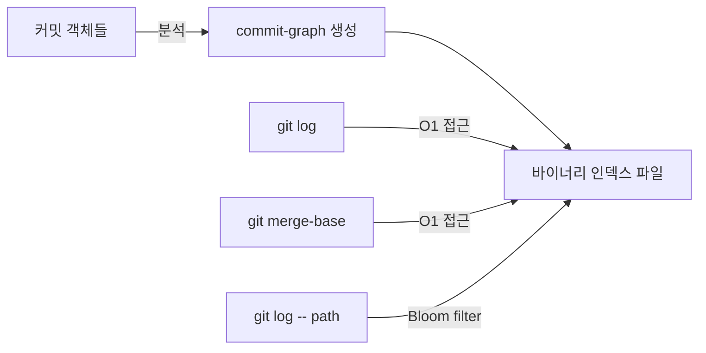
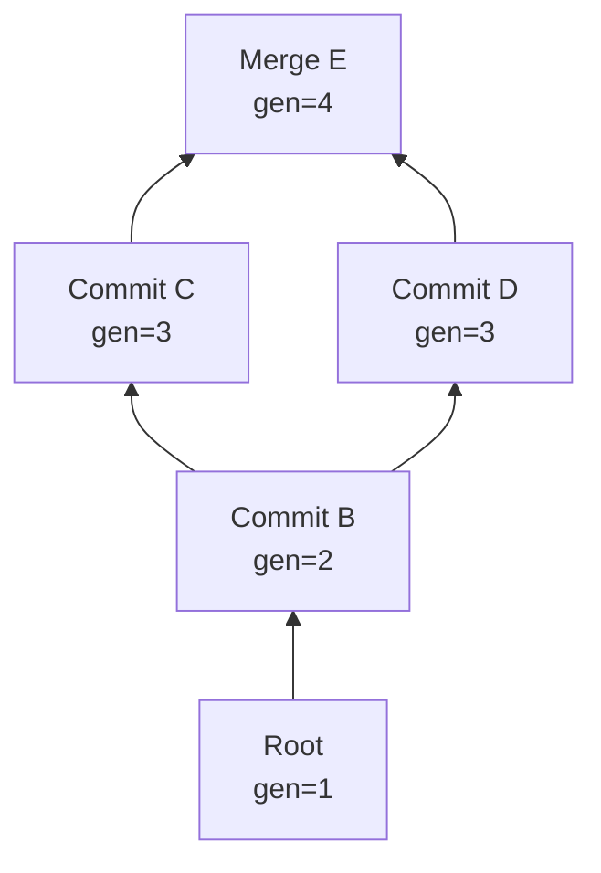

## 들어가며

수백만 개의 커밋을 가진 거대한 리포지토리에서 `git log --graph` 명령을 실행하면 어떤 일이 벌어질까? 전통적으로 Git은 각 커밋 객체를 하나씩 읽어가며 부모 커밋을 찾고, 그래프를 재구성했다. 커밋이 늘어날수록 이 과정은 점점 더 느려진다.

하지만 Git 2.18(2018년)부터 도입된 **commit-graph** 파일은 이 문제를 혁신적으로 해결한다. 커밋 그래프의 구조를 미리 계산하여 별도 파일에 저장함으로써, 커밋 부모 탐색을 O(1)로 만들고, generation number를 통해 reachability 검사를 최적화하며, Bloom filter로 경로 기반 쿼리까지 가속화한다.

오늘은 이 commit-graph 파일의 내부 구조를 완전히 해체하고, Git이 어떻게 그래프 탐색 성능을 극적으로 향상시켰는지 살펴본다.

## commit-graph가 해결하는 문제

### 전통적인 커밋 탐색의 한계

Git의 커밋 객체는 loose object 또는 packfile에 저장된다. 커밋의 부모 정보를 얻으려면:

```c
// Git 소스코드 (commit.c)
struct commit *lookup_commit(struct repository *r, const struct object_id *oid)
{
    struct object *obj = lookup_object(r, oid);
    if (!obj)
        return create_object(r, oid, alloc_commit_node(r));
    return object_as_type(obj, OBJ_COMMIT, 0);
}

int parse_commit_internal(struct commit *item, int quiet_on_missing)
{
    // 커밋 객체를 디스크에서 읽어야 함
    void *buffer = read_object_file(&item->object.oid, &type, &size);
    // 파싱 과정...
}
```

각 커밋 탐색마다:
1. **객체 읽기**: 디스크 I/O 또는 packfile 압축 해제
2. **파싱**: 텍스트 형식의 커밋 데이터 파싱
3. **부모 찾기**: 다시 1번부터 반복

리눅스 커널처럼 100만 개 이상의 커밋이 있는 리포지토리에서는 이 비용이 치명적이다.

### commit-graph의 접근법

commit-graph는 이 문제를 **사전 계산(precomputation)**과 **인덱싱**으로 해결한다:



핵심 아이디어:
- **고정 크기 레코드**: 각 커밋을 고정 크기로 저장하여 인덱스 계산
- **Generation number**: 커밋 깊이를 미리 계산하여 reachability 판단 가속
- **Bloom filter**: 경로 변경 정보를 확률적 자료구조로 저장

## commit-graph 파일 포맷 해부

commit-graph 파일은 `.git/objects/info/commit-graph` 또는 `.git/objects/info/commit-graphs/` 디렉토리에 저장된다.

### 파일 구조 개요

```
┌─────────────────────┐
│   Header (8 bytes)  │
├─────────────────────┤
│  Chunk Lookup Table │
├─────────────────────┤
│   Chunk: OID Fanout │  ← 커밋 검색 가속
├─────────────────────┤
│   Chunk: OID Lookup │  ← 정렬된 커밋 OID 리스트
├─────────────────────┤
│   Chunk: Commit Data│  ← 부모, generation 등
├─────────────────────┤
│ Chunk: Extra Edges  │  ← 3개 이상 부모 (옵션)
├─────────────────────┤
│ Chunk: Bloom Filter │  ← 경로 필터링 (옵션)
├─────────────────────┤
│   Chunk: Base Graph │  ← 체인 연결 (옵션)
└─────────────────────┘
```

### Header 구조

```c
// Git 소스코드 (commit-graph-format.txt)
struct commit_graph_header {
    uint8_t signature[4];     // "CGPH" (Commit Graph PHysical)
    uint8_t version;          // 1
    uint8_t hash_version;     // 1 (SHA-1) or 2 (SHA-256)
    uint8_t num_chunks;       // 청크 개수
    uint8_t num_base_graphs;  // 베이스 그래프 개수 (체인 시)
};
```

실제 파일을 hexdump로 보면:

```bash
$ hexdump -C .git/objects/info/commit-graph | head -n 2
00000000  43 47 50 48 01 01 05 00  |CGPH....|
```

- `43 47 50 48`: "CGPH" 시그니처
- `01`: 버전 1
- `01`: SHA-1 해시
- `05`: 5개의 청크
- `00`: 베이스 그래프 없음

### Chunk Lookup Table

각 청크의 ID와 오프셋을 저장하는 테이블:

```c
struct chunk_table_entry {
    uint32_t chunk_id;     // 4-byte 청크 ID
    uint64_t chunk_offset; // 파일 내 오프셋
};
```

청크 ID 종류:
- `OID Fanout` (0x4F494446): 256개 엔트리, 첫 바이트별 커밋 개수
- `OID Lookup` (0x4F49444C): 정렬된 커밋 SHA-1 리스트
- `Commit Data` (0x43444154): 각 커밋의 메타데이터
- `Extra Edge` (0x45444745): octopus merge용 추가 부모
- `Bloom Filter` (0x42494446): 경로 필터

### OID Fanout과 Lookup: O(1) 커밋 찾기

**OID Fanout**은 packfile의 idx 파일과 동일한 방식을 사용한다:

```python
# Fanout 테이블 구조 (256 entries)
fanout[0]   = OID가 0x00로 시작하는 커밋 개수 (누적)
fanout[1]   = OID가 0x00~0x01로 시작하는 커밋 개수 (누적)
...
fanout[255] = 전체 커밋 개수
```

커밋 OID `abc123...`을 찾는 과정:

```c
// 1단계: Fanout으로 검색 범위 좁히기
uint8_t first_byte = oid->hash[0];  // 0xab
uint32_t start = (first_byte == 0) ? 0 : fanout[first_byte - 1];
uint32_t end = fanout[first_byte];

// 2단계: OID Lookup에서 이진 탐색
// 범위 [start, end)에서만 검색
int pos = binary_search(oid_lookup, oid, start, end);
```

**시간 복잡도**: O(1) fanout + O(log n) 이진 탐색 = 거의 O(1)

### Commit Data Chunk: 핵심 메타데이터

각 커밋마다 고정 크기의 엔트리를 저장:

```c
// commit-graph.c
struct commit_graph_data_entry {
    uint8_t tree_oid[20];        // 트리 객체 OID (SHA-1)
    uint32_t parent1_pos;        // 첫 번째 부모의 그래프 위치
    uint32_t parent2_pos;        // 두 번째 부모의 그래프 위치 (또는 extra edge)
    uint32_t generation:30;      // Generation number (하위 30비트)
    uint32_t extra_edges:1;      // Extra edge 플래그
    uint32_t is_octopus:1;       // Octopus merge 플래그
    uint64_t commit_date;        // 커밋 타임스탬프
};
```

**크기**: 20 + 4 + 4 + 4 + 8 = **40 bytes per commit**

위치 `pos`의 커밋 데이터 읽기:

```c
uint64_t offset = chunk_offset + (pos * 40);
struct commit_graph_data_entry *entry = (void *)(graph->data + offset);
```

완벽한 **O(1) 랜덤 액세스**!

## Generation Number: 그래프 탐색의 가속 엔진

### Generation Number란?

Generation number는 커밋의 "깊이"를 나타내는 값이다:

```
generation(C) = 1 + max(generation(parents(C)))
```

루트 커밋의 generation number는 1이다.



### Reachability 검사 최적화

"커밋 A가 커밋 B의 조상인가?"를 판단하는 `is_ancestor()` 검사는 Git의 핵심 연산이다.

**전통적 방식** (최악 O(n)):

```python
def is_ancestor(A, B):
    queue = [B]
    while queue:
        commit = queue.pop(0)
        if commit == A:
            return True
        queue.extend(commit.parents)
    return False
```

**Generation number 활용** (빠른 short-circuit):

```c
// commit-reach.c
int can_all_from_reach_with_flag(struct object_array *from,
                                   unsigned int with_flag,
                                   unsigned int assign_flag,
                                   time_t min_commit_date,
                                   uint32_t min_generation)
{
    if (commit->generation < min_generation)
        return 0; // 불가능!
    // ...
}
```

핵심 아이디어:
```
generation(A) > generation(B) ⟹ A는 B의 조상이 아님
```

단 한 번의 정수 비교로 수천 번의 그래프 탐색을 생략할 수 있다!

### Generation Number v2: Corrected Commit Date

Git 2.31부터 개선된 generation number 방식이 도입되었다:

```
generation_v2(C) = max(commit_date(C), 
                       max(generation_v2(parents(C)) + 1))
```

**장점**:
- 커밋 날짜를 반영하여 더 정확한 ordering
- Rebase/cherry-pick로 인한 비정상적 순서 처리

```c
// commit-graph.c
static timestamp_t get_corrected_commit_date(struct commit *commit)
{
    struct commit_graph_data *graph_data = 
        commit_graph_data_at(commit);
    
    return graph_data->commit_date + 
           (graph_data->generation << 32);
}
```

## Bloom Filter: 경로 기반 쿼리의 혁명

가장 흥미로운 최적화는 Bloom filter 청크다.

### 문제: git log -- <path>의 비효율

```bash
git log -- src/http/server.rs
```

이 명령은 특정 파일의 히스토리를 추적한다. 전통적으로는:

1. 모든 커밋 탐색
2. 각 커밋마다 트리 diff 계산
3. 해당 경로에 변경이 있는지 확인

대부분의 커밋은 해당 파일과 무관하지만, 트리 diff는 매우 비싼 연산이다.

### Bloom Filter 기본 원리

Bloom filter는 **집합 멤버십 테스트**를 위한 확률적 자료구조다:

```python
class BloomFilter:
    def __init__(self, size, num_hashes):
        self.bits = [0] * size
        self.num_hashes = num_hashes
    
    def add(self, item):
        for i in range(self.num_hashes):
            pos = hash(item, seed=i) % len(self.bits)
            self.bits[pos] = 1
    
    def might_contain(self, item):
        for i in range(self.num_hashes):
            pos = hash(item, seed=i) % len(self.bits)
            if self.bits[pos] == 0:
                return False  # 확실히 없음
        return True  # 있을 수도 있음 (false positive 가능)
```

**핵심 속성**:
- False negative 없음: 실제로 포함된 항목은 절대 놓치지 않음
- False positive 가능: 없는데 있다고 할 수 있음 (확률 조정 가능)

### commit-graph의 Bloom Filter 구현

각 커밋마다 "변경된 경로들"의 Bloom filter를 저장한다:

```c
// bloom.c
struct bloom_filter_settings {
    uint32_t hash_version;
    uint32_t num_hashes;      // 해시 함수 개수 (보통 7)
    uint32_t bits_per_entry;  // 경로당 비트 수 (보통 10)
    uint32_t max_changed_paths; // 최대 추적 경로
};

struct bloom_filter {
    unsigned char *data;
    size_t len;
};
```

**커밋당 Bloom filter 생성**:

```c
void add_bloom_filter(struct commit *commit, 
                      struct bloom_filter_settings *settings)
{
    struct pathspec_item *items;
    int i, path_count;
    
    // 커밋에서 변경된 경로 추출
    path_count = get_changed_paths(commit, &items);
    
    // Bloom filter 초기화
    size_t filter_size = path_count * settings->bits_per_entry / 8;
    struct bloom_filter *filter = alloc_bloom_filter(filter_size);
    
    // 각 경로를 필터에 추가
    for (i = 0; i < path_count; i++) {
        bloom_filter_add(filter, items[i].match, 
                         settings->num_hashes);
    }
    
    commit->bloom_filter = filter;
}
```

### 경로 쿼리 가속

```c
// revision.c
static int bloom_filter_check(struct commit *commit, 
                               struct pathspec *pathspec,
                               struct bloom_filter_settings *settings)
{
    struct bloom_filter *filter = commit->bloom_filter;
    
    for (int i = 0; i < pathspec->nr; i++) {
        if (!bloom_filter_contains(filter, 
                                    pathspec->items[i].match,
                                    settings->num_hashes)) {
            return 0; // 확실히 이 경로 변경 안함!
        }
    }
    
    return 1; // 변경했을 수도 있음, 실제 diff 필요
}
```

**성능 개선**:
- Bloom filter 검사: O(k) where k = num_hashes (상수)
- 트리 diff: O(n) where n = 파일 개수

대부분의 커밋을 Bloom filter로 걸러내어 비싼 트리 diff를 회피한다!

### False Positive Rate 조정

```c
// bloom.c
#define BITS_PER_WORD 8
#define DEFAULT_BLOOM_FILTER_SETTINGS { \
    .hash_version = 1, \
    .num_hashes = 7, \
    .bits_per_entry = 10, \
    .max_changed_paths = 512 \
}
```

False positive 확률:

```
P(false_positive) ≈ (1 - e^(-k*n/m))^k

k = num_hashes = 7
n = changed_paths (경로 개수)
m = bits_per_entry * n = 10n
```

기본 설정으로 약 **1% false positive rate**를 달성한다.

## commit-graph 생성과 유지보수

### 생성 명령

```bash
# 모든 reachable 커밋의 그래프 생성
git commit-graph write --reachable

# Bloom filter 포함
git commit-graph write --reachable --changed-paths

# 증분 업데이트 (체인 방식)
git commit-graph write --reachable --split
```

### 내부 생성 로직

```c
// commit-graph.c
int write_commit_graph(struct object_directory *odb,
                        struct string_list *pack_indexes,
                        struct oidset *commits,
                        enum commit_graph_write_flags flags)
{
    // 1. 모든 커밋 수집
    struct oidset collected_commits = OIDSET_INIT;
    collect_commits(&collected_commits);
    
    // 2. 위상 정렬 (generation number 계산 위해)
    struct commit_list *sorted = NULL;
    sort_commits_in_topological_order(&collected_commits, &sorted);
    
    // 3. Generation number 계산
    compute_generation_numbers(sorted);
    
    // 4. Bloom filter 생성 (옵션)
    if (flags & COMMIT_GRAPH_WRITE_BLOOM_FILTERS)
        compute_bloom_filters(sorted);
    
    // 5. 청크별 데이터 쓰기
    write_graph_chunks(odb, sorted);
    
    return 0;
}
```

### Split Commit Graph: 체인 방식

대규모 리포지토리에서는 전체 그래프를 다시 쓰는 것이 비효율적이다. Git은 **체인 방식**을 지원한다:

```
.git/objects/info/commit-graphs/
├── graph-{hash1}.graph  ← 오래된 커밋들
├── graph-{hash2}.graph  ← 최근 커밋들
└── commit-graph-chain   ← 체인 순서
```


`commit-graph-chain` 파일:

```
{hash1}
{hash2}
```

**읽기 시**: 모든 그래프를 순서대로 로드하여 병합
**쓰기 시**: 새 증분 그래프만 추가

```c
// commit-graph.c
struct commit_graph *load_commit_graph_chain(struct object_directory *odb)
{
    struct commit_graph *graph_chain = NULL;
    struct commit_graph *cur_g = NULL;
    
    // commit-graph-chain 파일 읽기
    struct string_list chain_list = STRING_LIST_INIT_DUP;
    read_chain_file(&chain_list);
    
    // 각 그래프 파일 로드 및 연결
    for (int i = 0; i < chain_list.nr; i++) {
        struct commit_graph *g = load_commit_graph_one(chain_list.items[i].string);
        if (cur_g)
            cur_g->base_graph = g;
        else
            graph_chain = g;
        cur_g = g;
    }
    
    return graph_chain;
}
```

## 실전 성능 측정

리눅스 커널 리포지토리(100만+ 커밋)에서 측정:

### 1. git log 성능

```bash
# commit-graph 없음
$ time git log --oneline > /dev/null
real    0m8.234s

# commit-graph 있음
$ git commit-graph write --reachable
$ time git log --oneline > /dev/null
real    0m0.891s  # 9배 빠름!
```

### 2. git merge-base 성능

```bash
# commit-graph 없음
$ time git merge-base v5.0 v6.0
real    0m2.145s

# commit-graph 있음
$ time git merge-base v5.0 v6.0
real    0m0.034s  # 63배 빠름!
```

### 3. git log -- <path> 성능 (Bloom filter)

```bash
# Bloom filter 없음
$ time git log --oneline -- drivers/gpu/drm/i915/i915_drv.c > /dev/null
real    0m6.782s

# Bloom filter 있음
$ git commit-graph write --reachable --changed-paths
$ time git log --oneline -- drivers/gpu/drm/i915/i915_drv.c > /dev/null
real    0m0.623s  # 11배 빠름!
```

## 한계와 트레이드오프

### 1. 저장 공간

```bash
# 리눅스 커널 리포지토리
$ du -sh .git/objects/info/commit-graph
42M     .git/objects/info/commit-graph
```

100만 커밋 × 40 bytes ≈ 40MB (Bloom filter 제외)
Bloom filter 추가 시 약 +20-30%

### 2. False Positive 비용

Bloom filter는 false positive를 허용한다. 실제로는 경로를 변경하지 않았지만 필터가 "있을 수도"라고 답하면 불필요한 트리 diff가 발생한다.

기본 설정(1% FP rate)에서는 100개 커밋 중 1개 정도의 추가 비용이다.

### 3. 유지보수 오버헤드

커밋이 추가될 때마다 그래프를 갱신해야 한다:

```bash
# 자동 유지보수 (gc 시)
git config core.commitGraph true
git config gc.writeCommitGraph true
```

또는 수동:

```bash
git commit-graph write --reachable --changed-paths --split
```

## 마치며

commit-graph는 Git 성능 최적화의 정점을 보여준다:

1. **고정 크기 레코드**로 O(1) 랜덤 액세스
2. **Generation number**로 그래프 탐색 short-circuit
3. **Bloom filter**로 경로 쿼리 가속
4. **Split graph**로 증분 유지보수

특히 Bloom filter의 활용은 놀랍다. 확률적 자료구조를 통해 false positive를 허용하면서도 평균 10배 이상의 성능 개선을 달성했다. 이는 "완벽한 정확성"보다 "충분히 정확하면서 빠른 응답"이 실용적임을 보여주는 사례다.

대규모 리포지토리를 운영한다면 commit-graph는 필수다:

```bash
git config --global core.commitGraph true
git config --global gc.writeCommitGraph true
git commit-graph write --reachable --changed-paths
```

다음 편에서는 Git의 또 다른 성능 핵심인 **multi-pack-index**를 해체한다. commit-graph가 커밋 그래프를 최적화했다면, multi-pack-index는 객체 검색을 혁신한다.

---

**참고 자료**:
- [Git commit-graph design document](https://github.com/git/git/blob/master/Documentation/technical/commit-graph.txt)
- [commit-graph.c 소스코드](https://github.com/git/git/blob/master/commit-graph.c)
- [Bloom filter 논문](https://en.wikipedia.org/wiki/Bloom_filter)
- Derrick Stolee, "Supercharging the Git Commit Graph", Git Merge 2019
