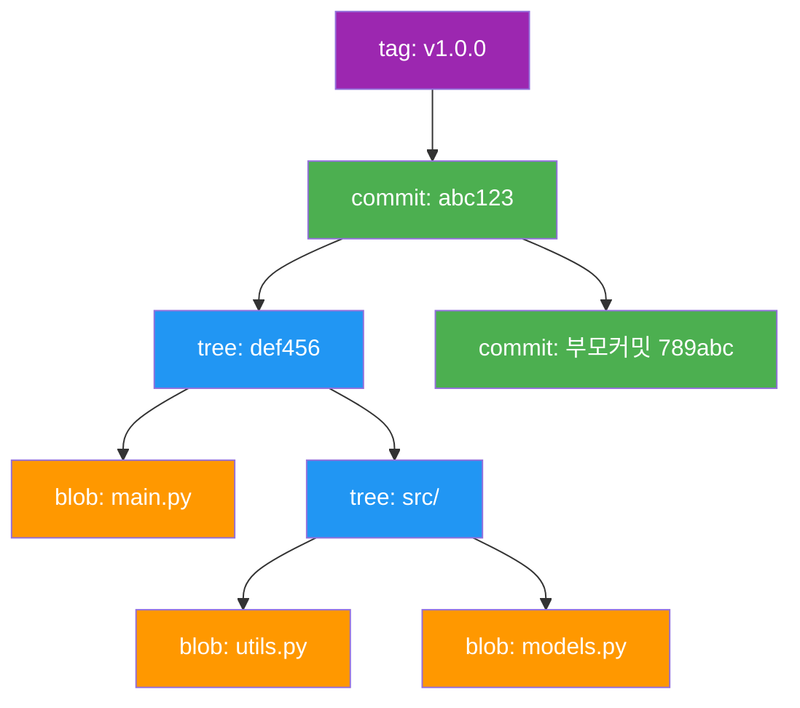
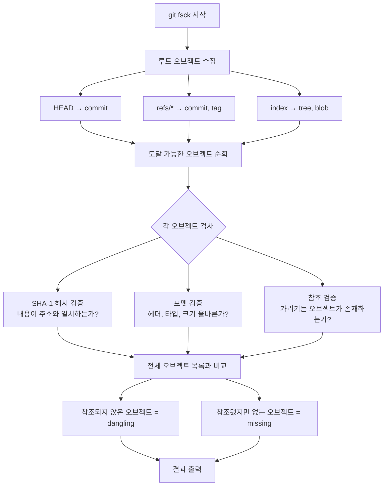
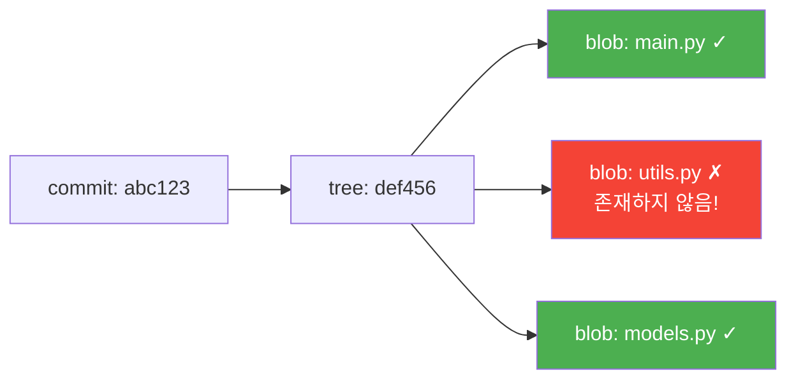
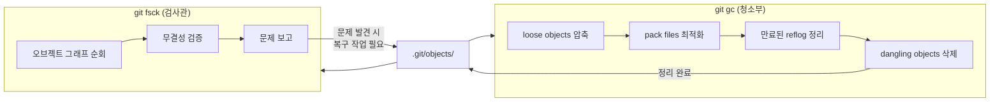

## 들어가며

파일시스템이 손상됐을 때 Linux에서 쓰는 명령어가 `fsck`다. Full name은 **file system check** — 디스크의 일관성을 검사하고, 깨진 inode를 찾아내고, 연결이 끊긴 블록을 탐지한다. Git도 정확히 같은 이름의 명령어를 갖고 있다: `git fsck`.

이름이 같다는 건 우연이 아니다. Git의 내부는 사실상 하나의 **내용 주소 지정 파일시스템(content-addressable filesystem)**이다. 모든 오브젝트는 SHA-1 해시로 주소가 지정되고, 트리 구조로 연결된다. 이 연결이 끊기거나 오브젝트가 손상되면 — 바로 그게 `git fsck`가 잡아내야 하는 상황이다.

대부분의 개발자는 `git fsck`를 한 번도 쳐본 적이 없다. `git status`는 알아도, `git fsck`는 모른다. 하지만 디스크 오류로 커밋이 사라지거나, `git reset --hard`를 잘못 쳤거나, 원격 저장소에서 clone이 이상하게 됐을 때 — 이 명령어가 당신의 코드를 살릴 수 있다.

오늘은 `git fsck`의 내장을 완전히 해부해보자.

---

## Git 오브젝트 그래프: fsck가 검사하는 것

`git fsck`를 이해하려면 먼저 Git의 내부 구조를 알아야 한다. Git은 4종류의 오브젝트로 구성된다:



각 오브젝트는 **SHA-1 해시**가 곧 주소다. 커밋은 트리를 가리키고, 트리는 blob(파일 내용)과 하위 트리를 가리킨다. 이 가리킴이 끊기면 "dangling" 또는 "missing" 상태가 된다.

`git fsck`는 이 전체 그래프를 순회하면서 두 가지 핵심 문제를 찾는다:

1. **Dangling objects** — 존재하지만 아무도 가리키지 않는 오브젝트
2. **Missing objects** — 누군가 가리키고 있지만 실제로 존재하지 않는 오브젝트

---

## 기본 동작: fsck가 실제로 하는 일

```bash
$ git fsck
Checking object directories: 100% (256/256), done.
Checking connectivity: done.
dangling blob d670460b4b4aece5915caf5c68d12f560a9fe3e4
dangling commit abc1234def5678...
```

출력이 조용하면 건강한 저장소다. 하지만 무슨 일이 일어나고 있는지 내부를 보자.

### fsck의 실행 순서



소스 코드(`builtin/fsck.c`)를 보면 핵심 함수는 `fsck_obj_buffer()`다. 각 오브젝트를 읽어 타입에 따라 `fsck_commit()`, `fsck_tree()`, `fsck_blob()`, `fsck_tag()` 중 하나를 호출한다.

---

## Dangling Objects: 유령 오브젝트들

**Dangling object**는 Git 저장소에 존재하지만, 현재 어떤 ref나 다른 오브젝트도 가리키지 않는 오브젝트다.

```bash
$ git fsck --unreachable
dangling blob d670460b4b4aece5915caf5c68d12f560a9fe3e4
dangling commit 7c4a64d90a34e3d5d75f9e00e6c2e89a7a1b3d5f
dangling tree 9daeafb9864cf43055ae93beb0afd6c7d144bfa4
```

### 언제 dangling이 생기나?

```bash
# 1. git reset --hard 후
git reset --hard HEAD~3
# → 최근 3개 커밋이 더 이상 어떤 브랜치도 가리키지 않음
# → dangling commit 3개 발생

# 2. git commit --amend 후
git commit --amend -m "새 메시지"
# → 이전 커밋 오브젝트가 dangling

# 3. 브랜치 강제 삭제
git branch -D feature-xyz
# → feature-xyz에만 있던 커밋들이 dangling

# 4. git stash drop
git stash drop
# → stash 커밋이 dangling
```

### Dangling blob = 잃어버린 파일 내용

`dangling blob`은 특히 유용하다. 실수로 `git add` 후 파일을 수정하거나 삭제했을 때, 원래 내용이 blob으로 남아있다:

```bash
# 실수 시나리오
echo "중요한 코드" > important.py
git add important.py
echo "덮어씌움" > important.py  # 아, 실수!

# dangling blob 찾기
git fsck --unreachable | grep blob
# dangling blob a1b2c3d4...

# 내용 복구
git cat-file -p a1b2c3d4
# 중요한 코드
```

---

## Missing Objects: 진짜 손상

Missing object는 더 심각하다. 누군가 가리키고 있는데 실제로 존재하지 않는 오브젝트다.

```bash
$ git fsck
error: object file .git/objects/ab/cdef1234... is empty
error: unable to find ab/cdef1234...
missing blob abcdef1234...
```

이건 주로 다음 상황에서 발생한다:

- **디스크 I/O 오류** — 쓰기 도중 전원이 꺼짐
- **파일 손상** — 오브젝트 파일이 물리적으로 손상
- **불완전한 transfer** — `git clone` 또는 `git fetch` 중 네트워크 끊김
- **수동 삭제** — 실수로 `.git/objects/` 내 파일 삭제



---

## 옵션 완전 분석

### `--connectivity-only`: 빠른 연결성 검사

```bash
$ git fsck --connectivity-only
Checking connectivity: done.
```

이 옵션은 각 오브젝트의 **내용 검증을 건너뛰고**, 오직 오브젝트 간 참조 연결만 검사한다. 대형 저장소에서 속도가 10배 이상 빠를 수 있다.

| 항목 | 기본 fsck | --connectivity-only |
|------|-----------|---------------------|
| SHA-1 해시 검증 | ✓ | ✗ |
| 오브젝트 포맷 검증 | ✓ | ✗ |
| 참조 연결성 검사 | ✓ | ✓ |
| 실행 속도 | 느림 | 빠름 |
| 적합한 상황 | 정기 점검 | CI/CD, 대형 저장소 |

소스 코드에서 `--connectivity-only`는 `fsck_obj()` 호출 자체를 건너뛴다. `object-connectivity.c`의 `mark_reachable_objects()`만 실행되어 도달 가능한 오브젝트 집합을 계산한다.

### `--full`: 더 철저한 검사

```bash
$ git fsck --full
Checking object directories: 100% (256/256), done.
Checking objects in alternates: done.
Checking connectivity: done.
```

기본 `git fsck`는 느슨한 오브젝트(`.git/objects/??/` 디렉토리)와 팩 파일(`.git/objects/pack/`)을 검사한다. `--full`은 여기에 추가로:

- **Alternates** — `.git/objects/info/alternates`에 등록된 외부 오브젝트 저장소
- **Submodule 오브젝트** — 각 서브모듈 저장소
- 팩 파일 내 **모든 오브젝트의 CRC 체크섬**까지 검증

```bash
# 완전한 저장소 건강 검진
git fsck --full --strict --progress
```

`--strict`는 추가적인 경고를 오류로 처리한다. 예를 들어 태그 메시지의 포맷 문제도 오류로 보고한다.

### `--unreachable` vs `--dangling`

```bash
# unreachable: 현재 ref에서 도달 불가능한 모든 오브젝트
git fsck --unreachable

# dangling: 그 중에서도 다른 어떤 오브젝트도 참조하지 않는 것만
git fsck --dangling  # 기본값
```

실제 차이를 보자:

```bash
# 예시: dangling commit이 dangling tree를 가리키는 경우
# - dangling commit → "unreachable"이자 "dangling"
# - dangling tree → "unreachable"이지만 commit이 가리키므로 "dangling" 아님

git fsck --unreachable  # 둘 다 표시
git fsck --dangling     # commit만 표시 (tree는 commit에 의해 참조됨)
```

---

## git gc와의 관계: 검사관과 청소부

`git fsck`와 `git gc`는 종종 함께 언급되지만, 역할이 완전히 다르다.



**핵심 차이점:**

- `git fsck` — **읽기 전용**. 저장소를 변경하지 않는다. 문제를 찾아 보고만 한다.
- `git gc` — **쓰기 작업**. 실제로 파일을 이동하고, 압축하고, 삭제한다.

`git gc`는 내부적으로 `git prune`을 실행해 14일(기본값) 이상 된 dangling object를 삭제한다. 즉, **fsck에서 보이는 dangling object들은 gc 이후 사라진다**.

```bash
# 현재 dangling objects 확인
git fsck --dangling

# gc 실행 (14일 이상 된 dangling 삭제)
git gc

# 즉시 모든 dangling 삭제 (주의!)
git gc --prune=now
```

⚠️ **중요**: `git gc --prune=now` 전에 반드시 `git fsck`로 먼저 상태를 확인하라. 복구하고 싶은 dangling commit이 있다면 gc 전에 브랜치로 만들어 살려야 한다.

---

## 저장소 복구 시나리오

### 시나리오 1: 실수로 날린 커밋 복구

```bash
# 실수: 중요한 브랜치를 강제 삭제
git branch -D important-feature
# error가 안 나왔다... 잘못 삭제한 것 같다

# Step 1: dangling commit 찾기
git fsck --unreachable | grep commit
# unreachable commit a1b2c3d4e5f6...

# Step 2: 내용 확인
git log --oneline a1b2c3d4e5f6
# a1b2c3d 완성된 중요한 기능
# b2c3d4e 기능 구현 중간 저장

# Step 3: 브랜치로 복구
git checkout -b recovered-feature a1b2c3d4e5f6
# Switched to a new branch 'recovered-feature'
```

reflog도 함께 확인하는 게 좋다:

```bash
git reflog | grep important-feature
# a1b2c3d HEAD@{5}: checkout: moving from important-feature to main
```

### 시나리오 2: 손상된 저장소 진단

```bash
$ git status
error: object file .git/objects/ab/cdef... is empty
fatal: loose object abcdef... (stored in .git/objects/ab/cdef...) is corrupt

# Step 1: 손상 범위 파악
git fsck --full 2>&1 | head -20

# Step 2: 손상된 오브젝트가 무엇인지 파악
git cat-file -t abcdef...  # blob? tree? commit?

# Step 3a: 원격 저장소에서 복구
git fetch origin
git checkout origin/main -- .  # 파일 복구

# Step 3b: 다른 클론에서 복구 (있다면)
# 다른 클론 저장소에서:
git cat-file -p abcdef... | gzip > object.gz
# 현재 저장소에서:
zcat object.gz > .git/objects/ab/cdef...
```

### 시나리오 3: 대형 저장소 정기 점검 스크립트

```bash
#!/bin/bash
# git-health-check.sh

REPO_PATH="${1:-.}"
LOG_FILE="/var/log/git-fsck-$(date +%Y%m%d).log"

echo "=== Git 저장소 건강 검진: $(date) ===" >> "$LOG_FILE"
echo "저장소: $REPO_PATH" >> "$LOG_FILE"

cd "$REPO_PATH"

# 빠른 연결성 검사 (매일)
echo "--- 연결성 검사 ---" >> "$LOG_FILE"
git fsck --connectivity-only 2>&1 >> "$LOG_FILE"

# 전체 검사 (주 1회)
if [ "$(date +%u)" -eq 1 ]; then
    echo "--- 전체 무결성 검사 ---" >> "$LOG_FILE"
    git fsck --full 2>&1 >> "$LOG_FILE"
fi

# 이상 감지 시 알림
if grep -q "error\|missing\|corrupt" "$LOG_FILE"; then
    echo "⚠️ 저장소 이상 감지!" 
    mail -s "Git 저장소 경고" admin@company.com < "$LOG_FILE"
fi

echo "검사 완료: $LOG_FILE"
```

### 시나리오 4: clone이 깨진 경우 재시도

```bash
# 불완전한 clone 감지
git fsck
# missing blob abcdef...
# missing tree 123456...

# 방법 1: fetch로 빠진 오브젝트 받기
git fetch --all

# 방법 2: 특정 오브젝트만 fetch
git fetch origin refs/objects/info/packs

# 방법 3: 저장소 전체 재clone (마지막 수단)
cd ..
rm -rf broken-repo
git clone --no-local origin broken-repo
```

---

## fsck 출력 해석 가이드

실제 `git fsck` 출력에서 자주 보이는 메시지들:

```bash
# 1. 정상적인 dangling (걱정 안 해도 됨)
dangling blob d670460b...     # git add했다가 reset한 파일
dangling commit 7c4a64d9...   # git stash drop 후 남은 커밋

# 2. 경고 (주의는 필요)
warning: git-fsck: use --unreachable to find unreachable objects
warning: orphan objects

# 3. 오류 (즉시 조치 필요)
error: object file .git/objects/ab/cdef is empty
error: unable to read sha1 file of .git/refs/heads/main (abcdef...)
missing blob abcdef...
missing tree 123456...
corrupt loose object '789abc...'
```

**Rule of thumb:**
- `dangling` → 복구 가능, gc 전에 필요하면 살릴 것
- `missing` → 손상, 즉시 원격에서 복구 시도
- `corrupt` → 심각, 다른 클론에서 오브젝트 파일 직접 복사

---

## 내부 구현: fsck가 SHA-1을 어떻게 검증하나

Git 오브젝트의 무결성 검증 과정을 코드 수준에서 보면:

```c
// object.c (단순화)
int check_object_signature(const struct object_id *oid, 
                           void *buf, unsigned long size, 
                           const char *type) {
    struct object_id real_oid;
    
    // 1. 실제 내용으로 SHA-1 계산
    hash_object_file(buf, size, type, &real_oid);
    
    // 2. 파일 경로(주소)의 SHA-1과 비교
    if (!oideq(oid, &real_oid)) {
        return -1;  // 불일치 = 손상!
    }
    return 0;
}
```

Git 오브젝트 파일 경로는 SHA-1에서 나온다:
- SHA-1: `d670460b4b4aece5915caf5c68d12f560a9fe3e4`
- 경로: `.git/objects/d6/70460b4b4aece5915caf5c68d12f560a9fe3e4`

내용을 바꾸면 SHA-1이 달라진다 → 경로와 불일치 → `corrupt` 오류. 이것이 Git이 **암호학적으로 변조를 탐지**하는 방식이다.

---

## 마치며

`git fsck`는 Git의 조용한 파수꾼이다. 평소에는 필요 없지만, 저장소가 위기에 처했을 때 가장 먼저 불러야 하는 명령어다.

핵심 정리:

- **`git fsck`** — 저장소 무결성 검사, 읽기 전용, 부작용 없음
- **`dangling object`** — 존재하지만 미참조. 복구 가능한 보물일 수 있음
- **`missing object`** — 참조되지만 존재하지 않음. 진짜 손상
- **`--connectivity-only`** — 빠른 검사, CI/CD나 대형 저장소에 적합
- **`--full`** — 철저한 검사, 주기적 점검에 적합
- **gc와의 관계** — fsck는 진단, gc는 치료. 치료 전 진단 먼저

저장소가 소중하다면, 가끔 `git fsck`를 실행해보자. 아무것도 출력되지 않는 게 가장 좋은 결과지만, 뭔가 나온다면 — gc가 삭제하기 전에 알아채서 다행인 거다.

```bash
# 습관적으로 실행해볼 한 줄
git fsck --unreachable --no-reflogs 2>&1 | grep -E "dangling|missing|error"
```

조용하면 건강한 것. 시끄러우면 — 이제 어떻게 해야 하는지 알 것이다.
