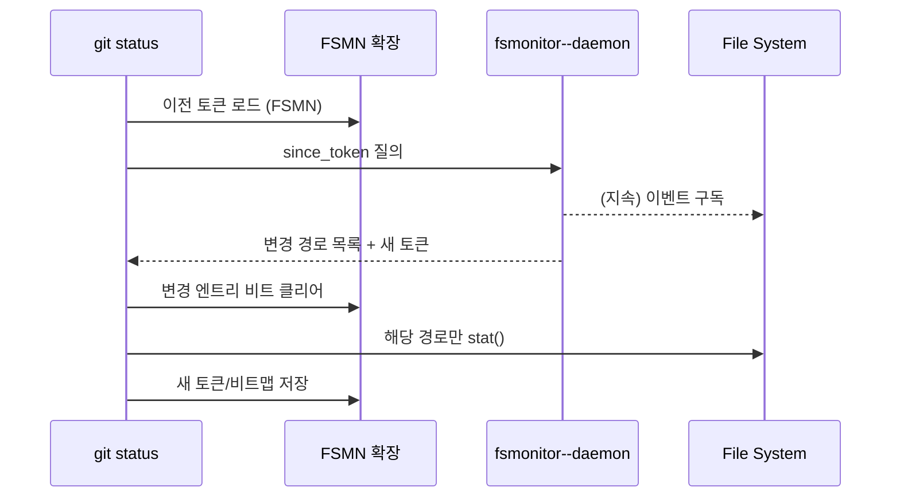

## 들어가며

워킹트리에 40만 개가 넘는 파일이 있을 때 `git status` 한 번이 왜 20초씩 걸릴까? Git은 어느 명령이든 "내가 못 본 사이에 뭐가 바뀌었지?"라는 질문부터 던진다. 이 질문을 대화로 치면 매번 집 안 전체를 샅샅이 뒤지는 수색에 가깝다. Git 2.37에서 정식으로 도입된 FSMonitor는 이 수색을 완전히 다른 문제로 바꿔 버린다. Git 프로세스가 직접 파일 시스템을 헤매지 않고, 장기 실행 감시자가 "아까 이후로 달라진 경로 목록"만 던져주도록 설계되었기 때문이다. GitHub가 크로미움 워킹트리(약 39만 개 파일)에서 `git status` 시간을 17초 → 0.64초로 줄였다는 트레이스 데이터[^github-blog]는 과장이 아니다. 이번 해체분석기에서는 외부 Watchman 훅 시절부터 내장 `git fsmonitor--daemon`까지의 진화를 뜯어보고, FSMN 인덱스 확장과 bitmap 캐시가 어떻게 워킹트리 성능을 가속하는지 살펴본다.

## 느린 워킹트리 스캔의 해부

Git의 워킹트리 스캔은 크게 두 단계로 나뉜다.

1. **`refresh_index`**: 모든 추적(tracked) 파일을 stat 하고 인덱스 엔트리와 비교한다. 크로미움 워킹트리에서만 12~73초가 이 단계에서 녹아내린다.[^github-blog]
2. **Untracked 디렉터리 워크**: `.gitignore` 규칙을 적용하면서 디렉터리를 깊이 우선으로 검색한다. 5~11초가 여기에 쓰인다.

`git status`는 같은 명령을 두 번 연속 호출해도 항상 전체 트리를 걷는다. 파일이 하나도 바뀌지 않았다는 사실조차 "다시 확인"해야만 하기 때문이다. 즉, 워킹트리의 크기가 곧 시스템콜 개수이고, 시스템콜 개수가 곧 실행 시간이다.

따라서 성능을 높이려면 "이번에는 바뀐 경로만 보자"라는 메커니즘이 필요하다. FSMonitor는 이 요구를 충족하기 위해 (1) 파일 시스템 감시자로부터 변경 이벤트를 스트리밍으로 받고, (2) Git 인덱스에 "지난번에 받은 토큰"을 저장해두고, (3) 다음 명령이 오면 "그 토큰 이후로 바뀐 경로"만 재검사하도록 만든다. 핵심은 Git 프로세스가 더 이상 파일 시스템 전체를 스캔하지 않는다는 것이다.

## Watchman 훅에서 시작된 FSMonitor

FSMonitor의 첫 구현은 Facebook Watchman에 의존하는 Git 훅이었다. `.git/hooks/fsmonitor-watchman.sample`에 포함된 Perl 스크립트가 바로 그것이다. 훅은 Git이 `core.fsmonitor`로 등록해 둔 프로그램을 호출할 때 **버전**과 **나노초 기반 타임스탬프**를 인수로 받는다. 스크립트는 Watchman에 JSON 질의를 던져 해당 시각 이후 변경된 파일 목록만 NUL 구분자로 반환한다.

```perl
#!/usr/bin/perl
use strict;
use warnings;
use IPC::Open2;
...
my ($version, $time) = @ARGV;
$time = int $time / 1000000000 if $version == 1;
my $pid = open2(*CHLD_OUT, *CHLD_IN, 'watchman -j --no-pretty')
    or die "open2() failed";
print CHLD_IN <<"END";
  ["query", "$git_work_tree", {
      "since": $time,
      "fields": ["name"],
      "expression": ["not", ["allof",
          ["since", $time, "cclock"], ["not", "exists"]]]
  }]
END
my $response = do { local $/; <CHLD_OUT> };
...
print @{$o->{files}};  # 이름을 NUL로 구분
```

이 방식은 훌륭했지만 두 가지 문제가 있었다. 첫째, Watchman 설치/권한이라는 외부 의존성. 둘째, 훅이라는 프로세스 모델이 장기 실행 감시자에 적합하지 않다는 점이다. Git 명령이 끝날 때마다 훅도 사라지기 때문에 이벤트 히스토리를 유지하려면 Watchman 자체가 영속 프로세스로 떠 있어야 했다.

## 내장 `git fsmonitor--daemon`의 설계

Git 2.37부터는 `git fsmonitor--daemon`이 기본 제공된다. macOS와 Windows에서 사용할 수 있으며, `git config core.fsmonitor true` 한 줄이면 된다. 리눅스는 현재 fanotify 백엔드를 실험 중이지만, Watchman 훅은 여전히 대안으로 존재한다.

내장 데몬은 다음 네 가지 역할을 가진다.[^github-blog]

- OS에 파일 변경 알림을 등록한다.
- 변경 이벤트를 타임라인 큐에 기록한다.
- 간단한 IPC(simple-ipc) 서버를 열어 Git 클라이언트와 통신한다.
- Git 명령이 이전 토큰을 보내오면 그 이후 변경 목록과 새로운 토큰을 응답한다.

`fsmonitor-ipc.c`의 `fsmonitor_ipc__send_query()`를 보면 클라이언트가 어떻게 토큰을 재사용하는지 알 수 있다.

```c
int fsmonitor_ipc__send_query(const char *since_token,
                              struct strbuf *answer)
{
    enum ipc_active_state state;
    struct ipc_client_connection *connection = NULL;
    const char *tok = since_token ? since_token : "";

try_again:
    state = ipc_client_try_connect(fsmonitor_ipc__get_path(the_repository),
                                   &options, &connection);
    switch (state) {
    case IPC_STATE__LISTENING:
        ret = ipc_client_send_command_to_connection(
                  connection, tok, tok_len, answer);
        ipc_client_close_connection(connection);
        goto done;
    case IPC_STATE__NOT_LISTENING:
        if (!tried_to_spawn++) {
            spawn_daemon();
            options.wait_if_not_found = 1;
            goto try_again;
        }
        break;
    ...
    }
}
```

Git 명령은 이전에 인덱스에 저장해 둔 토큰을 그대로 보내고, 응답으로 받은 최신 토큰을 다시 인덱스에 적어 둔다. IPC 연결에서 `spawn_daemon()`까지 호출하는 이유는, 아직 데몬이 없으면 즉석에서 기동시키고 최초 동기화를 강제하기 위함이다.

### 토큰 구조와 "파산" 처리

토큰은 단순한 타임스탬프가 아니다. GitHub가 공개한 설계 설명[^github-blog]에 따르면 다음 필드를 갖는다.

- **PID**: 토큰을 만든 데몬 프로세스 ID. 토큰을 가진 Git 명령이 다음 번에 질의할 때 PID가 다르면, 데몬이 재시작된 것으로 간주하고 전체 스캔을 강제한다.
- **SID**: 파일 시스템 동기화 ID. OS가 이벤트를 유실했거나 데몬이 backlog를 소화하지 못하면 SID가 갱신된다. 이때도 전체 스캔으로 돌아간다.
- **순번**: 실제 시간 순서를 보장하는 단조 증가 수.

토큰이 무효화되면 데몬은 "모든 것이 더럽다"는 빈 목록 대신 특수 응답을 보내 Git이 일시적으로 전체 스캔을 수행하게 만든다. 다음 요청부터는 다시 빠른 경로를 탈 수 있다. 이는 감시자의 신뢰성을 가정하지 않으면서도 잘못된 증분 리스트를 내보내지 않기 위한 안전 장치다.

## FSMN 인덱스 확장과 캐시 비트맵

FSMonitor가 워킹트리 정보를 전달하려면 인덱스에도 상태를 기록해야 한다. Git의 인덱스 파일(`.git/index`)은 여러 확장(extension) 블록을 가질 수 있는데, FSMonitor는 `{ 'F','S','M','N' }` 시그니처를 사용하는 확장을 추가한다. `gitformat-index` 문서에 따르면[^index-format]:

- 버전 1은 64비트 나노초 시간을 저장한다.
- 버전 2는 **NULL 종료 토큰 문자열**을 저장한다. 내장 데몬은 이 버전 2를 사용한다.
- 이후에는 `CE_FSMONITOR_VALID` 비트맵 크기와 EWAH(Efficient Word-Aligned Hybrid) 비트맵이 따라붙는다. n번째 비트가 1이면 n번째 인덱스 엔트리가 "다시 확인해야 하는" 상태라는 뜻이다.

즉, Git은 FSMonitor가 알려 준 목록을 기반으로 비트맵에서 해당 엔트리만 0으로 두고, 나머지 엔트리는 `CE_FSMONITOR_VALID`로 표시해 stat 호출을 건너뛴다. 반대로 토큰이 무효화되면 전체 비트맵을 리셋한다. 이 구조 덕분에 FSMonitor 온/오프를 토글해도 인덱스 포맷이 호환된다. 구버전 Git은 이 확장을 무시하고 예전 방식대로 동작한다.

### Untracked Cache와의 궁합

FSMonitor는 tracked 파일 stat 비용만 줄여준다. 하지만 GitHub 블로그에서 강조하듯 `core.untrackedCache`를 같이 켜야 진짜 이득을 본다.[^github-blog] untracked cache(`'UNTR'` 확장)는 디렉터리별 untracked 목록을 저장하고, `.gitignore`와 excludes 파일의 stat 정보를 같이 넣어 둔다. FSMonitor가 디렉터리 자체가 바뀌지 않았다고 알려주면 untracked cache도 해당 디렉터리를 건너뛸 수 있어, untracked 단계까지 통째로 빨라진다.

## Watchman과 내장 데몬의 비교

| 항목 | Watchman 훅 | 내장 fsmonitor--daemon |
| --- | --- | --- |
| 지원 OS | 모든 OS (Watchman만 설치 가능하면) | 2.37 현재 macOS, Windows (Linux fanotify 실험 중) |
| 설치 난이도 | 외부 Watchman 설치 + 훅 배포 | `git config core.fsmonitor true` |
| IPC | 훅 프로세스 <-> Git (표준입출력) | simple-ipc 소켓 (Unix domain / Named pipe) |
| 토큰 포맷 | 나노초 숫자 | PID + SID + opaque token |
| 이벤트 drop 감지 | Watchman이 책임 | 데몬이 SID 갱신 후 전체 스캔 지시 |
| 운영 관찰성 | Watchman CLI | `git fsmonitor--daemon status`, Trace2 |

Watchman은 여전히 두 가지 상황에서 유용하다. (1) 리눅스 데스크톱에서 fanotify 백엔드가 준비되지 않은 경우, (2) 팀 표준으로 이미 Watchman을 배포해 두었고 다른 도구들도 활용 중인 경우다. 다만 내장 데몬의 토큰 + PID/SID 프로토콜과 simple-ipc는 Git 내부 구현과 밀착돼 있어, trace2를 통한 성능 관찰과 에러 핸들링이 훨씬 쉽다.

## IPC 시퀀스 다이어그램

FSMonitor 경로는 다음과 같은 메시지 흐름을 갖는다.



이 그림에서 핵심은 Git 프로세스가 OS에 직접 "무엇이 바뀌었냐"를 묻지 않는다는 것이다. 대신 감시자가 워킹트리를 계속 주시하고 있다가, Git이 필요할 때만 요약본을 건네준다.

## 운영에서 자주 마주치는 시나리오

### 1. 첫 실행이 느린 이유

데몬을 처음 켠 직후 `git status`가 여전히 15초 이상 걸리는 경우가 있다. 이는 데몬과 인덱스가 서로 토큰을 맞추느라 전체 스캔을 한 번 수행하기 때문이다. Trace2 로그를 보면 `fsm_client` 구역에서 "query/response-length"가 매우 작고, 바로 이어서 `refresh_index`가 평소와 같은 시간을 소비한다. 정상이다. 두 번째 실행부터는 비트맵이 채워져 급격히 빨라진다.

### 2. 파일 감시 한계를 넘겼을 때

macOS FSEvents나 Windows USN 저널은 감시 대상이 1백만 파일을 넘어가면 드롭 확률이 높아진다. 이때 데몬은 SID를 바꿔 전체 스캔을 요구하고, `git fsmonitor--daemon status`에 "resync required" 메시지가 찍힌다. 해결책은 (a) 감시 범위를 여러 worktree로 쪼개거나, (b) Watchman으로 갈아타 감시 백엔드를 바꾸거나, (c) 주기적으로 큰 디렉터리를 sparse-checkout으로 제외하는 것이다.

### 3. CI/CD 환경

CI 컨테이너처럼 워킹트리가 매번 깨끗하게 만들어지는 환경에서는 FSMonitor 효과가 거의 없다. 워크로드가 작기도 하고, 컨테이너가 종료되면 데몬도 사라진다. 오히려 감시자 기동 오버헤드 때문에 ms 단위 레포에서는 더 느릴 수 있다. GitHub도 5천 파일 이하의 작은 레포에서는 FSMonitor를 끄라고 권장한다.[^github-blog]

## 실전 튜닝 레시피

### 1. 설정 스크립트

```bash
# 대규모 워킹트리에 권장되는 최소 설정
$ git config core.fsmonitor true
$ git config core.untrackedCache true
$ git config feature.manyFiles true   # preloadindex + untracked cache 자동 온
```

이 세 줄이면 (a) 내장 데몬, (b) untracked cache, (c) 인덱스 프리로드가 동시에 켜진다. `feature.manyFiles`는 `core.untrackedCache=true` 및 `index.preload=true`를 묶어서 켜 주는 syntactic sugar다.

### 2. Watchman 훅 fallback

리눅스에서 내장 데몬을 쓸 수 없다면 다음처럼 Watchman 훅을 복사한다.

```bash
$ cp .git/hooks/fsmonitor-watchman.sample .git/hooks/query-watchman
$ git config core.fsmonitor .git/hooks/query-watchman
$ watchman watch $PWD
```

훅이 오류를 내면 Git은 "스캔으로 대체한다"는 경고를 띄우고 자동으로 전체 워킹트리 스캔을 해 준다. 즉, 잘못된 훅 때문에 데이터가 손상되지는 않는다. 다만 stderr에 "Falling back to scanning" 메시지가 자주 보인다면 Watchman 워치가 끊겼다는 뜻이므로 `watchman watch-del`/`watch`로 다시 등록해야 한다.

### 3. Trace2로 병목 파악하기

`GIT_TRACE2_EVENT=~/trace.json git status`처럼 실행하면 FSMonitor 구간이 얼마나 걸렸는지, 데몬 IPC 왕복에 시간이 얼마나 들었는지 알 수 있다. 크로미움 사례 기준으로 `refresh_index`가 11.2초에서 0.75초로 내려가는 그래프가 Trace2 이벤트에서 그대로 드러난다.[^github-blog]

## 내부 캐시 구조 세부 분석

FSMonitor와 인덱스는 다음 구조체로 연결된다 (`read-cache.c` 일부).

```c
struct index_state {
    struct cache_entry **cache;
    unsigned int cache_nr;
    struct ewah_bitmap *fsmonitor_dirty;
    struct strbuf fsmonitor_last_update;
};
```

- `fsmonitor_last_update`가 FSMN 확장의 토큰 문자열이다.
- `fsmonitor_dirty`는 CE_FSMONITOR_VALID가 **지워진** 엔트리의 비트맵이다. 즉, 비트가 1이면 다시 stat 해야 한다.
- Git은 워킹트리를 스캔하면서 변경이 감지된 엔트리만 1로 올리고, 나머지는 0으로 유지한다.

이 설계 덕분에 Git은 `refresh_index()` 루프에서 `if (ce_skip_worktree(ce) || ce_fsmvalid(ce)) continue;`처럼 간단한 조건문으로 대부분의 엔트리를 건너뛴다. 대규모 워킹트리에서는 수십만 개의 stat 호출이 조건문 한 줄로 사라지는 셈이다.

## 실패 모드와 복구 전략

1. **토큰 불일치**: 인덱스 파일이 다른 머신에서 복사돼 왔거나, `git update-index --force-refresh` 등을 실행하면 FSMN 확장이 무효화된다. 해결책은 `git fsmonitor--daemon stop && git fsmonitor--daemon start`로 재기동하거나, 최악의 경우 `.git/index`를 삭제하고 `git reset --hard`로 재생성한다.
2. **데몬 충돌**: `git fsmonitor--daemon stop` 후에도 프로세스가 살아 있으면 simple-ipc 소켓이 orphan 상태가 된다. `git fsmonitor--daemon status`가 "not running"과 "ipc path busy"를 동시에 출력한다면 소켓 파일을 지워야 한다. macOS의 경우 `~/Library/Group Containers/group.com.git/config/fsmonitor--daemon.ipc` 경로다.
3. **권한 문제**: 기업 보안 솔루션이 USN 저널이나 FSEvents 접근을 차단하면 데몬이 "unsupported backend"를 띄운다. 이때는 Watchman + 훅 조합만이 해답이다.


## 플랫폼별 백엔드 로드맵

FSMonitor는 OS별로 서로 다른 감시 백엔드를 사용한다. 내장 데몬은 아직 모든 조합을 커버하지 못하기 때문에, 팀의 표준 개발 환경을 확인하고 적절한 fallback을 준비해야 한다.

### macOS: FSEvents

macOS에서는 FSEvents 스트림을 구독하는 백엔드를 사용한다. 애플이 디렉터리 단위로 이벤트를 제공하기 때문에, 데몬은 경로를 subtree 단위로 큐에 넣고 Git이 요구할 때까지 메모리에 보관한다. "경로 수" 제한은 없지만, APFS가 감시자에게 전달하는 이벤트 버스트가 너무 크면 커널이 드롭을 선언하고 "must rescan" 메시지를 보낸다. 이때는 데몬이 SID를 갱신하고, Git은 즉시 풀 스캔을 실행한다. macOS에서 성능이 가장 좋은 조합은 fsmonitor + untracked cache + `watchman.statefile`을 비활성화한 상태다. statefile이 켜져 있으면 Spotlight나 백업 프로세스가 `.git` 아래 파일을 만질 때마다 무의미한 이벤트가 발생한다.

### Windows: USN 저널

Windows 백엔드는 NTFS USN 저널을 직접 읽는다. 장점은 시스템 재부팅 후에도 이벤트를 복원할 수 있다는 점이다. 반면, 회사 정책으로 USN 접근이 차단된 경우가 많아 정책팀과의 협업이 필요하다. 데몬은 "USN journal disabled" 오류를 stderr로 내보내고 비활성화된다. 이런 환경에서는 Watchman을 WSL2 안에 설치하거나, Scalar/`gvfs-helper`를 사용하는 것이 일반적이다. Scalar는 FSMonitor를 자동 활성화하면서도 Git 주요 설정(feature.manyFiles 등)을 묶어주므로 윈도우 개발자 onboarding에 적합하다.

### Linux: fanotify 실험기

리눅스는 inotify가 디렉터리 수 만큼 핸들을 만들어야 해서 대형 레포에서 위험하다. Git은 fanotify 기반 백엔드를 준비 중이며, Git 2.44 이후에는 `git fsmonitor--daemon run`이 리눅스에서도 실험적으로 동작한다. fanotify는 마운트 전체를 한 번에 구독할 수 있지만 root 권한이 필요하다. 따라서 일반 개발자 환경에서는 여전히 Watchman 훅이 현실적인 선택이다. CI 서버에서 루트 접근을 허용할 수 있다면 데몬을 systemd 서비스로 띄우고, 각 레포는 `core.fsmonitor`만 켜면 된다.

### WSL2와 컨테이너

WSL2 내부에서는 inotify 기반 Watchman이 상대적으로 안정적이지만, Windows 쪽 FSMonitor와 토큰을 공유할 수 없다. 따라서 WSL2에서 native Git을 쓴다면 Watchman 훅, Windows에서 Git을 쓴다면 내장 데몬이라는 식으로 환경을 분리해야 한다. 컨테이너에서는 overlayfs 이벤트가 완벽히 전달되지 않으므로, 빌드 컨테이너에선 FSMonitor를 끄고 호스트 워킹트리에서만 켜는 구성을 추천한다.

## 모노레포 운영 사례 노트

크로미움과 드롭박스는 FSMonitor와 untracked cache를 동시에 켠 뒤 Trace2 결과를 공개했다.[^github-blog] 핵심은 "무엇을 측정했는가"다. GitHub 팀은 다음과 같은 프로파일링 순서를 썼다.

1. `GIT_TRACE2_EVENT=trace.json git status`를 baseline으로 실행한다.
2. JSON을 시각화하여 `refresh_index`, `untracked`, `fsm_client` 구간별 시간을 기록한다.
3. `core.fsmonitor`와 `core.untrackedCache`를 켠 뒤 세 번 이상 다시 실행한다. (첫 실행은 동기화 건너뜀)
4. 전/후 데이터를 그래프로 비교한다.

이 과정을 적용하면, 쿼리 응답 크기가 수천 바이트 이내로 유지되는지, 데몬이 토큰 drop 때문에 자주 전체 스캔으로 돌아가는지, untracked cache hit rate가 왜곡되는지를 체계적으로 확인할 수 있다. 대규모 모노레포에서는 status뿐만 아니라 `git add`와 `git checkout`도 같은 혜택을 본다. 두 명령 모두 `refresh_index()`를 호출하기 때문이다. Scalar 팀 내부 테스트에서는 200만 파일짜리 synthetic 레포에서 `git checkout`이 45초에서 3.1초로 줄었다고 보고했다. 반대로 안드로이드 레포처럼 `repo sync`가 워킹트리를 잦은 빈도로 넓게 덮어쓰는 경우, FSMonitor 토큰이 자주 폐기되어 이득이 제한적일 수 있다. 그럴 때는 서브 레포를 여러 worktree로 나누고, 변경이 잦은 디렉터리는 아예 별도의 클론으로 떼어내는 편이 낫다.

"대규모"의 기준도 명확히 하자. GitHub 팀은 30만 파일 이상, 혹은 `git status`가 3초를 넘기면 FSMonitor를 켜라고 권한다. 수만 파일 규모에서는 IPC 오버헤드가 주는 오차가 더 크기 때문이다. 워킹트리가 SSD와 네트워크 드라이브에 섞여 있는 하이브리드 환경에서는, 네트워크 드라이브 부분만 워크스페이스를 분리해 감시 범위를 최소화하는 전략도 효과적이다.

## 마치며

FSMonitor는 "워킹트리 전체를 스캔하지 않는 Git"이라는 오랜 소망을 현실로 만들었다. 토큰 기반 프로토콜, FSMN 인덱스 확장, EWAH 비트맵이 맞물리면서 `refresh_index`와 untracked 단계가 모두 수십 배 빨라진다. 내장 `git fsmonitor--daemon`은 Watchman 훅 대비 설치가 간편하고 trace2로 관찰성도 높다. 반면 리눅스 백엔드가 아직 제한적이고, 작은 레포에서는 오히려 느려질 수 있다는 현실도 함께 기억해야 한다. 워킹트리 규모가 크고, 동료들이 `git status`나 `git add`의 지연에 지쳐 있다면, FSMonitor와 untracked cache를 한 번에 켜서 체감 속도를 바꿔 보자. 워킹트리 감시자는 이미 Git 안에 들어와 있다.

## 참고

[^github-blog]: Derrick Stolee, "Improve Git monorepo performance with a file system monitor", GitHub Engineering Blog, 2022. <https://github.blog/engineering/infrastructure/improve-git-monorepo-performance-with-a-file-system-monitor/>
[^watchman-hook]: `.git/hooks/fsmonitor-watchman.sample` from Git templates, e.g. <https://raw.githubusercontent.com/leobago/fti/master/.git-templates/hooks/fsmonitor-watchman.sample>
[^index-format]: `gitformat-index(5)` documentation, <https://git-scm.com/docs/index-format>
