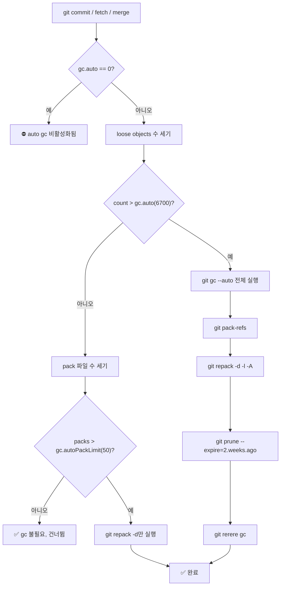
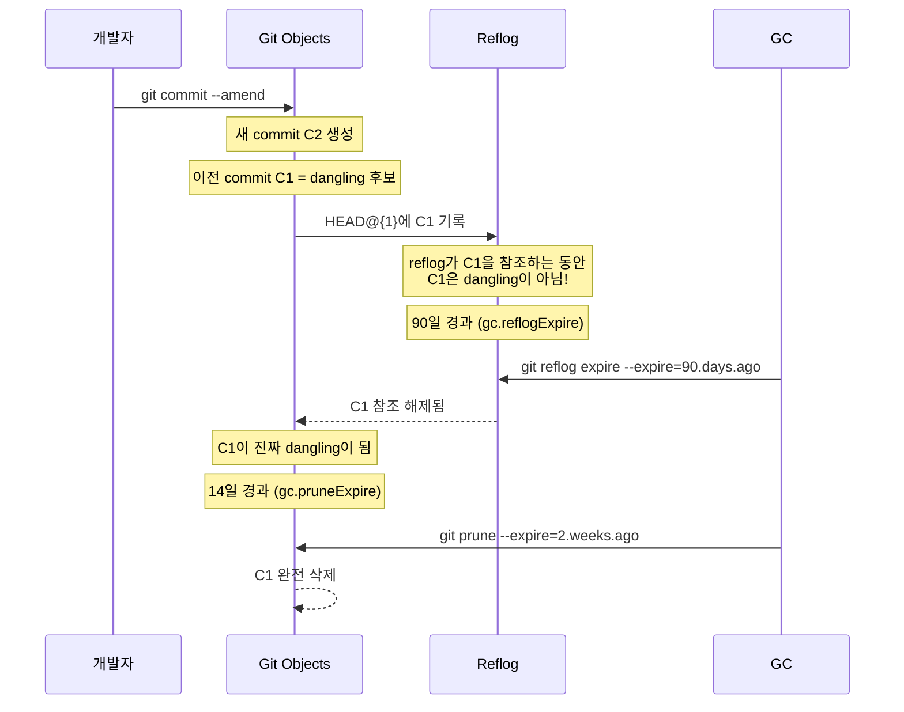

## 들어가며

`git gc`를 실행하면 터미널에 이런 메시지가 흘러간다.

```
Enumerating objects: 1243, done.
Counting objects: 100% (1243/1243), done.
Delta compression using up to 8 threads
Compressing objects: 100% (623/623), done.
Writing objects: 100% (1243/1243), done.
Total 1243 (delta 418), reused 0 (delta 0), pack-reused 0
```

대부분의 개발자는 이걸 그냥 "Git이 청소하는구나" 하고 지나친다. 하지만 이 짧은 순간에 Git은 무려 다섯 가지 작업을 순차적으로 수행한다. Java의 GC가 힙 메모리를 재정리하듯, Git의 GC도 `.git/objects/` 디렉토리 속에 흩어진 오브젝트들을 재조직한다 — 단순히 삭제하는 게 아니라, **압축하고, 재구성하고, 불필요한 것만 골라서 제거**한다.

오늘은 `git gc`의 내장을 완전히 해부해보자.

---

## gc가 실제로 하는 일

`git gc`를 실행하면 내부적으로 여러 서브커맨드가 순서대로 호출된다. Git 소스 코드(`builtin/gc.c`)를 보면 전체 흐름이 명확히 드러난다.

```c
/* git/builtin/gc.c — 단순화한 실행 순서 */
int cmd_gc(int argc, const char **argv, const char *prefix)
{
    /* 1단계: loose refs → packed-refs 파일로 병합 */
    run_command_v_opt(pack_refs_cmd, RUN_GIT_CMD);

    /* 2단계: loose objects → pack 파일로 묶기 + 오래된 pack 재압축 */
    run_command_v_opt(repack_cmd, RUN_GIT_CMD);

    /* 3단계: 참조 없는 dangling objects 제거 */
    run_command_v_opt(prune_cmd, RUN_GIT_CMD);

    /* 4단계: rerere 충돌 해결 캐시 정리 */
    run_command_v_opt(rerere_cmd, RUN_GIT_CMD);

    /* 5단계: stale worktree refs 정리 */
    run_command_v_opt(worktree_cmd, RUN_GIT_CMD);
}
```

단계별로 파헤쳐보자.

### 1단계: git pack-refs

브랜치가 많아지면 `.git/refs/` 하위에 파일이 수백 개 쌓인다. `feature/login`, `feature/payment`, `bugfix/null-pointer-crash`처럼 브랜치 하나마다 파일 하나다. 파일 I/O가 폭증하는 건 당연하다.

`git pack-refs --all`은 이 파일들을 `.git/packed-refs` 하나로 합쳐버린다.

```bash
# gc 전: 브랜치 파일 여기저기 산재
ls .git/refs/heads/
# feature-login  feature-payment  bugfix-crash  ...

# gc 후: 파일 0개, packed-refs 하나
cat .git/packed-refs
# pack-refs with: peeled fully-peeled sorted
# abc123def456... refs/heads/feature-login
# def456abc123... refs/heads/feature-payment
# ...
```

새 브랜치를 만들면 다시 개별 파일로 생성되지만, 다음 gc 때 또 합쳐진다.

### 2단계: git repack (핵심)

gc에서 가장 무거운 작업이다. `.git/objects/` 아래 흩어진 loose object들을 하나의 pack 파일로 묶고, 기존 pack 파일들도 재압축한다.

```bash
# gc 전: loose objects가 디렉토리마다 산재
find .git/objects -type f | grep -v pack | wc -l
# 847

ls .git/objects/ | head
# 1a/ 2b/ 3c/ 4d/ ...

# gc 후: 모두 pack 디렉토리로
ls .git/objects/
# info/  pack/

ls .git/objects/pack/
# pack-f3a2b1c4d5e6f7a8b9c0d1e2f3a4b5c6d7e8f9a0.idx
# pack-f3a2b1c4d5e6f7a8b9c0d1e2f3a4b5c6d7e8f9a0.pack
# pack-f3a2b1c4d5e6f7a8b9c0d1e2f3a4b5c6d7e8f9a0.rev
```

내부적으로는 `git repack -d -l -A --unpack-unreachable=<grace_period>` 형태로 실행된다. `-d`는 불필요해진 pack을 삭제, `-A`는 unreachable objects를 loose로 풀어놓는다(grace period가 지나기 전에 prune되지 않도록).

### 3단계: git prune

dangling object(어떤 ref에서도 도달할 수 없는 오브젝트)를 삭제한다. 기본적으로 **2주(14일) 이상** 된 것만 제거한다는 점이 중요하다.

```bash
# prune 전: unreachable objects 목록 확인
git fsck --unreachable
# unreachable blob abc123...
# unreachable commit def456...
# unreachable tree ghi789...

# gc 내부에서 실행되는 실제 명령
git prune --expire=2.weeks.ago
```

왜 즉시 삭제하지 않는가? **동시성 보호** 때문이다. 다른 Git 프로세스가 아직 참조하지 않은 새 오브젝트를 생성 중일 수 있다. 2주 grace period가 있으면 이런 race condition에서 안전하다.

### 4단계: git rerere gc

`rerere`(REuse REcorded REsolution)는 충돌 해결 방법을 `.git/rr-cache/`에 캐싱해두는 기능이다. 이 캐시도 오래되면 정리해야 한다.

```bash
# rerere 캐시 살펴보기
ls .git/rr-cache/
# a1b2c3d4e5f6.../
#   preimage   (충돌 발생 시 원본)
#   postimage  (해결 후 모습)

# gc에서 실행되는 명령
git rerere gc
# gc.rerereResolved  = 60일  (해결된 충돌)
# gc.rerereUnresolved = 15일 (미해결 충돌)
```

---

## .git/objects/pack/ 구조 해부

Pack 파일 시스템은 Git에서 가장 정교하게 설계된 부분 중 하나다. 파일 하나에 수만 개의 오브젝트를 담으면서도 O(log N) 탐색을 보장한다.

```
.git/objects/pack/
├── pack-{sha1}.pack   ← 실제 오브젝트 데이터 (delta 압축)
├── pack-{sha1}.idx    ← 검색용 인덱스 (팬아웃 테이블)
└── pack-{sha1}.rev    ← 역방향 인덱스 (Git 2.31+, offset→sha1)
```

### .pack 파일 바이너리 구조

```
┌─────────────────────────────────────────┐
│  4 bytes: Magic "PACK"                  │
│  4 bytes: Version (2)                   │
│  4 bytes: Object count N                │
├─────────────────────────────────────────┤
│  Object 1: [type+size header] [data]    │
│  Object 2: [type+size header] [data]    │
│  ...                                    │
│  Object N: ...                          │
├─────────────────────────────────────────┤
│  20 bytes: SHA-1 checksum               │
└─────────────────────────────────────────┘
```

오브젝트 헤더에는 타입(blob/tree/commit/tag + delta 타입)과 압축 전 크기가 가변 길이 인코딩(MSB-first)으로 저장된다.

**Delta 압축이 핵심이다.** 비슷한 파일(예: 연속 커밋 간 변경이 작은 파일)은 base 오브젝트와 그 **차이(delta)**만 저장한다. `git log --follow`가 가능한 이유이기도 하다.

```bash
# pack 내부 delta 관계 확인
git verify-pack -v .git/objects/pack/pack-*.idx | sort -k3 -n -r | head -10

# 출력 예시:
# sha1_A  blob  102400  1200  1024         ← 원본 (base)
# sha1_B  blob  102350    48  2300  sha1_A  ← delta (48바이트로 표현)
# sha1_C  blob  102100    31  2400  sha1_B  ← delta chain
```

SHA-1 뒤에 다른 SHA-1이 붙으면 그게 delta base다. `102400`짜리 파일이 `48`바이트 delta로 저장된다 — **2133배 압축**이다.

### .idx 파일 (v2 포맷)

```
┌────────────────────────────────────────────┐
│  4 bytes: Magic \377tOc                    │
│  4 bytes: Version (2)                      │
├────────────────────────────────────────────┤
│  256 × 4 bytes: 팬아웃 테이블              │
│    fanout[i] = SHA1 첫 바이트가 i 이하인   │
│    오브젝트의 누적 개수                    │
├────────────────────────────────────────────┤
│  N × 20 bytes: SHA-1 목록 (정렬됨)        │
│  N × 4 bytes:  CRC32 목록                 │
│  N × 4 bytes:  오프셋 목록 (pack 내 위치) │
│  대형 오프셋 테이블 (2GB 초과 시)         │
├────────────────────────────────────────────┤
│  20 bytes: pack 파일 SHA-1                 │
│  20 bytes: idx 파일 SHA-1                  │
└────────────────────────────────────────────┘
```

**팬아웃 테이블**이 검색 성능의 비결이다. SHA-1 첫 바이트(0x00~0xFF)로 이진 탐색 범위를 256분의 1로 줄인다.

```python
# 팬아웃 테이블 활용 예시 (개념 코드)
def find_object(target_sha1, fanout, sha1_list):
    first_byte = target_sha1[0]

    # 탐색 범위를 팬아웃 테이블로 좁힘
    lo = fanout[first_byte - 1] if first_byte > 0 else 0
    hi = fanout[first_byte]

    # 좁혀진 범위에서만 이진 탐색: O(log(N/256))
    return binary_search(sha1_list, target_sha1, lo, hi)
```

10만 개 오브젝트 기준, 전체 이진 탐색은 17회, 팬아웃 활용 시 ~9회다.

### .rev 파일 (역방향 인덱스, Git 2.31+)

`.idx`는 "SHA-1 → pack 오프셋"이다. `.rev`는 그 반대, "pack 오프셋 → SHA-1"다. `git blame`, `git log -p` 등이 pack 내 위치를 역추적할 때 사용한다.

---

## gc.auto 설정과 자동 실행 조건

`git gc`를 명시적으로 실행하지 않아도, `git commit`, `git fetch`, `git merge` 등의 내부에서 `git gc --auto`가 호출된다. 조건이 맞으면 자동으로 gc가 실행된다.

```bash
# 자동 gc 관련 설정 확인
git config --list | grep gc
```

| 설정 키 | 기본값 | 의미 |
|---|---|---|
| `gc.auto` | `6700` | loose object가 이 수 초과 시 자동 gc |
| `gc.autoPackLimit` | `50` | pack 파일이 이 수 초과 시 자동 repack |
| `gc.pruneExpire` | `2.weeks.ago` | dangling objects 삭제 유예 기간 |
| `gc.worktreePruneExpire` | `3.months.ago` | stale worktree 삭제 유예 기간 |
| `gc.rerereResolved` | `60` | rerere 해결 캐시 보관 일수 |
| `gc.rerereUnresolved` | `15` | rerere 미해결 캐시 보관 일수 |

### 자동 실행 흐름



### 왜 6700인가?

이 숫자는 역사적 실험값이다. Git 개발 초창기에 일반적인 리포지토리에서 성능 저하 없이 감당할 수 있는 loose object 수를 벤치마크한 결과다.

```bash
# 현재 loose object 수 확인
git count-objects
# count: 234 size: 1234 (KB)

# 상세 정보
git count-objects -v
# count: 234          ← loose objects 수
# size: 1234
# in-pack: 45678      ← pack 안의 objects 수
# packs: 3            ← pack 파일 수
# size-pack: 23456
# prune-packable: 12  ← pack 있는데 loose도 있는 objects
# garbage: 0
# size-garbage: 0

# CI 환경: auto gc 비활성화 (빌드 중 gc 방지)
git config --global gc.auto 0
```

---

## git prune vs git gc

혼동하기 쉬운 두 커맨드를 정확히 구분하자.

| | `git prune` | `git gc` |
|---|---|---|
| **범위** | dangling objects 삭제만 | prune + repack + pack-refs + rerere gc |
| **실행 시간** | 빠름 | 느림 (repack이 병목) |
| **직접 실행** | 비권장 (race condition 위험) | 권장 |
| **기본 expire** | 없음 (전부 삭제) | `2.weeks.ago` |

```bash
# prune 단독 실행 시 주의사항
git prune --dry-run        # 삭제 대상 미리 확인만
git prune --verbose        # 삭제 목록 출력하며 실행
git prune --expire=now     # ⚠️ 즉시 전부 삭제 (위험!)
git prune --expire=never   # 아무것도 삭제 안 함

# 안전한 방법: gc 통해서 prune
git gc --prune=2.weeks.ago   # 기본 동작
git gc --prune=now           # 즉시 전부 prune (확신할 때만)
git gc --no-prune            # prune 없이 repack만
```

> ⚠️ `git prune --expire=now`는 다른 Git 프로세스가 아직 완성하지 않은 오브젝트도 삭제할 수 있다. 협업 환경에서 여러 프로세스가 동시에 push/fetch 중이라면 특히 위험하다. `git gc`는 grace period로 이 문제를 방지한다.

---

## Dangling Objects: 유령 오브젝트의 생애

**Dangling object**는 어떤 ref(브랜치, 태그, stash, reflog)에서도 도달 불가능한 오브젝트다. 다음 상황에서 조용히 생성된다.

- `git commit --amend` → 이전 커밋 오브젝트가 dangling
- `git rebase` → 재작성된 모든 커밋이 dangling
- `git reset --hard HEAD~3` → 버려진 커밋 3개가 dangling
- `git branch -D feature` → 브랜치가 가리키던 커밋들이 dangling

### Dangling Object 생명주기



**reflog가 있는 한 dangling object는 살아있다.** 이것이 `git gc`가 데이터를 즉시 삭제하지 않는 이유다. reflog expire(기본 90일) → prune grace period(기본 14일) 순서로 이중 보호가 작동한다.

### Dangling Objects 직접 다루기

```bash
# dangling objects 전체 조회
git fsck --unreachable 2>/dev/null | grep "^unreachable"
# unreachable blob abc123...
# unreachable commit def456...
# unreachable tree ghi789...

# dangling commit만 필터 (복구 가능한 작업들)
git fsck --lost-found 2>/dev/null
# 결과가 .git/lost-found/commit/, .git/lost-found/other/ 에 저장됨

# dangling commit 내용 확인 (지워지기 전이면 복구 가능!)
git show def456abc

# 복구: dangling commit에서 브랜치 생성
git branch recovered/my-work def456abc

# 복구: dangling에 있는 파일 꺼내기
git cat-file -p abc123 > recovered-file.txt
```

---

## 실전: 저장소 다이어트

대형 파일이나 민감 정보를 히스토리에서 완전히 제거해야 할 때:

```bash
# 1. git filter-repo로 히스토리 재작성
#    (git filter-branch는 deprecated, filter-repo 권장)
pip install git-filter-repo
git filter-repo --path secrets.env --invert-paths

# 2. reflog 즉시 만료 (유예 없이)
git reflog expire --expire=now --all

# 3. 즉시 prune + aggressive repack
git gc --prune=now --aggressive

# 4. 결과 확인
git count-objects -vH
# size-pack: 1.23 MiB  (이전: 45.6 MiB)

# 5. 원격에 강제 push
git push origin --force --all
git push origin --force --tags
```

### `--aggressive`는 언제 써야 하나?

```bash
# 일반 gc (대부분의 경우 충분)
git gc
# window=10, depth=50 (delta 탐색 범위)
# 속도: 빠름

# aggressive gc (히스토리 재작성 후 등 특수 상황)
git gc --aggressive
# window=250, depth=250
# 속도: 매우 느림 (큰 저장소는 수십 분~수 시간)
```

> 💡 Git 개발자들은 `--aggressive`를 일상적으로 사용하는 걸 권장하지 않는다. 일반 `git gc`도 충분히 좋은 delta 압축을 한다. 히스토리를 완전히 재작성한 직후처럼 delta 관계가 깨진 상황에서만 의미가 있다.

---

## 설정 레퍼런스

```bash
# ── 자동 gc 임계값 ──────────────────────────────
git config --global gc.auto 6700           # loose object 임계값 (0=비활성화)
git config --global gc.autoPackLimit 50    # pack 파일 수 임계값

# ── 삭제 유예 기간 ───────────────────────────────
git config --global gc.pruneExpire "2.weeks.ago"
git config --global gc.worktreePruneExpire "3.months.ago"

# ── rerere 캐시 ──────────────────────────────────
git config --global gc.rerereResolved 60       # 해결된 충돌 캐시 (일)
git config --global gc.rerereUnresolved 15     # 미해결 충돌 캐시 (일)

# ── reflog 보관 ──────────────────────────────────
git config --global gc.reflogExpire 90               # 일반 refs (일)
git config --global gc.reflogExpireUnreachable 30    # unreachable refs (일)

# ── 서버/CI 환경 권장 설정 ───────────────────────
git config --global gc.auto 0              # 자동 gc 비활성화
git config --global gc.pruneExpire now     # 즉시 prune (bare 저장소에서)
```

---

## 마치며

`git gc`는 단순한 청소 도구가 아니다. **저장소의 장기 건강을 위한 복잡한 오케스트레이션 시스템**이다.

핵심 정리:

1. **gc = pack-refs + repack + prune + rerere gc + worktree prune** — 다섯 작업의 집합
2. **Pack 파일은 delta 압축** — 비슷한 오브젝트의 차이만 저장해 공간을 수백 배 절약
3. **auto gc는 6700 / 50 규칙** — loose objects 6700개 또는 pack 파일 50개 초과 시 자동 실행
4. **Dangling objects는 이중 보호** — reflog(90일) + grace period(14일)를 거쳐야 삭제
5. **`--aggressive`는 특수 상황용** — 히스토리 재작성 후처럼 delta 관계가 깨진 경우에만

다음에 `git gc`가 자동으로 실행되는 걸 보면, 그 뒤에서 얼마나 많은 일이 조용히 일어나는지 이제는 알 것이다. Git은 언제나 당신이 생각하는 것보다 훨씬 더 부지런하다.
