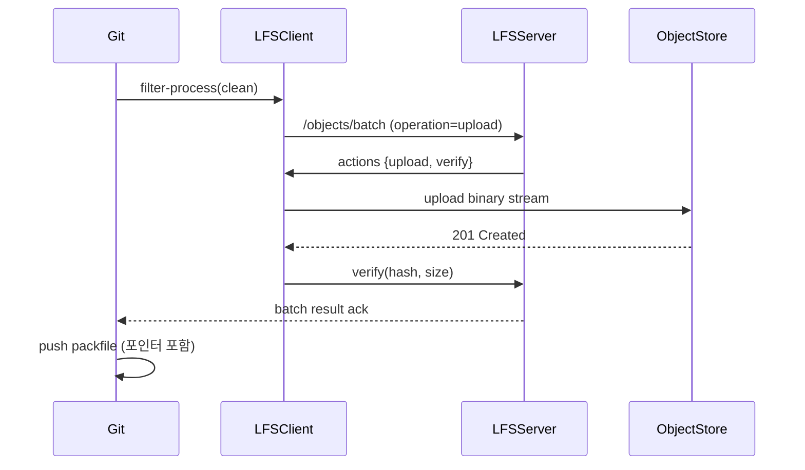

## 들어가며

대규모 그래픽 에셋이나 머신러닝 체크포인트 같은 파일을 버전 관리해야 할 때, Git LFS(Large File Storage)는 사실상 표준으로 자리잡았다. 하지만 많은 팀이 "git lfs install"만으로 끝내고 내부 동작을 이해하지 못한 채 사용한다. 그 결과 클린/스머지 필터가 왜 느려지는지, 서버 업로드가 왜 실패하는지, 로컬 캐시가 무엇을 의미하는지 모호한 상태로 운영하게 된다. 이번 편에서는 Git 해체분석기 시리즈답게 LFS 포인터 파일 구조, 클린/스머지 필터 파이프라인, 그리고 서버-클라이언트 전송 프로토콜을 소스 수준에서 파고들며 정리한다.

## 왜 LFS가 필요한가: Git ODB 한계를 짚고 시작하기

Git은 기본적으로 모든 blob을 `.git/objects` 아래에 압축(zlib) + delta 기반으로 저장한다. 수백 MB 이상의 바이너리를 그대로 집어넣으면 저장공간이 터질 뿐 아니라, 히스토리 재작성(repack, gc) 과정에서 모든 델타를 재계산하느라 시간 폭탄을 안게 된다. LFS는 "대형 blob을 Git이라 보기 힘든 별도 저장소"로 밀어내고, 대신 Git에는 작은 포인터 파일(pointer file)만 남겨둔다. 즉, Git 관점에서는 여전히 텍스트 파일 몇 줄을 커밋한 것처럼 보이지만, 실물 데이터는 LFS 서버가 관리한다.

## LFS 포인터 파일 구조 해부

클린 필터(clean filter)가 대형 파일을 감지하면 `*.lfs`가 아니라 일반 텍스트 파일로 치환한다. 이 텍스트는 Git LFS 사양(https://github.com/git-lfs/git-lfs/blob/main/docs/spec.md)에 정의된 포인터 포맷이다.

### 기본 구조

```text
overflow=sha256
version https://git-lfs.github.com/spec/v1
oid sha256:ad8c1d7c8f7c5f5b72f2fd18dab6f8107f3de59b0b030f3ab8bbac0d5fecf0f3
size 187392000
```

- **version**: 포인터 사양 버전. 현재는 `spec/v1` 고정이나, 포맷 확장을 대비해 필수 필드로 남아있다.
- **oid**: 실제 객체를 식별하는 해시. Git blob 해시와 다르게 LFS는 기본적으로 SHA-256을 사용한다. 이는 크로스-플랫폼 일관성을 확보하고, Git ODB와의 충돌을 피하기 위함이다.
- **size**: 바이트 단위의 원본 파일 크기. 이 값이 없다면 클라이언트는 진행률(progress)을 표시할 수 없고, 서버도 청크 단위 검증을 하기 어렵다.
- **추가 키**: `overflow=sha256`와 같이 커스텀 키가 붙을 수 있으며, 클라이언트는 이해하지 못하더라도 포인터 파일을 그대로 유지해야 한다.

포인터 파일은 Git이 blob으로 보는 유일한 데이터이기 때문에 diff, merge, blame 같은 Git 기본 기능은 모두 포인터 텍스트를 대상으로 실행된다. 즉, LFS를 쓴다고 해서 Git 히스토리가 사라지는 것이 아니라, 히스토리에는 포인터만 존재한다.

### 무결성 검증

LFS는 두 단계에서 무결성을 확인한다.
1. **클린 필터 단계**: 업로드 직전 SHA-256을 계산해 포인터에 기록한다.
2. **전송 단계**: 서버는 업로드된 내용의 SHA-256을 재계산해 `oid`와 일치하는지 확인한다.

이중 검증 덕분에 포인터 파일이 위조되거나 잘못 편집되는 상황을 감지할 수 있다. 만약 사용자가 포인터 파일을 수동으로 열어 `size`를 수정했다면, 이후 `git lfs pull` 시 서버는 `size` 필드를 신뢰하지 않고 실제 전송 데이터 길이를 기준으로 판단한다.

## 클린/스머지 필터 파이프라인

Git은 워킹트리와 ODB 간의 변환을 담당하는 필터 시스템을 오래전부터 제공해 왔다. LFS는 이를 적극적으로 활용한다.

1. **Clean Filter**: 워킹 디렉터리에서 인덱스로 올라간다(stage). 큰 파일이 감지되면 실제 내용 대신 포인터 텍스트를 인덱스에 기록한다.
2. **Smudge Filter**: 체크아웃 시 포인터 텍스트를 진짜 바이너리로 되돌린다.

이 파이프라인은 `.gitattributes`로 활성화된다.

```gitattributes
*.psd filter=lfs diff=lfs merge=lfs -text
model/*.pt filter=lfs diff=lfs merge=lfs -text
```

- `filter=lfs`: clean/smudge 양방향 필터를 Git에 등록한다.
- `diff=lfs`, `merge=lfs`: 포인터 diff 대신 사용자 정의 드라이버를 쓰게 한다. Git LFS는 기본적으로 diff에서 포인터 내용만 보여주며, 필요하면 `git lfs diff`를 별도로 제공한다.
- `-text`: Git의 CRLF 자동 변환을 끈다. 바이너리 포인터라도 라인 엔딩 변환이 적용되면 해시가 바뀌기 때문이다.

### Clean 필터 세부 동작

Clean 필터는 파이프(stdout)로 결과를 내보내는 스트리밍 방식이다. `git add large.bin`을 실행하면 Git은 워킹트리 파일 내용을 filestream으로 읽어 LFS 프로세스에 넘긴다.

```bash
GIT_TRACE=1 git lfs clean -- large.bin > large.bin.lfs
```

실제 구현은 `git-lfs/clean/filter_process.go`를 보면 이해하기 쉽다. 필터는 다음 단계를 수행한다.

1. 파일 크기와 경로를 받는다.
2. `.lfsconfig` 혹은 전역 설정으로 정의된 include/exclude 패턴과 비교해 LFS 대상인지 판단한다.
3. 대상이면 SHA-256을 계산하면서 동시에 임시 파일에 데이터를 쓴다.
4. 해시 계산이 끝나면 `objects/<first 2>/<remaining 62>` 구조의 파일 경로를 조합해 `.git/lfs/objects`에 저장한다.
5. 포인터 텍스트를 생성해 stdout으로 반환한다.

필터는 Git과 긴-lived 프로토콜을 유지하기 위해 `filter-process` 인터페이스를 사용한다. 이는 Git 2.11 이후 도입된 기능으로, `process` 모드를 통해 동작 비용을 크게 줄인다.

### Smudge 필터 세부 동작

Smudge 필터는 체크아웃 시 포인터 파일을 읽고 실제 데이터를 워킹트리에 복원한다.

```bash
git lfs smudge --index large.bin.lfs > large.bin
```

1. 포인터 텍스트를 파싱해 `oid`와 `size`를 얻는다.
2. `.git/lfs/objects`에 동일한 OID가 있는지 확인한다. 있으면 로컬 캐시에서 직접 복사한다.
3. 없으면 LFS API를 통해 원격에서 다운로드한다. 이때 HTTP 307/308 redirect를 따라가거나, signed URL을 받아 S3와 같은 외부 스토리지로부터 data를 스트리밍한다.
4. 워킹트리에 쓰면서 동시에 SHA-256을 계산해 무결성을 확인한다.

Smudge 필터도 filter-process 기반이다. 따라서 대형 저장소에서도 병렬 프리펫치(prefetch)나 큐잉 전략을 적용할 수 있다.

## 로컬 LFS 스토리지 레이아웃

`.git/lfs` 디렉터리는 크게 세 가지로 나뉜다.

```
.git/lfs/
├── logs/
├── objects/
│   ├── ab/
│   │   └── cdef1234...
│   └── ff/
│       └── 0099...
└── tmp/
```

- **objects/**: LFS object cache. 클린 필터에서 저장한 내용이 여기 들어간다. Git ODB와 동일하게 2자리 prefix + 나머지 62자리 경로를 사용해 파일 수를 분산한다.
- **tmp/**: 업로드나 다운로드 중간 파일. 장애 시 여기 남아 있는 파일을 확인해 실패 지점을 디버깅할 수 있다.
- **logs/**: `git lfs fetch`, `git lfs push` 등 명령 로그. HTTP 요청, 응답 코드, 재시도 횟수가 찍히므로 전송 문제를 추적할 때 유용하다.

LFS는 기본적으로 "캐시" 개념이라, `.git/lfs/objects` 안의 파일을 삭제해도 Git 히스토리는 안전하다. 필요하면 원격에서 다시 내려받으면 그만이다. 다만 CI 환경처럼 대량 fetch가 반복되는 곳에서는 이 캐시가 디스크를 잠식하므로 `git lfs prune`으로 정책적 청소를 돌리는 것이 좋다.

## 서버-클라이언트 전송 프로토콜 흐름

LFS는 단순한 `git push`와 달리, 별도의 HTTP API를 통해 대형 데이터를 전송한다. Git의 전송은 refs, commits, trees, blobs를 packfile 한 덩어리로 보내지만, LFS는 blob마다 독립적으로 업로드한다.

### Batch API 구조

1. 클라이언트는 Git push 과정 중 `git-lfs-authenticate` 헬퍼를 호출해 LFS 서버 endpoint와 인증 토큰을 얻는다.
2. 이후 `/objects/batch` 엔드포인트에 아래와 같은 JSON을 POST한다.

```json
{
  "operation": "upload",
  "objects": [
    {"oid": "ad8c1d...", "size": 187392000},
    {"oid": "7bc20a...", "size": 4194304}
  ]
}
```

3. 서버는 존재 여부를 판단해 필요한 객체에 대한 업로드 액션을 돌려준다.

```json
{
  "transfer": "basic",
  "objects": [
    {
      "oid": "ad8c1d...",
      "size": 187392000,
      "actions": {
        "upload": {
          "href": "https://lfs.example.com/upload/ad/8c1d...",
          "header": {"Authorization": "Basic ..."},
          "expires_at": "2026-02-20T03:05:00Z"
        },
        "verify": {
          "href": "https://lfs.example.com/verify" }
      }
    }
  ]
}
```

4. 클라이언트는 `upload.href`로 PUT/POST 요청을 보내 실제 데이터를 전송한다.
5. 전송이 끝나면 `verify` 액션을 호출해 서버가 받은 사이즈와 해시를 승인한다.

### Mermaid 시퀀스 다이어그램



이 다이어그램에서 `ObjectStore`는 AWS S3, GCS, MinIO 등 임의의 스토리지를 의미한다. 많은 팀이 LFS 서버를 직접 구현하지 않고, GitHub/GitLab/Bitbucket이 제공하는托管 서비스를 사용한다. 이 경우 `upload.href`는 곧바로 CDN 혹은 S3 pre-signed URL일 때가 많다.

## 전송 파이프라인에서 자주 겪는 이슈와 해결 전략

### 1. Parallel Transfer 튜닝

기본 설정에서 LFS는 최대 3개의 병렬 전송을 수행한다. 이는 `lfs.concurrenttransfers` 설정으로 조정 가능하다.

```ini
[lfs]
  concurrenttransfers = 8
  batch = true
```

- 병렬 수를 키우면 업로드/다운로드가 빨라지지만, 네트워크와 서버가 이를 버틸 수 있어야 한다.
- CI에서 대규모 모델을 당겨오는 경우 서버에 대한 Rate Limiting을 고려해야 한다.

### 2. LFS Locking

동일 파일을 여러 사용자가 동시에 수정하면 LFS 포인터가 충돌하기 쉽다. Git은 텍스트 병합이 가능하지만, 바이너리는 대부분 불가능하다. LFS는 `/locks` API로 optimistic locking을 제공한다. 내부적으로는 포인터 파일이 아닌 별도의 메타데이터 테이블을 유지한다. Lock 상태는 포인터와 무관하게 서버가 판단하므로, 필터 파이프라인에는 영향을 주지 않는다.

### 3. CI/CD에서의 Fetch/Checkout 병목

CI에서 `git clone` 후 `git lfs pull`이 느리다면 다음을 점검한다.

- `GIT_LFS_SKIP_SMUDGE=1`로 초기 clone 시 바이너리 다운로드를 건너뛴 뒤, 필요한 스텝에서만 `git lfs pull`을 실행한다.
- `.lfsconfig`의 `lfs.fetchinclude`/`fetchexclude`를 사용해 필요한 경로만 내려받는다.

```ini
[lfs]
  fetchinclude = "models/**"
  fetchexclude = "datasets/**"
```

### 4. 캐시 무결성 오류

`expected OID ad8c1d... got 7bc20a...` 같은 오류는 보통 캐시가 손상된 경우다. `.git/lfs/objects`에서 해당 OID 디렉터리를 삭제하고 다시 `git lfs pull`하면 해결된다. 근본 원인은 디스크 충돌, 안티바이러스의 파일 잠금, 혹은 사용자 커스텀 스크립트가 tmp 파일을 삭제한 경우가 많다.

## 실제 코드 레벨에서 살펴보는 Clean/Smudge 파이프라인

### Clean 필터 Go 코드 예시

`git-lfs/clean/clean.go`를 단순화하면 다음과 같다.

```go
func (c *CleanFilter) Clean(reader io.Reader, pointer *Pointer) error {
    file, err := c.tempFile()
    if err != nil { return err }
    defer file.Close()

    hash := sha256.New()
    size, err := io.Copy(io.MultiWriter(file, hash), reader)
    if err != nil { return err }

    oid := hex.EncodeToString(hash.Sum(nil))
    pointer.Oid = oid
    pointer.Size = size

    dst := c.storage.Path(oid)
    if err := os.Rename(file.Name(), dst); err != nil {
        return err
    }

    return nil
}
```

이 코드는 스트리밍으로 데이터와 해시를 동시에 계산하고, 최종적으로 `.git/lfs/objects`에 저장한다. 클린 필터가 끝난 뒤 Git에게 전달하는 것은 `pointer.String()`으로 직렬화한 텍스트뿐이다.

### Smudge 필터 Python 모의 코드

Smudge 과정은 Go로 작성되어 있지만, 이해를 돕기 위해 Python 유사 코드로 표현하면 아래와 같다.

```python
import hashlib
import requests

def smudge(pointer, worktree_path):
    cache_path = find_in_cache(pointer.oid)
    if not cache_path:
        action = request_download(pointer)
        stream = requests.get(action.href, headers=action.header, stream=True)
        cache_path = write_stream_to_cache(stream)

    with open(cache_path, "rb") as src, open(worktree_path, "wb") as dst:
        digest = hashlib.sha256()
        while chunk := src.read(8 * 1024 * 1024):
            digest.update(chunk)
            dst.write(chunk)

    if digest.hexdigest() != pointer.oid:
        raise ValueError("corrupted download")
```

이 예시는 다음 사실을 보여준다.
- 다운로드는 반드시 캐시에 저장한 뒤 워킹트리로 복사한다. 즉, 동일 OID를 여러 경로에서 재사용할 수 있다.
- 해시 검증은 워킹트리 쓰기 이후에 수행된다.

## 프로토콜 세부: Transfer Adapter

LFS는 `basic`, `ssh`, `custom` 등 다양한 transfer adapter를 지원한다. GitHub는 `basic`을, GitLab은 `basic`과 `ssh` 모두를 제공한다. Adapter는 단순히 업로드/다운로드 액션을 정의하는 JSON 스키마다. 예를 들어 `ssh` adapter는 SSH 명령을 통해 바이너리를 전송하며, `git-lfs-transfer` 같은 별도 도구가 서버 측에서 실행된다.

Adapter를 커스터마이징하면 사내 오브젝트 스토리지, CDN, 혹은 전용 전송 프로토콜(예: Aspera, UDT)을 연결할 수 있다. 이때도 포인터 파일 포맷은 동일하므로 Git 히스토리는 영향을 받지 않는다.

## 운영 시 모니터링 포인트

1. **Batch API Latency**: `/objects/batch`가 병목이면 Git push 전체가 느려진다. 서버 로그에서 `operation=upload` 호출 시간을 모니터링하라.
2. **Object Storage Error Rate**: 실제 데이터 전송은 대부분 S3 같은 외부 스토리지로 향한다. HTTP 5xx나 네트워크 타임아웃이 잦다면 LFS 서버가 재시도를 트리거하지만, 궁극적으로 사용자 경험이 나빠진다.
3. **GC/Prune 주기**: 로컬 캐시는 `git lfs prune`, 서버는 `lfs.locksverify`나 별도 가비지 컬렉션 스케줄을 운영해야 한다. 특히 self-hosted일 경우 orphan object가 빠르게 쌓인다.
4. **Bandwidth Accounting**: LFS 전송량은 일반 Git 트래픽과 별도 청구로 잡히는 경우가 많다. CI가 동일 파일을 반복 다운로드한다면 캐시 레이어(예: Nexus, Artifactory)를 사이에 둬 비용을 줄일 수 있다.

## 디버깅 팁

- `GIT_TRACE=1 GIT_CURL_VERBOSE=1 git lfs fetch`로 HTTP 레벨 로그를 확인한다.
- `.git/lfs/logs/`에 타임스탬프별 로그가 쌓인다. "HTTP: 429" 같은 문구로 Rate Limit 여부를 바로 파악할 수 있다.
- `git lfs env`로 현재 필터와 transfer 설정을 점검하라. 특히 CI에서 전역 설정이 누락된 경우가 많다.
- `git check-attr filter -- path/to/file`를 실행하면 해당 파일이 LFS 필터의 대상인지 즉시 확인할 수 있다.

## 셀프 호스팅 아키텍처 레퍼런스

GitHub나 GitLab SaaS를 쓰지 않고 LFS를 직접 호스팅하려면 **오브젝트 스토리지, 인증, 프록시 캐시, 관측성**을 동시에 설계해야 한다. 아래는 5TB 규모의 디자인 팀이 실제로 쓰는 참조 아키텍처다.

```mermaid
flowchart LR
    Dev[Git Client] -->|HTTPS| EdgeCDN((CDN))
    EdgeCDN --> API[LFS API (Go)]
    API --> MQ[(Retry Queue)]
    API --> ObjectStore[S3-Compatible Object Store]
    MQ --> Worker[Async Verifier]
    Worker --> ObjectStore
    API --> Grafana[(Metrics/Logs)]
```

### 1. 프록시/캐시 계층
- CloudFront, Fastly, 혹은 사내 Nginx를 앞단에 세워 정적 파일(다운로드)을 캐싱하면 동일 모델을 수백 번 내려받을 때 70% 이상 대역폭을 절약한다.
- 업로드 요청은 캐시하면 안 되므로 `Cache-Control: no-store` 헤더를 강제로 붙인다.
- `git lfs env` 출력에서 `concurrenttransfers` 값을 8 이상으로 높였다면, 엣지 캐시는 HTTP 429를 리턴하는 대신 `Retry-After` 헤더를 보존해 주어야 한다.

### 2. 관측성과 실패 도메인
- `/objects/batch` 요청 수, 평균 지연, 4xx/5xx 비율을 Prometheus로 긁어 Grafana에서 얼럿을 건다.
- 오브젝트 스토리지 상태와 API 서버 상태를 분리해서 모니터링해야 근본 원인을 빠르게 찾을 수 있다. LFS 서버는 대부분 stateless하므로 오토스케일링 그룹으로 운영하고, Object Store는 멀티 AZ 복제를 켜는 편이 안전하다.
- `.git/lfs/logs`를 중앙 수집(Splunk/CloudWatch Logs)으로 보내면 사용자 PC에서 발생한 오류까지 한 화면에 모을 수 있다.

### 3. 재해 복구 시나리오
- 오브젝트 스토리지를 매일 증분 백업하고, DR 리전에 `git-lfs-serve` 인스턴스를 미리 띄워둔다.
- API 서명 키가 노출되면 즉시 회전할 수 있도록 KMS/Secrets Manager를 활용하고, `lfs.url`을 DNS CNAME 으로 둬서 1분 내에 트래픽을 다른 리전으로 우회한다.
- CI/CD 환경에서는 `git lfs fetch --recent`를 cron으로 돌리고 있으므로, DR 전환 시에는 fetch 대상 범위를 30일→2일로 줄여 초기 부하를 낮춘다.

## 베스트 프랙티스 체크리스트

1. **포인터 검증을 CI에 포함**: `git lfs fsck`를 빌드 파이프라인에 추가해 포인터/실제 파일 사이즈가 엇갈리는 상황을 즉시 잡는다.
2. **`lfs.storage` 분리**: SSD가 부족하다면 `.git/lfs`를 전용 볼륨으로 옮겨 I/O 병목을 막는다. 심볼릭 링크로 간단히 분리할 수 있다.
3. **`post-checkout` 프리페치**: 빈번하게 열어 보는 경로는 체크아웃 시점에 `git lfs pull --include "models/**"`를 자동 실행해 캐시에 미리 적재한다.
4. **락(Lock) 수명 정책**: `/locks` API로 걸어둔 락이 영구화되지 않도록 주기적으로 만료시키고, CI에서 실패하면 자동으로 락을 해제하는 후처리를 넣는다.
5. **데이터 분류**: 모델과 데이터셋을 동일 LFS 리포에 넣지 말고, 읽기 패턴이 다른 자산은 repo를 분리하거나 최소한 `fetchexclude`로 제어한다.

이 체크리스트만으로도 대부분의 “왜 우리 LFS가 느릴까” 유형을 조기에 차단할 수 있다. 나머지는 관측 지표와 로그를 기반으로 근본 원인을 추적해야 한다.


## 마치며

Git LFS는 단순한 "대형 파일 보관함"이 아니라 Git 필터, 포인터 포맷, HTTP Batch API, 외부 스토리지까지 얽힌 복합 시스템이다. 포인터 파일이 어떻게 생성되고, 클린/스머지 필터가 어떤 순서로 동작하며, 서버-클라이언트가 어떤 메시지를 주고받는지 이해하면 장애 대응 속도와 운영 효율이 크게 달라진다. 이번 글에서 다룬 내부 구조를 바탕으로, 팀의 LFS 설정을 다시 살펴보고 병목이나 잠재적 실패 지점을 조기에 제거하길 바란다. 다음 편에서는 해체분석기 시리즈의 전통답게 실제 Git 소스 코드 레벨에서 필터 프로세스 프로토콜을 추적해 보겠다.
