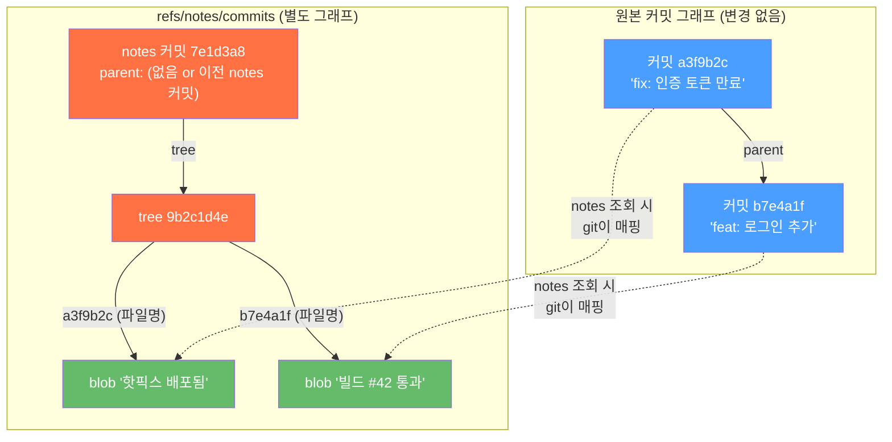
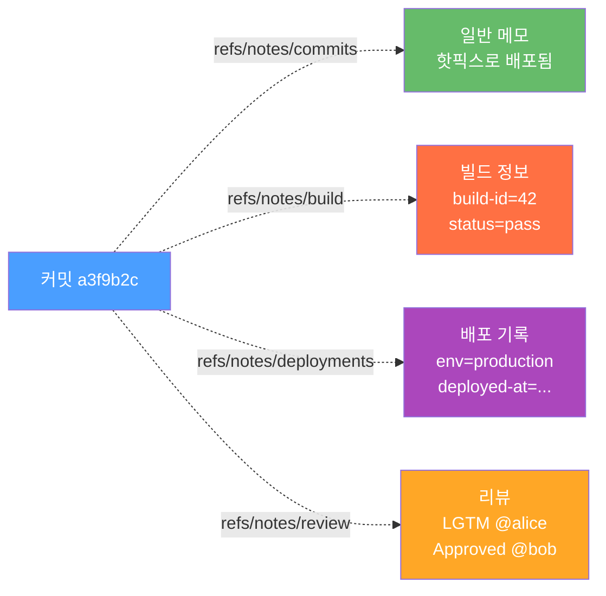
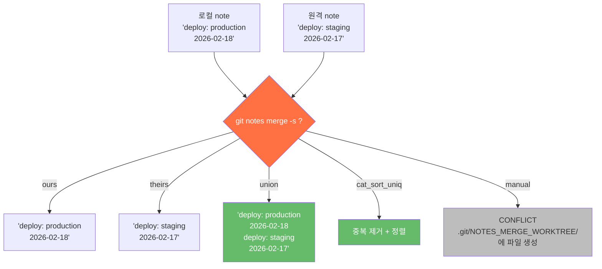
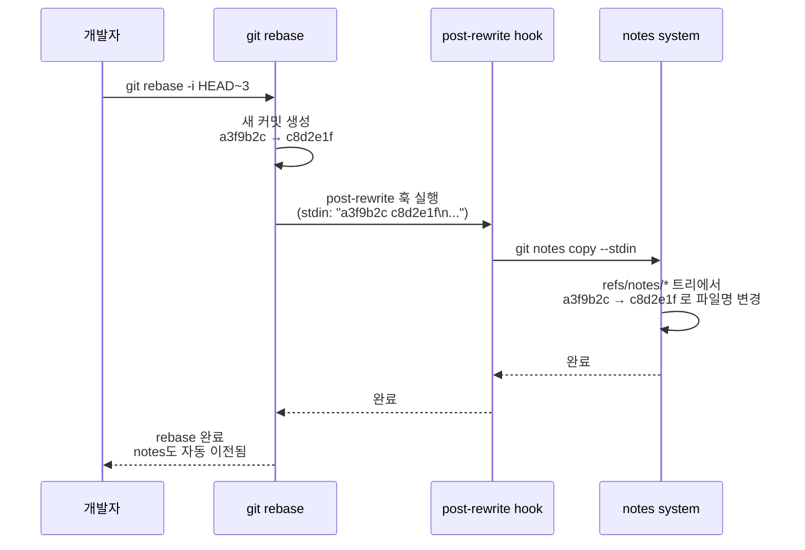

> "커밋 메시지를 수정하면 해시가 바뀌잖아요. 이미 push한 커밋에 나중에 정보를 추가할 방법이 없을까요?" — 배포 자동화 파이프라인을 구축하던 어느 DevOps 엔지니어

## 들어가며

`git commit --amend`를 실행하는 순간, 커밋 해시가 바뀝니다.  
이미 팀원들이 pull한 커밋이라면? 강제 push가 필요하고, 그 팀원들의 로컬 히스토리가 어긋납니다. CI는 새 해시를 알 수 없고, 배포 기록과의 연결이 끊어집니다.

현실에서는 커밋이 생성된 **이후**에 정보를 붙여야 할 일이 끊임없이 생깁니다:

- CI 파이프라인이 "이 커밋의 빌드는 성공했다"를 기록하고 싶다
- 코드 리뷰에서 나온 맥락("왜 이렇게 짰는지")을 후대에 남기고 싶다  
- 배포 시각, 환경, 아티팩트 URL을 커밋과 직접 연결하고 싶다
- 몇 달 전 커밋에 "이게 나중에 CVE-2025-XXXX로 밝혀졌음"을 달고 싶다

이럴 때 `git notes`가 등장합니다. 오늘은 git notes의 내부를 완전히 해체합니다. 단순한 "사용법" 말고, **어떻게 커밋 해시를 바꾸지 않으면서 정보를 붙일 수 있는지** — git 오브젝트 레벨부터 CI/CD 실전 패턴까지.

---

## 1. 30초 요약 — 쓰기 전에 느낌부터

```bash
# HEAD 커밋에 메모 추가
$ git notes add -m "핫픽스 배포됨 — 인증 토큰 만료 버그"

# git log에서 자동으로 표시됨
$ git log -1 --show-notes
commit a3f9b2c (HEAD -> main)
Author: gideok <gideok@example.com>
Date:   Wed Feb 18 09:00:00 2026 +0900

    fix: 사용자 인증 토큰 만료 처리

Notes:
    핫픽스 배포됨 — 인증 토큰 만료 버그

# 커밋 해시 확인
$ git rev-parse HEAD
a3f9b2c4d5e6f7a8b9c0d1e2f3a4b5c6d7e8f9a0  # ← 그대로!
```

해시가 그대로입니다. 어떻게? 지금부터 파헤쳐봅니다.

---

## 2. 내부 구조: refs/notes/commits는 무엇인가

git notes의 비밀은 **완전히 별도의 커밋 트리**에 있습니다.

```bash
# notes를 추가하고 나면 이 ref가 생긴다
$ cat .git/refs/notes/commits
7e1d3a8f2b9c0e4f1d6a3b7c9e2f0a4d8b1c5e7f

# 이게 뭔지 확인
$ git cat-file -t 7e1d3a8f2b9c0e4f1d6a3b7c9e2f0a4d8b1c5e7f
commit

# 커밋 내용 보기
$ git cat-file -p 7e1d3a8f2b9c0e4f1d6a3b7c9e2f0a4d8b1c5e7f
tree 9b2c1d4e5f6a7b8c9d0e1f2a3b4c5d6e7f8a9b0
author GitHub Actions <actions@github.com> 1739840400 +0900
committer GitHub Actions <actions@github.com> 1739840400 +0900

Notes added by 'git notes add'

# 트리 내용 (여기가 핵심!)
$ git ls-tree 9b2c1d4e5f6a7b8c9d0e1f2a3b4c5d6e7f8a9b0
100644 blob 4a9f2e1d3b8c7f0a2e5d4c3b2a1f0e9d8c7b6a5  a3f9b2c4d5e6f7a8b9c0d1e2f3a4b5c6d7e8f9a0
```

트리에서 파일명이 `a3f9b2c4...` — 방금 notes를 달았던 **원본 커밋의 해시**입니다. 그 blob의 내용이 바로 메모입니다.

```bash
$ git cat-file -p 4a9f2e1d3b8c7f0a2e5d4c3b2a1f0e9d8c7b6a5
핫픽스 배포됨 — 인증 토큰 만료 버그
```

전체 구조를 `.git` 디렉토리 레벨에서 보면:

```
.git/
├── refs/
│   ├── heads/main          ← 일반 브랜치
│   └── notes/
│       └── commits         ← notes "브랜치" (여기에 HEAD 커밋 SHA 저장)
└── objects/
    ├── 7e/1d3a8f...        ← notes 커밋 객체
    ├── 9b/2c1d4e...        ← notes 커밋의 트리 객체
    ├── a3/f9b2c4...        ← 원본 커밋 객체 (수정 없음!)
    └── 4a/9f2e1d...        ← note 내용 (blob)
```

**원본 커밋 `a3/f9b2c4...` 는 전혀 건드리지 않았습니다.** 오직 notes 전용 커밋이 새로 생긴 것뿐입니다.

---

## 3. Fan-out 샤딩: notes가 많아지면?

notes가 수백 개로 늘어나면 트리에 파일이 많아집니다. git은 이를 자동으로 **fan-out 샤딩**합니다 — objects 디렉토리와 동일한 방식입니다.

```bash
# notes가 적을 때: 플랫 구조
$ git ls-tree -r refs/notes/commits
100644 blob 4a9f...  a3f9b2c4d5e6f7a8b9c0d1e2f3a4b5c6d7e8f9a0
100644 blob 9b3f...  b7e4a1f8d2c9e6b3a0d7f4c1e8b5a2f9d6c3e0a7

# notes가 많아지면: 2자리 prefix 디렉토리로 샤딩
$ git ls-tree -r refs/notes/commits
100644 blob 4a9f...  a3/f9b2c4d5e6f7a8b9c0d1e2f3a4b5c6d7e8f9a0
100644 blob 9b3f...  b7/e4a1f8d2c9e6b3a0d7f4c1e8b5a2f9d6c3e0a7
100644 blob 2d1c...  b7/a3d5f1e8c2b9a0d6f4e1c8b5a2f9d3e6c0b7a4
```

git 소스코드([`notes.c`](https://github.com/git/git/blob/master/notes.c))에서 이 부분은 `load_subtree()` 함수가 담당합니다. 노트 개수가 `fanout_threshold`(기본 256)를 넘으면 자동으로 fan-out 레벨을 올립니다. 이론상 2단계 fan-out(`a3/f9/b2c4...`)까지 지원하지만 실제로는 1단계로 충분합니다.

---

## 4. 커밋 해시 불변성의 원리

git 커밋 해시는 정확히 이 입력들로 계산됩니다:

```
SHA-1(
  "commit " + length + NUL +
  "tree "   + tree_sha   + LF +
  "parent " + parent_sha + LF +   (있을 경우)
  "author " + author_info + LF +
  "committer " + committer_info + LF +
  LF +
  commit_message
)
```

`git notes add`가 하는 일은:
1. note 내용으로 새 **blob** 객체 생성
2. 기존 notes 트리에 `{원본_커밋_해시: blob_sha}` 항목 추가한 새 **tree** 객체 생성
3. 그 tree를 가리키는 새 **commit** 객체 생성
4. `refs/notes/commits`를 새 커밋으로 갱신

원본 커밋의 SHA-1 입력 중 **어느 것도 수정하지 않습니다.** 원본 커밋 해시는 수학적으로 불변입니다.



`git log --show-notes`를 실행하면 git은 두 그래프를 런타임에 조인해서 출력합니다. 두 그래프는 영원히 독립적으로 존재합니다.

---

## 5. Notes Namespace: 여러 종류의 메모를 독립적으로

기본 ref는 `refs/notes/commits`이지만, 목적별로 네임스페이스를 분리할 수 있습니다:

```bash
# CI 빌드 정보
$ git notes --ref=refs/notes/build add \
    -m "build-id=42, status=pass, duration=3m21s" HEAD

# 배포 기록
$ git notes --ref=refs/notes/deployments add \
    -m "env=production, deployed-at=2026-02-18T09:30Z" HEAD

# 코드 리뷰 코멘트
$ git notes --ref=refs/notes/review add \
    -m "LGTM @alice, Approved @bob" HEAD

# 각각 독립된 ref로 저장됨
$ ls .git/refs/notes/
build    commits    deployments    review
```



CI 서버, 배포 시스템, 코드 리뷰 도구가 **서로 방해 없이** 각자의 네임스페이스에 독립적으로 기록합니다.

### 여러 notes 동시에 보기

```bash
# 특정 ref만 표시
$ git log --show-notes=refs/notes/build -5

# 모든 notes ref 표시
$ git log --show-notes=* -5

# .git/config에 영구 설정
$ git config notes.displayRef 'refs/notes/*'

# 이제 git log 에 자동으로 모든 notes 표시됨
$ git log -5
```

---

## 6. Notes Push/Fetch: 원격 저장소와 공유

**기본 `git push`는 notes를 전송하지 않습니다.** 명시적으로 지정해야 합니다:

```bash
# 단일 notes ref push
$ git push origin refs/notes/commits

# 모든 notes push
$ git push origin 'refs/notes/*'

# fetch
$ git fetch origin 'refs/notes/*:refs/notes/*'

# 자동화: .git/config에 추가
$ git config --add remote.origin.fetch '+refs/notes/*:refs/notes/*'
$ git config --add remote.origin.push 'refs/notes/*'
```

설정 후 `.git/config`:

```ini
[remote "origin"]
    url = git@github.com:user/repo.git
    fetch = +refs/heads/*:refs/remotes/origin/*
    fetch = +refs/notes/*:refs/notes/*   ← 추가됨
    push = refs/notes/*                  ← 추가됨
```

이제 `git pull`, `git push`가 자동으로 notes도 동기화합니다.

---

## 7. Notes Merge 전략: 충돌은 어떻게 해결하나

두 곳에서 같은 커밋에 다른 notes를 달면 충돌이 생깁니다. git notes merge는 5가지 전략을 제공합니다:

```bash
git notes merge -s <전략> refs/notes/commits
```

| 전략 | 동작 | 최적 시나리오 |
|------|------|--------------|
| `manual` (기본) | CONFLICT 파일 생성, 수동 해결 | 중요한 메모, 사람이 판단 필요 |
| `ours` | 현재 로컬 내용 유지 | 로컬이 항상 정답인 경우 |
| `theirs` | 원격 내용으로 덮어쓰기 | 원격(CI 등)이 권위 있는 경우 |
| `union` | 두 내용을 이어붙임 | 빌드 로그, 이벤트 누적 |
| `cat_sort_uniq` | union 후 정렬 + 중복 제거 | 태그, 레이블 목록 |



### union 전략 실전: CI 여러 서버가 동시에 기록

```bash
# CI 빌드 서버가 완료 후 기록
$ git notes --ref=refs/notes/ci append \
    -m "build-123: PASS (2026-02-18 09:00, 3m21s)"

# 다른 CI 서버(테스트)도 기록
$ git notes --ref=refs/notes/ci append \
    -m "test-456: PASS (2026-02-18 09:05, 1m45s)"

# 두 서버의 notes를 union merge — 모든 이력 보존
$ git fetch origin refs/notes/ci:refs/notes/ci-remote
$ git notes merge -s union refs/notes/ci-remote
$ git push origin refs/notes/ci

# 결과 확인
$ git notes --ref=refs/notes/ci show HEAD
build-123: PASS (2026-02-18 09:00, 3m21s)
test-456: PASS (2026-02-18 09:05, 1m45s)
```

### manual 전략으로 충돌 해결

```bash
$ git notes merge refs/notes/commits-remote
# CONFLICT 발생

# 충돌 파일 위치
$ ls .git/NOTES_MERGE_WORKTREE/
a3f9b2c4d5e6f7a8b9c0d1e2f3a4b5c6d7e8f9a0

# 파일 열어 수동 편집
$ vim .git/NOTES_MERGE_WORKTREE/a3f9b2c4...
# <<<<<<< 로컬
# 내용 A
# =======
# 내용 B
# >>>>>>> 원격

# 해결 후 커밋
$ git notes merge --commit

# 또는 중단
$ git notes merge --abort
```

---

## 8. CI/CD 실전 활용

### 8-1. GitHub Actions: 커밋에 빌드 정보 자동 첨부

```yaml
# .github/workflows/ci.yml
name: CI + Annotate Commit

on: [push]

jobs:
  build-and-annotate:
    runs-on: ubuntu-latest
    steps:
      - uses: actions/checkout@v4
        with:
          fetch-depth: 0

      - name: Fetch existing notes
        run: |
          git fetch origin '+refs/notes/*:refs/notes/*' || true

      - name: Run build
        id: build
        run: |
          npm ci && npm run build && npm test
          echo "status=success" >> $GITHUB_OUTPUT
        continue-on-error: true

      - name: Attach build result to commit
        if: always()
        env:
          GIT_AUTHOR_NAME: "GitHub Actions"
          GIT_AUTHOR_EMAIL: "actions@github.com"
          GIT_COMMITTER_NAME: "GitHub Actions"
          GIT_COMMITTER_EMAIL: "actions@github.com"
        run: |
          cat > /tmp/note.txt << EOF
          build-id: ${{ github.run_id }}
          workflow: ${{ github.workflow }}
          status: ${{ steps.build.outputs.status || 'failure' }}
          runner: ${{ runner.os }}
          ref: ${{ github.ref }}
          timestamp: $(date -u +%Y-%m-%dT%H:%M:%SZ)
          url: ${{ github.server_url }}/${{ github.repository }}/actions/runs/${{ github.run_id }}
          EOF

          git notes --ref=refs/notes/ci add -f -F /tmp/note.txt ${{ github.sha }}
          git push origin refs/notes/ci
```

### 8-2. 배포 스크립트: 배포 기록을 커밋에 연결

```bash
#!/bin/bash
# scripts/deploy.sh

set -e

COMMIT_SHA=$(git rev-parse HEAD)
DEPLOY_ENV="${DEPLOY_ENV:-production}"
DEPLOY_TIME=$(date -u +"%Y-%m-%dT%H:%M:%SZ")
DEPLOYER="${GITHUB_ACTOR:-$(git config user.name)}"
ARTIFACT_URL="s3://my-artifacts/${COMMIT_SHA}.tar.gz"

echo "📦 $DEPLOY_ENV 배포 시작: $COMMIT_SHA"

# 실제 배포 로직
./scripts/build-and-upload.sh
./scripts/k8s-rollout.sh

# 성공하면 커밋에 배포 기록 첨부
git fetch origin '+refs/notes/*:refs/notes/*' || true

git notes --ref=refs/notes/deployments add -f -m \
"env: $DEPLOY_ENV
deployed-at: $DEPLOY_TIME
deployed-by: $DEPLOYER
pipeline: ${CI_PIPELINE_ID:-local}
artifact: $ARTIFACT_URL
k8s-rollout: success" \
"$COMMIT_SHA"

git push origin refs/notes/deployments

echo "✅ 배포 완료. 기록이 커밋 $COMMIT_SHA 에 첨부됨"
```

### 8-3. 배포 이력 조회 — "이 커밋 언제 배포됐어?"

```bash
# 특정 커밋의 전체 이력
$ git fetch origin '+refs/notes/*:refs/notes/*'

$ git notes --ref=refs/notes/deployments show a3f9b2c
env: production
deployed-at: 2026-02-18T09:30:00Z
deployed-by: gideok
pipeline: 42
artifact: s3://my-artifacts/a3f9b2c.tar.gz
k8s-rollout: success

# 최근 커밋들의 CI + 배포 상태를 한눈에
$ git log --show-notes=refs/notes/ci --show-notes=refs/notes/deployments \
    --format="%C(yellow)%h%Creset %s%n%C(cyan)%N%Creset" -10
```

### 8-4. format-patch와 함께: 이메일 워크플로우

`git format-patch`로 패치를 만들 때 notes도 함께 보낼 수 있습니다:

```bash
# notes를 패치 파일에 포함
$ git format-patch --notes HEAD~3..HEAD

# 0001-fix-auth.patch 파일 하단에 아래처럼 추가됨:
# ---
# Notes:
#     핫픽스 배포됨 — 인증 토큰 만료 버그
```

---

## 9. GitHub에서 Notes 보기 — 그리고 왜 안 보이는가

솔직히 말하면: **GitHub 웹 UI는 git notes를 표시하지 않습니다.** (2026년 현재)

GitHub의 커밋 페이지는 커밋 객체의 `message` 필드만 렌더링합니다. `refs/notes/commits`를 조회하는 로직 자체가 없습니다. GitHub Community에 [2022년부터 올라온 요청](https://github.com/orgs/community/discussions/14791)이 있지만 아직 구현되지 않았습니다.

**왜 구현이 어려울까?** notes는 push하지 않으면 원격에 없을 수 있고, 누가 notes를 달 수 있는지 권한 모델도 복잡합니다. 또 notes ref가 사용자마다 다를 수 있습니다.

### 대안 1: 로컬 조회

```bash
$ git fetch origin '+refs/notes/*:refs/notes/*'
$ git log --show-notes=* main
```

### 대안 2: GitLab은 부분 지원

GitLab은 일부 notes ref를 웹 UI에서 보여줄 수 있습니다. GitLab을 사용한다면 확인해볼 만합니다.

### 대안 3: GitHub Actions로 PR 코멘트 변환

notes 내용을 GitHub PR 코멘트로 변환하는 간단한 액션:

```yaml
- name: Post build notes as PR comment
  uses: actions/github-script@v7
  with:
    script: |
      let notes = '';
      try {
        notes = require('child_process')
          .execSync('git notes --ref=refs/notes/ci show ${{ github.sha }}')
          .toString().trim();
      } catch (e) {
        notes = '(노트 없음)';
      }

      const prNumber = context.payload.pull_request?.number;
      if (!prNumber) return;

      await github.rest.issues.createComment({
        owner: context.repo.owner,
        repo: context.repo.repo,
        issue_number: prNumber,
        body: `## 🏗️ CI 빌드 정보\n\`\`\`\n${notes}\n\`\`\``
      });
```

---

## 10. notes.rewrite — rebase 후에도 notes 살아남기

`git rebase`나 `git commit --amend`로 커밋 해시가 바뀌면, 기존 notes는 **고아**가 됩니다. 파일명이 구 해시이기 때문입니다.

이를 방지하는 설정:

```bash
$ git config notes.rewriteRef "refs/notes/*"
$ git config notes.rewrite.rebase true
$ git config notes.rewrite.amend true
```

`.git/config` 결과:

```ini
[notes]
    rewriteRef = refs/notes/*

[notes "rewrite"]
    rebase = true
    amend = true
```

이 설정이 있으면 rebase/amend 후 git이 자동으로 notes를 새 해시로 이전합니다.



실제로 `post-rewrite` 훅이 `git notes copy --stdin`을 호출하는 방식입니다. git 소스의 `git-notes--helpers.sh`에 구현되어 있습니다.

---

## 11. Notes Copy: 특정 커밋에서 복사

```bash
# from 커밋의 notes를 to 커밋으로 복사
$ git notes copy <from-commit> <to-commit>

# 실용 예: cherry-pick 후 notes 복사
$ ORIGINAL=a3f9b2c
$ NEW=$(git cherry-pick $ORIGINAL)

$ git notes copy $ORIGINAL $NEW
# 이제 새 커밋에도 같은 notes가 달림
```

rewrite 설정을 안 했거나, 수동으로 cherry-pick할 때 유용합니다.

---

## 12. 실전 팁과 주의사항

### 유용한 alias

```bash
# notes 포함 로그 (컬러)
$ git config alias.nl \
    'log --show-notes=* --format="%C(yellow)%h%Creset %s%n%C(cyan)%N%Creset"'

# 사용
$ git nl -10

# 특정 ref만
$ git config alias.ci-log \
    'log --show-notes=refs/notes/ci --format="%h %s%n%N"'
```

### Notes 삭제와 정리

```bash
# HEAD의 기본 notes 삭제
$ git notes remove HEAD

# 특정 ref의 notes 삭제
$ git notes --ref=refs/notes/ci remove a3f9b2c

# 존재하지 않는 커밋을 가리키는 고아 notes 정리
$ git notes prune -v
Removing note for object a3f9b2c...  # 더 이상 없는 커밋
```

### 크기 기준 — 무엇을 넣고 무엇을 넣지 말아야 하나

notes는 git objects이므로 저장소 크기에 직접 영향을 줍니다:

| 데이터 | 권장 | 이유 |
|--------|------|------|
| 빌드 메타데이터 (ID, 상태, 시간) | ✅ | 수십 바이트 |
| 테스트 결과 요약 | ✅ | 수 KB |
| 배포 기록 (env, 시각, 담당자) | ✅ | 수백 바이트 |
| 전체 빌드 로그 | ❌ | S3/Artifacts URL로 대체 |
| 바이너리 아티팩트 | ❌ | 저장소 폭발 |
| 스크린샷, 미디어 | ❌ | 절대 금지 |

---

## 마치며

git notes는 git의 불변성 보장에서 오는 제약을 **우회하는 것이 아니라 존중하면서** 해결하는 접근입니다. 커밋 해시를 바꾸지 않고도 메타데이터를 붙일 수 있는 이유는 완전히 분리된 커밋 그래프를 사용하기 때문입니다.

핵심 정리:

| 개념 | 내용 |
|------|------|
| **저장 구조** | `refs/notes/commits` 브랜치 + 커밋해시를 파일명으로 하는 트리 |
| **해시 불변성** | 원본 커밋 객체 미변경 → SHA-1 입력 동일 → 해시 동일 |
| **Fan-out** | notes 수가 많아지면 2자리 prefix 디렉토리로 자동 샤딩 |
| **Namespace** | `refs/notes/<name>` 으로 종류별 독립 분리 |
| **Push/Fetch** | 기본 비활성 → 명시적 refspec 필요 |
| **Merge 전략** | `union`이 CI 로그 누적에 최적 |
| **Rewrite** | `notes.rewriteRef` 설정으로 rebase/amend 후 자동 이전 |

GitHub이 아직 웹 UI에서 notes를 보여주지 않는다는 한계가 있지만, **CI/CD 파이프라인에서 빌드·배포 정보를 커밋과 영구히 연결**하는 패턴은 지금 당장 써볼 수 있습니다. "이 버그, 언제 고쳐서 언제 배포됐지?"라는 질문에 `git log`만으로 답할 수 있게 되는 순간, git notes의 진가를 느끼게 됩니다.

다음엔 `git replace` — 커밋을 "교체"하는 또 다른 투명한 마법을 해체해보겠습니다.

---

*참고:*
- *[git-notes 공식 문서](https://git-scm.com/docs/git-notes)*
- *[Git 소스: notes.c](https://github.com/git/git/blob/master/notes.c)*
- *[Git Internals - Git References](https://git-scm.com/book/en/v2/Git-Internals-Git-References)*
- *[GitHub Community: Support for git notes](https://github.com/orgs/community/discussions/14791)*
