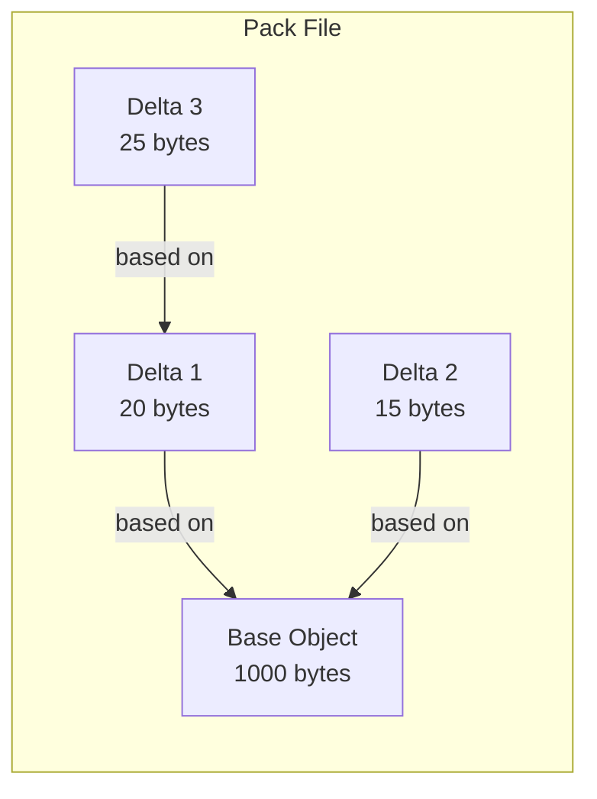

## 이전 글 요약

[지난 글](/posts/git-remote-evolution/)에서 Remote의 탄생을 봤다.

fetch, push로 object를 주고받을 수 있게 됐다. 하지만 한 가지 문제가 있었다:

**"object가 너무 많아지면 어떡하지?"**

Linux 커널 저장소를 생각해보자. 20년간 수백만 개의 commit, 수천만 개의 파일 버전. 이걸 전부 개별 파일로 저장하면?

---

## Loose Object의 한계

Git은 처음에 모든 object를 개별 파일로 저장했다.

```
.git/objects/
├── ab/
│   └── cd1234...  (blob)
├── ef/
│   └── gh5678...  (tree)
└── 12/
    └── 345678...  (commit)
```

### 문제점

**1. 파일 수 폭발**

```bash
# Linux 커널 저장소
$ find .git/objects -type f | wc -l
8,234,567  # 800만 개 파일
```

파일 시스템은 이렇게 많은 파일을 싫어한다. `ls`만 해도 느려진다.

**2. 중복 저장**

`README.md`를 살짝 수정하면?

```
v1: "Hello World"  → blob abc123 (12 bytes, zlib 압축)
v2: "Hello World!" → blob def456 (13 bytes, zlib 압축)
```

99% 같은 내용인데 **완전히 별개의 파일**로 저장된다.

**3. 네트워크 비효율**

```bash
git clone linux-kernel
# 800만 개 파일을 하나씩 전송?
```

불가능하다.

---

## Pack 파일의 등장

2005년, Linus는 해결책을 만들었다.

> **"비슷한 object끼리 묶어서 delta만 저장하자"**

```
Before (loose objects):
.git/objects/ab/cd1234...  (100KB)
.git/objects/ef/gh5678...  (100KB)  # 거의 동일
.git/objects/12/345678...  (100KB)  # 거의 동일

After (pack file):
.git/objects/pack/pack-xxx.pack  (105KB)
.git/objects/pack/pack-xxx.idx
```

300KB가 105KB로. **65% 절약**.

---

## Delta Compression

Pack의 핵심은 **delta compression**이다.

### 원리

```
Base object:  "Hello World, this is a test file..."  (1000 bytes)
Similar object: "Hello World, this is a TEST file..."  (1000 bytes)

Delta: "offset 28, replace 4 bytes: TEST"  (20 bytes)
```

비슷한 파일은 **차이점(delta)만 저장**한다.

### Mermaid로 보는 구조



Delta는 다른 delta를 기반으로 할 수도 있다 (delta chain).

---

## Linus의 설명 (2006년 IRC 로그)

2006년 2월, Linus가 직접 설명한 packing 알고리즘:

> **1. 모든 object 목록 생성**
> **2. "마법의" 휴리스틱으로 정렬**
> **3. sliding window로 delta 가능한 쌍 찾기**
> **4. recency order로 출력**

### 정렬 기준 (마법의 정체)

```
1. 타입별 분리 (commit, tree, blob 따로)
2. 파일명으로 정렬 (basename 기준)
3. 크기로 정렬 (큰 것부터)
```

왜 파일명?

```
src/utils/Makefile
lib/core/Makefile
tests/Makefile
```

같은 이름의 파일은 **내용도 비슷할 가능성이 높다**.

---

## Pack 파일 구조

실제 pack 파일을 열어보자.

```bash
$ hexdump -C .git/objects/pack/pack-xxx.pack | head -20
```

```
00000000  50 41 43 4b 00 00 00 02  00 00 12 34 ...
          P  A  C  K  (version 2)   (object count)
```

### 헤더

| 오프셋 | 크기 | 내용 |
|--------|------|------|
| 0 | 4 bytes | "PACK" 시그니처 |
| 4 | 4 bytes | 버전 (보통 2) |
| 8 | 4 bytes | object 개수 |

### Object Entry

각 object는 다음 형태:

```
[header] [data]
```

Header에는:
- 타입 (commit, tree, blob, tag, delta)
- 크기
- delta인 경우: base object 참조

---

## Index 파일 (.idx)

Pack 파일만으로는 특정 object를 찾기 어렵다. 그래서 **index 파일**이 있다.

```
pack-xxx.pack  → 실제 데이터
pack-xxx.idx   → "SHA-1 → offset" 매핑
```

### Index 구조 (v2)

```
1. Fanout table (256 entries)
   - 첫 바이트 기준 object 수 누적
   
2. SHA-1 목록 (정렬됨)

3. CRC32 체크섬

4. Offset 목록
```

이진 검색으로 **O(log n)**에 object 찾기 가능.

---

## 언제 Pack이 만들어지나?

### 1. git gc

```bash
$ git gc
Counting objects: 12345, done.
Delta compression using up to 8 threads.
Compressing objects: 100% (10000/10000), done.
```

- loose object가 일정 수 이상이면 자동 실행
- 수동으로도 실행 가능

### 2. git push / git fetch

```bash
$ git push origin main
Counting objects: 50, done.
Delta compression...
Writing objects: 100% (50/50), 15.23 KiB
```

네트워크 전송 시 **thin pack** 생성:
- 상대방이 이미 가진 object는 포함 안 함
- delta의 base가 상대방에게 있다고 가정

### 3. git repack

```bash
$ git repack -a -d
```

모든 pack을 하나로 합치기.

---

## Pack 파일 검증

```bash
$ git verify-pack -v .git/objects/pack/pack-xxx.pack
```

출력:
```
abc123 commit 234 150 12
def456 tree   567 400 200
789xyz blob   1024 800 600
012345 blob   50 45 1400 1 789xyz  # delta, base=789xyz
```

마지막 줄: `012345`는 `789xyz`의 delta로 저장됨.

---

## 실험: Pack 효과 측정

```bash
# 1. loose objects 크기
$ du -sh .git/objects/??
150M

# 2. gc 실행
$ git gc

# 3. pack 크기
$ du -sh .git/objects/pack
45M
```

**70% 용량 절감**.

---

## Thin Pack vs Full Pack

### Full Pack

모든 object가 self-contained. clone할 때 사용.

```
[base] [delta] [base] [delta] ...
모든 base가 pack 안에 있음
```

### Thin Pack

push/fetch할 때 사용. 상대방이 가진 object를 base로 참조 가능.

```
[delta] [delta] [delta] ...
base는 상대방에게 있다고 가정
```

받는 쪽에서 "fix up" 과정 필요:

```bash
# thin pack 받은 후
$ git index-pack --fix-thin pack-xxx.pack
```

---

## Delta Chain 깊이 제한

Delta가 delta를 참조하면 chain이 길어진다:

```
A → B → C → D → E → F (chain depth = 6)
```

문제: F를 읽으려면 A부터 순서대로 적용해야 함.

**해결**: `pack.depth` 설정 (기본값: 50)

```bash
$ git config pack.depth 50
```

너무 깊으면 읽기 성능 저하.

---

## 2005년의 혁신

| Before (loose) | After (pack) |
|----------------|--------------|
| 파일 수 많음 | 1~2개 파일 |
| 중복 저장 | delta compression |
| clone 느림 | 빠른 전송 |
| 디스크 많이 사용 | 70%+ 절감 |

Linux 커널 저장소:
- Loose objects: ~10GB
- Packed: ~2GB

---

## 정리: Pack의 본질

| 개념 | 설명 |
|------|------|
| Pack file | 여러 object를 하나로 묶은 파일 |
| Index file | SHA-1 → offset 매핑 |
| Delta | 비슷한 object 간 차이점만 저장 |
| Thin pack | 상대방 object를 base로 참조 |
| git gc | loose → pack 변환 |

**Pack은 Git이 대규모 저장소를 다룰 수 있게 해주는 핵심 기술이다.**

---

## 다음 글 예고

이제 Git의 핵심 구조를 모두 살펴봤다:
- 저장 (objects)
- 브랜치 (refs)
- 공유 (remote)
- 최적화 (pack)

다음은 이 모든 것을 **정리하는 글**이 될 예정이다.

---

## 참고 자료

- [Git Internals - Packfiles](https://git-scm.com/book/en/v2/Git-Internals-Packfiles)
- [Linus on Pack Heuristics (2006 IRC)](https://www.kernel.org/pub/software/scm/git/docs/technical/pack-heuristics.html)
- [Git Pack Format](https://git-scm.com/docs/pack-format)
- [A Nibble of Git's Object Store](https://getcode.substack.com/p/a-nibble-of-gits-object-store)
