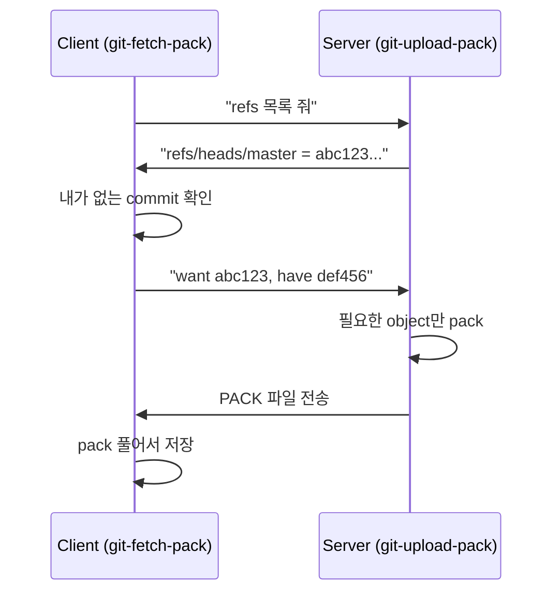
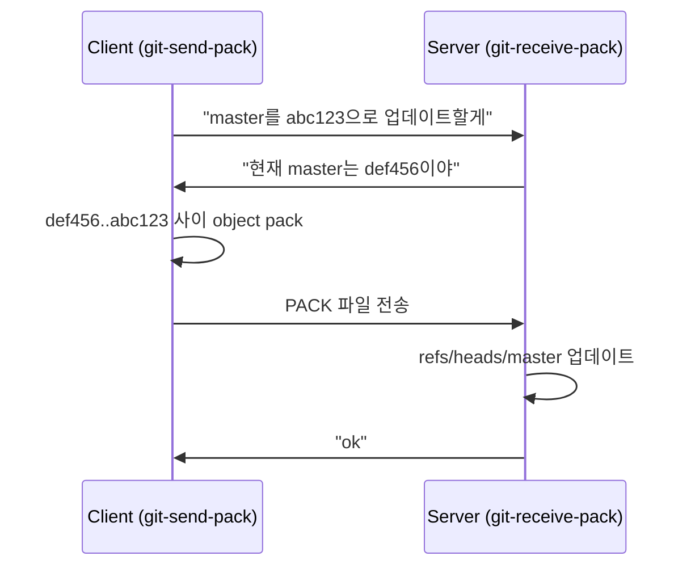

## 이전 글 요약

[지난 글](/posts/git-branches-birth/)에서 Branch의 탄생을 봤다.

Branch는 그냥 41바이트짜리 파일이었다. `.git/refs/heads/master`에 commit hash만 저장.

그런데 Branch가 생기면 자연스러운 질문이 따라온다:

**"이 Branch를 다른 사람과 어떻게 공유하지?"**

---

## Git 이전: Patches and Tarballs

Git이 왜 만들어졌는지 이해하려면, 그 전에 Linux 커널 개발자들이 어떻게 협업했는지 알아야 한다.

### 메일링 리스트 워크플로우

```
1. 리눅스가 tarball 배포 (linux-2.6.11.tar.gz)
2. 개발자가 다운로드 → 압축 해제
3. 코드 수정
4. diff 생성: diff -u original/ modified/ > my-feature.patch
5. 메일링 리스트에 patch 전송
6. 토론 후 리눅스가 patch 적용
7. 새 tarball 배포
8. 반복
```

이게 **분산 버전 관리의 원형**이다.

- 모두가 로컬 복사본을 가짐
- 변경사항은 로컬에서 만듦
- "머지 권한"은 tarball 배포자에게

### 문제점

1. **Patch 관리가 힘듦** - 누가 뭘 보냈는지 추적 어려움
2. **충돌 해결이 수동** - patch가 안 맞으면 직접 수정
3. **히스토리가 없음** - tarball만 있고 중간 과정이 사라짐

Git은 이 워크플로우를 **자동화**하기 위해 만들어졌다.

---

## 첫 번째 네트워크 도구: rsync

Git 초기에는 별도의 네트워크 프로토콜이 없었다.

어떻게 공유했을까? **rsync로 `.git` 폴더 통째로 복사**.

```bash
# 2005년 4월의 Git 공유 방법
rsync -avz my-repo/.git/ server:/pub/linux/.git/
```

Git의 object 저장 방식 덕분에 이게 잘 작동했다:

- 모든 object는 content-addressable (SHA-1 기반)
- 같은 내용 = 같은 hash = 같은 파일명
- rsync는 변경된 파일만 전송
- **이미 있는 object는 자동으로 스킵**

하지만 문제가 있었다:

1. **전체 접근 권한 필요** - rsync는 파일시스템 레벨
2. **어떤 object가 필요한지 모름** - 일단 다 복사
3. **방화벽 통과 어려움** - rsync 포트 필요

---

## git-fetch-pack의 등장

2005년 4월 말, Linus는 더 스마트한 방법을 만들었다.

### 핵심 아이디어

> "내가 가진 object 목록을 보내면, 상대방이 없는 것만 보내줘"

```
나: "나 abc123, def456 가지고 있어"
서버: "그럼 789xyz만 보내줄게"
```

이게 **git-fetch-pack**과 **git-upload-pack**의 탄생이다.



### 실제 초기 코드

```c
// 2005년 fetch-pack.c 초기 버전
static int fetch_pack(int fd, ...)
{
    // 1. 서버의 refs 읽기
    // 2. 내가 가진 것과 비교  
    // 3. 필요한 것만 요청
    // 4. pack 파일로 받기
}
```

**핵심 혁신**: 필요한 object만 전송 → 대역폭 절약

---

## git-send-pack: Push의 원형

fetch가 "가져오기"라면, send-pack은 "보내기"다.

```bash
# 초기 push 방식
git-send-pack server:/repo master
```

동작 방식:



---

## 프로토콜의 진화

### 1단계: SSH (2005년 4월~)

```bash
git-fetch-pack ssh://server/repo
```

- 인증은 SSH가 처리
- 암호화도 SSH가 처리
- 가장 먼저 지원된 프로토콜

### 2단계: git:// 프로토콜 (2005년 5월~)

```bash
git-fetch-pack git://server/repo
```

- 포트 9418 사용
- 인증 없음 (읽기 전용)
- **git-daemon**이 서버 역할

```bash
# 서버에서 실행
git daemon --base-path=/pub/git --export-all
```

### 3단계: HTTP (2005년 여름~)

처음엔 "dumb HTTP"였다:

```bash
# 그냥 .git 폴더를 웹서버로 노출
# 클라이언트가 필요한 파일을 하나씩 GET
GET /repo.git/objects/ab/cd1234...
GET /repo.git/objects/ef/gh5678...
```

문제: **object를 하나씩 요청** → 느림

2005년 9월, Nick Hengeveld가 개선:
- HTTP로도 pack 협상 가능
- Resumable 다운로드
- 병렬 요청

이게 나중에 "smart HTTP"로 발전한다.

---

## "origin"의 탄생

왜 remote 이름이 `origin`일까?

### 답: 특별한 이유 없음

```bash
git clone https://github.com/torvalds/linux
# 자동으로 "origin"이라는 이름 붙음
```

`origin`은 그냥 **"원본"**이라는 뜻이다.

- clone 하면 자동으로 붙는 기본값
- 기술적으로 특별한 의미 없음
- 다른 이름으로 바꿔도 됨

```bash
git remote rename origin upstream
```

### 왜 이 이름이 표준이 됐나

1. clone할 때 자동 생성
2. 모든 튜토리얼이 origin 사용
3. 관습이 표준이 됨

---

## git remote add의 등장

초기엔 remote 개념이 명확하지 않았다.

```bash
# 2005년 방식
git-fetch-pack ssh://server/repo master
git-send-pack ssh://server/repo master
```

매번 전체 URL을 입력해야 했다.

### .git/remotes 파일 (2005년)

```bash
# .git/remotes/origin
URL: ssh://server/repo
Pull: refs/heads/master:refs/heads/origin
Push: refs/heads/master:refs/heads/master
```

### .git/config로 통합 (2005년 후반~)

```ini
[remote "origin"]
    url = ssh://server/repo
    fetch = +refs/heads/*:refs/remotes/origin/*
```

이게 지금 우리가 아는 형태다.

---

## Tracking Branch의 탄생

문제: fetch하면 어디에 저장하지?

```bash
git fetch origin
# origin/master는 어디에?
```

### 해결: refs/remotes/

```
.git/
├── refs/
│   ├── heads/           # 로컬 브랜치
│   │   └── master
│   └── remotes/         # 리모트 브랜치
│       └── origin/
│           └── master
```

이 구조가 생긴 이유:

1. **로컬과 리모트 분리** - 충돌 방지
2. **여러 리모트 지원** - origin, upstream, ...
3. **추적 가능** - 어디서 왔는지 알 수 있음

---

## fetch, pull, push의 정립

### git fetch

```bash
git fetch origin
```

1. origin의 refs 목록 가져오기
2. 내가 없는 object 다운로드
3. refs/remotes/origin/* 업데이트
4. **Working directory는 그대로**

### git pull

```bash
git pull origin master
```

= `git fetch` + `git merge`

처음엔 fetch와 merge가 분리된 걸 귀찮아해서 만들어짐.

### git push

```bash
git push origin master
```

1. 내 master와 origin/master 비교
2. 새로운 object pack으로 전송
3. 서버의 refs/heads/master 업데이트

---

## 2005년의 타임라인

| 날짜 | 이벤트 |
|-----|--------|
| 4월 7일 | 첫 커밋 |
| 4월 중순 | rsync로 공유 |
| 4월 말 | git-fetch-pack, git-send-pack |
| 5월 | git-daemon, git:// 프로토콜 |
| 6월 16일 | Linux 2.6.12 릴리즈에 Git 사용 |
| 9월 | HTTP 지원 개선 |

**2달 만에** Git은 완전한 분산 버전 관리 시스템이 됐다.

---

## 정리: Remote의 본질

| 개념 | 실체 |
|-----|------|
| Remote | `.git/config`의 URL 설정 |
| origin | clone시 자동 생성되는 기본 이름 |
| Tracking branch | `refs/remotes/<remote>/<branch>` |
| fetch | object 다운로드 + remote refs 업데이트 |
| push | object 업로드 + 서버 refs 업데이트 |
| pull | fetch + merge |

**Remote는 URL에 붙인 별명이다.** 그 이상도 이하도 아니다.

---

## 다음 글 예고

이제 저장(object), 브랜치(refs), 공유(remote)가 갖춰졌다.

하지만 아직 하나가 부족하다: **용량 최적화**.

Git이 수백만 개의 object를 어떻게 효율적으로 저장할까?

[해체분석기 #11: Pack 파일의 비밀](/posts/git-pack-files/)에서 계속.

---

## 참고 자료

- [GitButler: 20 years of Git](https://blog.gitbutler.com/20-years-of-git/)
- [Git Internals - Transfer Protocols](https://git-scm.com/book/en/v2/Git-Internals-Transfer-Protocols)
- [Git Protocol Documentation](https://git-scm.com/docs/protocol-common)
- [Linus Torvalds on Git's early days](https://lore.kernel.org/git/)
