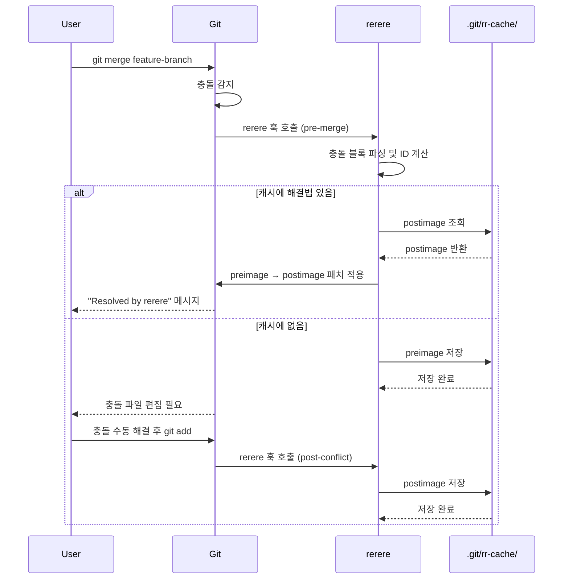
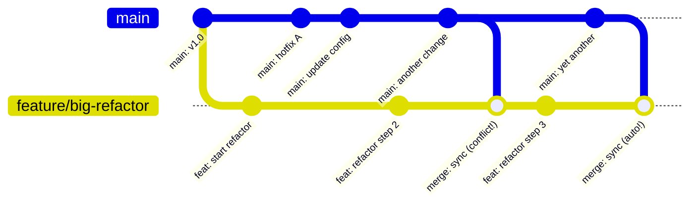

## 이전 글 요약

[지난 글](/posts/git-diff-secret/)에서 diff 알고리즘을 살펴봤다.

Myers 알고리즘이 두 파일의 차이를 어떻게 찾는지 — O(ND) 복잡도로 최소 편집 경로를 탐색하는 방식이었다.

그런데 diff가 있으면 반드시 따라오는 것이 있다.

**충돌(conflict).**

두 브랜치가 같은 줄을 서로 다르게 수정했을 때, Git은 어떻게 해야 할지 모른다. 사람이 직접 결정해야 한다. 그리고 이 과정은 때로 끔찍하게 반복된다.

> "이 충돌... 저번 주에도 똑같이 해결했는데."

**git rerere**는 이 반복을 끝낸다. 충돌 해결 방법을 기억했다가, 같은 충돌이 다시 나타나면 자동으로 적용한다.

---

## rerere란 무엇인가

`rerere` = **Re**use **R**ecorded **Re**solution

직역하면 "기록된 해결방법을 재사용하다".

Git 공식 문서는 이렇게 설명한다:

> "If you work on a long-lived feature branch, and you have to keep merging it with main, rerere will help you by remembering how you resolved a particular conflict the first time, so that the next time it sees the same conflict it resolves it automatically."

### 언제 유용한가?

```
시나리오 1: 장기 feature 브랜치
  feature/big-refactor (3개월째 개발 중)
  ↕ 매주 main에서 merge
  → 같은 파일, 같은 충돌이 매주 반복
  
시나리오 2: rebase 중 반복 충돌
  git rebase -i HEAD~10
  → 10개 커밋 각각에 같은 충돌 해결 반복
  
시나리오 3: 여러 브랜치에 동일 패치 적용
  git cherry-pick A B C
  → A에서 해결한 충돌이 B, C에서도 반복
```

rerere는 이 세 시나리오 모두에서 시간을 아낀다.

---

## 활성화 방법

rerere는 기본적으로 **비활성화**되어 있다.

```bash
# 전역 설정 (모든 저장소)
git config --global rerere.enabled true

# 저장소별 설정
git config rerere.enabled true
```

활성화하는 순간, Git은 모든 충돌 상황을 조용히 기록하기 시작한다.

추가로 유용한 설정:

```bash
# 충돌 해결 후 자동으로 스테이징
git config --global rerere.autoupdate true
```

`rerere.autoupdate`를 켜면, rerere가 자동 해결한 파일을 git add까지 자동으로 해준다. 완전히 손을 놓을 수 있다.

---

## .git/rr-cache/ 구조 해체분석

rerere의 모든 기억은 `.git/rr-cache/` 디렉토리에 산다.

```bash
$ ls .git/rr-cache/
a1b2c3d4e5f6a7b8c9d0e1f2a3b4c5d6e7f8a9b0/
```

각 서브디렉토리는 **충돌 ID** — SHA1 해시다. 이 해시는 충돌 내용의 지문(fingerprint)이다.

### 해시 계산 방법

rerere는 충돌 마커 사이의 내용으로 해시를 만든다:

```python
# 개념적 구현 (실제 C 코드 기반)
def compute_conflict_id(conflicted_file):
    conflict_blocks = []
    
    for block in parse_conflict_markers(conflicted_file):
        # HEAD 쪽 내용과 incoming 쪽 내용을 추출
        ours = block.ours.strip()
        theirs = block.theirs.strip()
        
        # 순서 정규화: 두 방향 충돌을 같은 해시로
        conflict_blocks.append(normalize(ours, theirs))
    
    return sha1(join(conflict_blocks))
```

**핵심**: 해시는 충돌 *내용*에만 의존한다. 파일 이름, 줄 번호, 주변 컨텍스트는 포함하지 않는다. 그래서 같은 충돌이 다른 파일에서 발생해도 같은 해시가 나온다.

### preimage 파일

```bash
$ cat .git/rr-cache/a1b2c3.../preimage
```

preimage는 **충돌이 발생한 시점의 파일 상태**다. 충돌 마커가 포함된 원본 그대로다:

```
function calculate(x, y) {
<<<<<<< HEAD
  return x + y;
=======
  return x * y;
>>>>>>> feature/multiply
}
```

rerere는 이 상태를 기억해둔다. 나중에 같은 충돌이 발생하면, preimage와 비교해서 "이거 본 적 있어!"를 판단한다.

### postimage 파일

```bash
$ cat .git/rr-cache/a1b2c3.../postimage
```

postimage는 **사람이 충돌을 해결한 후의 파일 상태**다. 충돌 마커가 없는 최종 결과:

```
function calculate(x, y) {
  return x * y;  // 곱셈이 맞음
}
```

rerere가 자동 해결할 때, preimage → postimage로의 변환을 새 파일에 적용한다.

### rr-cache 디렉토리 완전 해부

```bash
$ ls -la .git/rr-cache/a1b2c3d4.../
total 16
drwxr-xr-x  4  preimage
drwxr-xr-x  4  postimage
```

처음 충돌 발생 시: `preimage`만 생성됨  
충돌 해결 후: `postimage`도 생성됨

postimage가 없으면 아직 미해결 기록이다.

---

## 내부 동작 플로우



---

## 실전 예제: 반복 충돌 해결

### 상황 설정

```bash
# main 브랜치에 config.js가 있다
$ cat config.js
const API_URL = 'https://api.example.com';
const TIMEOUT = 5000;

# feature 브랜치에서 수정
$ git checkout -b feature/new-api
$ vim config.js  # TIMEOUT을 10000으로 변경
$ git commit -am "feat: increase timeout"

# main에서도 같은 줄 수정 (다른 방향)
$ git checkout main
$ vim config.js  # TIMEOUT을 3000으로 변경
$ git commit -am "fix: reduce timeout for performance"
```

### 첫 번째 충돌과 해결

```bash
$ git merge feature/new-api
Auto-merging config.js
CONFLICT (content): Merge conflict in config.js
Recorded preimage for 'config.js'   # ← rerere가 기록!
Automatic merge failed; fix conflicts and then commit the result.

$ cat config.js
const API_URL = 'https://api.example.com';
<<<<<<< HEAD
const TIMEOUT = 3000;
=======
const TIMEOUT = 10000;
>>>>>>> feature/new-api

# 충돌 해결: 10000이 맞다고 판단
$ vim config.js
$ cat config.js
const API_URL = 'https://api.example.com';
const TIMEOUT = 10000;

$ git add config.js
Recorded resolution for 'config.js'.  # ← rerere가 해결법 저장!

$ git commit -m "merge: feature/new-api"
```

### rr-cache 확인

```bash
$ ls .git/rr-cache/
7f3a9c2b1d4e5f6a8b9c0d1e2f3a4b5c/

$ ls .git/rr-cache/7f3a9c2b.../
postimage  preimage

$ cat .git/rr-cache/7f3a9c2b.../preimage
const API_URL = 'https://api.example.com';
<<<<<<< 
const TIMEOUT = 3000;
=======
const TIMEOUT = 10000;
>>>>>>> 

# 주목: 브랜치 이름이 없다! 내용만 남긴다.
```

### 두 번째 충돌: 자동 해결

```bash
# 다음 주, feature/new-api를 다시 rebase해야 하는 상황
$ git checkout feature/new-api
$ git rebase main

# 같은 충돌 발생
CONFLICT (content): Merge conflict in config.js
Resolved 'config.js' using previous resolution.  # ← 자동 해결!
# 손 댈 필요 없음!
```

이것이 rerere의 마법이다.

---

## rerere 명령어 레퍼런스

```bash
# rerere 상태 확인
$ git rerere status
config.js          # 현재 preimage가 있는 파일들

# 기록된 해결법 목록
$ git rerere list
.git/rr-cache/7f3a9c2b.../preimage   # SHA 목록

# 수동으로 재적용
$ git rerere

# 특정 해결법 삭제
$ git rerere forget path/to/file

# 전체 캐시 초기화 (주의!)
$ rm -rf .git/rr-cache/
```

---

## 장기 브랜치 관리에서의 가치

rerere가 가장 빛나는 상황은 **장기 feature 브랜치**다.



feature/big-refactor를 3개월 동안 개발하면서 main을 매주 merge한다고 가정하자.

- 1주차: `config.js` 충돌 → 수동 해결 (rerere 기록)
- 2주차: `config.js` 같은 충돌 → **자동 해결**
- 3주차: `config.js` 같은 충돌 → **자동 해결**
- ...

매주 같은 충돌을 해결하는 시간이 완전히 사라진다.

### 팀 차원에서의 활용

rerere는 기본적으로 로컬이다. `.git/rr-cache/`는 원격에 push되지 않는다. 하지만 팀에서 공유할 수 있다:

```bash
# rr-cache를 공유 저장소로 관리하는 방법
$ git bundle create rr-cache.bundle --all
# 또는 직접 rsync
$ rsync -av .git/rr-cache/ shared/rr-cache/

# 다른 팀원이 가져와서 적용
$ rsync -av shared/rr-cache/ .git/rr-cache/
```

일부 팀은 `rr-cache`를 별도 git 저장소로 관리하고 스크립트로 동기화한다. 팀 전체가 같은 충돌 해결 지식을 공유하는 셈이다.

---

## rerere의 한계와 주의사항

### 1. 충돌 내용이 조금이라도 다르면 새로운 충돌

rerere의 해시는 충돌 블록의 정확한 내용으로 계산된다. 코드가 조금 바뀌면 새로운 해시 = 새로운 충돌로 인식한다.

```bash
# 이전에 해결한 충돌
<<<<<<< 
const TIMEOUT = 3000;
=======
const TIMEOUT = 10000;
>>>>>>> 

# 이건 다른 충돌로 인식 (공백 하나 차이)
<<<<<<< 
const TIMEOUT  = 3000;
=======
const TIMEOUT = 10000;
>>>>>>> 
```

### 2. 잘못된 해결법도 기억한다

rerere는 당신이 충돌을 **잘못 해결해도** 기억한다. 나중에 같은 충돌이 자동 해결될 때 잘못된 방법이 적용된다. 항상 rerere 적용 후 코드를 확인해야 한다.

```bash
# rerere 적용 후 반드시 확인
$ git diff HEAD
$ git diff --staged
```

### 3. 만료 관리

rr-cache는 무한정 쌓인다. Git은 기본적으로 만료 정책을 가진다:

```bash
# 해결된 기록: 60일 후 만료 (기본값)
git config gc.rerereResolved 60

# 미해결 기록: 15일 후 만료 (기본값)  
git config gc.rerereUnresolved 15
```

`git gc`가 실행될 때 이 설정에 따라 오래된 rr-cache 항목이 정리된다.

---

## Git 소스코드에서 rerere 찾기

rerere의 핵심 구현은 Git 소스코드의 `rerere.c`에 있다.

```c
// rerere.c - 핵심 함수들
int rerere(struct repository *r, int flags);
int rerere_forget(struct repository *r, struct pathspec *pathspec);
int rerere_clear(struct repository *r, struct string_list *merge_rr);
```

충돌 ID 계산 부분을 보면:

```c
// 충돌 블록을 읽어 SHA1 계산
static int handle_conflict(struct strbuf *out, struct rerere_id *id,
                           int marker_size, int variant)
{
    /* ... */
    the_hash_algo->update_fn(&ctx, one.buf, one.len);
    the_hash_algo->update_fn(&ctx, "\0", 1);
    the_hash_algo->update_fn(&ctx, two.buf, two.len);
    /* ... */
}
```

브랜치 이름이 아닌 **충돌 내용 자체**로 해시를 만드는 게 보인다. 이것이 "같은 충돌"의 정의다.

Git 2.0 이후로 rerere는 SHA-256도 지원한다 (`the_hash_algo`가 추상화 레이어).

---

## 실전 워크플로우 권장 설정

```bash
# ~/.gitconfig 권장 설정
[rerere]
    enabled = true
    autoupdate = true

[gc]
    rerereResolved = 90    # 해결된 기록 90일 보관
    rerereUnresolved = 30  # 미해결 기록 30일 보관
```

### rebase와 함께 사용하기

```bash
# 대화형 rebase에서 rerere의 진가
$ git rebase -i main

# 각 커밋을 하나씩 적용하면서 같은 충돌이 반복될 때
# rerere가 자동으로 해결해준다

# rerere.autoupdate = true면 git add도 자동
# 그냥 계속 진행하면 된다
$ git rebase --continue  # (자동 해결 후 바로)
```

### 팀 프로젝트 설정 스크립트

```bash
#!/bin/bash
# setup-rerere.sh - 팀 프로젝트 설정

echo "Setting up rerere..."
git config rerere.enabled true
git config rerere.autoupdate true

# 공유 rr-cache가 있다면 동기화
if [ -d "shared/rr-cache" ]; then
    echo "Syncing team rr-cache..."
    cp -r shared/rr-cache/* .git/rr-cache/ 2>/dev/null || true
fi

echo "rerere is ready!"
```

---

## 마치며

`git rerere`는 Git에서 가장 과소평가된 기능 중 하나다.

활성화하는 것 자체가 두 줄짜리 설정이고, 그 후로는 완전히 투명하게 동작한다. 알아서 기록하고, 알아서 해결한다. 사용자는 "처음" 충돌만 해결하면 된다.

특히:

- **장기 feature 브랜치**를 관리하는 팀
- **대화형 rebase**를 자주 사용하는 개발자
- **cherry-pick**으로 여러 브랜치에 패치를 적용하는 워크플로우

이 세 상황에서 rerere는 매일 수십 분의 시간을 아껴준다.

`.git/rr-cache/`의 preimage와 postimage — 이 두 파일이 Git의 기억력이다.

충돌을 두려워하지 않아도 되는 이유 하나가 더 생겼다.

---

*다음 글에서는 Git의 또 다른 내부 메커니즘을 해체분석합니다.*
