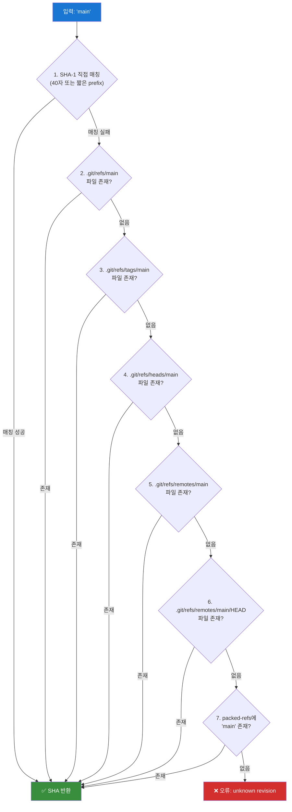
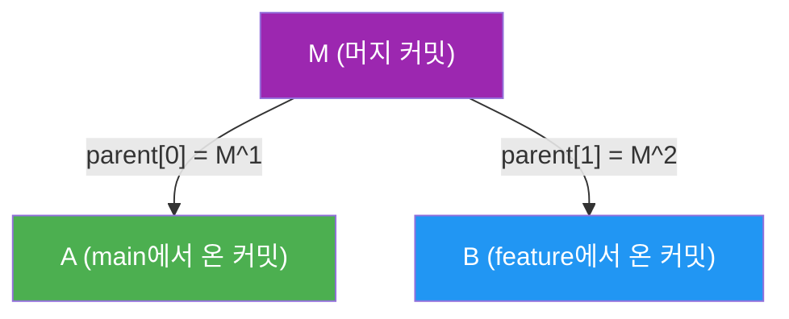

## 들어가며

Git 명령어들 중 가장 조용하고, 가장 많이 쓰이면서, 가장 이해받지 못하는 명령어가 있다. 바로 `git rev-parse`다.

직접 치는 경우는 드물다. 하지만 당신이 `git checkout main`을 치면, 내부적으로 `rev-parse`가 `main`을 SHA로 변환한다. `git log HEAD~3`을 치면, `~3` 토큰을 해석하는 게 바로 이 명령이다. CI 스크립트에서 `$(git rev-parse --short HEAD)`로 커밋 해시를 추출할 때도, GitHub Actions 내부에서 브랜치 이름을 검증할 때도 마찬가지다.

`rev-parse`는 Git의 **레퍼런스 해석 엔진**이다. 사람이 읽을 수 있는 이름(`main`, `HEAD~3`, `v1.0^{}`)을 Git이 이해하는 40자리 SHA-1 해시로 변환하는 파이프라인 전체를 책임진다.

오늘은 이 파이프라인을 완전히 분해해본다.

---

## refname → SHA: 7단계 해석 파이프라인

Git이 `rev-parse`에 `main`이라는 이름을 주면, 내부적으로 특정 순서에 따라 이름을 찾는다. Git 공식 문서([gitrevisions(7)](https://git-scm.com/docs/gitrevisions))에는 이 순서가 명시되어 있다. 총 7단계다.



### 1단계: SHA prefix 직접 매칭

입력이 16진수 문자열이면, Git은 먼저 object store에서 직접 찾는다.

```bash
# 40자 완전한 SHA
$ git rev-parse a1b2c3d4e5f6a1b2c3d4e5f6a1b2c3d4e5f6a1b2
a1b2c3d4e5f6a1b2c3d4e5f6a1b2c3d4e5f6a1b2

# 짧은 prefix (최소 4자, 기본 7자)
$ git rev-parse a1b2c3d
a1b2c3d4e5f6a1b2c3d4e5f6a1b2c3d4e5f6a1b2

# 여러 오브젝트에 매칭될 경우 오류
$ git rev-parse a1b
error: short SHA1 a1b is ambiguous
```

짧은 SHA는 `core.abbrev` 설정으로 기본 길이를 조절할 수 있다. Git 2.11부터는 저장소 크기에 따라 자동 계산한다.

### 2~6단계: 루스 ref 파일시스템 탐색

`.git/refs/` 디렉토리를 직접 순회한다. 각 ref는 그냥 **텍스트 파일**이다:

```bash
$ cat .git/refs/heads/main
a1b2c3d4e5f6a1b2c3d4e5f6a1b2c3d4e5f6a1b2

$ cat .git/HEAD
ref: refs/heads/main
```

`HEAD`는 특수하다. 직접 SHA를 담을 수도 있고("detached HEAD"), 다른 ref를 가리키는 symbolic ref일 수도 있다.

### 7단계: packed-refs

Git은 refs를 효율적으로 보관하기 위해 주기적으로 **루스 ref 파일들을 하나의 파일로 압축**한다. 이게 `.git/packed-refs`다.

```bash
$ cat .git/packed-refs
# pack-refs with: peeled fully-peeled sorted
a1b2c3d4e5f6a1b2c3d4e5f6a1b2c3d4e5f6a1b2 refs/heads/feature/auth
^b2c3d4e5f6a1b2c3d4e5f6a1b2c3d4e5f6a1b2a1  # 태그가 가리키는 커밋 (peeled)
c3d4e5f6a1b2c3d4e5f6a1b2c3d4e5f6a1b2a1b2 refs/tags/v1.0.0
d4e5f6a1b2c3d4e5f6a1b2c3d4e5f6a1b2a1b2c3 refs/remotes/origin/main
```

`^`로 시작하는 줄은 annotated tag의 "peeled" SHA — 태그 오브젝트가 가리키는 실제 커밋이다. `git log v1.0.0`이 태그 자체가 아닌 커밋 히스토리를 보여줄 수 있는 이유가 바로 이것이다.

**루스 ref vs packed-ref 우선순위:** 루스 ref가 항상 먼저다. 이는 `git update-ref`가 새 ref를 쓸 때 packed-refs를 갱신하지 않고 새 파일을 만들기 때문이다. `git pack-refs --all`을 실행하면 모든 루스 ref를 packed-refs로 통합한다.

---

## reflog: 세 번째 저장소

ref를 찾는 단계에서 언급되지 않은 곳이 있다. 바로 **reflog**다. reflog는 ref의 *이력*이지, ref 자체가 아니기 때문에 기본 파이프라인과 별도로 작동한다.

```bash
# @{숫자} 문법으로 reflog 접근
$ git rev-parse HEAD@{1}   # HEAD가 가리켰던 직전 위치
$ git rev-parse main@{2}   # main 브랜치의 2번 전 위치
$ git rev-parse HEAD@{1 hour ago}  # 1시간 전 HEAD
$ git rev-parse main@{yesterday}   # 어제의 main
```

reflog 파일은 `.git/logs/` 안에 있다:

```bash
$ cat .git/logs/HEAD
a1b2c3d4 0000000000000000000000000000000000000000 김기덕 <email> 1708234567 +0900	commit (initial): init
b2c3d4e5 a1b2c3d4e5f6a1b2c3d4e5f6a1b2c3d4e5f6a1b2 김기덕 <email> 1708234600 +0900	commit: add feature
```

각 줄은 `이전SHA 새SHA 작성자 타임스탬프 동작` 형식이다. `@{1}`은 두 번째 줄의 *이전SHA*를 반환한다.

---

## 리비전 토큰 파싱: `^`, `~`, `@{u}`, `@{-1}`

SHA를 얻은 다음에는 *수정자(modifier)*를 처리한다. 이 토큰들이 Git의 "시간여행" 문법이다.

### `~N`: 첫 번째 부모를 N번 타고 올라가기

```bash
$ git rev-parse HEAD~3    # HEAD의 증조부모 커밋
$ git rev-parse HEAD~     # HEAD~1과 동일

# 내부 동작: commit 오브젝트의 첫 번째 parent 필드를 N번 역추적
```


### `^N`: N번째 부모 선택 (머지 커밋용)

```bash
$ git rev-parse HEAD^     # 첫 번째 부모 (HEAD~1과 동일)
$ git rev-parse HEAD^2    # 두 번째 부모 (머지된 브랜치의 커밋)
$ git rev-parse HEAD^3    # 세 번째 부모 (octopus merge)
```



### `^{}`: 태그 역참조 (dereference)

```bash
$ git rev-parse v1.0.0        # 태그 오브젝트의 SHA
$ git rev-parse v1.0.0^{}     # 태그가 가리키는 커밋의 SHA
$ git rev-parse v1.0.0^{tree} # 커밋이 가리키는 트리의 SHA
$ git rev-parse v1.0.0^{blob} # blob까지 역참조
```

annotated tag는 커밋이 아니다. `tag` 타입의 오브젝트로, 커밋을 가리킨다. `^{}`는 "최종적으로 커밋에 도달할 때까지 역참조하라"는 뜻이다.

### `@{u}`, `@{upstream}`: 업스트림 브랜치

```bash
$ git rev-parse HEAD@{upstream}   # 현재 브랜치의 upstream
$ git rev-parse main@{u}          # main의 upstream (origin/main)
```

이 정보는 `.git/config`의 `[branch "main"]` 섹션에 저장된다:

```ini
[branch "main"]
    remote = origin
    merge = refs/heads/main
```

`@{u}`는 이 설정을 읽어 `refs/remotes/origin/main`을 7단계 파이프라인에 다시 넣는다.

### `@{-N}`: 체크아웃 이력

```bash
$ git rev-parse @{-1}    # 직전에 있던 브랜치/커밋
$ git checkout @{-1}     # git checkout -와 동일
```

이 정보는 `HEAD` reflog에서 "checkout:" 동작 항목을 역으로 찾는다.

---

## `--symbolic-full-name`: 이름을 SHA로 변환하지 말라

대부분의 경우 `rev-parse`는 SHA를 반환한다. 하지만 때로는 **완전한 ref 이름**이 필요하다.

```bash
# SHA 반환
$ git rev-parse HEAD
a1b2c3d4e5f6a1b2c3d4e5f6a1b2c3d4e5f6a1b2

# 심볼릭 이름 반환
$ git rev-parse --symbolic-full-name HEAD
refs/heads/main

$ git rev-parse --symbolic-full-name @{u}
refs/remotes/origin/main

# 브랜치 이름만 추출
$ git rev-parse --abbrev-ref HEAD
main

$ git rev-parse --abbrev-ref @{u}
origin/main
```

**내부 동작:** SHA 해석 파이프라인을 실행하되, 마지막 단계에서 SHA 대신 해당 ref의 전체 경로를 반환한다. Symbolic ref(`HEAD → refs/heads/main`)의 경우 역참조하지 않고 그 symbolic 이름을 그대로 반환한다.

`--symbolic` (full-name 없이)는 짧은 이름도 허용한다:

```bash
$ git rev-parse --symbolic HEAD
HEAD

$ git rev-parse --symbolic refs/heads/main
refs/heads/main
```

---

## `--verify`: 파이프라인을 검증 모드로

기본적으로 `rev-parse`는 찾지 못하면 오류를 출력하고 종료한다. `--verify`는 이를 **더 엄격하게** 만든다: 정확히 하나의 오브젝트여야 한다.

```bash
# 존재하는 ref: 성공
$ git rev-parse --verify main
a1b2c3d4e5f6a1b2c3d4e5f6a1b2c3d4e5f6a1b2

# 존재하지 않는 ref: 오류 메시지 없이 종료 코드 128
$ git rev-parse --verify nonexistent-branch 2>/dev/null
$ echo $?
128

# 스크립트에서 브랜치 존재 여부 확인
if git rev-parse --verify --quiet refs/heads/feature/auth > /dev/null 2>&1; then
    echo "브랜치 존재함"
else
    echo "브랜치 없음"
fi
```

`--quiet`와 함께 쓰면 오류 메시지를 억제한다. 스크립트에서 ref 존재 여부를 확인할 때 표준 패턴이다.

**`--verify`가 확인하는 것:**
1. 입력이 정확히 하나의 토큰인가
2. 해석 결과가 Git 오브젝트 데이터베이스에 실제로 존재하는가
3. 타입 제약(`^{commit}`, `^{tree}` 등)이 있다면 충족되는가

---

## Plumbing vs Porcelain: `rev-parse`가 받는 환경 변수

`rev-parse`는 Git의 **plumbing** 명령이다. Porcelain 명령(`git checkout`, `git log`)이 내부적으로 호출하는 저수준 도구다. 이 구분이 중요한 이유는 **환경 변수 처리** 때문이다.

### Git이 사용하는 핵심 환경 변수

```bash
# GIT_DIR: .git 디렉토리 위치 강제 지정
$ GIT_DIR=/path/to/other/.git git rev-parse HEAD

# GIT_WORK_TREE: 워킹 트리 위치 강제 지정
$ GIT_DIR=/path/to/repo/.git GIT_WORK_TREE=/path/to/worktree git rev-parse --show-toplevel

# GIT_NAMESPACE: ref 네임스페이스 (GitHub PR refs 같은 것)
$ GIT_NAMESPACE=pull/42 git rev-parse HEAD

# GIT_OBJECT_DIRECTORY: object store 위치
$ GIT_OBJECT_DIRECTORY=/alt/objects git rev-parse abc123
```

### Porcelain이 Plumbing을 호출할 때

`git checkout feature`를 실행하면 내부에서 이런 일이 일어난다:

```
git checkout feature
    └─→ rev-parse feature       → SHA 해석
    └─→ read-tree -u -m HEAD feature → 워킹 트리 업데이트
    └─→ symbolic-ref HEAD refs/heads/feature → HEAD 갱신
```

Porcelain은 사용자의 터미널 환경을 상속하고, Plumbing에 필요한 환경 변수를 설정한 뒤 호출한다.

### `--git-dir`, `--show-toplevel` 모드

`rev-parse`는 SHA 해석 외에도 저장소 자체에 대한 정보를 제공한다:

```bash
# .git 디렉토리 경로
$ git rev-parse --git-dir
/Users/gideok/project/.git

# 루트 디렉토리 (--show-toplevel은 워킹 트리 필요)
$ git rev-parse --show-toplevel
/Users/gideok/project

# 현재 위치가 git 저장소 안인지 확인
$ git rev-parse --is-inside-work-tree
true

# 현재 위치가 .git 디렉토리 안인지
$ git rev-parse --is-inside-git-dir
false

# prefix: 루트에서 현재 위치까지의 상대 경로
$ git rev-parse --show-prefix
src/components/
```

이 기능들은 플러밍 스크립트에서 저장소 구조를 탐색하는 데 필수적이다.

---

## 실전: CI 스크립트에서 `rev-parse` 활용

이제 실제 사용 패턴을 보자. CI/CD 환경에서 `rev-parse`는 거의 모든 Git 관련 스크립트의 핵심이다.

### 패턴 1: 안전한 버전 태그 추출

```bash
#!/bin/bash
# 현재 커밋에 정확히 붙어있는 태그 추출 (CI 릴리스 파이프라인)

get_version_tag() {
    local sha
    sha=$(git rev-parse HEAD)
    
    # HEAD에 직접 붙어있는 태그만 (--exact-match)
    local tag
    tag=$(git describe --exact-match --tags HEAD 2>/dev/null)
    
    if [ -z "$tag" ]; then
        # 태그가 없으면 dev 버전 형식으로
        local short_sha
        short_sha=$(git rev-parse --short HEAD)
        echo "dev-${short_sha}"
    else
        echo "$tag"
    fi
}

VERSION=$(get_version_tag)
echo "Building version: $VERSION"
```

### 패턴 2: 브랜치 안전 검증

```bash
#!/bin/bash
# 배포 전 브랜치 검증

DEPLOY_BRANCH="main"
CURRENT_BRANCH=$(git rev-parse --abbrev-ref HEAD)

# Detached HEAD 상태 처리
if [ "$CURRENT_BRANCH" = "HEAD" ]; then
    echo "ERROR: Detached HEAD state. Cannot deploy."
    exit 1
fi

# main 브랜치인지 확인
if [ "$CURRENT_BRANCH" != "$DEPLOY_BRANCH" ]; then
    echo "ERROR: Must deploy from '$DEPLOY_BRANCH', currently on '$CURRENT_BRANCH'"
    exit 1
fi

# upstream과 동기화 확인
LOCAL=$(git rev-parse HEAD)
REMOTE=$(git rev-parse @{u} 2>/dev/null)

if [ -z "$REMOTE" ]; then
    echo "WARNING: No upstream set, skipping sync check"
elif [ "$LOCAL" != "$REMOTE" ]; then
    echo "ERROR: Local branch is out of sync with upstream"
    echo "  Local:  $LOCAL"
    echo "  Remote: $REMOTE"
    exit 1
fi

echo "✅ Branch validation passed"
```

### 패턴 3: 변경된 파일 범위 감지

```bash
#!/bin/bash
# PR의 변경 파일 목록 추출 (GitHub Actions에서 자주 사용)

BASE_SHA="${GITHUB_BASE_SHA:-}"
HEAD_SHA=$(git rev-parse HEAD)

if [ -z "$BASE_SHA" ]; then
    # 로컬 환경: merge-base 계산
    BASE_SHA=$(git rev-parse origin/main)
fi

# 두 커밋 사이의 변경 파일
CHANGED_FILES=$(git diff --name-only "$BASE_SHA" "$HEAD_SHA")

# 특정 디렉토리 변경 여부 확인
if echo "$CHANGED_FILES" | grep -q "^src/"; then
    echo "Frontend changed, running npm build..."
    npm run build
fi

if echo "$CHANGED_FILES" | grep -q "^backend/"; then
    echo "Backend changed, running tests..."
    pytest backend/
fi
```

### 패턴 4: short SHA를 Docker 이미지 태그로

```bash
#!/bin/bash
# Docker 이미지에 Git 정보 인코딩

IMAGE_NAME="myapp"
SHORT_SHA=$(git rev-parse --short=8 HEAD)  # 8자리 지정
BRANCH=$(git rev-parse --abbrev-ref HEAD | tr '/' '-')  # 슬래시 치환
BUILD_DATE=$(date +%Y%m%d)

IMAGE_TAG="${BRANCH}-${SHORT_SHA}-${BUILD_DATE}"
FULL_TAG="${IMAGE_NAME}:${IMAGE_TAG}"

docker build \
    --label "git.sha=$(git rev-parse HEAD)" \
    --label "git.branch=${BRANCH}" \
    --label "git.short_sha=${SHORT_SHA}" \
    -t "$FULL_TAG" \
    .

echo "Built: $FULL_TAG"
```

### 패턴 5: 저장소 루트 기준 상대 경로

```bash
#!/bin/bash
# 어느 디렉토리에서 실행해도 저장소 루트 기준으로 동작

REPO_ROOT=$(git rev-parse --show-toplevel)

# 루트 기준으로 파일 읽기
CONFIG_FILE="$REPO_ROOT/config/deploy.yaml"

if [ ! -f "$CONFIG_FILE" ]; then
    echo "ERROR: $CONFIG_FILE not found"
    exit 1
fi

cd "$REPO_ROOT" || exit 1
echo "Working from: $REPO_ROOT"
```

---

## 고급: `--parseopt`로 스크립트 인수 파싱

잘 알려지지 않은 기능이지만, `rev-parse`는 Git 스타일 옵션 파싱도 제공한다:

```bash
#!/bin/bash
# git-mycommand 같은 스크립트에서 사용

OPTS_SPEC="\
my-command [options] <revision>
--
h,help    show help
v,verbose be verbose
n,dry-run=  dry run with count
branch=   target branch
"

eval "$(echo "$OPTS_SPEC" | git rev-parse --parseopt -- "$@" || echo exit $?)"

while [ $# -gt 0 ]; do
    opt="$1"
    shift
    case "$opt" in
        -v) VERBOSE=1 ;;
        -n) DRY_RUN_COUNT="$1"; shift ;;
        --branch) BRANCH="$1"; shift ;;
        --) break ;;
    esac
done

REVISION="$1"
SHA=$(git rev-parse --verify "$REVISION")
echo "Resolved: $REVISION → $SHA"
```

---

## `rev-parse`의 내부: 소스 코드 레벨

Git 소스코드에서 `rev-parse`의 핵심은 `revision.c`의 `get_sha1_with_context()` 함수다. 이 함수가 위에서 설명한 7단계 파이프라인을 구현한다.

실제 처리 흐름:

```
get_sha1_with_context(name, flags, sha1, oc)
    ├── get_sha1_basic()      # SHA prefix 매칭
    ├── lookup_ref()          # refs/ 탐색
    │     ├── read_ref_full() # 루스 ref 파일
    │     └── packed_refs     # packed-refs 탐색
    ├── parse_object_type()   # ^{commit}, ^{tree} 처리
    └── deref_tag()           # annotated tag 역참조
```

`~N`과 `^N` 처리는 `interpret_nth_prior_checkout()`과 `peel_to_type()`이 담당한다. Reflog 접근은 `read_ref_at()`이 `.git/logs/` 파일을 직접 파싱한다.

---

## 마치며

`git rev-parse`는 Git의 레퍼런스 세계와 SHA 세계를 잇는 다리다. 표면은 단순하지만 내부는 정교하다.

오늘 살펴본 핵심을 정리하면:

- **7단계 파이프라인**: SHA prefix → 루스 ref → packed-refs 순서로 탐색
- **reflog는 별도**: `@{N}`, `@{time}` 문법으로 ref 이력 접근
- **토큰 수정자**: `~`(첫 번째 부모), `^`(N번째 부모), `^{}`(태그 역참조)
- **`--symbolic-full-name`**: SHA 대신 완전한 ref 이름 반환
- **`--verify`**: 엄격한 검증, 스크립트에서 ref 존재 확인 표준 패턴
- **환경 변수**: `GIT_DIR`, `GIT_WORK_TREE` 등으로 동작 제어
- **CI 활용**: short SHA, 브랜치 검증, 변경 범위 감지의 핵심 도구

Git 스크립트를 짜다가 "이 브랜치가 존재하는지 어떻게 확인하지?", "현재 커밋의 SHA를 어떻게 가져오지?"라는 질문이 나올 때마다 `rev-parse`가 답이다. 이제 그 답이 내부적으로 어떻게 동작하는지도 알게 됐다.

---

