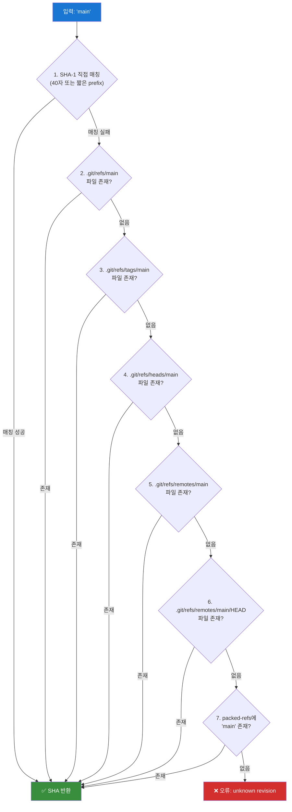
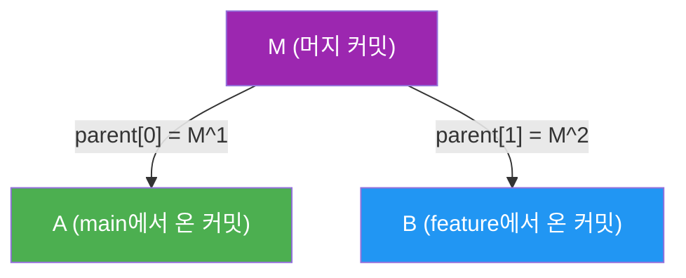

## 들어가며

Git 명령어들 중 가장 조용하고, 가장 많이 쓰이면서, 가장 이해받지 못하는 명령어가 있다. 바로 `git rev-parse`다.

직접 치는 경우는 드물다. 하지만 당신이 `git checkout main`을 치면, 내부적으로 `rev-parse`가 `main`을 SHA로 변환한다. `git log HEAD~3`을 치면, `~3` 토큰을 해석하는 게 바로 이 명령이다. CI 스크립트에서 `$(git rev-parse --short HEAD)`로 커밋 해시를 추출할 때도, GitHub Actions 내부에서 브랜치 이름을 검증할 때도 마찬가지다.

`rev-parse`는 Git의 **레퍼런스 해석 엔진**이다. 사람이 읽을 수 있는 이름(`main`, `HEAD~3`, `v1.0^{}`)을 Git이 이해하는 40자리 SHA-1 해시로 변환하는 파이프라인 전체를 책임진다.

오늘은 이 파이프라인을 완전히 분해해본다.

---

## refname → SHA: 7단계 해석 파이프라인

Git이 `rev-parse`에 `main`이라는 이름을 주면, 내부적으로 특정 순서에 따라 이름을 찾는다. Git 공식 문서([gitrevisions(7)](https://git-scm.com/docs/gitrevisions))에는 이 순서가 명시되어 있다. 총 7단계다.



### 1단계: SHA prefix 직접 매칭

입력이 16진수 문자열이면, Git은 먼저 object store에서 직접 찾는다.

```bash
# 40자 완전한 SHA
$ git rev-parse a1b2c3d4e5f6a1b2c3d4e5f6a1b2c3d4e5f6a1b2
a1b2c3d4e5f6a1b2c3d4e5f6a1b2c3d4e5f6a1b2

# 짧은 prefix (최소 4자, 기본 7자)
$ git rev-parse a1b2c3d
a1b2c3d4e5f6a1b2c3d4e5f6a1b2c3d4e5f6a1b2

# 여러 오브젝트에 매칭될 경우 오류
$ git rev-parse a1b
error: short SHA1 a1b is ambiguous
```

짧은 SHA는 `core.abbrev` 설정으로 기본 길이를 조절할 수 있다. Git 2.11부터는 저장소 크기에 따라 자동 계산한다.

### 2~6단계: 루스 ref 파일시스템 탐색

`.git/refs/` 디렉토리를 직접 순회한다. 각 ref는 그냥 **텍스트 파일**이다:

```bash
$ cat .git/refs/heads/main
a1b2c3d4e5f6a1b2c3d4e5f6a1b2c3d4e5f6a1b2

$ cat .git/HEAD
ref: refs/heads/main
```

`HEAD`는 특수하다. 직접 SHA를 담을 수도 있고("detached HEAD"), 다른 ref를 가리키는 symbolic ref일 수도 있다.

### 7단계: packed-refs

Git은 refs를 효율적으로 보관하기 위해 주기적으로 **루스 ref 파일들을 하나의 파일로 압축**한다. 이게 `.git/packed-refs`다.

```bash
$ cat .git/packed-refs
# pack-refs with: peeled fully-peeled sorted
a1b2c3d4e5f6a1b2c3d4e5f6a1b2c3d4e5f6a1b2 refs/heads/feature/auth
^b2c3d4e5f6a1b2c3d4e5f6a1b2c3d4e5f6a1b2a1  # 태그가 가리키는 커밋 (peeled)
c3d4e5f6a1b2c3d4e5f6a1b2c3d4e5f6a1b2a1b2 refs/tags/v1.0.0
d4e5f6a1b2c3d4e5f6a1b2c3d4e5f6a1b2a1b2c3 refs/remotes/origin/main
```

`^`로 시작하는 줄은 annotated tag의 "peeled" SHA — 태그 오브젝트가 가리키는 실제 커밋이다. `git log v1.0.0`이 태그 자체가 아닌 커밋 히스토리를 보여줄 수 있는 이유가 바로 이것이다.

**루스 ref vs packed-ref 우선순위:** 루스 ref가 항상 먼저다. 이는 `git update-ref`가 새 ref를 쓸 때 packed-refs를 갱신하지 않고 새 파일을 만들기 때문이다. `git pack-refs --all`을 실행하면 모든 루스 ref를 packed-refs로 통합한다.

---

## reflog: 세 번째 저장소

ref를 찾는 단계에서 언급되지 않은 곳이 있다. 바로 **reflog**다. reflog는 ref의 *이력*이지, ref 자체가 아니기 때문에 기본 파이프라인과 별도로 작동한다.

```bash
# @{숫자} 문법으로 reflog 접근
$ git rev-parse HEAD@{1}   # HEAD가 가리켰던 직전 위치
$ git rev-parse main@{2}   # main 브랜치의 2번 전 위치
$ git rev-parse HEAD@{1 hour ago}  # 1시간 전 HEAD
$ git rev-parse main@{yesterday}   # 어제의 main
```

reflog 파일은 `.git/logs/` 안에 있다:

```bash
$ cat .git/logs/HEAD
a1b2c3d4 0000000000000000000000000000000000000000 김기덕 <email> 1708234567 +0900	commit (initial): init
b2c3d4e5 a1b2c3d4e5f6a1b2c3d4e5f6a1b2c3d4e5f6a1b2 김기덕 <email> 1708234600 +0900	commit: add feature
```

각 줄은 `이전SHA 새SHA 작성자 타임스탬프 동작` 형식이다. `@{1}`은 두 번째 줄의 *이전SHA*를 반환한다.

---

## 리비전 토큰 파싱: `^`, `~`, `@{u}`, `@{-1}`

SHA를 얻은 다음에는 *수정자(modifier)*를 처리한다. 이 토큰들이 Git의 "시간여행" 문법이다.

### `~N`: 첫 번째 부모를 N번 타고 올라가기

```bash
$ git rev-parse HEAD~3    # HEAD의 증조부모 커밋
$ git rev-parse HEAD~     # HEAD~1과 동일

# 내부 동작: commit 오브젝트의 첫 번째 parent 필드를 N번 역추적
```


### `^N`: N번째 부모 선택 (머지 커밋용)

```bash
$ git rev-parse HEAD^     # 첫 번째 부모 (HEAD~1과 동일)
$ git rev-parse HEAD^2    # 두 번째 부모 (머지된 브랜치의 커밋)
$ git rev-parse HEAD^3    # 세 번째 부모 (octopus merge)
```



### `^{}`: 태그 역참조 (dereference)

```bash
$ git rev-parse v1.0.0        # 태그 오브젝트의 SHA
$ git rev-parse v1.0.0^{}     # 태그가 가리키는 커밋의 SHA
$ git rev-parse v1.0.0^{tree} # 커밋이 가리키는 트리의 SHA
$ git rev-parse v1.0.0^{blob} # blob까지 역참조
```

annotated tag는 커밋이 아니다. `tag` 타입의 오브젝트로, 커밋을 가리킨다. `^{}`는 "최종적으로 커밋에 도달할 때까지 역참조하라"는 뜻이다.

### `@{u}`, `@{upstream}`: 업스트림 브랜치

```bash
$ git rev-parse HEAD@{upstream}   # 현재 브랜치의 upstream
$ git rev-parse main@{u}          # main의 upstream (origin/main)
```

이 정보는 `.git/config`의 `[branch "main"]` 섹션에 저장된다:

```ini
[branch "main"]
    remote = origin
    merge = refs/heads/main
```

`@{u}`는 이 설정을 읽어 `refs/remotes/origin/main`을 7단계 파이프라인에 다시 넣는다.

### `@{-N}`: 체크아웃 이력

```bash
$ git rev-parse @{-1}    # 직전에 있던 브랜치/커밋
$ git checkout @{-1}     # git checkout -와 동일
```

이 정보는 `HEAD` reflog에서 "checkout:" 동작 항목을 역으로 찾는다.

---

## 자주 쓰는 패턴

```bash
# 현재 커밋 SHA
$ git rev-parse HEAD
a1b2c3d4e5f6a1b2c3d4e5f6a1b2c3d4e5f6a1b2

# 짧은 SHA (CI에서 Docker 태그 등에 활용)
$ git rev-parse --short HEAD
a1b2c3d

# 현재 브랜치 이름
$ git rev-parse --abbrev-ref HEAD
main

# 브랜치 존재 여부 확인
$ git rev-parse --verify refs/heads/feature 2>/dev/null && echo "exists"
```

---

## 마치며

`git rev-parse`는 Git의 **레퍼런스 해석 엔진**이다.

핵심 정리:

| 개념 | 설명 |
|------|------|
| 7단계 파이프라인 | SHA prefix → 루스 ref → packed-refs 순서로 탐색 |
| reflog | `@{N}`, `@{time}` 문법으로 ref 이력 접근 |
| `~N` | 첫 번째 부모를 N번 타고 올라가기 |
| `^N` | N번째 부모 선택 (머지 커밋용) |
| `^{}` | 태그를 커밋까지 역참조 |

`git checkout main`을 치면 내부에서 `rev-parse main`이 실행된다. 사람이 읽는 이름을 Git이 이해하는 SHA로 바꾸는 조용한 번역기다.

---

