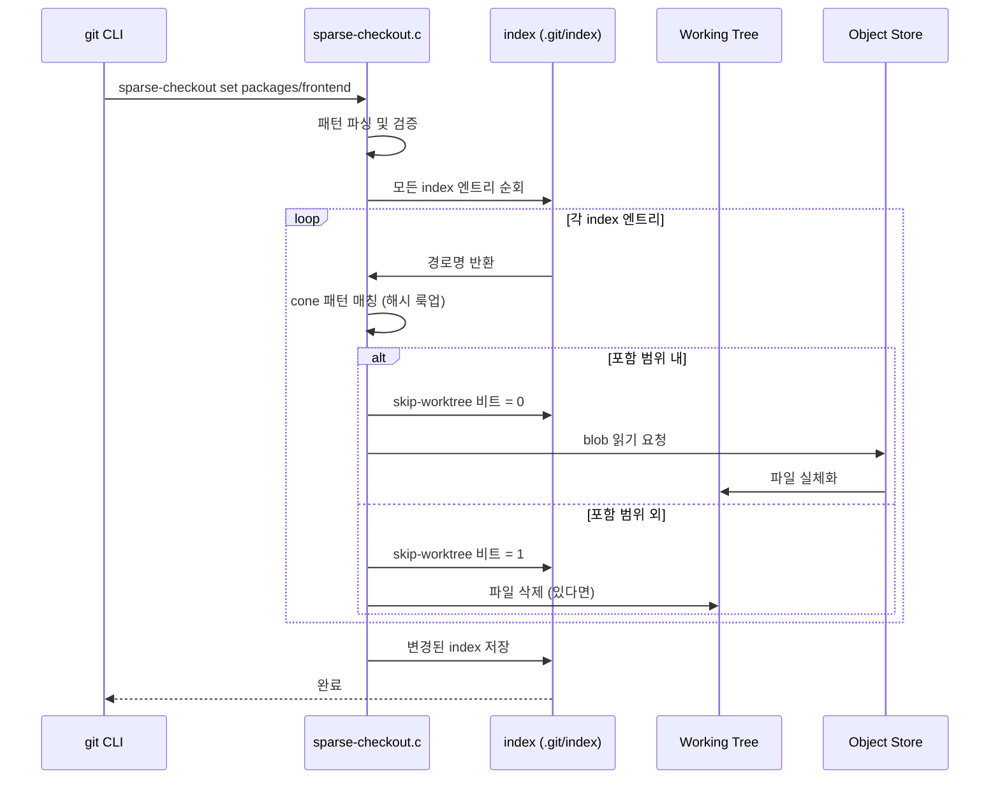
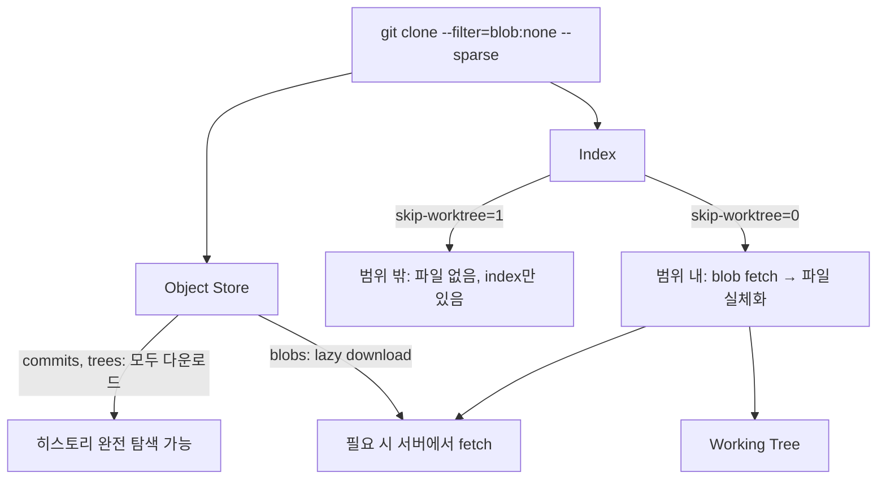

## 들어가며

수천 개의 패키지를 담은 모노레포를 `git clone`하면 어떤 일이 벌어질까. Google의 내부 저장소는 86TB에 달한다고 알려져 있다. Meta의 Sapling은 수억 개의 파일을 담은 단일 저장소를 운영한다. 당신이 그 저장소를 clone한다면? 커피 한 잔 마시는 정도가 아니라, 점심을 먹고 돌아와도 아직 진행 중일 수 있다.

거대 모노레포 문제는 단순히 "용량이 크다"가 아니다. 개발자가 실제로 필요한 코드는 전체의 1-5%에 불과한데, 나머지 95-99%를 무조건 내려받아야 한다는 비효율이 문제다. `frontend/` 팀이 `backend/` 코드를 왜 clone해야 하나?

Git 2.25(2020년 1월)에 정식으로 자리 잡은 `sparse-checkout`은 이 문제에 대한 Git의 공식 답변이다. 오늘은 이 기능의 내장을 완전히 해부해보자 — 파일 구조, 내부 알고리즘, cone mode의 최적화 원리, 그리고 partial clone과의 시너지까지.

---

## sparse-checkout의 내부 동작

### working tree ↔ index ↔ object store

sparse-checkout을 이해하려면 Git의 세 계층을 먼저 짚어야 한다.

```
┌─────────────────────────────────────────────┐
│              Object Store                    │
│    (.git/objects/ — 모든 blob, tree, commit) │
└──────────────────┬──────────────────────────┘
                   │ checkout 시 필요한 blob 읽기
┌──────────────────▼──────────────────────────┐
│                  Index                       │
│       (.git/index — staging area)            │
│   각 파일마다 skip-worktree 비트 존재        │
└──────────────────┬──────────────────────────┘
                   │ skip-worktree=0인 파일만 실체화
┌──────────────────▼──────────────────────────┐
│              Working Tree                    │
│       (실제 파일시스템에 존재하는 파일들)    │
└─────────────────────────────────────────────┘
```

sparse-checkout의 핵심은 **index에 있지만 working tree에는 없는** 파일을 만드는 것이다. 이걸 가능하게 하는 것이 바로 index entry의 `skip-worktree` 비트다.

### skip-worktree 비트

Git index의 각 엔트리는 64비트 플래그를 가진다. `builtin/ls-files.c`의 `CE_SKIP_WORKTREE` 플래그를 보면:

```c
/* cache.h */
#define CE_SKIP_WORKTREE     (1 << 23)
#define CE_INTENT_TO_ADD     (1 << 29)

/* 파일이 sparse 영역 밖에 있을 때 Git이 하는 일 */
static int check_skip_worktree(const struct cache_entry *ce)
{
    return !!(ce->ce_flags & CE_SKIP_WORKTREE);
}
```

이 비트가 1로 설정된 파일은 Git이 working tree에서 해당 파일을 **읽지도, 쓰지도 않는다**. `git status`를 실행해도 해당 파일의 변경사항은 무시된다. index에는 엔트리가 있지만 실제 파일은 디스크에 없어도 Git은 "삭제됐다"고 보지 않는다.

`git ls-files -v`로 현재 skip-worktree 상태를 확인할 수 있다:

```bash
git ls-files -v | head -20
# H .gitignore        ← 정상 (H = Hunk in working tree)
# S packages/backend/src/main.ts  ← skip (S = Skip-worktree)
# S packages/backend/package.json
# H packages/frontend/src/index.ts
```

### 파일 구조: `.git/info/sparse-checkout`

non-cone mode에서 sparse-checkout의 패턴은 `.git/info/sparse-checkout` 파일에 저장된다. `.gitignore`와 동일한 패턴 문법을 사용한다:

```
# .git/info/sparse-checkout (non-cone mode)

# 포함할 파일/디렉토리 (기본: 제외)
/packages/frontend/
/packages/shared/
/tools/scripts/

# 중첩 제외
!/packages/frontend/node_modules/

# 글로브 패턴
*.md
/docs/**/*.md
```

**중요한 점**: Git은 이 파일을 위에서 아래로 읽으며, 각 경로가 패턴과 매치되는지 확인한다. 매치되는 마지막 패턴이 적용되며, 매치되지 않으면 기본값(excluded)이 적용된다.

cone mode에서는 이 파일 대신 Git이 내부적으로 디렉토리 목록을 관리하며, `.git/info/sparse-checkout`은 자동 생성되는 특수 패턴으로 채워진다.

---

## cone mode vs non-cone mode

### non-cone mode: 유연하지만 느리다

non-cone mode는 임의의 글로브 패턴을 지원한다. `*.ts` 파일만 포함하거나, 특정 깊이의 디렉토리만 선택하는 것도 가능하다.

```bash
# non-cone mode 활성화
git sparse-checkout init
git sparse-checkout set --no-cone '/*.md' '/packages/frontend/**'
```

하지만 치명적인 성능 문제가 있다. Git이 **모든 파일 경로에 대해 전체 패턴 목록을 순차적으로 검사**해야 한다. 파일이 100만 개, 패턴이 100개라면 최대 1억 번의 비교가 발생한다.

```
non-cone 패턴 매칭 복잡도: O(파일 수 × 패턴 수)
```

실제로 Git 내부(`dir.c`)에서 `match_pathspec()` 함수가 호출될 때마다 전체 패턴 배열을 순회한다:

```c
/* dir.c — 단순화 */
static int match_pathspec_item(const struct pathspec_item *item,
                                const char *name, int namelen)
{
    /* 글로브 패턴 매칭: 경로 하나당 O(패턴 수) */
    return wildmatch(item->match, name, item->flags);
}
```

### cone mode: 빠르고 예측 가능하다

cone mode(Git 2.26+)는 패턴 언어를 의도적으로 제한한다. **오직 디렉토리 단위로만 포함/제외**를 지정할 수 있다. 이 제약 덕분에 O(1) 해시 룩업으로 매칭이 가능해진다.

```bash
# cone mode 활성화 (기본값)
git sparse-checkout init --cone
git sparse-checkout set packages/frontend packages/shared
```

cone mode의 두 가지 집합:

```
┌─────────────────────────────────────────────────┐
│  Included directories (해당 디렉토리 전체)       │
│  packages/frontend/                              │
│  packages/shared/                                │
├─────────────────────────────────────────────────┤
│  Parent directories (루트 파일만, 하위 제외)     │
│  /           (루트 파일들)                       │
│  packages/   (packages/ 바로 아래 파일들)        │
└─────────────────────────────────────────────────┘
```

Git은 cone mode에서 내부적으로 두 개의 해시셋을 유지한다:

```c
/* sparse-checkout.c */
struct pattern_list {
    struct hashmap recursive;   /* 완전 포함 디렉토리 */
    struct hashmap parent;      /* 부모 디렉토리 (파일만) */
};
```

경로 `packages/frontend/src/App.tsx`가 포함되는지 확인할 때:
1. `packages/frontend/src/` → recursive 집합에 없음
2. `packages/frontend/` → recursive 집합에 있음 ✓ → **포함**

O(1) 룩업, 파일 수와 관계없이 상수 시간이다.

### 두 모드 비교

```
┌──────────────────┬────────────────────────┬────────────────────────┐
│                  │     non-cone mode      │       cone mode        │
├──────────────────┼────────────────────────┼────────────────────────┤
│ 패턴 유연성      │ 임의의 글로브 패턴     │ 디렉토리 단위만        │
│ 매칭 복잡도      │ O(파일 × 패턴)         │ O(1) 해시 룩업         │
│ 대형 레포 성능   │ 느림 (checkout 지연)   │ 빠름                   │
│ 패턴 파일        │ .git/info/sparse-checkout │ 자동 생성             │
│ 권장 사용처      │ 세밀한 제어 필요 시    │ 모노레포 (권장)        │
└──────────────────┴────────────────────────┴────────────────────────┘
```

---

## 내부 동작 흐름

`git sparse-checkout set packages/frontend`를 실행했을 때 Git 내부에서 일어나는 일을 단계별로 추적해보자.



이 과정에서 **object store의 데이터는 변경되지 않는다**. sparse-checkout은 순수하게 index의 skip-worktree 비트와 working tree를 동기화하는 작업이다. 히스토리는 그대로 유지되며, 나중에 범위를 늘리면 숨겨진 파일들이 즉시 복원된다.

---

## 모노레포에서의 실전 활용

### 시나리오: frontend 팀의 일상

```bash
# 1. 새 팀원이 입사 — 처음부터 sparse하게 clone
git clone --filter=blob:none --sparse https://github.com/myorg/monorepo.git
cd monorepo

# 2. 필요한 패키지만 체크아웃
git sparse-checkout init --cone
git sparse-checkout set packages/frontend packages/shared tools/build-scripts

# 3. 현재 sparse 범위 확인
git sparse-checkout list
# packages/frontend
# packages/shared
# tools/build-scripts

# 4. 작업 중 backend API 타입 파일이 필요해졌을 때
git sparse-checkout add packages/backend/src/types

# 5. 더 이상 필요 없으면 다시 제거
git sparse-checkout set packages/frontend packages/shared tools/build-scripts
```

### 임시로 특정 파일 접근하기

sparse 범위 밖의 파일을 임시로 볼 때는:

```bash
# skip-worktree 무시하고 특정 파일만 복원
git checkout HEAD -- packages/backend/src/config.ts

# 아니면 object store에서 직접 읽기 (working tree 변경 없음)
git show HEAD:packages/backend/src/config.ts
git cat-file -p HEAD:packages/backend/package.json
```

### 팀별 sparse profile 관리

대규모 팀에서는 각 팀의 sparse 설정을 별도 파일로 관리하는 패턴이 유용하다:

```bash
# .sparse-profiles/frontend
packages/frontend
packages/shared
packages/design-system
tools/build-scripts

# .sparse-profiles/backend  
packages/backend
packages/shared
packages/proto
tools/build-scripts
infrastructure/docker

# 팀원이 입사할 때
git sparse-checkout set $(cat .sparse-profiles/frontend)
```

### CI/CD에서의 활용

빌드 파이프라인에서 sparse-checkout은 clone 시간을 극적으로 단축한다:

```yaml
# GitHub Actions
- name: Checkout (sparse)
  uses: actions/checkout@v4
  with:
    sparse-checkout: |
      packages/frontend
      packages/shared
      tools/build-scripts
    sparse-checkout-cone-mode: true
    filter: blob:none
```

```bash
# GitLab CI / 직접 제어
git clone --filter=blob:none --no-checkout $CI_REPOSITORY_URL
cd repo
git sparse-checkout init --cone
git sparse-checkout set packages/frontend packages/shared
git checkout $CI_COMMIT_SHA
```

---

## partial clone과 함께 사용하기

sparse-checkout만 사용하면 "어떤 파일을 working tree에 노출할지"는 제어할 수 있지만, **object store에는 여전히 모든 blob이 다운로드**된다. 진정한 의미의 최적화는 partial clone을 함께 사용할 때 완성된다.

### partial clone의 두 가지 필터

```bash
# 1. blob:none — blob 오브젝트는 필요할 때만 다운로드
#    (tree, commit은 모두 다운로드)
git clone --filter=blob:none <url>

# 2. tree:0 — 현재 커밋의 tree만 다운로드
#    (가장 얕은 클론, 히스토리 탐색 제한)
git clone --filter=tree:0 <url>
```

`--filter=blob:none`이 sparse-checkout과 가장 잘 어울린다. tree와 commit 오브젝트는 모두 받아서 `git log`, `git blame` 등을 정상적으로 사용할 수 있으면서, blob은 실제로 파일이 필요한 순간(checkout)에 lazy하게 다운로드된다.

### 두 기능의 시너지



실제 저장 공간 비교 (가상 시나리오: 10GB 모노레포, 2% 사용):

```
전통적 clone:          10,000 MB  (object store + working tree)
sparse-checkout만:      5,200 MB  (object store 유지, working tree 200MB)
partial clone만:        2,100 MB  (blob lazy, working tree 전체)
partial + sparse:         200 MB  (blob lazy, working tree도 2%)
```

### 실전: 완전한 설정 흐름

```bash
# ── 처음 설정 ──────────────────────────────────────────────

# blob:none 필터로 clone (blob은 나중에)
# --no-checkout: index 구성 전에 sparse 설정하기 위해
git clone --filter=blob:none --no-checkout \
  https://github.com/myorg/monorepo.git
cd monorepo

# cone mode로 sparse 초기화
git sparse-checkout init --cone

# 필요한 범위 지정
git sparse-checkout set packages/frontend packages/shared

# 이제 checkout — 범위 내 blob만 서버에서 내려받음
git checkout main

# ── 범위 확장 ──────────────────────────────────────────────

# 새 패키지 추가 — 해당 blob만 추가로 다운로드
git sparse-checkout add packages/analytics

# ── 현재 상태 진단 ─────────────────────────────────────────

# sparse 범위 확인
git sparse-checkout list

# object store 크기 확인
du -sh .git/objects/

# 실제로 download된 blob 수 확인
git cat-file --batch-all-objects --batch-check | \
  grep blob | wc -l

# promisor remote 확인 (partial clone에서 blob 출처)
cat .git/config | grep promisor
# promisor = true  ← 이 서버가 lazy blob을 제공함
```

### Partial clone 주의사항

```bash
# blob:none으로 clone한 후 git grep은 모든 blob을 fetch할 수 있음!
# 이 명령은 범위 밖 파일들의 blob까지 다운로드한다
git grep "function parseConfig"  # ← 주의

# 범위를 지정해서 실행하면 안전
git grep "function parseConfig" -- packages/frontend/

# git log --all은 괜찮음 (blob 없이 commit/tree만 사용)
git log --all --oneline  # ← 안전

# git log -p는 diff 생성 시 blob fetch
git log -p -- packages/frontend/src/  # ← blob 다운로드 발생
```

---

## `.git/info/sparse-checkout` 파일 구조 심층 분석

cone mode를 사용할 때 Git이 자동으로 관리하는 이 파일의 실제 내용을 살펴보자:

```bash
cat .git/info/sparse-checkout
```

```
/*
!/*/
/packages/frontend/
/packages/shared/
```

이 패턴을 해독하면:

| 패턴 | 의미 |
|------|------|
| `/*` | 루트의 모든 파일 포함 (하위 디렉토리 제외) |
| `!/*/` | 루트의 모든 디렉토리 제외 (override) |
| `/packages/frontend/` | 이 디렉토리는 포함 |
| `/packages/shared/` | 이 디렉토리는 포함 |

cone mode는 이 패턴을 직접 파싱하지 않고 내부 해시셋을 사용하지만, 파일 자체는 non-cone 모드와의 호환성을 위해 유효한 gitignore 패턴으로 기록된다.

```bash
# 직접 편집하면 어떻게 될까? (비권장)
# Git은 다음 sparse-checkout 명령 실행 시 덮어쓴다
# 직접 편집은 non-cone mode에서만 의미가 있음

# non-cone에서 직접 편집 후 적용
echo "/packages/legacy/" >> .git/info/sparse-checkout
git sparse-checkout reapply  # 변경사항 working tree에 반영
```

---

## 자주 만나는 문제들

### "sparse 범위 밖 파일을 수정했더니 사라졌다"

```bash
# 실수로 sparse 범위를 좁혔을 때 파일이 삭제됨
# 하지만 object store에는 여전히 있음
git sparse-checkout add packages/that-i-forgot
# 파일이 돌아온다
```

### "git status가 너무 오래 걸린다"

```bash
# cone mode 확인
git config core.sparseCheckoutCone
# false 또는 없으면 non-cone mode — 느릴 수 있음

# cone mode로 전환
git sparse-checkout init --cone
git sparse-checkout set $(git sparse-checkout list)
```

### "merge 시 범위 밖 충돌이 발생한다"

sparse-checkout은 merge 중 범위 밖 파일의 충돌도 표시한다. 이건 의도된 동작이다 — 당신이 수정하지 않은 파일에서도 충돌이 발생할 수 있기 때문이다.

```bash
# 범위 밖 충돌을 자동으로 "ours"로 해결하는 방법 (주의해서 사용)
git checkout --ours -- packages/backend/
git add packages/backend/
```

---

## 마치며

`git sparse-checkout`은 "파일을 숨기는" 기능이 아니다. **index에 모든 정보를 유지하면서 working tree만 선택적으로 실체화하는** 정교한 메커니즘이다. `skip-worktree` 비트 하나로 Git은 "이 파일은 알고 있지만, 지금 당신 디스크에는 없어도 된다"는 상태를 표현한다.

cone mode의 O(1) 해시 룩업은 단순한 최적화가 아니다. 수백만 파일이 있는 저장소에서 non-cone의 O(N×M) 복잡도는 checkout을 분 단위로 만들어버린다. 패턴 언어를 의도적으로 제한함으로써 알고리즘적으로 완전히 다른 경로를 탈 수 있게 한 설계 결정이다.

그리고 `--filter=blob:none`과의 조합은 진정한 게임 체인저다. sparse-checkout이 "어떤 파일을 볼지"를 결정한다면, partial clone은 "어떤 데이터를 받을지"를 결정한다. 두 개를 함께 쓰면, 10GB 저장소를 200MB로 다루는 것이 가능해진다.

모노레포를 운영하거나 사용하는 팀이라면, 이 두 기능의 조합을 설정하는 데 한 시간을 투자하는 것이 앞으로의 무수한 clone 시간을 절약하는 가장 확실한 방법이다.

---

