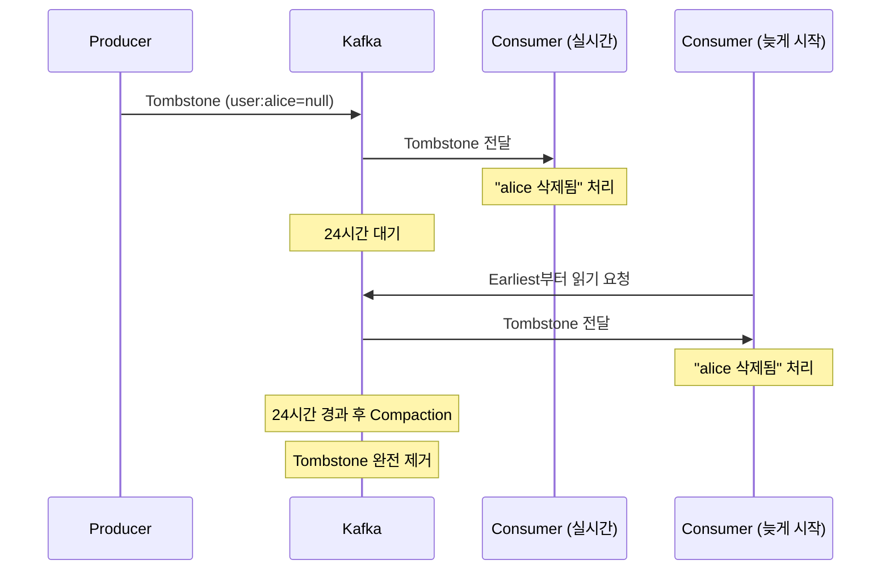

**시간이 아닌 '상태'로 로그를 정리하는 법**

---

## 프롤로그: Retention의 딜레마

당신은 사용자 프로필을 관리하는 시스템을 만들고 있다. Kafka Topic에 변경사항을 기록한다.

```
Topic: user-profiles (cleanup.policy=delete, retention.ms=7일)

Day 1: user:alice → {name: "Alice", email: "alice@example.com"}
Day 2: user:alice → {name: "Alice", email: "alice@newdomain.com"}
Day 3: user:alice → {name: "Alice Smith", email: "alice@newdomain.com"}
Day 4: user:alice → 탈퇴 (삭제 요청)
```

**문제**: Alice가 탈퇴했지만, 그녀의 데이터는 **7일간 Topic에 남아있다**. GDPR이라면? 감사에 걸린다.

"Retention을 1시간으로 줄이면 되지 않나?" → 그럼 다른 사용자들의 프로필도 1시간 만에 사라진다. 현재 상태를 잃어버린다.

**진짜 필요한 건**: "각 사용자의 **최신 상태만** 영구 보존. 중간 히스토리는 버려도 된다."

시간 기반 Retention으로는 불가능하다. 여기서 **Log Compaction**이 등장한다.

---

## 1. Retention vs Compaction: 정리의 두 철학

### 1.1 Retention: 시간의 흐름

```
cleanup.policy=delete (기본값)

Timeline:
Day 0  ──> Day 7 ──> Day 14
[Seg 1] [Seg 2] [Seg 3] [Seg 4]
 ↓ 7일 경과
[삭제]   유지    유지    유지
```

**동작 방식**:
1. Segment 전체를 시간(`retention.ms`) 또는 크기(`retention.bytes`) 기준으로 삭제
2. 5분마다 체크 (`log.retention.check.interval.ms`)
3. Segment의 **가장 최신 메시지** timestamp가 기준

**장점**:
- 간단하고 예측 가능
- CPU/I/O 부하 낮음
- 디스크 사용량 = f(retention.ms)

**한계**:
- "상태"를 관리할 수 없음
- 중복 데이터 제거 불가
- "최신만 필요"한 경우에도 과거 전체 보관

### 1.2 Compaction: 상태의 보존

```
cleanup.policy=compact

Before:
[k1:v1][k2:v2][k1:v3][k3:v4][k2:v5][k1:v6]

After:
[k2:v2][k3:v4][k2:v5][k1:v6]
       ↑ 각 Key의 최신 값만 남음
```

**동작 방식**:
1. 각 Key의 **가장 최신 값만** 유지
2. 오래된 중복 Record 제거
3. Offset은 절대 변하지 않음 (불변성 유지)

**장점**:
- "현재 상태"를 영구 보존
- 공간 = f(unique keys) - 업데이트 횟수 무관
- Topic 처음부터 읽으면 최신 상태 복원

**트레이드오프**:
- CPU/I/O 부하 높음 (백그라운드 정리)
- Key가 없는 메시지는 정리 불가
- Key 카디널리티가 너무 높으면 비효율적

---

## 2. Compaction 해부: Cleaner Thread의 작동 원리

### 2.1 LogCleaner 아키텍처

Kafka Broker는 **LogCleaner**를 백그라운드로 실행한다.

```scala
// kafka/log/LogCleaner.scala (핵심 구조)
class LogCleaner(config: CleanerConfig, ...) {
  // Cleaner thread pool (기본 1개)
  private val cleaners = (0 until config.numThreads).map(
    new CleanerThread(_)
  )
  
  // 공유 I/O throttler (기본 1.5 MB/s)
  private val throttler = new Throttler(
    desiredRatePerSec = config.maxIoBytesPerSecond,
    checkIntervalMs = 300
  )
}
```

**설정**:
```properties
# server.properties
log.cleaner.enable=true                      # 필수!
log.cleaner.threads=2                        # Thread 개수
log.cleaner.io.max.bytes.per.second=1572864  # I/O throttle (1.5MB/s)
log.cleaner.dedupe.buffer.size=134217728     # 128MB per thread
```

### 2.2 "가장 더러운" 로그 선택

LogCleaner는 "어떤 Topic부터 정리할까?" 를 다음 기준으로 정한다.

```
Dirty Ratio = (Dirty Bytes) / (Total Bytes)

Dirty Bytes = 아직 정리 안 된 중복 데이터
Total Bytes = 전체 로그 크기

예시:
Topic A: 1GB, Dirty 800MB → Dirty Ratio = 0.8 (80%)
Topic B: 2GB, Dirty 600MB → Dirty Ratio = 0.3 (30%)

→ Topic A 먼저 정리! (더 더럽다)
```

**Threshold**:
```properties
# Topic 설정
min.cleanable.dirty.ratio=0.5  # 50% 이상 더러워야 정리
```

낮추면 (예: 0.1) → 더 자주 정리 (공간 절약, CPU 증가)  
높이면 (예: 0.7) → 덜 정리 (CPU 절약, 공간 낭비)

### 2.3 Compaction 알고리즘 (2단계)

#### Phase 1: Offset Map 구축

```
목적: "각 Key의 최신 Offset"을 메모리에 기록

Dirty Section 스캔:
Offset 100: {key: "user:1", value: "Alice"}
Offset 105: {key: "user:2", value: "Bob"}
Offset 110: {key: "user:1", value: "Alice Updated"}

→ Offset Map:
  ┌──────────┬────────┐
  │ Key      │ Offset │
  ├──────────┼────────┤
  │ "user:1" │  110   │  ← 최신 offset
  │ "user:2" │  105   │
  └──────────┴────────┘
```

**메모리 구조**:
- `SkimpyOffsetMap`: 효율적인 해시맵
- `log.cleaner.dedupe.buffer.size` (기본 128MB)
- Collision handling: Linear probing
- 저장 형식: `[Hash(8B)][Offset(8B)]`

#### Phase 2: Clean Section 재작성

```
Clean Section을 순회하며 중복 제거:

Original Clean Section:
[100: user:1→Alice] [102: user:2→Bob] [105: user:3→Carol]

Check each record:
1. Offset 100, key="user:1" → Map에 110 있음 → Skip! (중복)
2. Offset 102, key="user:2" → Map에 105 있음 → Keep (최신)
3. Offset 105, key="user:3" → Map에 없음 → Keep

New Clean Section:
[102: user:2→Bob] [105: user:3→Carol]
```

**I/O 최적화**:
- Read/Write Buffer: `log.cleaner.io.buffer.size` (512KB)
- Throttling: 공유 Throttler로 Producer/Consumer 영향 최소화
- Swap: 정리 완료 후 원본과 새 Segment 교체

### 2.4 보호 메커니즘

**Active Segment 보호**:
```
[Clean Seg 1][Clean Seg 2][Dirty Seg 3][Active Seg 4]
                              ↑ 여기까지만 정리
                                        ↑ 절대 건드리지 않음!
```

Producer가 쓰는 중인 Segment는 Compaction 대상에서 제외.

**min.compaction.lag.ms** (기본 30초):
```
Timeline:
T=0      T=10     T=30     T=60
│        │        │        │
Write    Write    Eligible Compact
msg      msg      ↑ 30초 후부터 정리 가능
```

"Head-of-log" 변경사항이 너무 빨리 사라지는 것 방지. Consumer가 최신 변경을 놓치지 않도록.

---

## 3. Tombstone: 삭제를 "이벤트"로 표현하기

### 3.1 문제 상황

```
사용자 탈퇴 처리를 어떻게 표현할까?

Naive approach: 메시지를 보내지 않는다
→ 문제: Compaction 시 이전 값이 "최신"으로 남음!

Offset 100: user:alice → {name: "Alice", email: "..."}
Offset 110: user:bob   → {name: "Bob", email: "..."}
... (alice에 대한 메시지 없음)

Compaction 후:
user:alice → {name: "Alice", email: "..."}  ← 여전히 존재!
```

**해결책**: **Tombstone** - null 값을 가진 특수 메시지

### 3.2 Tombstone 발행

```java
// Producer 코드
ProducerRecord<String, String> tombstone = 
    new ProducerRecord<>(
        "user-profiles",
        "user:alice",
        null  // ← 진짜 null! (문자열 "null" 아님)
    );

producer.send(tombstone);
```

**결과**:
```
Topic: user-profiles

Offset 100: {key: "user:alice", value: {name: "Alice", ...}}
Offset 150: {key: "user:alice", value: null}  ← Tombstone

Compaction 후:
Offset 150: {key: "user:alice", value: null}  ← 최신 값(삭제)
```

### 3.3 Two-Phase Deletion

Tombstone은 **2단계**로 삭제된다.

**Phase 1: Tombstone 유지 (Grace Period)**
```
설정: delete.retention.ms=86400000 (24시간)

T=0: Tombstone 발행
 ↓
T=1h: Compaction 수행
      → Tombstone은 "최신 값"으로 유지
      → 이전 값들 제거
 ↓
T=23h: Consumer가 처음부터 읽기
       → Tombstone 발견 → "user:alice 삭제됨" 인식
```

**Phase 2: Tombstone 제거**
```
T=24h+: Compaction 수행
        → Tombstone timestamp 확인
        → 24시간 경과 → Tombstone 자체도 제거

최종 결과: Topic에 user:alice 흔적 없음
```

**왜 Grace Period가 필요한가?**



늦게 시작하는 Consumer에게도 "삭제되었다"는 정보 전달 보장!

### 3.4 주의사항

**진짜 null이어야 한다**:
```java
// ❌ 잘못된 예
producer.send(new ProducerRecord<>("topic", "key", "null"));
→ 문자열 "null"은 Tombstone 아님!

// ✅ 올바른 예
producer.send(new ProducerRecord<>("topic", "key", null));
```

**Key가 없으면 Compaction 불가**:
```java
// ❌ Key 없는 메시지는 정리 안 됨
producer.send(new ProducerRecord<>("topic", null, "value"));
```

---

## 4. 성능 영향과 튜닝

### 4.1 리소스 사용량

**메모리**:
```
Per Thread:
= dedupe.buffer.size + (2 × io.buffer.size)
= 128MB + (2 × 512KB)
≈ 129MB

2개 Thread → ~258MB
10개 Thread → ~1.3GB

⚠️ Thread당 2GB 넘으면 ByteBuffer overflow!
```

**CPU/I/O**:
```
높은 부하 상황:
1. Offset Map 구축: 모든 Dirty Record 스캔 + 해싱
2. Clean Section 재작성: Segment 순회 + Map lookup
3. 압축/직렬화: 새 Segment 작성

예시 로그:
[kafka-log-cleaner-thread-0]: 
  Cleaned log user-events-0 (dirty = [100000, 200000])
  45.6 MB processed in 3.2 sec (14.25 MB/sec)
  Indexed 120,000 records, deleted 35,000 records
  Max buffer utilization: 87.3%
```

### 4.2 Throttling

```properties
# I/O 제한 (모든 Thread 공유)
log.cleaner.io.max.bytes.per.second=1572864  # 1.5 MB/s

# Thread별 독립이 아님!
# 2개 Thread → 각각 750 KB/s
# 10개 Thread → 각각 150 KB/s
```

**목적**: Producer/Consumer I/O에 영향 최소화

```
Disk I/O:
├─ Producer writes:  60 MB/s
├─ Consumer reads:   40 MB/s
└─ Cleaner:          1.5 MB/s ← Throttled!
```

### 4.3 실전 튜닝 가이드

**시나리오 1: 많은 Compact Topic**
```properties
log.cleaner.threads=4                        # Thread 증가
log.cleaner.dedupe.buffer.size=268435456     # 256MB (더 큰 버퍼)
min.cleanable.dirty.ratio=0.3                # 더 자주 정리
```

**시나리오 2: 저장 공간 압박**
```properties
min.cleanable.dirty.ratio=0.1                # 공격적 정리 (10%)
segment.bytes=52428800                       # 50MB (작은 Segment)
max.compaction.lag.ms=3600000                # 1시간 내 반드시 정리
```

**시나리오 3: CPU 부담 줄이기**
```properties
log.cleaner.threads=1                        # 최소 Thread
min.cleanable.dirty.ratio=0.7                # 덜 자주 정리
log.cleaner.backoff.ms=30000                 # 30초 대기 (기본 15초)
```

### 4.4 모니터링 메트릭

**JMX Metrics (중요)**:
```
kafka.log:type=LogCleanerManager,name=max-dirty-percent
  → 가장 더러운 로그의 Dirty Ratio (높으면 정리 필요)

kafka.log:type=LogCleaner,name=cleaner-recopy-percent
  → 재작성 비율 (낮을수록 효율적)

kafka.log:type=LogCleaner,name=max-clean-time-secs
  → 가장 오래 걸린 Compaction 시간 (성능 병목 확인)

kafka.log:type=LogCleanerStats,name=MaxBufferUtilizationPct
  → Offset Map 버퍼 사용률 (100% 근접 시 버퍼 증가 필요)
```

---

## 5. 사용 사례

### 5.1 CDC (Change Data Capture)

**시나리오**: MySQL → Kafka → Elasticsearch

```sql
-- MySQL users 테이블
CREATE TABLE users (
  id INT PRIMARY KEY,
  name VARCHAR(100),
  email VARCHAR(100)
);

-- 변경 발생
INSERT INTO users VALUES (1, 'Alice', 'alice@example.com');
UPDATE users SET email='alice@new.com' WHERE id=1;
DELETE FROM users WHERE id=1;
```

**Kafka Topic (Debezium 등)**:
```
Topic: mysql.inventory.users
cleanup.policy=compact,delete
retention.ms=2592000000  # 30일

Offset 1000: {key: {"id": 1}, value: {name: "Alice", email: "alice@example.com"}}
Offset 1050: {key: {"id": 1}, value: {name: "Alice", email: "alice@new.com"}}
Offset 1100: {key: {"id": 1}, value: null}  ← DELETE → Tombstone

Compaction 후:
Offset 1100: {key: {"id": 1}, value: null}

30일 후 Retention:
[완전 삭제]  ← GDPR 준수
```

**Consumer (Elasticsearch Sink)**:
```
1. Topic earliest부터 읽기
2. 각 id의 최신 값으로 ES 인덱스 업데이트
3. null 값 → ES에서 Document 삭제
4. 결과: MySQL 현재 상태와 ES 완벽 동기화
```

### 5.2 KTable (Kafka Streams)

```java
// Kafka Streams 코드
StreamsBuilder builder = new StreamsBuilder();

// KTable: cleanup.policy=compact 자동 설정
KTable<String, Long> wordCounts = builder
    .stream("text-input")
    .flatMapValues(line -> Arrays.asList(line.split(" ")))
    .groupBy((key, word) -> word)
    .count();  // Internal changelog: compact!

wordCounts.toStream().to("word-counts-output");
```

**내부 Changelog Topic**:
```
Topic: word-counts-STATE-STORE-0000000001-changelog
cleanup.policy=compact
min.cleanable.dirty.ratio=0.1  # Streams가 자동 설정

Offset 1: {key: "hello", value: 1}
Offset 2: {key: "world", value: 1}
Offset 3: {key: "hello", value: 2}  ← 업데이트
Offset 4: {key: "hello", value: 3}

Compaction 후:
{key: "hello", value: 3}
{key: "world", value: 1}
```

**장점**:
- Streams 앱 재시작 시 Changelog 처음부터 읽어서 State 복원
- 전체 히스토리 재처리 불필요 → 빠른 복구

### 5.3 User Profile / Configuration

**Feature Flag 관리**:
```
Topic: feature-flags (cleanup.policy=compact)

Offset 500: {key: "new-ui", value: "enabled"}
Offset 505: {key: "beta-api", value: "disabled"}
Offset 510: {key: "new-ui", value: "disabled"}  ← 롤백!
Offset 515: {key: "dark-mode", value: "enabled"}

Compaction 후:
{
  "new-ui": "disabled",
  "beta-api": "disabled",
  "dark-mode": "enabled"
}
```

**애플리케이션**:
```java
// 시작 시 Feature Flag 로드
consumer.subscribe("feature-flags");
consumer.seekToBeginning(partitions);  // earliest부터

Map<String, String> flags = new HashMap<>();
while (true) {
    records = consumer.poll(Duration.ofMillis(100));
    for (record : records) {
        if (record.value() != null) {
            flags.put(record.key(), record.value());
        } else {
            flags.remove(record.key());  // Tombstone
        }
    }
    if (consumer.position(...) >= endOffset) break;
}

// flags에 최신 상태 복원 완료!
// 이후 실시간 구독으로 변경사항 반영
```

### 5.4 __consumer_offsets (Kafka 내부)

Kafka 자신도 Compaction을 쓴다!

```
Topic: __consumer_offsets
cleanup.policy=compact
partitions=50

Key: {group: "my-app", topic: "orders", partition: 0}
Value: {offset: 12345, metadata: "...", timestamp: ...}

동작:
1. Consumer가 commit → __consumer_offsets에 기록
2. 같은 (group, topic, partition) 조합은 최신 offset만 필요
3. Compaction으로 이전 commit 제거

결과:
- 수백만 consumer group이 있어도
- partition당 1개 record만 유지
- 공간 효율적!
```

---

## 6. cleanup.policy 설정 전략

### 6.1 delete (기본)

```properties
cleanup.policy=delete
retention.ms=604800000       # 7일
retention.bytes=-1           # 무제한
segment.bytes=1073741824     # 1GB
```

**적합한 경우**:
- 로그, 메트릭, 이벤트 스트림
- 과거 데이터 중요하지 않음
- 순서만 중요 (중복 허용)

**예시**: 클릭스트림, 서버 로그, IoT 센서 데이터

### 6.2 compact

```properties
cleanup.policy=compact
min.cleanable.dirty.ratio=0.5
segment.bytes=104857600           # 100MB
min.compaction.lag.ms=0
delete.retention.ms=86400000      # Tombstone 24시간
```

**적합한 경우**:
- 최신 상태만 중요
- Key 카디널리티 제한적 (수천만~수억)
- 영구 보존 필요

**예시**: User Profile, CDC, KTable Changelog

### 6.3 compact,delete (Hybrid)

```properties
cleanup.policy=compact,delete
min.cleanable.dirty.ratio=0.5
retention.ms=2592000000           # 30일
delete.retention.ms=86400000      # Tombstone 1일
```

**동작 순서**:
1. 먼저 Compaction (Key 중복 제거)
2. 그 다음 Retention (30일 경과 Segment 삭제)

**적합한 경우**:
- 최신 상태 + 시간 제한
- GDPR 등 규제 준수
- 무한 증가 방지

**예시**: CDC with TTL, 감사 로그

### 6.4 비교표

| 항목 | delete | compact | compact,delete |
|------|--------|---------|----------------|
| **삭제 기준** | 시간/크기 | Key 중복 | 둘 다 |
| **공간 예측** | 쉬움 | 어려움 | 중간 |
| **CPU/I/O** | 낮음 | 높음 | 높음 |
| **보장** | 시간 내 전체 | 최신 영구 | 최신 + 시간 |
| **Tombstone** | 불필요 | 필수 | 필수 |
| **사례** | 로그 | CDC, KTable | CDC+TTL |

---

## 7. Key 설계의 중요성

Compaction의 효율성은 **Key를 어떻게 설계하느냐**에 달렸다.

### 7.1 잘못된 Key 설계

```java
// ❌ Timestamp를 Key에 포함
ProducerRecord<String, String> bad = new ProducerRecord<>(
    "user-events",
    "user:alice:" + System.currentTimeMillis(),  // 매번 다른 Key!
    eventJson
);

결과:
Offset 1: {key: "user:alice:1708012345000", value: {...}}
Offset 2: {key: "user:alice:1708012346000", value: {...}}
Offset 3: {key: "user:alice:1708012347000", value: {...}}

→ Compaction 무용지물! (Key가 전부 다름)
```

### 7.2 올바른 Key 설계

```java
// ✅ 엔티티 ID를 Key로
ProducerRecord<String, String> good = new ProducerRecord<>(
    "user-profiles",
    "user:alice",  // 고정된 Key
    profileJson
);

결과:
Offset 1: {key: "user:alice", value: {version: 1, ...}}
Offset 2: {key: "user:alice", value: {version: 2, ...}}
Offset 3: {key: "user:alice", value: {version: 3, ...}}

Compaction 후:
Offset 3: {key: "user:alice", value: {version: 3, ...}}  ← 최신만!
```

### 7.3 Key 카디널리티 고려

```
Low Cardinality (좋음):
- User IDs: 수백만
- Product SKUs: 수십만
- Sensor IDs: 수천~수만

High Cardinality (나쁨):
- Session IDs: 수십억 (매번 새로움)
- Request IDs: 무한
- Random UUIDs: 의미 없음

Rule of Thumb:
Unique Keys < 10억 → Compaction 효율적
Unique Keys > 100억 → Retention 고려
```

---

## 에필로그: Log의 두 얼굴

Kafka의 철학은 "append-only log"다. 한 번 쓴 데이터는 절대 변하지 않는다.

그런데 Compaction은? **"물리적으로 삭제"**하는 게 아닌가?

**핵심 통찰**:

```
논리적 불변성 (Logical Immutability):
- Offset은 절대 변하지 않음
- Offset 100에 쓴 데이터는 영원히 Offset 100

물리적 정리 (Physical Cleanup):
- 중복된 데이터를 제거할 뿐
- "최신 상태"는 여전히 로그에 존재
```

Compaction은 **"논리적 append-only 유지하면서 물리적 공간 절약"**하는 기법이다.

**Tombstone도 마찬가지**:
- 삭제조차 "이벤트"로 표현 (불변성 유지)
- null 값을 가진 메시지를 추가할 뿐
- "삭제했다"는 사실이 로그에 기록됨

**Log Compaction의 진짜 의미**:

Kafka는 단순한 메시징 시스템이 아니다. **"분산 Key-Value 저장소"**이자 **"Event Sourcing 플랫폼"**이다.

- **메시징**: 실시간 이벤트 전달
- **저장소**: 현재 상태 영구 보존
- **이벤트 소싱**: 상태 변경 히스토리 재생

Compaction은 이 모든 걸 가능하게 하는 핵심 메커니즘이다.

---


**Kafka 해체분석기 #8: "Exactly-Once의 비밀 - Idempotent Producer와 Transaction"**
- `enable.idempotence=true`의 내부 동작
- Producer ID와 Sequence Number
- Transaction Coordinator와 Two-Phase Commit
- `isolation.level=read_committed` 구현

---

**참고 자료**:
- [Kafka Documentation: Log Compaction](https://kafka.apache.org/documentation/#compaction)
- [Confluent: Log Compaction Design](https://docs.confluent.io/kafka/design/log_compaction.html)
- [GitHub: kafka/log/LogCleaner.scala](https://github.com/apache/kafka/blob/trunk/core/src/main/scala/kafka/log/LogCleaner.scala)
- [KIP-534: Retain tombstones for delete.retention.ms](https://cwiki.apache.org/confluence/display/KAFKA/KIP-534)
