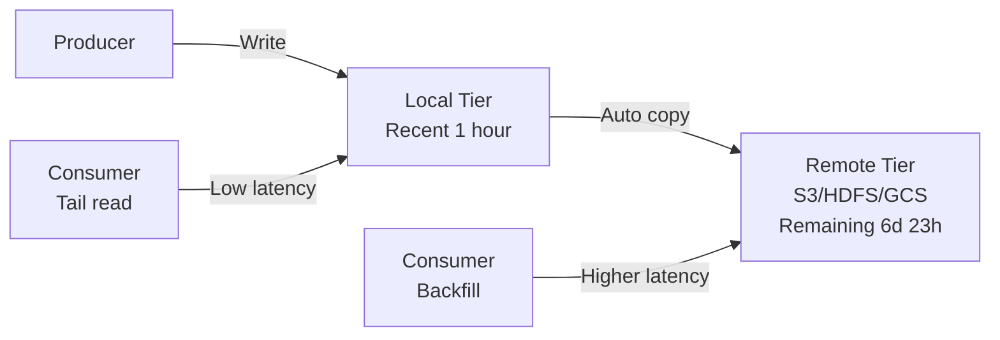

**왜 Kafka는 모든 데이터를 로컬에 쌓았을까**

---

## 프롤로그: 월 $24,300짜리 retention

어느 스타트업의 데이터 엔지니어가 Slack 알림을 받았다.

```
AWS Cost Alert
Kafka Cluster EBS Volume: $24,300 this month
Budget exceeded by 340%
```

50TB의 데이터를 7일간 보관하려 했을 뿐인데, 청구서는 폭탄이었다. **3x 복제** (고가용성) + **2x over-provisioning** (디스크 여유) = 실제 데이터의 **6배** 스토리지가 필요했다. 304TB의 EBS GP3 볼륨. $0.08/GiB × 304,000 = $24,320/월.

더 큰 문제는 **확장성**이었다. retention을 30일로 늘리면? 클러스터 전체를 스케일아웃해야 한다. 브로커를 추가하면 메모리와 CPU도 따라온다. **스토리지만 늘릴 수 없다.**

이런 한계를 깨기 위해 Kafka 3.6부터 등장한 게 바로 **Tiered Storage**다. 아이디어는 단순하다. **자주 쓰는 데이터는 로컬에, 오래된 데이터는 S3에.** 이 단순한 변화가 어떻게 90% 비용을 절감하는지 해부해보자.

---

## Chapter 1: append-only의 딜레마

Kafka의 핵심은 **append-only log**다. 메시지는 끝에만 추가되고, 절대 수정되지 않는다. 이 설계 덕분에 초당 수백만 건의 이벤트를 처리할 수 있다.

### 로컬 디스크의 한계

```
Partition 0 on Broker 1:
/var/kafka/logs/topic-0/
├── 00000000000000000000.log (1GB)
├── 00000000000001000000.log (1GB)
├── 00000000000002000000.log (1GB)
├── ... (계속)
└── 00000000000099000000.log (1GB, active)
```

모든 세그먼트가 로컬 디스크에 쌓인다. `retention.ms=604800000` (7일)이면, 7일 동안 모든 세그먼트가 브로커에 남는다. 

**문제는 세 가지다:**

1. **비용**: EBS는 복제 + over-provisioning으로 실제 데이터의 6배
2. **복구 시간**: 브로커 장애 시 수백 GB를 다른 브로커에서 복사
3. **확장 불가능**: retention 늘리려면 클러스터 전체 스케일아웃

### 사용 패턴의 비대칭

그런데 실제 사용 패턴을 보면:

```
읽기 패턴:
95% - Tail reads (최근 1시간 데이터, page cache 활용)
 5% - Backfill/복구 (오래된 데이터, 디스크 I/O)
```

**대부분의 Consumer는 실시간 tail read**다. Kafka는 OS page cache를 활용해 최근 데이터를 메모리에서 서빙한다. 디스크는 거의 안 건드린다.

오래된 데이터를 읽는 건 드물다. 장애 복구, backfill 작업, 감사(audit) 정도. 그런데 이 드문 케이스를 위해 **모든 데이터를 로컬에 쌓는다**는 게 말이 되나?

---

## Chapter 2: Two-Tier의 탄생

### KIP-405의 핵심 아이디어

**"자주 쓰는 데이터는 가까이, 오래된 데이터는 싸게."**



- **Local Tier**: 브로커 디스크, 최근 1시간 (설정 가능)
- **Remote Tier**: S3/HDFS/GCS, 나머지 전부
- 세그먼트가 롤링되면 자동으로 리모트로 복사
- `local.retention.ms` 경과 후 로컬 세그먼트 삭제

### 오프셋 제약 조건

```
Rx (Remote start) ≤ Ry (Remote end) ≤ Lx (Local start) ≤ Ly (LSO) ≤ Lz (Local end)

Example:
Offset:  0 ────────────────── 1000 ──────── 1100 ───── 1200
         Rx                   Ry/Lx        Ly       Lz
         └─ Remote Storage ──┘└─ Local Disk ─────┘
```

- Consumer가 offset 500을 요청? → S3에서 fetch
- Consumer가 offset 1150을 요청? → 로컬 디스크 (page cache)

---

## Chapter 3: RemoteStorageManager 해부

### 세 가지 핵심 컴포넌트

Tiered Storage는 세 가지 컴포넌트로 구성된다:

#### 1. RemoteLogManager (RLM)
브로커 내부 컴포넌트. Leader/Follower 파티션별로 태스크를 생성한다.

```java
class RemoteLogManager {
    // Leader만 실행
    void copyLogSegmentToRemote(LogSegment segment) {
        if (segment.lastOffset < lastStableOffset) {
            RemoteLogSegmentId id = UUID.randomUUID();
            remoteStorageManager.copyLogSegment(
                new RemoteLogSegmentMetadata(id, segment),
                new LogSegmentData(segment.log, segment.indexes)
            );
        }
    }
    
    // Leader/Follower 모두
    FetchDataInfo readFromRemote(long startOffset) {
        RemoteLogSegmentMetadata metadata = 
            remoteLogMetadataManager.findSegment(startOffset);
        return remoteStorageManager.fetchLogSegment(metadata);
    }
}
```

#### 2. RemoteStorageManager (RSM)
플러그인 가능한 인터페이스. S3, HDFS, GCS 등 구현체를 교체 가능.

```scala
trait RemoteStorageManager {
  def copyLogSegment(metadata: RemoteLogSegmentMetadata, 
                     data: LogSegmentData): Unit
  
  def fetchLogSegment(metadata: RemoteLogSegmentMetadata, 
                      startPos: Long, 
                      endPos: Long): InputStream
  
  def deleteLogSegment(metadata: RemoteLogSegmentMetadata): Unit
}
```

**S3 구현체 예시** (mgoblin/minio-rsm):
```kotlin
class MinioRemoteStorageManager : RemoteStorageManager {
    fun copyLogSegment(metadata: RemoteLogSegmentMetadata, 
                      data: LogSegmentData) {
        val s3Key = "${metadata.topicPartition}/${metadata.segmentId}"
        minioClient.putObject(
            PutObjectArgs.builder()
                .bucket(bucketName)
                .`object`(s3Key)
                .stream(data.logStream, data.size, -1)
                .build()
        )
        // indexes도 동일하게 업로드
    }
}
```

#### 3. RemoteLogMetadataManager (RLMM)
리모트 세그먼트의 메타데이터를 관리. 기본 구현은 내부 토픽 `__remote_log_metadata`를 사용.

```
Topic: __remote_log_metadata
Partition: hash(topic-partition) % 50

Message:
{
  "segmentId": "uuid-1234",
  "topicPartition": "events-0",
  "startOffset": 0,
  "endOffset": 999999,
  "state": "COPY_SEGMENT_FINISHED",
  "brokerId": 1,
  "segmentSizeBytes": 1073741824
}
```

---

## Chapter 4: 설정 해부

### Broker 설정

```properties
# server.properties

# Tiered Storage 활성화
remote.log.storage.system.enable=true

# RSM 구현체 지정 (S3)
remote.log.storage.manager.class.name=\
  org.apache.kafka.tiered.storage.s3.S3RemoteStorageManager

# RSM JAR 경로
remote.log.storage.manager.class.path=\
  /opt/kafka/libs/kafka-tiered-storage-s3-3.6.0.jar

# 인덱스 캐시 크기 (1GB)
remote.log.index.file.cache.total.size.mb=1024

# RLM 태스크 주기 (30초)
remote.log.manager.task.interval.ms=30000
```

### Topic 설정

```bash
kafka-configs.sh --bootstrap-server localhost:9092 \
  --entity-type topics \
  --entity-name events \
  --alter \
  --add-config \
  "remote.storage.enable=true,\
   local.retention.ms=3600000,\
   retention.ms=604800000"
```

**의미:**
- `remote.storage.enable=true`: 이 토픽에 Tiered Storage 활성화
- `local.retention.ms=3600000`: 로컬에 1시간만 보관
- `retention.ms=604800000`: 전체는 7일 보관 (나머지 6일 23시간은 S3)

### S3 구성 (MinIO 예제)

```properties
# S3 엔드포인트
rsm.config.minio.url=http://localhost:9000

# 인증
rsm.config.minio.access.key=minioadmin
rsm.config.minio.secret.key=minioadmin

# 버킷
rsm.config.minio.bucket.name=kafka-tiered
rsm.config.minio.auto.create.bucket=true
```

---

## Chapter 5: Follower의 딜레마

### OFFSET_MOVED_TO_TIERED_STORAGE

Tiered Storage의 가장 복잡한 부분은 **Follower replication**이다. Follower가 Leader의 오래된 데이터를 복제하려 하면?

```
Broker 1 (Leader):
  Remote: offset 0 - 999999 (S3)
  Local:  offset 1000000 - 1200000

Broker 2 (Follower, 재시작 후):
  Local: offset 0 - 500000 (오래된 데이터)

Follower가 offset 500001부터 fetch 시도
→ Leader: "그건 S3에 있어!" (OFFSET_MOVED_TO_TIERED_STORAGE)
```

**문제:** Follower는 S3에서 어떻게 복제하나?

### 답: 복제하지 않는다

핵심 통찰: **리모트 데이터는 이미 S3에 있다.** 굳이 Follower에 복사할 필요가 없다. S3 자체가 11 nines 내구성을 보장한다.

Follower가 해야 할 일:
1. **로컬 로그 truncate** (오래된 로컬 데이터 삭제)
2. **Auxiliary state 구축** (Leader epoch cache, Producer snapshot)
3. **Earliest Local Offset (ELO)부터 fetch** (로컬 데이터만)

### BuildingRemoteLogAux 상태

```
Step 1: Follower가 오래된 offset fetch
→ Leader가 OFFSET_MOVED_TO_TIERED_STORAGE 에러

Step 2: Follower가 ListOffset(timestamp=-4) 요청
→ Leader가 ELO=1000000, LE=3 반환

Step 3: Follower가 BuildingRemoteLogAux 상태 진입
- RLMM에서 리모트 세그먼트 메타데이터 조회
- RSM에서 leader-epoch-cache, producer-snapshot 다운로드
- 로컬 캐시 구축: LE-0,0 / LE-1,300000 / LE-2,700000 / LE-3,1000000

Step 4: Fetching 상태 전환
→ ELO(1000000)부터 정상 복제
```

**파일 구조 (S3):**
```
s3://kafka-tiered/events-0/seg-0-999999/
├── 00000000000000000000.log          # 1GB
├── 00000000000000000000.index        # Offset index
├── 00000000000000000000.timeindex    # Timestamp index
├── leader-epoch-checkpoint           # LE-0,0 / LE-1,300000 / LE-2,700000
└── producer-snapshot                 # PID deduplication
```

### Unclean Leader Election

리모트 스토리지에도 **로그 분기**가 생길 수 있다.

```
Step 1: Broker A (Leader)
  Remote: seg-0-3 (uuid1, LE-0, offsets 0-3)

Step 2: Broker A 장애, Broker B 승격 (unclean)
  Remote: seg-0-3 (uuid2, LE-1, offsets 0-3, 다른 데이터!)

Step 3: Consumer가 offset 1 요청
  - LE-0 아니고 LE-1이므로 uuid2 세그먼트에서 fetch
  - KIP-320: LE-0로 요청하면 fenced
```

Leader epoch 덕분에 **올바른 세그먼트**를 식별할 수 있다. 기존 Kafka의 로직(KIP-101, KIP-279)이 그대로 적용된다.

---

## Chapter 6: 성능과 비용

### Cold Read Latency

| 스토리지 | 평균 레이턴시 | 처리량 |
|---------|-------------|--------|
| Local (page cache) | ~5 ms | 3.2M records/s |
| Tiered (최적화) | ~19 ms | 1.3M records/s |
| Tiered (작은 세그먼트) | ~172 ms | 0.2M records/s |

**핵심 요인:**
- **세그먼트 크기**: 10MB 세그먼트는 1GB 대비 21배 느림 (더 많은 S3 요청)
- **백엔드**: S3 Standard vs MinIO vs NetApp ONTAP
- **네트워크**: 40 Gbps 환경에서는 네트워크가 병목

**실제 벤치마크** (Strimzi):
```
Producer latency (tiered enabled):
- Average: 1953-5002 ms
- p99: 6663 ms

Consumer latency (cold read):
- Average: 19 ms (로컬 대비 3.8배)
```

### 비용 비교

```
시나리오: 50TB 데이터, 7일 retention, 3x 복제

로컬 전용 (EBS GP3):
50TB × 3 (복제) × 2 (over-provisioning) = 304TB
$0.08/GiB × 304,000 GiB = $24,320/월

Tiered (1시간 로컬 + S3):
Local: 10GB × 3 = 30GB → $2.4/월
Remote: 50TB × 1 (S3 자체 복제) = 50TB → $1,150/월
Total: $1,152/월

절감율: 95%
```

**실제로는:**
- S3 API 비용 (LIST, GET) 추가
- Cross-AZ 트래픽 비용
- 하지만 여전히 **80-90% 절감**

---

## Chapter 7: Thread Pool의 마법

### 왜 별도 Thread Pool?

**문제:** S3가 몇 시간 장애나면?

```
❌ 나쁜 설계:
Kafka I/O 스레드가 S3 업로드/다운로드 → S3 타임아웃 → 전체 브로커 멈춤

✅ 좋은 설계:
전용 Thread Pool이 S3 작업 → S3 장애여도 로컬 작업은 정상
```

### RLM Thread Pool

```java
class RemoteLogManager {
    private final ScheduledThreadPoolExecutor rlmThreadPool;
    private final Map<TopicPartition, Long> nextScheduledTime;
    
    void scheduleTask(TopicPartition tp) {
        if (System.currentTimeMillis() >= nextScheduledTime.get(tp)) {
            rlmThreadPool.submit(() -> {
                try {
                    copySegmentsToRemote(tp);
                    nextScheduledTime.put(tp, 
                        now() + taskIntervalMs);
                } catch (RemoteStorageException e) {
                    // Exponential backoff
                    long backoff = calculateBackoff(e.retryCount);
                    nextScheduledTime.put(tp, now() + backoff);
                }
            });
        }
    }
}
```

설정:
```properties
remote.log.manager.task.interval.ms=30000  # 30초마다
remote.log.manager.task.retry.interval.ms=1000  # 초기 재시도
remote.log.manager.task.retry.backoff.max.ms=60000  # 최대 1분
```

### Remote Fetcher Thread Pool

```java
class ReplicaManager {
    def fetchMessages(fetchRequest: FetchRequest): FetchResponse = {
        if (offsetInRemoteStorage) {
            val delayedFetch = new DelayedRemoteFetch(...)
            remoteFetchPurgatory.tryCompleteElseWatch(delayedFetch)
            remoteFetcherPool.submit(() => {
                val data = remoteLogManager.read(offset)
                delayedFetch.complete(data)
            })
        }
    }
}
```

**효과:** S3가 느려져도 로컬 tail read는 영향 없음.

---

## 에필로그: 무한 보관의 시대

Tiered Storage가 바꾼 것:

**Before:**
```
retention 7일 → 클러스터 스케일아웃 → 비용 폭증
retention 30일? → "예산 없어요"
```

**After:**
```
retention 7일 → 로컬 1시간, S3 6일 23시간 → $1,152/월
retention 365일? → 로컬 1시간, S3 364일 23시간 → $8,395/월
```

**Kafka가 진정한 "Event Store"가 되었다.** 더 이상 ETL 파이프라인으로 HDFS에 복사할 필요 없다. Kafka 하나로 실시간 스트리밍 + 장기 보관 + 히스토리 조회가 가능하다.

Jay Kreps가 2011년 꿈꿨던 **"이벤트 히스토리의 영구 저장소"**가 드디어 현실이 되었다. 단, S3 청구서만 잘 관리한다면.

```java
// The future of Kafka
retention.ms=-1  // Infinite retention
local.retention.ms=3600000  // 1 hour local
// 나머지는 S3가 알아서
```

---

## 참고
- [KIP-405: Kafka Tiered Storage](https://cwiki.apache.org/confluence/x/KJDQBQ)
- [Apache Kafka 3.6 Documentation](https://kafka.apache.org/36/documentation.html#tiered_storage)
- [Strimzi: Tiered Storage Benchmark](https://strimzi.io/blog/2025/04/22/tha-various-tiers-of-apache-kafka-tiered-storage/)
- [mgoblin/minio-rsm](https://github.com/mgoblin/minio-rsm) - MinIO RSM 구현체
