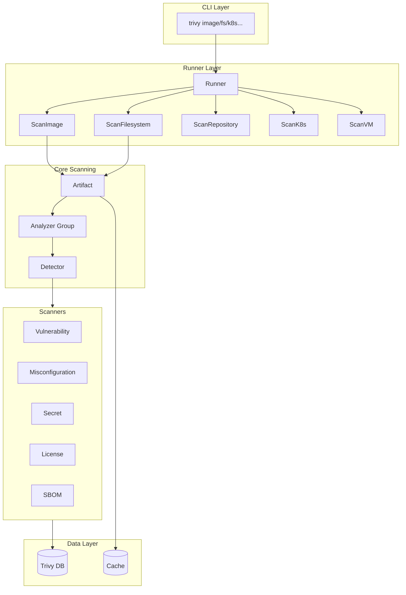
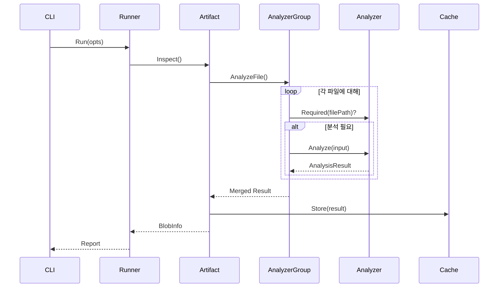
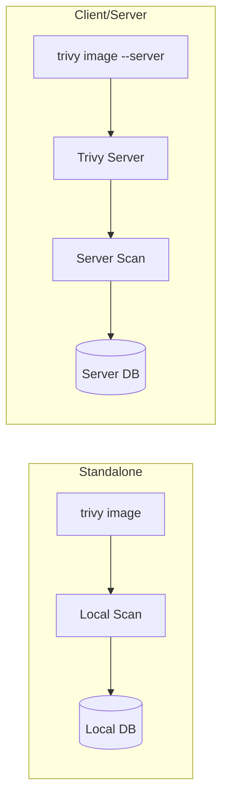

> 이 글은 [aquasecurity/trivy](https://github.com/aquasecurity/trivy) GitHub 레포지토리를 직접 분석하여 작성되었습니다.

## 들어가며

**Trivy**는 컨테이너 이미지, 파일시스템, Git 레포지토리, Kubernetes 클러스터 등을 스캔하여 보안 취약점, 설정 오류, 시크릿 노출 등을 탐지하는 오픈소스 보안 스캐너입니다.

단순한 CLI 도구로 보이지만, 내부는 **플러그인 기반 아키텍처**로 설계되어 있어 새로운 스캐너나 분석기를 쉽게 추가할 수 있습니다. 오늘은 이 구조를 뜯어보겠습니다.

---

## 1. 전체 아키텍처 개요



Trivy의 핵심 흐름은 다음과 같습니다:

1. **CLI**가 Target(image, fs, k8s 등)과 Scanner(vuln, misconfig 등)를 지정
2. **Runner**가 Target 타입에 맞는 스캔 함수 호출
3. **Analyzer**가 파일을 분석하여 패키지/설정 정보 추출
4. **Detector**가 취약점 DB와 대조하여 문제 탐지
5. **Reporter**가 결과를 JSON/Table/SARIF 등으로 출력

---

## 2. Target과 Scanner: 무엇을 어떻게 스캔할까?

### Target Types (스캔 대상)

```go
// pkg/commands/artifact/run.go
type TargetKind string

const (
    TargetContainerImage TargetKind = "image"
    TargetFilesystem     TargetKind = "fs"
    TargetRootfs         TargetKind = "rootfs"
    TargetRepository     TargetKind = "repo"
    TargetSBOM           TargetKind = "sbom"
    TargetVM             TargetKind = "vm"
    TargetK8s            TargetKind = "k8s"
)
```

| Target | 설명 | 예시 |
|--------|------|------|
| `image` | 컨테이너 이미지 | `trivy image python:3.9` |
| `fs` | 로컬 파일시스템 | `trivy fs ./myproject` |
| `repo` | Git 레포지토리 | `trivy repo https://github.com/...` |
| `k8s` | Kubernetes 클러스터 | `trivy k8s cluster` |
| `sbom` | SBOM 파일 | `trivy sbom ./bom.json` |
| `vm` | 가상머신 이미지 | `trivy vm ./disk.vmdk` |

### Scanner Types (스캐너)

```go
// pkg/types/scanner.go
const (
    VulnerabilityScanner  = "vuln"
    MisconfigScanner      = "misconfig"
    SecretScanner         = "secret"
    LicenseScanner        = "license"
    SBOMScanner           = "sbom"
)
```

이 설계의 핵심은 **Target과 Scanner의 조합**입니다. 예를 들어:

```bash
# 이미지에서 취약점 + 시크릿 스캔
trivy image --scanners vuln,secret nginx:latest

# 파일시스템에서 취약점 + IaC 설정오류 스캔
trivy fs --scanners vuln,misconfig ./terraform
```

---

## 3. Analyzer 패턴: 플러그인 아키텍처의 핵심

Trivy의 가장 인상적인 설계는 **Analyzer 플러그인 시스템**입니다.

### 3.1 Analyzer 인터페이스

```go
// pkg/fanal/analyzer/analyzer.go
type analyzer interface {
    Type() Type
    Version() int
    Analyze(ctx context.Context, input AnalysisInput) (*AnalysisResult, error)
    Required(filePath string, info os.FileInfo) bool
}
```

모든 분석기는 이 인터페이스를 구현합니다:

- **Type()**: 분석기 식별자 (예: `TypeDebian`, `TypeNpm`, `TypeDockerfile`)
- **Version()**: 캐시 무효화용 버전
- **Required()**: 이 파일을 분석해야 하는지 판단
- **Analyze()**: 실제 분석 로직

### 3.2 분석기 등록

```go
// 각 분석기 파일에서
func init() {
    analyzer.RegisterAnalyzer(&debianAnalyzer{})
}
```

Go의 `init()` 함수를 활용한 **자동 등록 패턴**입니다. import만 하면 분석기가 자동으로 등록됩니다.

### 3.3 분석기 타입들

```go
// pkg/fanal/analyzer/const.go
const (
    // OS 패키지 분석기
    TypeAlpine  Type = "alpine"
    TypeDebian  Type = "debian"
    TypeRPM     Type = "rpm"
    
    // 언어별 패키지 분석기
    TypeNpm     Type = "npm"
    TypePip     Type = "pip"
    TypeGoMod   Type = "gomod"
    TypeCargo   Type = "cargo"
    
    // 설정 파일 분석기
    TypeDockerfile    Type = "dockerfile"
    TypeKubernetes    Type = "kubernetes"
    TypeTerraform     Type = "terraform"
    TypeCloudFormation Type = "cloudformation"
    
    // 기타
    TypeSecret  Type = "secret"
    TypeLicense Type = "license-file"
)
```

현재 **50개 이상의 분석기**가 내장되어 있습니다!

---

## 4. 분석 흐름 상세



### 4.1 파일별 분석 결정

```go
// 예: Debian 분석기
func (a *debianAnalyzer) Required(filePath string, _ os.FileInfo) bool {
    // /var/lib/dpkg/status 파일만 분석
    return filePath == "var/lib/dpkg/status"
}
```

각 분석기가 `Required()` 메서드로 자기가 처리할 파일만 선택합니다. 이로써 **불필요한 분석을 피하고 성능을 최적화**합니다.

### 4.2 결과 병합

```go
// pkg/fanal/analyzer/analyzer.go
func (r *AnalysisResult) Merge(newResult *AnalysisResult) {
    r.m.Lock()
    defer r.m.Unlock()
    
    r.OS.Merge(newResult.OS)
    r.PackageInfos = append(r.PackageInfos, newResult.PackageInfos...)
    r.Applications = append(r.Applications, newResult.Applications...)
    r.Secrets = append(r.Secrets, newResult.Secrets...)
    // ...
}
```

여러 분석기가 **병렬로 실행**되고, 결과는 thread-safe하게 병합됩니다.

---

## 5. Standalone vs Client/Server 모드

Trivy는 두 가지 모드로 동작합니다:



```go
// pkg/commands/artifact/run.go
func (r *runner) ScanImage(ctx context.Context, opts flag.Options) (types.Report, error) {
    var s InitializeScanService
    switch {
    case opts.Input != "" && opts.ServerAddr == "":
        // Standalone: 로컬 이미지 타르볼
        s = archiveStandaloneScanService
    case opts.Input == "" && opts.ServerAddr != "":
        // Client/Server: 원격 서버에 스캔 요청
        s = imageRemoteScanService
    // ...
    }
    return r.scanArtifact(ctx, opts, s)
}
```

**Server 모드의 장점:**
- 취약점 DB를 서버에서만 관리 (클라이언트 경량화)
- 여러 CI/CD 파이프라인에서 공유
- DB 업데이트 중앙 관리

---

## 6. 디렉토리 구조

```
trivy/
├── cmd/trivy/           # CLI 엔트리포인트
├── pkg/
│   ├── commands/        # 서브커맨드 (image, fs, k8s 등)
│   │   └── artifact/    # 메인 스캔 로직
│   ├── fanal/           # File ANALyzer (핵심!)
│   │   ├── analyzer/    # 각종 분석기
│   │   ├── artifact/    # 아티팩트 추상화
│   │   └── types/       # 타입 정의
│   ├── detector/        # 취약점 탐지
│   ├── db/              # 취약점 DB 관리
│   ├── iac/             # IaC 스캔 (Terraform, K8s 등)
│   ├── k8s/             # Kubernetes 스캔
│   ├── result/          # 결과 필터링
│   └── report/          # 출력 포맷터
└── docs/                # 문서
```

### 핵심 패키지 역할

| 패키지 | 역할 |
|--------|------|
| `pkg/fanal` | **F**ile **ANAL**yzer - 파일 분석의 핵심 |
| `pkg/detector` | CVE 매칭, 취약점 탐지 |
| `pkg/iac` | Terraform, K8s YAML 등 IaC 스캔 |
| `pkg/db` | trivy-db 다운로드/관리 |
| `pkg/cache` | 분석 결과 캐싱 |

---

## 7. 확장 포인트

Trivy를 커스터마이징하려면:

### 7.1 새 분석기 추가

```go
// pkg/fanal/analyzer/language/myanalyzer/myanalyzer.go
type myAnalyzer struct{}

func init() {
    analyzer.RegisterAnalyzer(&myAnalyzer{})
}

func (a *myAnalyzer) Type() analyzer.Type {
    return "my-analyzer"
}

func (a *myAnalyzer) Required(filePath string, _ os.FileInfo) bool {
    return strings.HasSuffix(filePath, "my-lockfile.lock")
}

func (a *myAnalyzer) Analyze(ctx context.Context, input analyzer.AnalysisInput) (*analyzer.AnalysisResult, error) {
    // 분석 로직
}
```

### 7.2 WASM 모듈

Trivy는 WASM 모듈을 통한 확장도 지원합니다:

```go
// pkg/module/module.go
m, err := module.NewManager(ctx, module.Options{
    Dir:            cliOptions.ModuleDir,
    EnabledModules: cliOptions.EnabledModules,
})
m.Register()
```

---

## 8. 핵심 설계 원칙

Trivy 코드베이스에서 배울 수 있는 설계 원칙:

### 8.1 플러그인 아키텍처
```
RegisterAnalyzer() + init() 패턴으로 확장성 확보
→ 새 언어/패키지 매니저 지원 시 기존 코드 수정 불필요
```

### 8.2 관심사 분리
```
Target (무엇을) × Scanner (어떻게) × Reporter (어떤 형식으로)
→ 각 축이 독립적으로 확장 가능
```

### 8.3 캐싱 전략
```
분석기 버전 + 파일 해시 기반 캐싱
→ 동일 이미지 재스캔 시 즉시 결과 반환
```

### 8.4 병렬 처리
```go
eg, ctx := errgroup.WithContext(ctx)
limit := semaphore.NewWeighted(int64(parallel))

for _, a := range analyzers {
    eg.Go(func() error {
        // 분석 실행
    })
}
```

---

## 마무리

Trivy는 단순한 보안 스캐너를 넘어, **확장 가능한 분석 프레임워크**로 설계되었습니다. 핵심 설계 포인트를 정리하면:

1. **Analyzer 플러그인 패턴**: `init()` + `RegisterAnalyzer()`로 자동 등록
2. **Target × Scanner 조합**: 유연한 스캔 조합 가능
3. **Standalone/Server 모드**: 다양한 배포 시나리오 지원
4. **병렬 분석 + 캐싱**: 대규모 스캔 성능 최적화

DevOps/보안 도구를 설계한다면, Trivy의 플러그인 아키텍처를 참고해보세요!

---

## 참고 자료

- [Trivy GitHub](https://github.com/aquasecurity/trivy)
- [Trivy 공식 문서](https://trivy.dev/docs/)
- [Trivy Architecture Overview](https://trivy.dev/docs/latest/community/contribute/architecture/)
