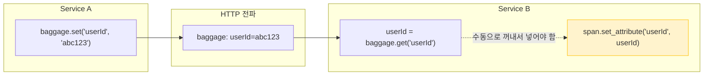
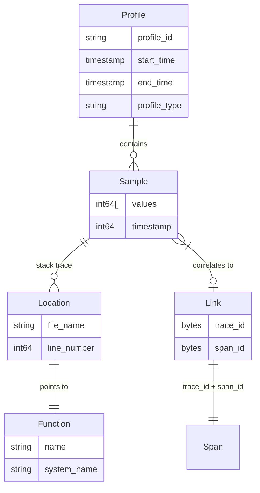
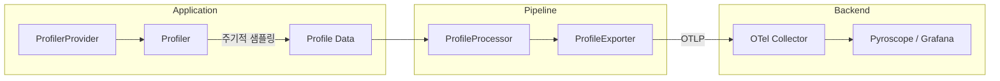
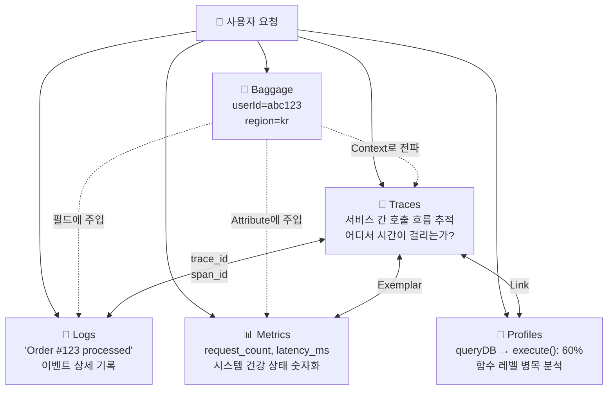

> 이 글은 [OpenTelemetry Baggage 공식 문서](https://opentelemetry.io/docs/concepts/signals/baggage/)와 [Profiles 공식 문서](https://opentelemetry.io/docs/concepts/signals/profiles/)를 기반으로 작성되었습니다.

[#5](/posts/otel-logs-deep-dive/)까지 Traces, Metrics, Logs를 모두 해부했다. 하지만 OTel에는 두 가지 신호가 더 있다: **Baggage**와 **Profiles**다.

Baggage는 관측 데이터를 생성하는 게 아니라 **맥락을 전파**하는 메커니즘이고, Profiles는 2024년에 추가된 **가장 최신 신호**다. 둘 다 독립 포스트로 다루기엔 가벼우니, 하나로 묶어 OTel 신호 시리즈를 완성한다.

---

## Part 1: Baggage — 서비스 경계를 넘는 사용자 정의 데이터

### Baggage는 왜 필요한가?

[#2](/posts/otel-context-propagation/)에서 Context Propagation을 다뤘다. `traceparent` 헤더로 trace_id와 span_id가 서비스 간에 전파되는 걸 봤다.

하지만 **trace_id 외에 다른 정보도 전파하고 싶다면?** 예를 들어:

- API Gateway에서 인증한 **사용자 ID**를 하위 모든 서비스에 전달하고 싶다
- 프론트엔드에서 시작된 요청의 **A/B 테스트 그룹**을 백엔드까지 알리고 싶다
- 요청이 발생한 **리전 정보**를 전체 호출 체인에 부여하고 싶다

이때 쓰는 것이 **Baggage**다.

---

### W3C Baggage 헤더

[#2](/posts/otel-context-propagation/)에서 본 `traceparent`처럼, Baggage도 **W3C 표준 HTTP 헤더**로 전파된다:

```http
GET /api/orders HTTP/1.1
Host: order-service:8080
traceparent: 00-4bf92f3577b34da6a3ce929d0e0e4736-00f067aa0ba902b7-01
baggage: userId=abc123,region=ap-northeast-2;source=frontend,abGroup=experiment-42
```

형식은 단순하다:

```
baggage: key1=value1,key2=value2;property1=p1,key3=value3
```

| 구분 | 설명 |
|------|------|
| `,` | 항목 간 구분자 |
| `=` | key와 value 구분자 |
| `;` | value 뒤에 붙는 메타데이터(property) 구분자 |

위 예시를 파싱하면:

| Key | Value | Properties |
|-----|-------|------------|
| `userId` | `abc123` | — |
| `region` | `ap-northeast-2` | `source=frontend` |
| `abGroup` | `experiment-42` | — |

---

### Baggage API: 세 가지 동작

Baggage API는 극도로 단순하다:

```python
from opentelemetry import baggage, context

# Set — Baggage에 key-value 추가
ctx = baggage.set_baggage("userId", "abc123")
token = context.attach(ctx)

# Get — 현재 Context에서 값 읽기
user_id = baggage.get_baggage("userId")
# → "abc123"

# Remove — 특정 키 제거
ctx = baggage.remove_baggage("userId")

# GetAll — 모든 항목 조회
all_baggage = baggage.get_all()
# → {"userId": "abc123", "region": "ap-northeast-2"}
```

핵심: Baggage는 **Context에 바인딩**된다. `set_baggage()`는 새 Context를 반환하고, 그걸 attach해야 현재 실행 흐름에 적용된다.

---

### Baggage ≠ Span Attribute

가장 흔한 오해를 짚자. **Baggage에 값을 넣는다고 자동으로 Span Attribute에 추가되지 않는다.**



이건 의도적인 설계다. Baggage는 **모든 하위 서비스에 전파**되기 때문에, 자동으로 텔레메트리에 포함시키면 의도하지 않은 데이터 노출이 발생할 수 있다.

---

### 활용 패턴: Baggage + SpanProcessor

매번 수동으로 꺼내는 건 번거롭다. 실무에서는 **SpanProcessor를 커스텀**해서 Baggage 값을 자동으로 Span Attribute에 주입한다:

```python
from opentelemetry.sdk.trace import SpanProcessor
from opentelemetry import baggage

class BaggageSpanProcessor(SpanProcessor):
    """Baggage의 특정 키를 모든 Span에 자동 주입"""

    def __init__(self, keys_to_copy: list[str]):
        self.keys_to_copy = keys_to_copy

    def on_start(self, span, parent_context):
        for key in self.keys_to_copy:
            value = baggage.get_baggage(key, context=parent_context)
            if value is not None:
                span.set_attribute(f"app.{key}", value)
```

이렇게 하면 `userId`, `region`, `abGroup` 같은 Baggage 값이 모든 Span에 자동으로 `app.userId`, `app.region` 등의 Attribute로 붙는다.

---

### 보안 주의사항

Baggage는 **평문 HTTP 헤더**로 전파된다. 절대 넣으면 안 되는 것들:

- 비밀번호, API 키, 인증 토큰
- 주민등록번호, 카드번호 등 PII
- 내부 시스템 경로, DB 연결 문자열

W3C 스펙의 크기 제한도 기억하자:

| 제한 | 값 |
|------|-----|
| 전체 `baggage` 헤더 | 최대 **8,192 바이트** |
| 개별 항목(key=value) | 최대 **4,096 바이트** |
| 항목 수 | 최대 **180개** |

Baggage는 "누가 이 요청을 보냈는지", "어떤 실험 그룹인지" 같은 **비민감 맥락 데이터**에만 써야 한다.

---

## Part 2: Profiles — 코드 레벨에서 "왜 느린지"를 말한다

### 프로파일링이란?

Traces는 "서비스 A → B → C에서 어디가 느린지"를 알려준다. 하지만 "서비스 B의 **어떤 함수**가 느린지"는 알려주지 않는다.

**Profiling**은 프로그램 실행 중 **주기적으로 콜 스택을 샘플링**해서, 어떤 함수가 CPU 시간/메모리를 얼마나 소비하는지 파악하는 기법이다.

```
[10ms 간격 샘플링]

샘플 1: main() → handleRequest() → queryDB() → marshal()
샘플 2: main() → handleRequest() → queryDB() → execute()
샘플 3: main() → handleRequest() → queryDB() → execute()
샘플 4: main() → handleRequest() → marshal()
샘플 5: main() → handleRequest() → queryDB() → execute()

→ execute()가 60%, marshal()이 40% 차지
→ "DB 쿼리 실행이 가장 큰 병목"
```

### OTel 이전의 프로파일링 도구

Go의 `pprof`, Java의 `async-profiler`, Linux의 `perf` 등 언어별/OS별 도구가 있었지만:

- 각각 **다른 포맷**을 사용
- Trace/Metrics/Logs와 **연결이 안 됨**
- 일회성 스냅샷 위주, **연속 프로파일링(Continuous Profiling)** 지원 미흡

OTel Profiles는 이 문제를 해결한다.

---

### OTel Profiles 데이터 모델: pprof-extended

OTel은 Google의 [pprof](https://github.com/google/pprof) 포맷을 확장한 **pprof-extended**를 채택했다. 완전한 호환보다는 **변환 가능성(convertibility)**을 목표로 한다.

핵심 구성 요소:



| 구성 요소 | 역할 |
|-----------|------|
| **Profile** | 일정 시간 동안 수집된 샘플의 모음. CPU/메모리 등 프로파일 유형 포함 |
| **Sample** | 특정 시점의 콜 스택 스냅샷 + 측정값(CPU 시간, 할당 바이트 등) |
| **Location** | 코드 내 특정 지점 — 파일명, 라인 넘버 |
| **Function** | 함수명, 시스템 함수명(mangled name) |
| **Link** | trace_id와 span_id로 **특정 Span과 연결** |

---

### pprof 대비 개선점

기존 pprof과 비교해서 OTel pprof-extended가 추가한 것들:

| 기존 pprof | OTel pprof-extended |
|------------|---------------------|
| 샘플마다 독립적인 콜 스택 | 샘플 간 **콜 스택 공유** (메모리 효율) |
| 라벨로 메타데이터 부착 | OTel **Attributes** 체계 사용 |
| Trace 연결 불가 | **trace_id, span_id로 Span과 직접 연결** |
| 타임스탬프 미흡 | **퍼스트클래스 타임스탬프** 지원 |
| 단일 메타데이터 부착점 | Sample, Location, Mapping **각각에 메타데이터 부착 가능** |

---

### Profiles 파이프라인

다른 신호와 동일한 Provider → Processor → Exporter 패턴을 따른다:



**OTLP v1.3.0**부터 Profiles가 프로토콜에 포함됐고, OTel Collector **v0.112.0**부터 프로파일 데이터의 수신/처리/내보내기가 가능하다.

> ⚠️ **주의**: Profiles는 아직 **unstable(실험적)** 상태다. API와 데이터 모델이 변경될 수 있다.

---

### Profiles의 킬러 피처: 다른 신호와의 연결

Profiles가 기존 프로파일링 도구와 결정적으로 다른 점은 **Trace와의 상관분석**이다:

```
Trace: POST /api/orders (총 450ms)
├── Span: validateInput (20ms)
├── Span: queryDB (350ms)  ← 여기가 느리다
│     └── Profile Link: trace_id=abc, span_id=def
│         → queryDB() 내부에서:
│           execute():  210ms (60%)
│           marshal():  105ms (30%)
│           connect():   35ms (10%)
└── Span: sendResponse (80ms)
```

Trace로 "queryDB Span이 350ms"라는 걸 알고, Profile로 "그 안에서 execute()가 60%를 차지"하는 걸 안다. **서비스 레벨 → 함수 레벨**로 드릴다운이 가능해지는 것이다.

---

## 다섯 신호의 완전한 그림

이제 OTel의 모든 신호를 봤다. 전체 그림을 그려보자:



| 신호 | 질문 | 언제 보나 |
|------|------|-----------|
| **Baggage** | 이 요청은 **누구의/어떤** 요청인가? | 맥락 전파 시 |
| **Traces** | 요청이 서비스 간에 **어디서** 느린가? | 지연 분석, 의존성 추적 |
| **Metrics** | 시스템이 **얼마나** 건강한가? | 대시보드, 알림 |
| **Logs** | 특정 시점에 **무슨 일**이 일어났는가? | 디버깅, 감사 |
| **Profiles** | 코드의 **어떤 함수**가 병목인가? | 성능 최적화 |

이것으로 OTel Concepts의 Signals 시리즈를 마친다. 다음은 실제 구현 — SDK 설정, Collector 구성, 백엔드 연동을 다룰 차례다.

---

## 시리즈 네비게이션

| # | 주제 | 링크 |
|---|------|------|
| 1 | Observability란 무엇인가 | [보기](/posts/otel-observability-primer/) |
| 2 | Context Propagation | [보기](/posts/otel-context-propagation/) |
| 3 | Traces — Span 해부 | [보기](/posts/otel-traces-deep-dive/) |
| 4 | Metrics — 숫자로 말한다 | [보기](/posts/otel-metrics-deep-dive/) |
| 5 | Logs — 연결한다 | [보기](/posts/otel-logs-deep-dive/) |
| **6** | **Baggage & Profiles** | **현재 글** |
