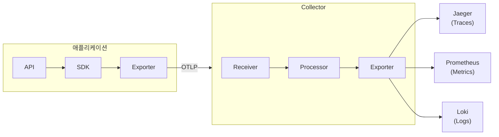
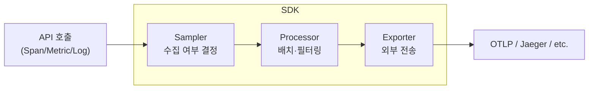
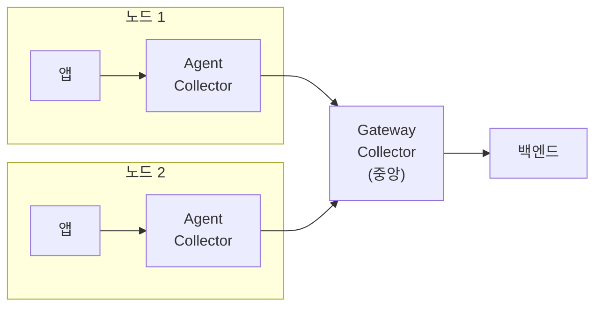

> 이 글은 [OpenTelemetry Components 공식 문서](https://opentelemetry.io/docs/concepts/components/)를 기반으로 작성되었습니다.

[#7](/posts/otel-instrumentation/)에서 텔레메트리가 어떻게 만들어지는지 봤다. 이번에는 **만들어진 텔레메트리가 어떤 소프트웨어 조각들을 거쳐 백엔드까지 도달하는지** — OTel의 전체 아키텍처를 그려본다.

---

## 전체 그림부터



네 가지 핵심 컴포넌트: **API**, **SDK**, **OTLP**, **Collector**. 하나씩 뜯어보자.

---

## 1. API — 텔레메트리 기록 인터페이스

[#7](/posts/otel-instrumentation/)에서 다뤘던 것. 앱 코드와 라이브러리가 텔레메트리를 **기록**하는 데 쓰는 인터페이스다.

- `TracerProvider` → `Tracer` → Span 생성
- `MeterProvider` → `Meter` → Metric 기록
- `LoggerProvider` → `Logger` → Log 전송

API의 핵심 특성: **SDK 없이도 동작한다.** SDK가 없으면 모든 호출이 no-op이 되어 아무 일도 안 일어난다. 이 덕분에 라이브러리는 API에만 의존하면서 안전하게 계측 코드를 넣을 수 있다.

---

## 2. SDK — 처리와 내보내기의 구현체

API가 "무엇을 기록할지"를 정의한다면, SDK는 **"기록된 것을 어떻게 처리하고 어디로 보낼지"**를 구현한다. 각 언어(Java, Python, Go, .NET, Node.js 등)마다 별도 SDK가 있다.

SDK 내부의 세 가지 핵심 파트:



| 파트 | 역할 | 예시 |
|------|------|------|
| **Sampler** | 어떤 Trace를 수집할지 결정 | `TraceIdRatioBased(0.1)` → 10%만 수집 |
| **Processor** | 데이터를 배치로 모으거나 가공 | `BatchSpanProcessor` → 일정량 모아서 한번에 전송 |
| **Exporter** | 데이터를 특정 포맷으로 특정 대상에 전송 | `OTLPSpanExporter` → Collector로 전송 |

SDK 설정은 **앱의 진입점(main)**에서 한 번만 하면 된다:

```python
from opentelemetry.sdk.trace import TracerProvider
from opentelemetry.sdk.trace.export import BatchSpanProcessor
from opentelemetry.exporter.otlp.proto.grpc.trace_exporter import OTLPSpanExporter

provider = TracerProvider()
provider.add_span_processor(
    BatchSpanProcessor(OTLPSpanExporter(endpoint="http://collector:4317"))
)
trace.set_tracer_provider(provider)
```

---

## 3. OTLP — 표준 전송 프로토콜

**OpenTelemetry Protocol(OTLP)**은 OTel의 네이티브 와이어 프로토콜이다. Traces, Metrics, Logs, Profiles — 모든 신호를 **하나의 프로토콜**로 전송한다.

| 전송 방식 | 포트 | 특징 |
|-----------|------|------|
| **gRPC** | 4317 | 고성능, 스트리밍, 바이너리 직렬화 |
| **HTTP/protobuf** | 4318 | 방화벽 친화적, 디버깅 용이 |

OTLP가 존재하는 이유: **벤더 종속 제거**. 앱은 OTLP로만 내보내면 되고, 백엔드를 Jaeger에서 Grafana Tempo로, Datadog에서 New Relic으로 바꿔도 **앱 코드는 그대로**다.

```
앱 → OTLP → Collector → Jaeger     (오늘)
앱 → OTLP → Collector → Tempo      (내일, 앱 코드 변경 없음)
```

---

## 4. Collector — 텔레메트리의 라우터

Collector는 OTel에서 가장 강력한 인프라 컴포넌트다. **벤더 무관하게 텔레메트리를 수신·처리·내보내는 독립 프로세스**로, 앱과 백엔드 사이에서 중간 계층 역할을 한다.

### Receiver → Processor → Exporter

Collector 내부는 세 단계 파이프라인이다:

```yaml
receivers:          # 데이터를 "받는" 입구
  otlp:
    protocols:
      grpc:         # :4317
      http:         # :4318

processors:         # 데이터를 "가공"
  batch:            # 배치로 묶어서 전송 효율화
  attributes:       # Attribute 추가/삭제/변환
    actions:
      - key: environment
        value: production
        action: upsert

exporters:          # 데이터를 "내보내는" 출구
  otlp:
    endpoint: "tempo:4317"
  prometheus:
    endpoint: "0.0.0.0:8889"

service:
  pipelines:        # 시그널별 파이프라인 구성
    traces:
      receivers: [otlp]
      processors: [batch]
      exporters: [otlp]
    metrics:
      receivers: [otlp]
      processors: [batch, attributes]
      exporters: [prometheus]
```

시그널별로 **다른 파이프라인**을 구성할 수 있다. Traces는 Tempo로, Metrics는 Prometheus로, Logs는 Loki로 — 각각 다른 Processor와 Exporter를 태울 수 있다.

### 배포 패턴: Agent와 Gateway



| 패턴 | 배포 형태 | 역할 |
|------|-----------|------|
| **Agent** | 앱과 같은 노드 (DaemonSet / Sidecar) | 로컬 수집, 가벼운 전처리 |
| **Gateway** | 독립 서비스 (Deployment) | 중앙 집계, 배치 처리, 라우팅, 정책 적용 |

실무에서는 **Agent → Gateway 두 계층 구조**를 많이 쓴다. Agent가 각 노드에서 빠르게 수집하고, Gateway가 중앙에서 모아서 백엔드로 보내는 식이다.

### 왜 Collector를 쓰는가?

앱 SDK에서 직접 백엔드로 보내도 되는데, 왜 중간에 Collector를 두는가?

- **앱 부담 경감** — 배치 처리, 재시도, 큐잉을 Collector가 대신
- **백엔드 교체 용이** — 앱은 항상 Collector로만 보내면 되고, 백엔드 변경은 Collector 설정만 수정
- **데이터 가공** — PII 제거, Attribute 추가, 샘플링 등을 앱 코드 밖에서 처리
- **팬아웃** — 같은 데이터를 여러 백엔드에 동시 전송

---

## 5. 그 외 컴포넌트

### Kubernetes Operator

K8s 환경에서 Collector 배포와 워크로드 auto-instrumentation을 **CRD(Custom Resource Definition)**로 선언적으로 관리한다. Deployment/DaemonSet/Sidecar 모드를 YAML 한 장으로 전환할 수 있다.

### FaaS 지원

AWS Lambda 같은 서버리스 환경에서는 **pre-built Lambda Layer**를 붙여서 auto-instrumentation을 적용하거나, Collector를 Lambda Layer로 배포해서 텔레메트리를 수집한다.

---

## API → SDK → OTLP → Collector → 백엔드

이것이 OTel의 전체 데이터 흐름이다:

1. **API**로 텔레메트리를 기록한다 (코드 레벨)
2. **SDK**가 샘플링·배치·가공해서 내보낼 준비를 한다 (프로세스 내)
3. **OTLP**로 Collector에 전송한다 (네트워크)
4. **Collector**가 수신·가공·라우팅해서 백엔드로 보낸다 (인프라)

신호(Traces, Metrics, Logs)가 **무엇**이고 Instrumentation이 **어떻게** 만드는지를 앞선 글들에서 봤다면, Components는 **어디를 거쳐 어디로 흘러가는지**를 보여주는 것이다.

---

## 시리즈 네비게이션

| # | 주제 | 링크 |
|---|------|------|
| 1 | Observability란 무엇인가 | [보기](/posts/otel-observability-primer/) |
| 2 | Context Propagation | [보기](/posts/otel-context-propagation/) |
| 3 | Traces — Span 해부 | [보기](/posts/otel-traces-deep-dive/) |
| 4 | Metrics — 숫자로 말한다 | [보기](/posts/otel-metrics-deep-dive/) |
| 5 | Logs — 연결한다 | [보기](/posts/otel-logs-deep-dive/) |
| 6 | Baggage & Profiles | [보기](/posts/otel-baggage-and-profiles/) |
| 7 | Instrumentation | [보기](/posts/otel-instrumentation/) |
| **8** | **Components** | **현재 글** |
