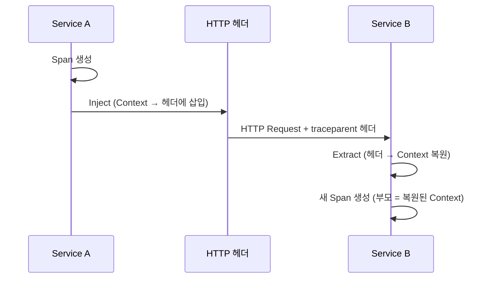
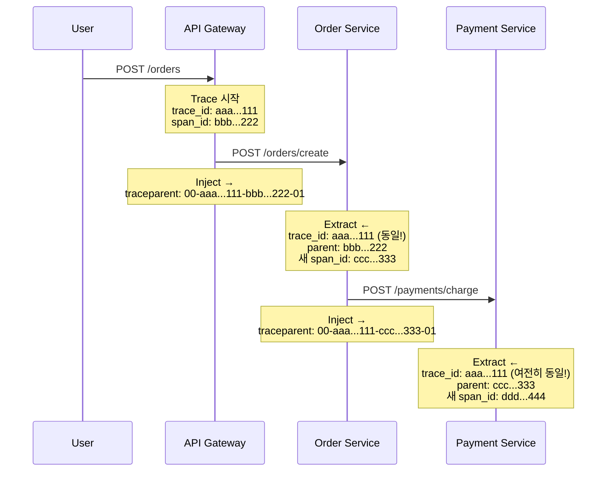
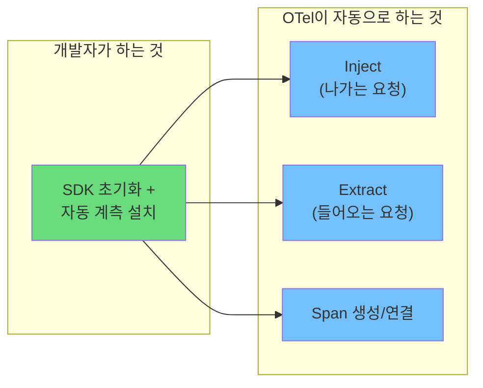

> 이 글은 [OpenTelemetry Context Propagation 공식 문서](https://opentelemetry.io/docs/concepts/context-propagation/)를 기반으로 작성되었습니다.

[이전 글](/posts/otel-observability-primer/)에서 Trace는 여러 Span으로 구성된다고 했다. 그런데 한 가지 의문이 남는다.

> Service A에서 만든 Span과 Service B에서 만든 Span은 **별도의 프로세스**다.
> 다른 머신, 다른 언어, 다른 런타임일 수도 있다.
> 이것들이 어떻게 **하나의 Trace**로 엮이는가?

답은 **Context Propagation**이다.

---

## Context Propagation이란?

두 단어를 분리해서 보자.

| 개념 | 역할 |
|------|------|
| **Context** | "지금 나는 어떤 Trace의 어떤 Span 안에 있다"는 정보 |
| **Propagation** | 이 Context를 서비스 경계를 넘어 전달하는 메커니즘 |

Context Propagation은 분산 추적의 **접착제**다. 이게 없으면 각 서비스가 독립적으로 Span을 만들 뿐, 하나의 요청 흐름으로 연결되지 않는다.

---

## Context: 현재 실행 위치

Context는 현재 실행 중인 Trace/Span 정보를 담은 객체다.

```python
# Context가 담고 있는 핵심 정보 (개념적)
context = {
    "trace_id": "80e1afed08e019fc1110464cfa66635c",
    "span_id": "7a085853722dc6d2",
    "trace_flags": "01",  # 샘플링 여부
}
```

프로세스 내에서 Context는 **암묵적으로 전파**된다. 같은 프로세스 안에서는 현재 어떤 Span이 활성화되어 있는지를 자동으로 추적한다.

```python
from opentelemetry import trace

tracer = trace.get_tracer(__name__)

with tracer.start_as_current_span("parent"):
    # 여기서의 Context: parent span

    with tracer.start_as_current_span("child"):
        # 여기서의 Context: child span (parent를 자동으로 참조)
        do_work()
```

문제는 **프로세스 경계를 넘을 때**다. HTTP 호출, gRPC 호출, 메시지 큐 발행 — 이런 경우 Context가 자동으로 따라가지 않는다. 명시적으로 **실어 보내야** 한다.

---

## Propagation: Inject와 Extract

Propagation은 두 가지 동작으로 이루어진다.



### Inject — 나가는 요청에 Context를 싣는다

Service A가 Service B를 HTTP로 호출할 때:

```python
# 개념적 코드 (실제로는 자동 계측이 처리)
import requests

headers = {}
# Propagator가 현재 Context를 헤더에 삽입
propagator.inject(headers)
# headers = {"traceparent": "00-80e1af...-7a0858...-01"}

response = requests.get("http://service-b/api", headers=headers)
```

### Extract — 들어오는 요청에서 Context를 꺼낸다

Service B가 요청을 받을 때:

```python
# 개념적 코드 (실제로는 자동 계측이 처리)
from flask import request

# Propagator가 헤더에서 Context를 복원
context = propagator.extract(request.headers)
# context에는 Service A의 trace_id, span_id가 들어있음

# 복원된 Context를 부모로 새 Span 생성
with tracer.start_as_current_span("handle-request", context=context):
    process_request()
```

이렇게 하면 Service B의 Span은 Service A의 Span을 **부모로 참조**하게 된다. 두 서비스의 Span이 하나의 Trace로 엮이는 순간이다.

---

## W3C Traceparent: 전달의 표준 형식

Context가 "어떤 형식으로" 전달되는지도 중요하다. OTel은 기본적으로 **W3C Trace Context** 표준을 사용한다. 핵심은 `traceparent` HTTP 헤더다.

### 헤더 구조

```
traceparent: 00-80e1afed08e019fc1110464cfa66635c-7a085853722dc6d2-01
```

이걸 분해하면:

```
00-80e1afed08e019fc1110464cfa66635c-7a085853722dc6d2-01
──  ────────────────────────────────  ────────────────  ──
│              │                           │            │
Version    Trace ID (32자 hex)     Parent Span ID    Trace Flags
(항상 00)  전체 Trace 식별자       (16자 hex)         (01 = 샘플링됨)
                                    호출자의 Span ID
```

| 필드 | 길이 | 설명 |
|------|------|------|
| **Version** | 2자 | 형식 버전. 현재 항상 `00` |
| **Trace ID** | 32자 | 전체 Trace를 고유하게 식별. 모든 서비스가 동일한 값을 공유 |
| **Parent Span ID** | 16자 | 직전 호출자의 Span ID. "누가 나를 호출했는가" |
| **Trace Flags** | 2자 | `01`이면 샘플링됨, `00`이면 아님 |

### 실제 흐름 예시

사용자가 주문을 넣는 시나리오를 따라가 보자.



핵심을 보자:

- **Trace ID는 변하지 않는다** — 모든 서비스가 `aaa...111`을 공유한다
- **Parent Span ID는 매번 바뀐다** — 직전 호출자의 Span ID가 들어간다
- **각 서비스는 새 Span ID를 생성한다** — 그리고 다음 호출에서 Parent가 된다

이 체인 덕분에 3개 서비스에 흩어진 Span들이 하나의 Trace 트리로 재구성된다.

---

## tracestate: 벤더별 확장

`traceparent`와 함께 `tracestate` 헤더도 전파된다.

```
tracestate: rojo=00f067aa0ba902b7,congo=t61rcWkgMzE
```

이건 **벤더별 추가 정보**를 담는 공간이다. 예를 들어 특정 모니터링 벤더가 자체적으로 필요한 메타데이터를 여기에 넣을 수 있다. W3C 표준의 일부이므로, 모든 Propagator가 이 헤더를 함께 전달해야 한다.

---

## Baggage: 비즈니스 데이터 전파

Context Propagation은 Trace 정보만 전달하는 게 아니다. **Baggage**를 통해 **임의의 key-value 데이터**도 서비스 간에 전파할 수 있다.

### 언제 쓰는가?

```python
from opentelemetry import baggage

# 최초 서비스에서 Baggage 설정
ctx = baggage.set_baggage("user.id", "42")
ctx = baggage.set_baggage("user.plan", "premium", context=ctx)
```

이 값들은 이후 **모든 하위 서비스**에서 꺼내 쓸 수 있다:

```python
# 하위 서비스에서 Baggage 조회
user_id = baggage.get_baggage("user.id")
# → "42" (최초 서비스에서 설정한 값)
```

### 활용 사례

| 사례 | Baggage Key | 값 |
|------|-------------|-----|
| 사용자 추적 | `user.id` | `42` |
| A/B 테스트 | `experiment.group` | `control` |
| 테넌트 구분 | `tenant.id` | `acme-corp` |
| 요금제별 분석 | `user.plan` | `premium` |

### 주의: Baggage는 신중하게

Baggage는 **모든 하위 서비스로 전파**된다. 무분별하게 넣으면:

- 네트워크 오버헤드 증가 (매 요청마다 헤더에 실림)
- 민감 정보 유출 위험 (하위 서비스가 모두 볼 수 있음)

최소한의 필수 정보만 넣는 게 원칙이다.

---

## 자동 계측이 해주는 것

여기까지 읽으면 "매번 inject/extract를 직접 코딩해야 하나?"라는 의문이 든다. 답은 **대부분 아니다**.

OTel의 Instrumentation 라이브러리가 자동으로 처리한다:

```python
# Flask + OpenTelemetry 자동 계측
# → 들어오는 요청에서 traceparent를 자동으로 Extract

# requests + OpenTelemetry 자동 계측
# → 나가는 요청에 traceparent를 자동으로 Inject

# 개발자가 할 일: 자동 계측 라이브러리만 설치하면 끝
pip install opentelemetry-instrumentation-flask
pip install opentelemetry-instrumentation-requests
```



수동으로 처리해야 하는 경우는 커스텀 전송 프로토콜이나 OTel이 아직 지원하지 않는 라이브러리를 쓸 때 정도다.

---

## 정리: Context Propagation의 전체 그림

```
┌──────────────────────────────────────────────────────────────┐
│                    Context Propagation                        │
│                                                              │
│  "분산 시스템에서 Trace가 끊기지 않는 이유"                    │
│                                                              │
│  Context = Trace ID + Span ID + Flags                        │
│    → "내가 지금 어떤 Trace의 어떤 Span에 있는지"              │
│                                                              │
│  Propagation = Inject + Extract                              │
│    → Inject: 나가는 요청 헤더에 Context 삽입                  │
│    → Extract: 들어오는 요청 헤더에서 Context 복원              │
│                                                              │
│  표준 형식 = W3C Traceparent                                  │
│    → 00-{trace_id}-{parent_span_id}-{flags}                  │
│                                                              │
│  + Baggage: 임의의 key-value를 함께 전파                      │
│                                                              │
└──────────────────────────────────────────────────────────────┘
```

다음 글에서는 **Span의 내부 구조**를 더 깊이 파고든다. Span이 실제로 어떤 데이터를 담고 있는지, Attributes/Events/Links는 각각 무엇인지, Status와 Kind는 어떻게 다른지 살펴본다.

---

## 참고 자료

- [OpenTelemetry Context Propagation](https://opentelemetry.io/docs/concepts/context-propagation/)
- [W3C Trace Context Specification](https://www.w3.org/TR/trace-context/)
- [OpenTelemetry Propagators API](https://opentelemetry.io/docs/specs/otel/context/api-propagators/)
- [OpenTelemetry Baggage](https://opentelemetry.io/docs/concepts/signals/baggage/)
