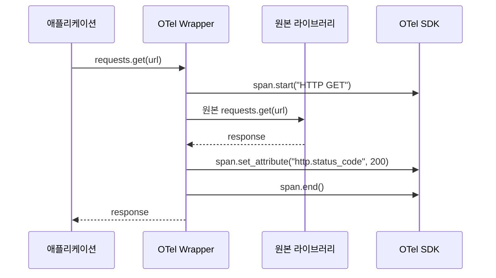
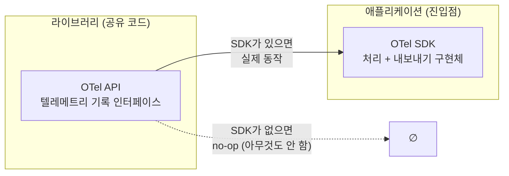
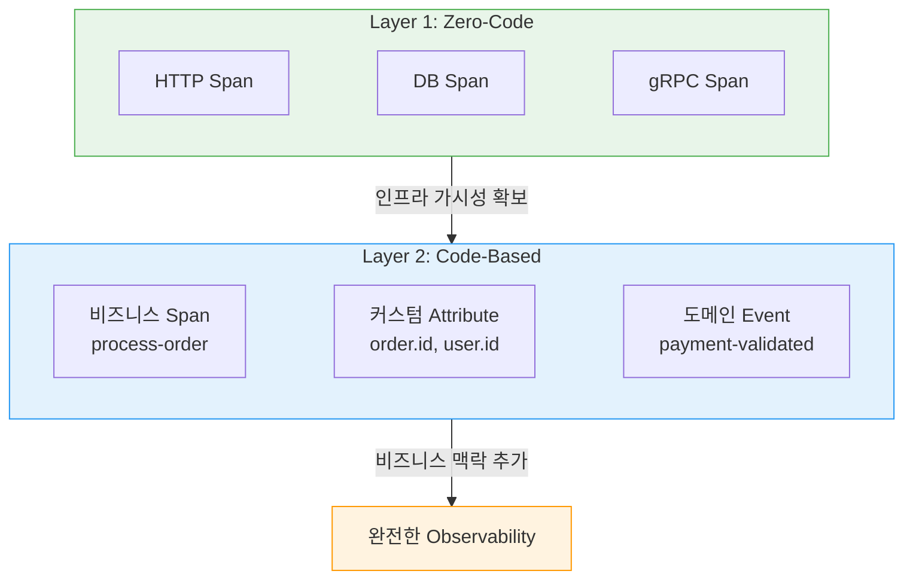

> 이 글은 [OpenTelemetry Zero-code Instrumentation](https://opentelemetry.io/docs/concepts/instrumentation/zero-code/)과 [Code-based Instrumentation](https://opentelemetry.io/docs/concepts/instrumentation/code-based/) 공식 문서를 기반으로 작성되었습니다.

[#6](/posts/otel-baggage-and-profiles/)까지 OTel의 다섯 가지 신호를 모두 다뤘다. 이제 **"그 신호들은 실제로 어떻게 만들어지는가"**에 답할 차례다.

OTel은 텔레메트리를 생성하는 두 가지 경로를 제공한다: **Zero-code**와 **Code-based**. 이름 그대로, 코드를 안 건드리느냐 건드리느냐의 차이다.

---

## Zero-Code Instrumentation: 코드 변경 없이 텔레메트리 얻기

### 원리

Zero-code(자동) instrumentation의 핵심 아이디어는 단순하다:

> **라이브러리의 함수 호출을 가로채서, 원래 동작 전후에 OTel API 호출을 끼워넣는다.**

HTTP 클라이언트의 `send()`, DB 드라이버의 `execute()` 같은 함수를 감싸서(wrap), 개발자가 작성한 코드는 그대로 두되 **실행 시점에 텔레메트리가 자동 생성**되게 하는 것이다.



앱 코드는 `requests.get()`을 호출했을 뿐인데, 사이에 끼어든 Wrapper가 Span을 만들고 Attribute를 채우고 닫는다.

### 언어별 "끼워넣기" 방식

이 "가로채기"를 구현하는 방식은 언어 런타임마다 다르다:

| 기법 | 대상 언어 | 원리 |
|------|-----------|------|
| **Bytecode Instrumentation** | Java, .NET | 클래스 로딩 시 **바이트코드를 수정**해서 계측 코드 주입. JVM Agent나 CLR Profiling API 사용 |
| **Monkey Patching** | Python, Node.js, Ruby | 런타임에 기존 함수/모듈을 **계측 버전으로 교체**. 동적 언어의 유연성 활용 |
| **eBPF** | Go, C/C++ (Linux) | **커널 레벨**에서 시스템 콜·네트워크를 모니터링. 바이너리 수정 없이 동작하지만 Linux 전용 |

방식은 달라도 결과는 같다: **앱 코드 변경 없이, 인프라 레벨 Span이 자동 생성**된다.

### 실행 예시 (Python)

```bash
# 1. OTel 배포판 + OTLP Exporter 설치
pip install opentelemetry-distro opentelemetry-exporter-otlp

# 2. 사용 중인 라이브러리를 감지해서 계측 패키지 자동 설치
opentelemetry-bootstrap -a install

# 3. 계측 에이전트로 앱 실행 — 코드 수정 없음
OTEL_SERVICE_NAME=order-service \
OTEL_EXPORTER_OTLP_ENDPOINT=http://collector:4318 \
opentelemetry-instrument python app.py
```

이것만으로 Flask/Django 라우트, requests/urllib3 HTTP 호출, psycopg2/pymongo DB 쿼리 등에서 Span이 자동으로 만들어진다.

### 자동 계측의 한계

Zero-code가 잡아주는 건 **라이브러리 경계의 I/O 동작**뿐이다:

```
✅ 자동으로 잡히는 것              ❌ 안 잡히는 것
─────────────────────            ─────────────────────
HTTP 요청/응답                    비즈니스 로직 흐름
DB 쿼리 실행                      도메인 Attribute (userId, orderId)
gRPC 호출                         조건부 분기 내 세부 동작
메시지 큐 produce/consume          커스텀 이벤트, 에러 분류
```

"DB 쿼리가 느리다"는 알 수 있지만, **"어떤 사용자의 어떤 주문 때문에 느린지"**는 알 수 없다. 여기서 Code-based가 필요해진다.

---

## Code-Based Instrumentation: 비즈니스 맥락을 직접 심기

### API와 SDK의 분리

Code-based instrumentation을 이해하려면 OTel의 핵심 설계 원칙부터 알아야 한다:



| | API | SDK |
|---|---|---|
| **역할** | 텔레메트리 **기록** 인터페이스 | 텔레메트리 **처리·내보내기** 구현체 |
| **누가 의존?** | 라이브러리 작성자 | 앱 운영자 |
| **무게** | 가벼움 | 무거움 (Exporter, Processor 포함) |

왜 이렇게 나눠놨을까? **라이브러리는 API만 의존하면 된다.** 그 라이브러리를 쓰는 앱이 SDK를 설정하면 텔레메트리가 수집되고, 안 하면 no-op으로 빠진다. 라이브러리 입장에서는 어느 쪽이든 안전하게 동작한다.

### 직접 계측하기

Code-based의 전형적인 흐름:

```python
from opentelemetry import trace

# Tracer 이름은 "계측 주체"를 식별한다
# — 라이브러리라면 라이브러리 이름, 서비스라면 서비스 이름
tracer = trace.get_tracer("order-service", "1.2.0")

def process_order(order_id: str, user_id: str):
    with tracer.start_as_current_span("process-order") as span:
        # 비즈니스 맥락을 Attribute로 — Zero-code로는 불가능한 부분
        span.set_attribute("order.id", order_id)
        span.set_attribute("user.id", user_id)

        validate_payment(order_id)

        span.add_event("payment-validated", {"amount": 150.0})

        ship_order(order_id)
```

Zero-code가 만든 HTTP/DB Span 위에, Code-based로 **비즈니스 의미가 담긴 Span과 Attribute**를 추가하는 것이다.

### Instrumentation Library: 중간 지대

직접 API를 호출하는 것과 완전 자동 사이에 **Instrumentation Library**라는 중간 지대가 있다:

```python
from opentelemetry.instrumentation.flask import FlaskInstrumentor

# 한 줄로 Flask의 모든 라우트에 Span 자동 생성
FlaskInstrumentor().instrument_app(app)
```

코드 수정이긴 하지만 **한 줄**이다. 이건 Zero-code 에이전트가 내부적으로 하는 것과 같은 동작을 명시적으로 호출하는 거다.

---

## 둘은 양자택일이 아니라 레이어다

실무에서는 Zero-code와 Code-based를 **조합**한다:



| 단계 | 접근 | 얻는 것 |
|------|------|---------|
| **1단계** | Zero-code로 시작 | 코드 변경 없이 인프라 레벨 Span 확보 |
| **2단계** | Code-based로 보강 | 비즈니스 Span, 도메인 Attribute, 커스텀 이벤트 추가 |

Zero-code로 **숲**을 보고, Code-based로 **나무**를 본다.

---

## 시리즈 네비게이션

| # | 주제 | 링크 |
|---|------|------|
| 1 | Observability란 무엇인가 | [보기](/posts/otel-observability-primer/) |
| 2 | Context Propagation | [보기](/posts/otel-context-propagation/) |
| 3 | Traces — Span 해부 | [보기](/posts/otel-traces-deep-dive/) |
| 4 | Metrics — 숫자로 말한다 | [보기](/posts/otel-metrics-deep-dive/) |
| 5 | Logs — 연결한다 | [보기](/posts/otel-logs-deep-dive/) |
| 6 | Baggage & Profiles | [보기](/posts/otel-baggage-and-profiles/) |
| **7** | **Instrumentation** | **현재 글** |
