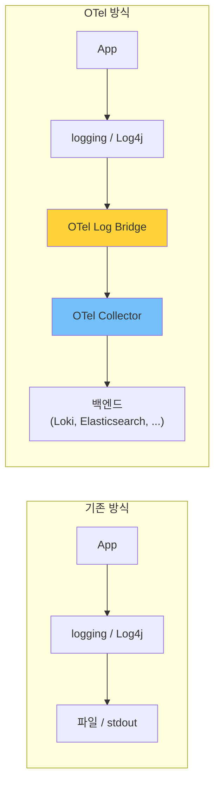
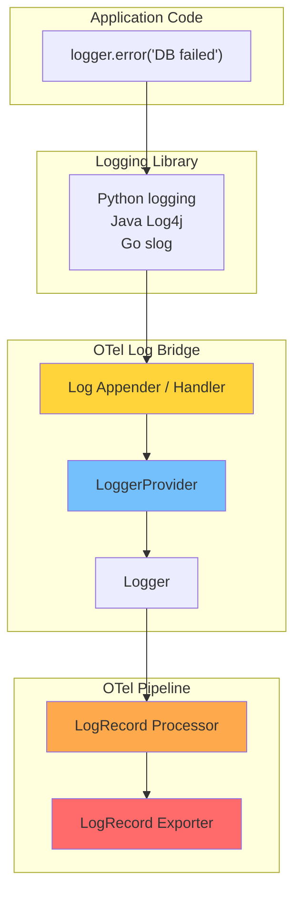
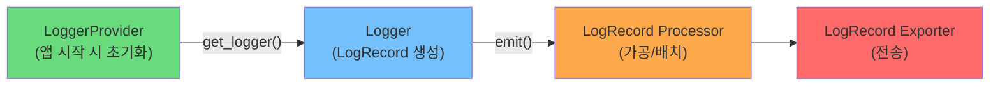
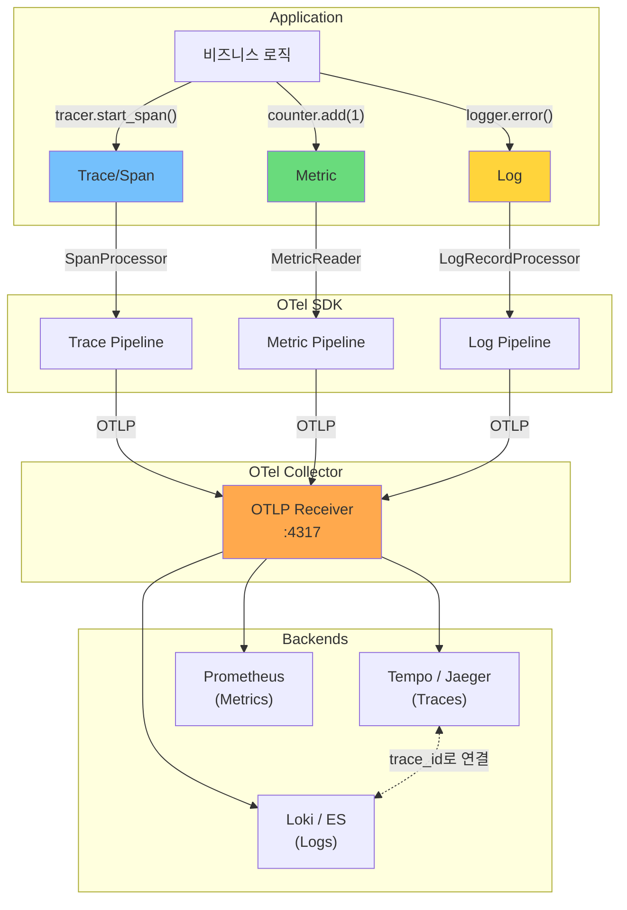

> 이 글은 [OpenTelemetry Logs 공식 문서](https://opentelemetry.io/docs/concepts/signals/logs/)를 기반으로 작성되었습니다.

[#3](/posts/otel-traces-deep-dive/)에서 Traces를, [#4](/posts/otel-metrics-deep-dive/)에서 Metrics를 해부했다. 이제 세 번째 신호인 **Logs**다.

Logs는 세 신호 중 가장 익숙하지만, OTel에서의 접근 방식은 **Traces, Metrics와 근본적으로 다르다**.

---

## OTel Logs의 독특한 철학: 대체가 아닌 연결

### Traces와 Metrics는 "새로 만든다"

```python
# Traces: OTel SDK로 직접 생성
from opentelemetry import trace
tracer = trace.get_tracer(__name__)
with tracer.start_as_current_span("my-operation"):
    ...

# Metrics: OTel SDK로 직접 생성
from opentelemetry import metrics
meter = metrics.get_meter(__name__)
counter = meter.create_counter("requests")
```

Traces와 Metrics는 OTel 이전에 **통일된 표준이 없었다**. 그래서 OTel이 새 API를 만들어 표준화한 것이다.

### Logs는 "이미 있는 것을 연결한다"

```python
# 기존 로깅: 이미 모든 언어에 성숙한 라이브러리가 있다
import logging
logger = logging.getLogger(__name__)
logger.error("Failed to connect to database")
```

Python의 `logging`, Java의 Log4j/SLF4J, Go의 `slog`, Node의 `winston/pino` — 수십 년간 발전한 로깅 생태계가 이미 존재한다.

OTel은 이걸 **대체하지 않는다**. 대신 **Log Bridge(Log Appender)**를 통해 기존 로깅 라이브러리를 OTel 파이프라인에 연결한다.



개발자가 할 일: **기존 로깅 코드는 그대로 두고**, OTel Log Bridge만 설치/설정하면 된다.

---

## LogRecord: OTel의 로그 데이터 모델

OTel은 로그가 어떤 구조를 가져야 하는지 **표준 데이터 모델**을 정의한다. 기존 로깅 라이브러리의 로그가 Bridge를 통과하면 이 모델로 변환된다.

```json
{
  "timestamp": "2026-03-11T09:15:23.000Z",
  "observed_timestamp": "2026-03-11T09:15:23.001Z",
  "severity_number": 17,
  "severity_text": "ERROR",
  "body": "Failed to connect to database: connection timeout after 30s",
  "attributes": {
    "db.system": "postgresql",
    "db.namespace": "users",
    "error.type": "ConnectionTimeoutError",
    "retry.count": 3
  },
  "resource": {
    "service.name": "order-service",
    "service.version": "1.2.0",
    "deployment.environment": "production"
  },
  "trace_id": "80e1afed08e019fc1110464cfa66635c",
  "span_id": "7a085853722dc6d2",
  "trace_flags": 1
}
```

### 필드 해부

| 필드 | 설명 |
|------|------|
| **timestamp** | 이벤트가 발생한 시각 |
| **observed_timestamp** | 로그가 수집된 시각 (네트워크 지연 등으로 다를 수 있음) |
| **severity_number** | 심각도 숫자 (1-24, TRACE부터 FATAL까지) |
| **severity_text** | 심각도 텍스트 ("ERROR", "WARN", ...) |
| **body** | 로그 메시지 본문 |
| **attributes** | 구조화된 메타데이터 (key-value) |
| **resource** | 이 로그를 생성한 서비스 정보 |
| **trace_id / span_id** | Trace 연결 고리 |

### Severity Levels

OTel은 24단계의 심각도를 정의한다. 기존 로깅 라이브러리의 레벨과 매핑된다.

| OTel Severity | 번호 범위 | Python logging | Java Log4j |
|--------------|-----------|----------------|------------|
| TRACE | 1-4 | DEBUG (세분화) | TRACE |
| DEBUG | 5-8 | DEBUG | DEBUG |
| INFO | 9-12 | INFO | INFO |
| WARN | 13-16 | WARNING | WARN |
| ERROR | 17-20 | ERROR | ERROR |
| FATAL | 21-24 | CRITICAL | FATAL |

---

## Trace Correlation: OTel Logs의 핵심 가치

OTel Logs의 진짜 가치는 여기에 있다. **로그에 Trace ID와 Span ID를 자동으로 삽입**해서, 로그와 트레이스를 연결한다.

### 로그만 있을 때 vs Trace와 연결했을 때

```
# 로그만 있을 때
[ERROR] Failed to connect to database: connection timeout
[ERROR] Failed to connect to database: connection timeout
[ERROR] Failed to connect to database: connection timeout

→ "DB 연결이 안 된다는 건 알겠는데..."
  - 어떤 요청에서 발생한 건가?
  - 어떤 사용자가 영향을 받았는가?
  - 이 에러 전후로 다른 서비스에서는 무슨 일이 있었는가?
  → 알 수 없다
```

```
# Trace와 연결했을 때
[ERROR] trace_id=80e1af... span_id=7a0858...
        Failed to connect to database: connection timeout

→ trace_id로 검색하면:
  - API Gateway → Order Service → [여기서 DB 연결 실패]
  - 사용자 user_id=42의 POST /api/orders 요청
  - Payment Service는 정상, DB 커넥션 풀이 고갈된 상태
  → 즉시 근본 원인 도달
```

### 자동 연결의 원리

활성 Span이 있는 상태에서 로그를 남기면, OTel SDK가 **자동으로** 현재 Context의 Trace ID와 Span ID를 LogRecord에 삽입한다.

```python
from opentelemetry import trace
import logging

logger = logging.getLogger(__name__)
tracer = trace.get_tracer(__name__)

with tracer.start_as_current_span("process-order"):
    # 이 블록 안에서 남기는 모든 로그에
    # 자동으로 trace_id, span_id가 삽입된다
    logger.info("Order processing started")     # ← trace_id 자동 포함
    logger.error("DB connection failed")         # ← trace_id 자동 포함
```

개발자가 `trace_id`를 직접 로그에 넣을 필요가 없다. Bridge가 알아서 처리한다.

---

## Log Bridge: 기존 로깅 ↔ OTel 연결

### 아키텍처



### Python 예시

```python
import logging
from opentelemetry import trace
from opentelemetry.sdk._logs import LoggerProvider
from opentelemetry.sdk._logs.export import (
    BatchLogRecordProcessor,
    ConsoleLogRecordExporter,
)
from opentelemetry._logs import set_logger_provider

# 1. LoggerProvider 초기화
logger_provider = LoggerProvider()
logger_provider.add_log_record_processor(
    BatchLogRecordProcessor(ConsoleLogRecordExporter())
)
set_logger_provider(logger_provider)

# 2. Python logging에 OTel Handler 연결
from opentelemetry.sdk._logs import LoggingHandler

handler = LoggingHandler(logger_provider=logger_provider)
logging.getLogger().addHandler(handler)

# 3. 기존 코드 그대로 사용 — OTel이 알아서 처리
logger = logging.getLogger(__name__)
logger.error("Something went wrong")
# → LogRecord에 trace_id, span_id, resource 등이 자동 첨부
```

핵심: **기존 `logger.error()` 코드를 바꿀 필요가 없다**. Handler만 추가하면 된다.

### Java 예시 (Log4j2)

```xml
<!-- log4j2.xml에 OTel Appender 추가 -->
<Configuration>
  <Appenders>
    <OpenTelemetry name="OpenTelemetryAppender"/>
  </Appenders>
  <Loggers>
    <Root level="info">
      <AppenderRef ref="OpenTelemetryAppender"/>
    </Root>
  </Loggers>
</Configuration>
```

```java
// 기존 코드 그대로
Logger logger = LogManager.getLogger(MyService.class);
logger.error("Failed to process order", exception);
// → OTel Appender가 LogRecord로 변환 + trace_id 삽입
```

---

## Structured Logging과 OTel

OTel은 **구조화된 로그(Structured Logging)**를 권장한다.

### 비구조화 vs 구조화

```
# 비구조화: 사람이 읽기엔 좋지만 기계가 파싱하기 어렵다
2026-03-11 09:15:23 ERROR Failed to connect to users DB after 3 retries

# 구조화: 기계가 파싱하고 쿼리하기 쉽다
{
  "severity": "ERROR",
  "body": "Failed to connect to database",
  "attributes": {
    "db.namespace": "users",
    "retry.count": 3
  }
}
```

구조화된 로그는 **Attributes로 검색과 필터링**이 가능하다:

- `db.namespace = "users"`인 에러만 보기
- `retry.count > 2`인 로그만 필터링
- `service.name = "order-service"` AND `severity >= ERROR`

OTel의 LogRecord 모델 자체가 구조화 형식이므로, Bridge를 통과하면 자연스럽게 구조화된다.

---

## Logs Pipeline: 다른 신호와 동일한 패턴



| Traces | Metrics | Logs |
|--------|---------|------|
| TracerProvider | MeterProvider | **LoggerProvider** |
| Tracer | Meter | **Logger** |
| SpanProcessor | MetricReader | **LogRecordProcessor** |
| SpanExporter | MetricExporter | **LogRecordExporter** |

세 신호 모두 동일한 패턴이다: **Provider → 생성기 → Processor → Exporter**.

---

## OTLP로 전송

Logs도 당연히 OTLP로 전송된다. Traces, Metrics와 **같은 엔드포인트, 같은 프로토콜**이다.

```
OTLP gRPC :4317
  ├─ TraceService/Export    ← Traces
  ├─ MetricsService/Export  ← Metrics
  └─ LogsService/Export     ← Logs ✓
```

```yaml
# Collector 설정
service:
  pipelines:
    logs:
      receivers: [otlp]
      processors: [batch]
      exporters: [loki, elasticsearch]
```

### OTLP LogRecord 구조

```
ResourceLogs
  └─ Resource: { service.name: "order-service", ... }
  └─ ScopeLogs
       └─ Scope: { name: "my-module", version: "1.0.0" }
       └─ LogRecords[]
            └─ LogRecord
                 time_unix_nano: 1710123456000000000
                 severity_number: 17
                 severity_text: "ERROR"
                 body: { string_value: "DB connection failed" }
                 attributes: [
                   { key: "db.system", value: "postgresql" }
                 ]
                 trace_id: 80e1afed08e019fc...
                 span_id: 7a085853722dc6d2...
```

---

## Logs vs Span Events: 언제 무엇을 쓰는가?

[#3](/posts/otel-traces-deep-dive/)에서 Span Events도 "Span 안의 구조화된 로그"라고 했다. 그러면 Logs와 Span Events는 어떻게 다른가?

| | Span Event | Log |
|---|---|---|
| **소속** | 특정 Span에 종속 | 독립적 (Span 없이도 존재) |
| **생존 범위** | Span과 함께 생성/전송 | 별도 파이프라인으로 전송 |
| **용도** | Span 내 특정 시점의 중요 사건 | 범용 이벤트 기록 |
| **예시** | "주문 검증 완료", "예외 발생" | "서비스 시작됨", "설정 로드됨" |
| **Trace 없이** | 존재 불가 | 존재 가능 |

경험적 기준:

- **활성 Span이 있고**, 그 작업과 직접 관련된 사건 → **Span Event**
- **활성 Span이 없거나**, 특정 요청과 무관한 시스템 이벤트 → **Log**
- 기존 로깅 코드를 **마이그레이션하지 않고** 그대로 쓰고 싶다 → **Log** (Bridge 사용)

---

## 세 신호의 연결: 전체 그림

이제 세 신호를 모두 배웠다. 전체 그림을 보자.



**trace_id**가 세 신호를 잇는 공통 키다:

1. **Metric 알림** → "에러율 5% 초과"
2. **Trace 추적** → "이 요청이 어디서 실패했는가"
3. **Log 확인** → "정확히 무슨 에러가 발생했는가"

---

## 정리

```
┌──────────────────────────────────────────────────────────────┐
│                    OpenTelemetry Logs                         │
│                                                              │
│  "기존 로깅을 대체하지 않고, 연결한다"                        │
│                                                              │
│  핵심 철학:                                                  │
│    기존 로깅 라이브러리(logging, Log4j, slog) 유지            │
│    Log Bridge/Appender로 OTel 파이프라인에 연결               │
│                                                              │
│  LogRecord 데이터 모델:                                      │
│    timestamp + severity + body + attributes                  │
│    + trace_id + span_id (← Trace Correlation의 핵심)         │
│                                                              │
│  Trace Correlation:                                          │
│    활성 Span 안에서 남긴 로그에 자동으로 trace_id 삽입        │
│    → 로그에서 Trace로, Trace에서 로그로 즉시 이동 가능        │
│                                                              │
│  Pipeline:                                                   │
│    LoggerProvider → Logger → LogRecordProcessor → Exporter   │
│    (Traces, Metrics와 동일한 패턴)                           │
│                                                              │
└──────────────────────────────────────────────────────────────┘
```

이것으로 OpenTelemetry의 **세 가지 핵심 신호**(Traces, Metrics, Logs)를 모두 해부했다. 다음 글에서는 이 세 신호를 실제로 **수집하고, 가공하고, 내보내는 중앙 허브** — **OTel Collector**의 아키텍처를 파고든다.

---

## 참고 자료

- [OpenTelemetry Logs](https://opentelemetry.io/docs/concepts/signals/logs/)
- [OpenTelemetry Logging Specification](https://opentelemetry.io/docs/specs/otel/logs/)
- [OpenTelemetry Log Data Model](https://opentelemetry.io/docs/specs/otel/logs/data-model/)
- [OpenTelemetry Logging — Dash0](https://www.dash0.com/knowledge/opentelemetry-logging-explained)
