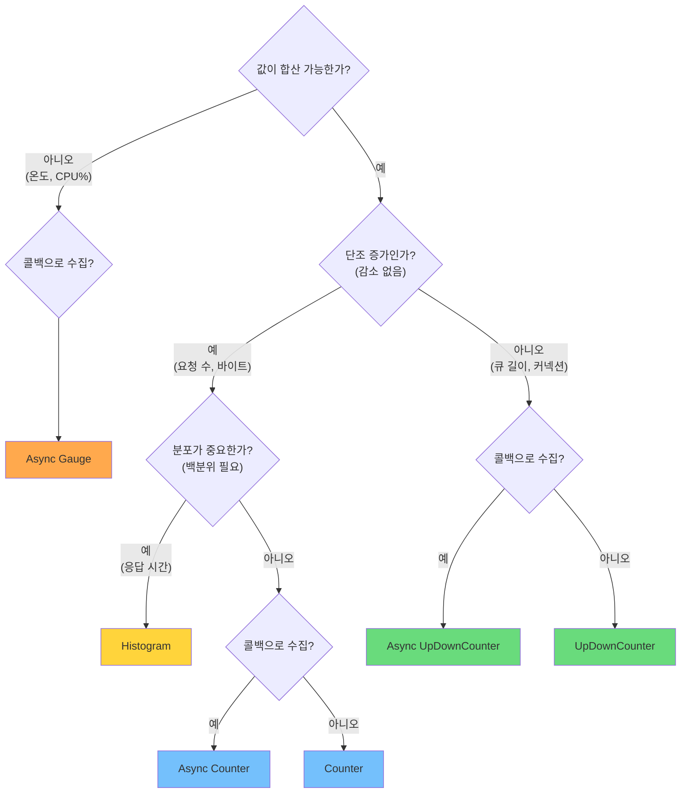
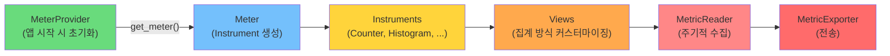
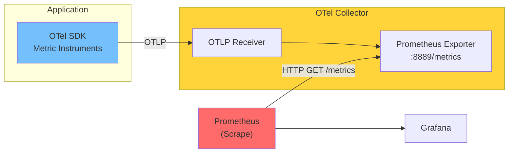

> 이 글은 [OpenTelemetry Metrics 공식 문서](https://opentelemetry.io/docs/concepts/signals/metrics/)를 기반으로 작성되었습니다.

[#3](/posts/otel-traces-deep-dive/)에서 Trace의 내부를 해부했다. Trace는 **개별 요청의 여정**을 보여준다. 하지만 "지금 전체 시스템이 건강한가?"라는 질문에는 Trace만으로 답하기 어렵다.

그게 **Metrics**의 역할이다.

---

## Metric이란?

런타임에 캡처한 **서비스의 측정값**이다. 하나의 metric event는 세 가지로 구성된다:

- **측정값** — 숫자 (예: 0.25초, 1234건)
- **시간** — 언제 측정했는가
- **메타데이터** — Attributes (예: `http.method="GET"`, `status_code=200`)

```
# Prometheus 형식으로 보면 익숙하다
http_requests_total{method="GET", status="200"} 12847
http_request_duration_seconds{quantile="0.99"} 0.250
system_memory_usage_bytes 8589934592
```

Metric은 시간에 따른 **추세**를 보여준다. "에러율이 올라가고 있는가?", "응답 시간이 느려지고 있는가?", "메모리가 점점 차고 있는가?" — 이런 질문에 답한다.

---

## Trace vs Metrics: 보완 관계

| | Traces | Metrics |
|---|---|---|
| **관점** | 개별 요청 하나하나 | 시스템 전체 상태 |
| **질문** | "이 요청은 왜 느렸는가?" | "전체적으로 얼마나 느린가?" |
| **데이터양** | 요청 수에 비례 (샘플링 필요) | 고정적 (시간 간격으로 수집) |
| **비용** | 높음 (Span마다 데이터) | 낮음 (집계된 숫자) |
| **발견** | 근본 원인 추적 | 이상 징후 감지 |

실제 디버깅 흐름:

```
Metric: "에러율이 5% 넘었다!" → 이상 감지
  ↓
Metric: "POST /api/orders에서 집중 발생" → 범위 좁히기
  ↓
Trace: "이 요청이 Payment Service에서 타임아웃" → 근본 원인
```

---

## 6가지 Metric Instruments

OTel은 측정 대상에 따라 **6가지 도구(Instrument)**를 제공한다. 크게 동기/비동기로 나뉜다.

### 동기(Synchronous) Instruments

코드 실행 흐름에서 **직접 호출**한다. 비즈니스 로직과 함께 동작한다.

---

### 1. Counter — 증가만 하는 누적 값

**절대로 감소하지 않는 값**을 센다.

```python
from opentelemetry import metrics

meter = metrics.get_meter("my-service")
request_counter = meter.create_counter(
    name="http.server.request.count",
    description="총 HTTP 요청 수",
    unit="requests",
)

# 요청이 들어올 때마다
request_counter.add(1, {
    "http.request.method": "GET",
    "http.response.status_code": 200,
})
```

**사용 예**: 총 요청 수, 총 에러 수, 처리된 바이트 수, 완료된 작업 수

**핵심 특성**: 값이 리셋되더라도(프로세스 재시작 등) 백엔드가 이를 처리한다. 단조 증가(monotonically increasing)하는 값에만 사용한다.

---

### 2. UpDownCounter — 올라가기도 내려가기도 하는 값

현재 **활성 상태**를 추적한다.

```python
active_requests = meter.create_up_down_counter(
    name="http.server.active_requests",
    description="현재 처리 중인 요청 수",
)

# 요청 시작
active_requests.add(1)

# 요청 완료
active_requests.add(-1)
```

**사용 예**: 활성 요청 수, 큐 길이, 커넥션 풀 사용량

**Counter와의 차이**: Counter는 `add(양수)`만 가능. UpDownCounter는 `add(음수)`도 가능.

---

### 3. Histogram — 값의 분포를 기록

**평균보다 백분위가 중요한 값**을 측정한다.

```python
request_duration = meter.create_histogram(
    name="http.server.request.duration",
    description="요청 처리 시간",
    unit="s",
)

# 요청 처리 후
request_duration.record(0.25, {
    "http.request.method": "POST",
    "url.path": "/api/orders",
})
```

Histogram은 내부적으로 다음을 자동 계산한다:

| 통계 | 설명 |
|------|------|
| **count** | 측정 횟수 |
| **sum** | 측정값 합계 |
| **min / max** | 최솟값 / 최댓값 |
| **bucket counts** | 구간별 분포 (0-10ms: 500건, 10-50ms: 300건, ...) |

**왜 평균이 아니라 분포인가?**

```
시나리오: 평균 응답 시간 100ms

현실 A: 모든 요청이 90~110ms   → 양호
현실 B: 99%가 10ms, 1%가 9초   → 심각

평균은 동일하지만, 분포를 보면 전혀 다른 이야기다.
```

Histogram이 있어야 p50, p90, p99 같은 **백분위(percentile)**를 계산할 수 있다. 대부분의 SLO는 "p99 응답 시간이 500ms 이하"처럼 백분위로 정의된다.

**사용 예**: 응답 시간, 요청/응답 크기, 배치 처리 소요 시간

---

### 비동기(Asynchronous) Instruments

**콜백 함수를 등록**하고, OTel이 주기적으로 호출해서 값을 수집한다. 시스템 레벨 메트릭처럼 "현재 값을 읽어오면 되는" 경우에 적합하다.

---

### 4. Asynchronous Gauge — 현재 스냅샷 값

**합산이 의미 없는 현재 값**을 읽는다.

```python
def cpu_usage_callback(callback):
    callback.observe(78.5, {"host": "server-01"})

meter.create_observable_gauge(
    name="system.cpu.utilization",
    callbacks=[cpu_usage_callback],
    description="CPU 사용률",
    unit="%",
)
```

**왜 합산이 의미 없는가?** 서버 3대의 CPU 사용률이 각각 70%, 80%, 60%일 때, 합산한 210%는 의미가 없다. 평균 70%가 의미 있다.

**사용 예**: CPU 사용률, 메모리 사용량, 디스크 여유 공간, 현재 온도

---

### 5. Asynchronous Counter

Counter와 같지만, 콜백으로 수집한다.

```python
def network_bytes_callback(callback):
    # OS에서 현재까지의 누적 바이트를 읽어옴
    callback.observe(get_total_bytes_sent(), {"interface": "eth0"})

meter.create_observable_counter(
    name="system.network.io.transmit",
    callbacks=[network_bytes_callback],
    unit="bytes",
)
```

**사용 예**: OS 레벨 카운터 (네트워크 바이트, CPU time), 외부 시스템의 누적 통계

---

### 6. Asynchronous UpDownCounter

UpDownCounter의 비동기 버전.

```python
def thread_count_callback(callback):
    callback.observe(get_active_thread_count())

meter.create_observable_up_down_counter(
    name="process.thread.count",
    callbacks=[thread_count_callback],
)
```

**사용 예**: 프로세스 스레드 수, 시스템 핸들 수

---

## Instrument 선택 가이드

어떤 Instrument를 써야 할지 헷갈릴 때:



---

## Metric Pipeline 구조

Trace에 TracerProvider → Tracer → Span Processor → Exporter가 있듯이, Metric에도 파이프라인이 있다.



### 각 컴포넌트

```python
from opentelemetry import metrics
from opentelemetry.sdk.metrics import MeterProvider
from opentelemetry.sdk.metrics.export import (
    PeriodicExportingMetricReader,
    ConsoleMetricExporter,
)

# 1. Exporter 설정
exporter = ConsoleMetricExporter()

# 2. MetricReader (60초마다 수집)
reader = PeriodicExportingMetricReader(
    exporter,
    export_interval_millis=60000,
)

# 3. MeterProvider 초기화
provider = MeterProvider(metric_readers=[reader])
metrics.set_meter_provider(provider)

# 4. Meter로 Instrument 생성
meter = metrics.get_meter("my-service", "1.0.0")
counter = meter.create_counter("requests")
```

### Views: 집계 커스터마이징

View는 "이 metric을 어떻게 집계할 것인가"를 정의한다.

```python
from opentelemetry.sdk.metrics import View
from opentelemetry.sdk.metrics.export import AggregationTemporality

# Histogram의 bucket 경계를 커스터마이징
custom_view = View(
    instrument_name="http.server.request.duration",
    aggregation=ExplicitBucketHistogramAggregation(
        boundaries=[0.005, 0.01, 0.025, 0.05, 0.1, 0.25, 0.5, 1.0, 5.0]
    ),
)

# 특정 attribute만 남기기 (카디널리티 제어)
filtered_view = View(
    instrument_name="http.server.request.count",
    attribute_keys=["http.request.method"],  # method만 남기고 나머지 버림
)
```

View가 중요한 이유: **카디널리티 폭발** 방지. Attribute 조합이 너무 많으면(사용자 ID × 엔드포인트 × 상태 코드 × ...) 시계열(time series) 수가 폭발해서 백엔드가 감당 못 한다. View로 필요한 Attribute만 남기면 이 문제를 제어할 수 있다.

---

## Aggregation Temporality: Delta vs Cumulative

Metric을 내보낼 때 중요한 개념이 하나 더 있다. **값을 누적으로 보낼 것인가, 변화분만 보낼 것인가?**

| | Cumulative | Delta |
|---|---|---|
| **의미** | 시작 이후 누적값 | 마지막 보고 이후 변화분 |
| **예시** | "총 요청 수: 12,847" | "지난 1분간 요청 수: 342" |
| **적합한 백엔드** | Prometheus | Datadog, OTLP |
| **장점** | 간단, 유실 시 복구 쉬움 | 네트워크 효율적 |

```
# Cumulative: 매번 전체 누적값
T=0:  requests_total = 100
T=1:  requests_total = 142    (42건 발생)
T=2:  requests_total = 185    (43건 발생)

# Delta: 변화분만
T=0→1:  requests_delta = 42
T=1→2:  requests_delta = 43
```

---

## OTLP로 Metric은 어떻게 전송되는가?

OTLP(OpenTelemetry Protocol)는 Traces만을 위한 프로토콜이 아니다. **Traces, Metrics, Logs 세 가지 신호 모두**를 전송하는 통합 프로토콜이다.

### OTLP Metric의 전송 구조

```
OTLP 전송 포맷 (Protobuf)

ResourceMetrics
  └─ Resource: { service.name: "order-service", ... }
  └─ ScopeMetrics
       └─ Scope: { name: "my-service", version: "1.0.0" }
       └─ Metrics[]
            ├─ Metric: "http.server.request.count"
            │    type: Sum
            │    data_points:
            │      - attributes: { method: "GET", status: 200 }
            │        value: 12847
            │        time_unix_nano: 1710123456000000000
            │
            ├─ Metric: "http.server.request.duration"
            │    type: Histogram
            │    data_points:
            │      - attributes: { method: "POST" }
            │        count: 1000
            │        sum: 250.5
            │        bucket_counts: [500, 300, 150, 40, 10]
            │        explicit_bounds: [0.01, 0.05, 0.1, 0.5]
            │
            └─ Metric: "system.cpu.utilization"
                 type: Gauge
                 data_points:
                   - attributes: { host: "server-01" }
                     value: 78.5
```

### OTLP의 Metric 타입

OTLP는 Instrument와 1:1 대응하는 데이터 타입을 정의한다:

| Instrument | OTLP 타입 | Data Point |
|-----------|-----------|------------|
| Counter | **Sum** (monotonic=true) | NumberDataPoint |
| UpDownCounter | **Sum** (monotonic=false) | NumberDataPoint |
| Histogram | **Histogram** | HistogramDataPoint |
| Gauge | **Gauge** | NumberDataPoint |

### 전송 방식

```yaml
# Collector 설정에서 Metric 파이프라인
service:
  pipelines:
    metrics:                    # ← Traces와 별도 파이프라인
      receivers: [otlp]
      processors: [batch]
      exporters: [prometheus, otlp/backend]
```

OTLP는 gRPC(포트 4317)와 HTTP(포트 4318) 두 가지 전송을 지원한다. 동일한 엔드포인트에서 Traces, Metrics, Logs를 모두 받을 수 있다.

```
# 하나의 Collector 엔드포인트로 세 신호 모두 전송
OTLP gRPC :4317
  ├─ /opentelemetry.proto.collector.trace.v1.TraceService/Export
  ├─ /opentelemetry.proto.collector.metrics.v1.MetricsService/Export
  └─ /opentelemetry.proto.collector.logs.v1.LogsService/Export
```

---

## Prometheus와의 관계

Prometheus를 이미 쓰고 있다면? OTel Metric과 **호환**된다.



OTel로 계측하고, Collector의 Prometheus Exporter를 통해 기존 Prometheus 인프라에 그대로 연결할 수 있다. 코드는 OTel 표준으로 작성하되, 백엔드는 Prometheus를 유지하는 것이다.

---

## 정리

```
┌──────────────────────────────────────────────────────────────┐
│                    OpenTelemetry Metrics                      │
│                                                              │
│  "시스템의 건강 상태를 숫자로 말한다"                          │
│                                                              │
│  동기 Instruments:                                           │
│    Counter        — 증가만 하는 누적 값 (요청 수)             │
│    UpDownCounter  — 오르내리는 현재 값 (큐 길이)              │
│    Histogram      — 값의 분포 (응답 시간 p99)                │
│                                                              │
│  비동기 Instruments:                                         │
│    Async Gauge    — 스냅샷 값 (CPU%, 메모리)                 │
│    Async Counter  — OS 레벨 누적 카운터                      │
│    Async UpDownCounter — 시스템 레벨 현재 값                 │
│                                                              │
│  Pipeline:                                                   │
│    MeterProvider → Meter → Views → MetricReader → Exporter   │
│                                                              │
│  OTLP:                                                       │
│    Traces, Metrics, Logs를 모두 전송하는 통합 프로토콜         │
│    gRPC(:4317) / HTTP(:4318) 지원                            │
│                                                              │
└──────────────────────────────────────────────────────────────┘
```

다음 글에서는 세 번째 신호인 **Logs**를 다룬다. 기존 로깅과 OTel Logs는 어떻게 다른지, Log와 Trace가 어떻게 연결되는지 살펴본다.

---

## 참고 자료

- [OpenTelemetry Metrics](https://opentelemetry.io/docs/concepts/signals/metrics/)
- [OpenTelemetry Metrics API Specification](https://opentelemetry.io/docs/specs/otel/metrics/api/)
- [OpenTelemetry Metrics SDK Specification](https://opentelemetry.io/docs/specs/otel/metrics/sdk/)
- [OTLP Metrics Protobuf Definition](https://github.com/open-telemetry/opentelemetry-proto/blob/main/opentelemetry/proto/metrics/v1/metrics.proto)
