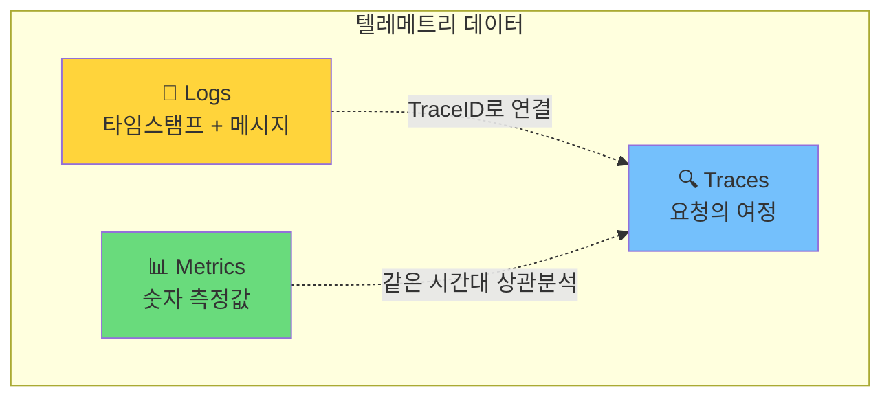
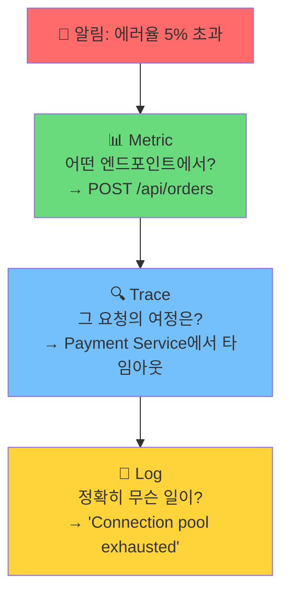

> 이 글은 [OpenTelemetry Observability Primer](https://opentelemetry.io/docs/concepts/observability-primer/)를 기반으로 작성되었습니다.

OpenTelemetry를 제대로 이해하려면, OTel이 **무엇을 해결하려는 건지**부터 알아야 한다. 그 출발점이 **Observability**(관측 가능성)다.

---

## Observability란?

제어 이론(Control Theory)에서 온 개념이다. 원래 의미는:

> **시스템의 외부 출력만 보고 내부 상태를 추론할 수 있는 능력**

소프트웨어에 적용하면? 서버가 느려졌을 때, 대시보드와 로그만 보고 **"왜 느린지"**를 파악할 수 있어야 한다. 단순히 "CPU가 90%다"를 아는 게 아니라, "어떤 요청이 어떤 서비스에서 병목을 일으켜서 CPU가 90%까지 올라갔는지"를 추적할 수 있어야 한다.

---

## Monitoring ≠ Observability

둘은 다르다.

| | Monitoring | Observability |
|---|---|---|
| **질문** | "시스템이 정상인가?" | "왜 비정상인가?" |
| **방식** | 미리 정의한 메트릭 확인 | 임의의 질문에 답할 수 있는 데이터 |
| **한계** | 예상한 문제만 잡음 | 예상 못 한 문제도 추적 가능 |

모니터링은 **알려진 문제**를 감시한다. "CPU > 80%면 알림"처럼 미리 설정한 임계값에 반응한다.

Observability는 **모르는 문제**를 탐색한다. "왜 특정 사용자의 요청만 느린가?"처럼, 사전에 예측하지 못한 질문에도 답할 수 있는 능력이다.

분산 시스템에서는 이게 결정적이다. 마이크로서비스 수십 개가 얽혀 있을 때, 어디서 문제가 생길지 미리 다 예측하는 건 불가능하다.

---

## 텔레메트리(Telemetry) 데이터

Observability를 확보하려면 시스템이 **자기 상태를 말해줄 수 있어야** 한다. 이 데이터를 텔레메트리 데이터라고 부르고, 크게 세 가지로 나뉜다.



각각이 단독으로도 유용하지만, **서로 연결될 때** 진짜 Observability가 된다.

---

## 1. Logs: 가장 오래된 친구

로그는 소프트웨어에서 가장 익숙한 텔레메트리다. **특정 시점에 발생한 이벤트**를 타임스탬프와 함께 기록한다.

```
2026-03-11 09:15:23 [ERROR] Failed to connect to database: connection timeout
2026-03-11 09:15:24 [INFO]  Retrying connection (attempt 2/3)
2026-03-11 09:15:26 [ERROR] All retry attempts exhausted
```

개발할 때 `print`나 `console.log`를 찍는 것도 넓은 의미에서 로그다. 익숙하고 간단하다.

### 로그만으로는 부족한 이유

문제는 **맥락이 없다**는 것이다.

위의 에러 로그를 보자. 데이터베이스 연결이 실패했다는 건 알겠다. 하지만:

- 어떤 사용자의 어떤 요청에서 발생한 건가?
- 이 에러가 전체 요청 흐름에서 어디쯤에 위치하는가?
- 같은 시간대에 다른 서비스에서도 문제가 있었는가?

로그 한 줄만으로는 답할 수 없다. 수십 개 서비스에서 쏟아지는 로그를 `grep`으로 뒤지면서 상관관계를 머릿속으로 조합해야 한다.

### OTel이 로그에 하는 일

OpenTelemetry는 로그에 **TraceID와 SpanID를 삽입**한다.

```json
{
  "timestamp": "2026-03-11T09:15:23Z",
  "severity": "ERROR",
  "body": "Failed to connect to database",
  "trace_id": "a1b2c3d4e5f6...",
  "span_id": "7890abcdef..."
}
```

이 한 줄의 차이가 크다. 이제 이 로그가 **어떤 요청의 어떤 단계에서** 발생했는지 즉시 추적할 수 있다. 로그가 Trace와 연결되면, 단독으로는 보이지 않던 맥락이 드러난다.

---

## 2. Metrics: 숫자로 말하는 건강 상태

메트릭은 **일정 시간 간격으로 측정한 숫자 값**이다.

```
# 현재 시점의 시스템 상태
http_requests_total:          12,847
http_request_duration_p99:    0.250s
error_rate:                   2.3%
active_db_connections:        45/50
memory_usage:                 78%
```

### 메트릭이 잘하는 것

- **전체 그림을 한눈에** — "지금 시스템이 건강한가?"에 빠르게 답한다
- **추세와 패턴** — "에러율이 점점 올라가고 있는가?"
- **알림** — "응답 시간이 임계값을 넘으면 호출"
- **용량 계획** — "이 추세면 3주 뒤에 디스크가 찬다"

### 메트릭만으로는 부족한 이유

메트릭은 **"무엇이(what)"**는 알려주지만, **"왜(why)"**는 알려주지 않는다.

"에러율 2.3%"라는 메트릭을 본다고 하자. 이게 한 명의 사용자에게 집중된 문제인지, 전체 사용자에게 고르게 퍼진 문제인지, 특정 엔드포인트에서만 발생하는 건지 — 메트릭만으로는 알기 어렵다.

---

## 3. Traces: 요청의 여정 추적

분산 추적(Distributed Tracing)은 **하나의 요청이 여러 서비스를 거쳐가는 전체 경로**를 기록한다.

사용자가 웹 페이지를 로드한다고 하자. 이 단순한 요청 하나가 실제로는 이렇게 흐른다:

```
사용자 요청
  └─→ API Gateway (인증 확인)
       └─→ User Service (사용자 정보 조회)
       └─→ Product Service (상품 목록)
            └─→ Database (쿼리 실행)
            └─→ Cache (캐시 확인)
       └─→ Recommendation Service (추천)
```

### Span: Trace의 구성 블록

Trace는 여러 개의 **Span**으로 구성된다. 각 Span은 **하나의 작업 단위**를 나타낸다.

```mermaid
gantt
    title Trace: 사용자 페이지 로드
    dateFormat X
    axisFormat %L ms

    section API Gateway
    인증 확인           :0, 30

    section User Service
    사용자 정보 조회    :30, 80

    section Product Service
    상품 목록 조회      :30, 200

    section Database
    SQL 쿼리 실행       :50, 180

    section Cache
    캐시 조회           :35, 45
```



Span이 담고 있는 정보:

| 필드 | 설명 | 예시 |
|------|------|------|
| **Name** | 작업 이름 | `GET /api/products` |
| **Start/End Time** | 시작/종료 시각 | 50ms ~ 180ms |
| **Attributes** | 메타데이터 | `http.status_code: 200` |
| **Events** | 시간순 이벤트 | 로그 메시지 |
| **Status** | 성공/에러 | `OK` 또는 `ERROR` |
| **Parent Span** | 부모 Span 참조 | 호출 관계 추적 |

### Traces가 잘하는 것

- **병목 지점 발견** — "이 요청이 느린 건 Database Span이 130ms 걸렸기 때문이다"
- **에러 전파 추적** — "Payment Service 에러가 Order Service까지 전파됐다"
- **서비스 간 의존관계 파악** — 한 눈에 호출 관계가 보인다

### Traces만으로는 부족한 이유

모든 요청을 Trace하면 데이터 양이 폭발한다. 일반적으로 **샘플링**해서 일부만 저장하기 때문에, 전체 트래픽의 통계적 파악은 Metric이 더 적합하다.

---

## 핵심: 세 신호의 연결

세 가지 신호는 각각 단독으로도 유용하지만, **서로 연결될 때** 진짜 힘을 발휘한다.



실제 디버깅 시나리오를 따라가 보자:

1. **Metric이 알려준다** — "에러율이 갑자기 5%를 넘었다"
2. **필터링한다** — "POST /api/orders 엔드포인트에서 집중 발생"
3. **Trace를 연다** — "이 요청이 Payment Service에서 타임아웃 나고 있다"
4. **Log를 확인한다** — "Payment Service의 DB 커넥션 풀이 고갈됐다"

Metric → Trace → Log 순서로 **넓은 시야에서 좁은 시야로** 좁혀가며 근본 원인에 도달한다. 이 연결이 바로 Observability의 핵심이다.

---

## 그래서 OpenTelemetry는?

여기까지가 "Observability란 무엇인가"다. 정리하면:

```
┌───────────────────────────────────────────────────────────┐
│                    Observability                          │
│                                                           │
│   시스템의 외부 출력으로 내부 상태를 이해하는 능력          │
│                                                           │
│   세 가지 신호:                                           │
│     Logs    — 이벤트 기록 (무슨 일이 있었나)              │
│     Metrics — 숫자 측정값 (얼마나 심각한가)               │
│     Traces  — 요청 경로 추적 (어디서 발생했나)            │
│                                                           │
│   핵심은 세 신호의 연결                                   │
│     → 개별 신호로는 불완전                                │
│     → 연결되면 임의의 질문에 답할 수 있다                 │
│                                                           │
└───────────────────────────────────────────────────────────┘
```

OpenTelemetry는 이 세 신호를 **통일된 방식으로 생성하고, 연결하고, 내보내는** 프레임워크다. 벤더에 종속되지 않으면서, 하나의 API로 Logs/Metrics/Traces를 모두 다룬다.

다음 글에서는 OTel이 이 문제를 **어떤 아키텍처로** 풀고 있는지 — API, SDK, Collector, OTLP의 구조를 본격적으로 살펴본다.

---

## 참고 자료

- [OpenTelemetry Observability Primer](https://opentelemetry.io/docs/concepts/observability-primer/)
- [OpenTelemetry Concepts](https://opentelemetry.io/docs/concepts/)
- [What is OpenTelemetry?](https://opentelemetry.io/docs/what-is-opentelemetry/)
