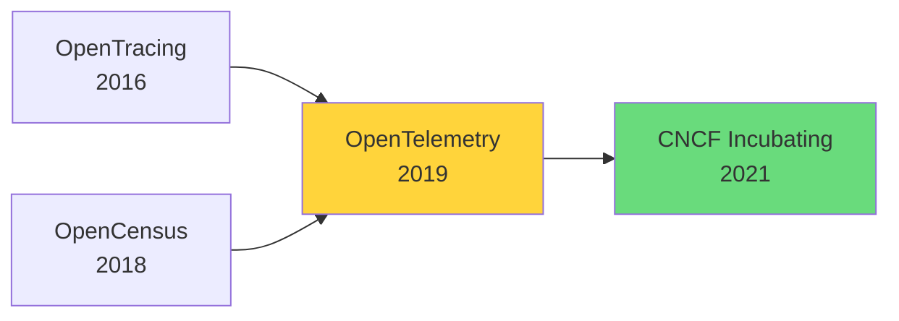
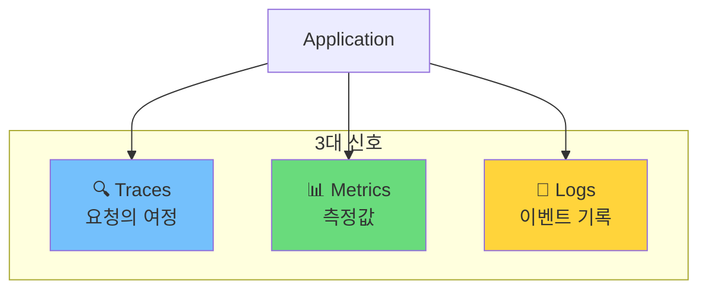
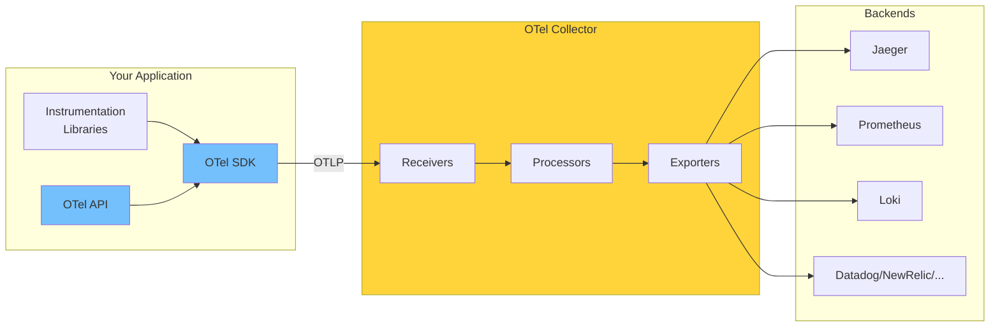
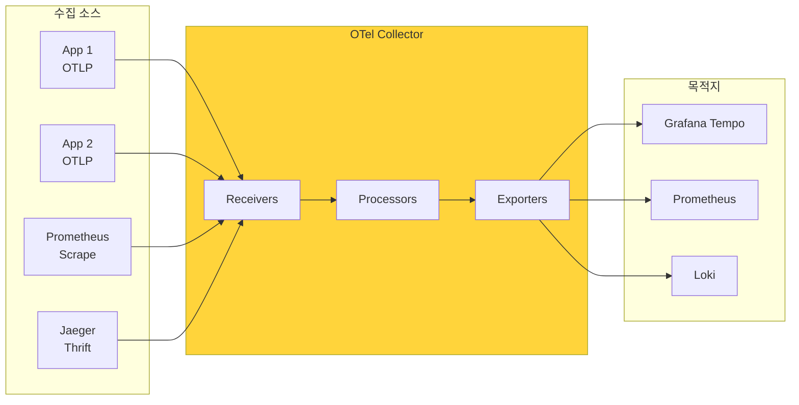

> 이 글은 [OpenTelemetry 공식 문서](https://opentelemetry.io/docs/)를 기반으로 작성되었습니다.

## OpenTelemetry란?

**OpenTelemetry**(줄여서 OTel)는 텔레메트리 데이터(Trace, Metric, Log)를 **생성, 수집, 내보내기** 위한 오픈소스 Observability 프레임워크입니다.

핵심은 이겁니다:

> **벤더 중립(Vendor-agnostic)** — 어떤 백엔드든 상관없이 동일한 방식으로 계측한다.

Jaeger를 쓰든, Datadog을 쓰든, Grafana 스택을 쓰든 — 애플리케이션 코드는 바뀌지 않습니다.

---

## 왜 OpenTelemetry인가?

### 이전의 문제: 벤더 종속

```
# 예전 방식: 벤더마다 다른 SDK
from datadog import tracer        # Datadog 전용
from newrelic import agent        # New Relic 전용
from jaeger_client import Config  # Jaeger 전용
```

벤더를 바꾸면? **코드 전체를 수정**해야 했습니다.

### OTel의 해결책: 단일 표준

```python
# OTel 방식: 하나의 API로 모든 백엔드 지원
from opentelemetry import trace

tracer = trace.get_tracer(__name__)
with tracer.start_as_current_span("my-operation"):
    do_work()

# 백엔드는 설정으로 변경 (코드 수정 없음)
```

### OTel의 두 가지 핵심 원칙

| 원칙 | 의미 |
|------|------|
| **You own your data** | 생성한 데이터는 당신의 것. 벤더 락인 없음 |
| **Single set of APIs** | 하나의 API만 배우면 됨 |

---

## 역사: OpenTracing + OpenCensus = OpenTelemetry



- **OpenTracing** (2016): 분산 추적 표준화 시도
- **OpenCensus** (2018): Google의 계측 라이브러리
- 둘 다 같은 문제를 풀려 했지만, 각자 한계가 있었음
- **2019년 합병** → OpenTelemetry 탄생
- 현재 CNCF에서 **Kubernetes 다음으로 활발한 프로젝트**

---

## 3대 신호 (Signals)

OpenTelemetry가 다루는 텔레메트리 데이터는 크게 세 가지입니다:



### Traces — 요청의 여정

분산 시스템에서 **하나의 요청이 어떤 경로로 흘러갔는지** 추적합니다.

```
[User Request]
    └─→ [API Gateway] (50ms)
        └─→ [Auth Service] (20ms)
        └─→ [Order Service] (150ms)
            └─→ [Database] (80ms)
            └─→ [Payment API] (200ms)
```

- **Span**: 하나의 작업 단위
- **Trace**: Span들의 연결 (DAG)
- 병목 지점, 에러 발생 위치를 정확히 파악

### Metrics — 숫자로 측정

시간에 따른 **수치 데이터**입니다.

```
http_requests_total{method="GET", status="200"} 1234
http_request_duration_seconds{quantile="0.99"} 0.25
system_memory_usage_bytes 8589934592
```

- **Counter**: 증가만 하는 값 (요청 수, 에러 수)
- **Gauge**: 오르내리는 값 (메모리, CPU)
- **Histogram**: 분포 (응답 시간 백분위)

### Logs — 이벤트 기록

**특정 시점에 발생한 이벤트**를 기록합니다.

```json
{
  "timestamp": "2026-03-10T14:30:00Z",
  "severity": "ERROR",
  "body": "Failed to connect to database",
  "attributes": {
    "db.name": "users",
    "error.code": "ETIMEDOUT"
  },
  "trace_id": "abc123...",
  "span_id": "def456..."
}
```

OTel의 차별점: **Log에 Trace ID를 연결**해서 로그와 트레이스를 상관 분석할 수 있습니다.

---

## 전체 아키텍처 조감도



### 주요 컴포넌트

| 컴포넌트 | 역할 |
|----------|------|
| **API** | 텔레메트리 생성을 위한 인터페이스 (언어별) |
| **SDK** | API 구현체, 샘플링/배치/내보내기 처리 |
| **Instrumentation Libraries** | 프레임워크 자동 계측 (FastAPI, requests 등) |
| **Collector** | 텔레메트리 수집/처리/내보내기 프록시 |
| **OTLP** | OpenTelemetry Protocol, 표준 전송 포맷 |

---

## Collector: 중앙 허브

Collector는 선택사항이지만, 프로덕션에서는 **거의 필수**입니다.



### 파이프라인 구조

```yaml
# collector-config.yaml
receivers:
  otlp:
    protocols:
      grpc:
        endpoint: 0.0.0.0:4317
      http:
        endpoint: 0.0.0.0:4318

processors:
  batch:
    timeout: 1s
    send_batch_size: 1024

exporters:
  otlp:
    endpoint: tempo:4317
  prometheus:
    endpoint: 0.0.0.0:8889

service:
  pipelines:
    traces:
      receivers: [otlp]
      processors: [batch]
      exporters: [otlp]
    metrics:
      receivers: [otlp]
      processors: [batch]
      exporters: [prometheus]
```

**Receiver** → **Processor** → **Exporter** 순서로 데이터가 흐릅니다.

---

## OTel이 **아닌** 것

명확히 해둘 것:

| OTel이 하는 것 | OTel이 **안** 하는 것 |
|---------------|---------------------|
| 텔레메트리 생성 | 데이터 저장 (Storage) |
| 텔레메트리 수집/처리 | 시각화 (Visualization) |
| 텔레메트리 내보내기 | 알림 (Alerting) |

저장/시각화/알림은 **백엔드의 역할**입니다:
- Traces → Jaeger, Tempo, Zipkin
- Metrics → Prometheus, InfluxDB
- Logs → Loki, Elasticsearch
- 통합 → Grafana, Datadog, New Relic

---

## 언어 지원

OTel은 거의 모든 주요 언어를 지원합니다:

| 언어 | 상태 | Auto-instrumentation |
|------|------|---------------------|
| Java | Stable | ✅ |
| Python | Stable | ✅ |
| Go | Stable | ❌ (manual only) |
| JavaScript/Node | Stable | ✅ |
| .NET | Stable | ✅ |
| Ruby | Stable | ✅ |
| Rust | Alpha | ❌ |
| C++ | Stable | ❌ |

**Auto-instrumentation**: 코드 수정 없이 자동으로 계측 (Java Agent, Python sitecustomize 등)

---

## 정리: OTel의 철학

```
┌─────────────────────────────────────────────────────┐
│                  OpenTelemetry                      │
│                                                     │
│   "계측은 한 번, 백엔드는 자유롭게"                    │
│                                                     │
│   • 벤더 중립: 코드 변경 없이 백엔드 교체            │
│   • 3대 신호: Trace + Metric + Log 통합             │
│   • 표준 프로토콜: OTLP                             │
│   • 확장 가능: Collector 파이프라인                 │
│                                                     │
└─────────────────────────────────────────────────────┘
```

다음 글에서는 **Trace의 내부 구조**를 해체분석합니다. Span이 실제로 어떤 데이터를 담고 있는지, TraceID와 SpanID는 어떻게 생성되는지, Context Propagation이 분산 시스템에서 어떻게 동작하는지 살펴봅니다.

---

## 참고 자료

- [OpenTelemetry 공식 문서](https://opentelemetry.io/docs/)
- [What is OpenTelemetry?](https://opentelemetry.io/docs/what-is-opentelemetry/)
- [OTel Concepts](https://opentelemetry.io/docs/concepts/)
- [CNCF OpenTelemetry](https://www.cncf.io/projects/opentelemetry/)
- [OpenTelemetry Specification](https://opentelemetry.io/docs/specs/otel/)
