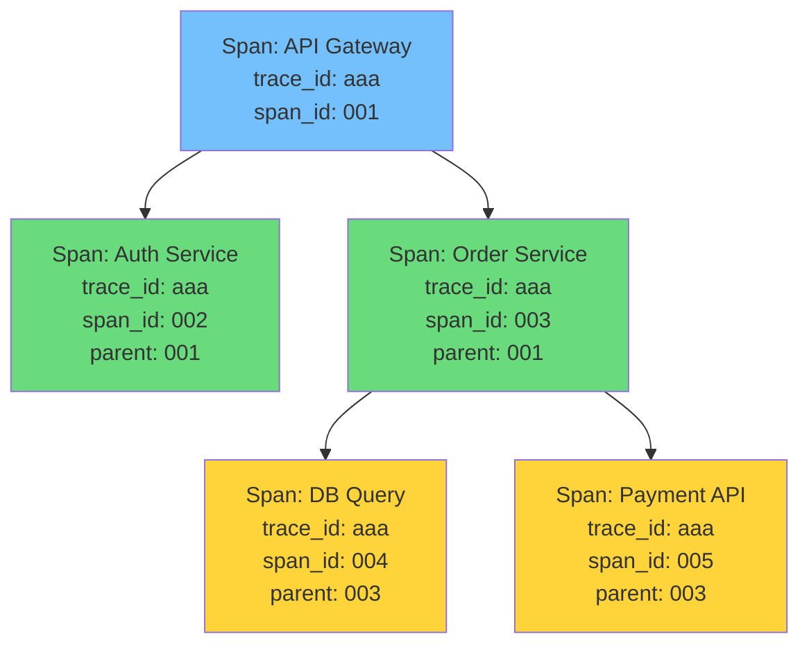
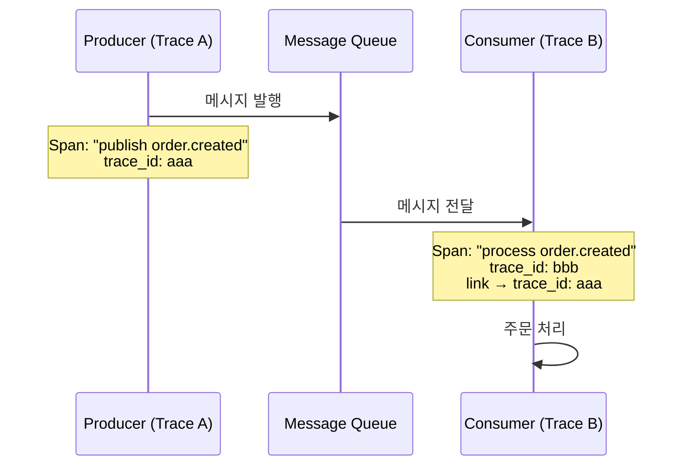
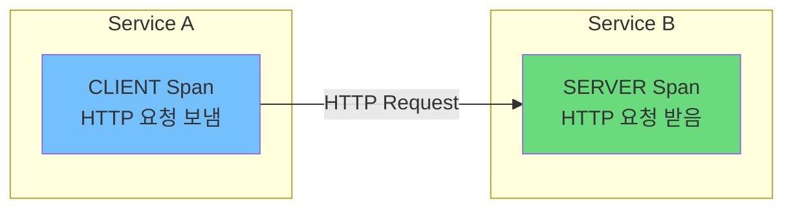
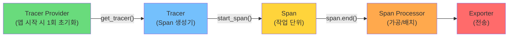

> 이 글은 [OpenTelemetry Traces 공식 문서](https://opentelemetry.io/docs/concepts/signals/traces/)를 기반으로 작성되었습니다.

[#1](/posts/otel-observability-primer/)에서 Trace가 "요청의 여정"이라고 했고, [#2](/posts/otel-context-propagation/)에서 그 여정이 서비스 경계를 넘는 원리를 봤다. 이제 여정의 구성 블록인 **Span 내부**를 해부할 차례다.

---

## Trace와 Span: 다시 한번 정의

**Trace**는 하나의 요청이 분산 시스템을 관통하는 전체 경로다. 그 자체가 데이터 구조라기보다는, **Span들의 집합**이다.

**Span**은 그 경로 위의 **개별 작업 단위**다. "API Gateway에서 인증 확인", "Database에서 쿼리 실행" — 이런 각각의 작업이 Span이다.

Span들은 부모-자식 관계로 연결되어 트리(정확히는 DAG)를 형성한다. 이 트리 전체가 하나의 Trace다.



모든 Span이 **동일한 trace_id**를 공유한다. 이게 이 Span들이 한 Trace에 속한다는 증거다.

---

## Span 해부: 내부 구조 전체 맵

Span은 단순히 "이름 + 시작/끝 시간"이 아니다. 상당히 풍부한 구조를 가지고 있다.

```
┌─────────────────────────────────────────────────┐
│                     Span                         │
├─────────────────────────────────────────────────┤
│  Name          : "POST /api/orders"              │
│  SpanContext    : trace_id, span_id, flags       │
│  Parent Span   : parent_span_id                  │
│  Kind          : SERVER                          │
│  Start Time    : 2026-03-11T09:15:23.000Z        │
│  End Time      : 2026-03-11T09:15:23.250Z        │
│  Status        : OK                              │
│                                                  │
│  Attributes    : { http.method: "POST", ... }    │
│  Events        : [ { name: "exception", ... } ]  │
│  Links         : [ { trace_id: bbb, ... } ]      │
└─────────────────────────────────────────────────┘
```

하나씩 뜯어보자.

---

## 1. SpanContext — Span의 신분증

SpanContext는 Span을 고유하게 식별하는 **불변 데이터**다. [#2: Context Propagation](/posts/otel-context-propagation/)에서 서비스 간에 전파되는 게 바로 이것이다.

```python
span_context = {
    "trace_id": "80e1afed08e019fc1110464cfa66635c",  # 32자 hex
    "span_id": "7a085853722dc6d2",                    # 16자 hex
    "trace_flags": "01",                               # 샘플링 여부
    "trace_state": "vendor1=value1,vendor2=value2",    # 벤더별 확장
}
```

| 필드 | 크기 | 역할 |
|------|------|------|
| **Trace ID** | 16 bytes (32 hex) | 전체 Trace 식별. 모든 Span이 공유 |
| **Span ID** | 8 bytes (16 hex) | 이 Span 고유 식별 |
| **Trace Flags** | 1 byte | 샘플링 결정 등 |
| **Trace State** | 가변 | 벤더별 추가 정보 |

SpanContext는 Span이 생성되는 순간 결정되고, 이후 변경되지 않는다.

---

## 2. Attributes — 작업의 맥락

Attributes는 Span에 붙이는 **key-value 메타데이터**다. "이 작업이 구체적으로 무엇이었는지"를 설명한다.

### HTTP 서버 Span의 Attributes 예시

```python
span.set_attribute("http.request.method", "POST")
span.set_attribute("url.path", "/api/orders")
span.set_attribute("http.response.status_code", 201)
span.set_attribute("server.address", "api.example.com")
span.set_attribute("user.id", "42")
```

### DB 쿼리 Span의 Attributes 예시

```python
span.set_attribute("db.system", "postgresql")
span.set_attribute("db.statement", "SELECT * FROM orders WHERE user_id = $1")
span.set_attribute("db.operation.name", "SELECT")
span.set_attribute("db.namespace", "production")
```

### Semantic Conventions

여기서 핵심은 Attribute 이름이 **제멋대로가 아니라는 것**이다.

OTel은 [Semantic Conventions](https://opentelemetry.io/docs/specs/semconv/)를 통해 표준 이름을 정의한다. `http.request.method`, `db.system`, `server.address` — 이런 이름은 OTel이 정한 규칙이다.

왜 중요한가? 모든 팀이 같은 이름을 쓰면:

- 백엔드에서 일관된 쿼리가 가능 ("모든 서비스의 HTTP 500 에러를 찾아줘")
- 대시보드와 알림 규칙을 재사용할 수 있음
- 자동 계측 라이브러리가 동일한 형식으로 데이터를 생성

---

## 3. Events — Span 안에서 일어난 일

Event는 Span 실행 중 **특정 시점에 발생한 의미 있는 사건**이다. 구조화된 로그라고 생각하면 된다.

```python
from opentelemetry import trace

span = trace.get_current_span()

# 일반 이벤트
span.add_event("order.validated", attributes={
    "order.id": "ORD-12345",
    "order.item_count": 3,
})

# 예외 이벤트 (자동 기록 가능)
span.add_event("exception", attributes={
    "exception.type": "ConnectionTimeoutError",
    "exception.message": "Connection pool exhausted after 30s",
    "exception.stacktrace": "Traceback (most recent call last):\n  ...",
})
```

### Event vs Log vs Attribute

혼동하기 쉬운 세 가지를 비교하자.

| | Attribute | Event | Log |
|---|---|---|---|
| **시점** | Span 전체에 대한 정보 | Span 내 특정 시점 | 독립적 |
| **예시** | `http.method = "POST"` | "09:15:23에 예외 발생" | "DB 연결 실패" |
| **개수** | key당 1개 (덮어쓰기) | 여러 개 가능 | 여러 개 가능 |
| **맥락** | Span에 종속 | Span에 종속 | Span과 연결 가능(TraceID) |

---

## 4. Links — 다른 Trace와의 인과 관계

부모-자식 관계와는 다른, **느슨한 인과 관계**를 표현한다.

### 언제 쓰는가?

가장 대표적인 사례가 **비동기 메시지 처리**다.



Producer의 Span과 Consumer의 Span은 서로 **다른 Trace**에 속한다. Consumer는 메시지가 언제 올지 모르기 때문에, 부모-자식 관계가 적절하지 않다. 하지만 인과관계는 분명히 있다 — 그래서 **Link**로 연결한다.

```python
from opentelemetry import trace

# Consumer 측에서 Link 생성
producer_context = trace.SpanContext(
    trace_id=0xaaa,
    span_id=0x111,
    is_remote=True,
)

link = trace.Link(producer_context, attributes={
    "messaging.operation": "process",
})

with tracer.start_as_current_span("process-order", links=[link]):
    process_order()
```

### 다른 활용 사례

- **배치 처리**: 여러 요청을 하나의 배치 Span에서 처리할 때, 각 원본 요청의 Span을 Link
- **재시도**: 재시도 Span이 원래 시도 Span을 Link
- **Fan-in**: 여러 비동기 작업의 결과를 모아 처리할 때

---

## 5. Status — 성공인가, 실패인가

Span의 최종 결과를 나타낸다. 세 가지 값만 있다.

| Status | 의미 | 설정 주체 |
|--------|------|-----------|
| **Unset** | 기본값. 에러 없이 완료 | 자동 |
| **Error** | 에러 발생 | 개발자 또는 자동 계측 |
| **Ok** | 명시적으로 "성공" 표시 | 개발자만 |

```python
from opentelemetry.trace import StatusCode

# 에러 발생 시
span.set_status(StatusCode.ERROR, "Database connection failed")

# 명시적 성공 표시 (보통은 Unset으로 충분)
span.set_status(StatusCode.OK)
```

### Unset vs Ok의 차이

미묘하지만 중요하다.

- **Unset**: "에러를 보고하지 않았다" → 대부분의 정상 상황
- **Ok**: "이 Span은 확실히 성공이다" → 하위에서 에러가 났지만 이 Span 레벨에서는 정상 처리했을 때

대부분의 경우 Unset으로 충분하고, 에러일 때만 Error를 설정하면 된다.

---

## 6. Span Kind — 이 Span의 역할은?

SpanKind는 이 Span이 분산 시스템에서 **어떤 역할**을 하는지 나타낸다.



### 다섯 가지 Kind

| Kind | 역할 | 전형적 예시 |
|------|------|------------|
| **CLIENT** | 원격 서비스를 **호출하는** 쪽 | HTTP 클라이언트, DB 클라이언트 |
| **SERVER** | 원격에서 들어온 요청을 **처리하는** 쪽 | HTTP 서버 핸들러 |
| **PRODUCER** | 메시지/이벤트를 **발행** | Kafka Producer, RabbitMQ Publisher |
| **CONSUMER** | 메시지/이벤트를 **소비** | Kafka Consumer, SQS Listener |
| **INTERNAL** | 서비스 내부 작업 | 비즈니스 로직 함수, 유틸리티 작업 |

### 왜 Kind가 필요한가?

트레이싱 백엔드가 **시각화와 분석을 정확하게** 하기 위해서다.

- CLIENT + SERVER 쌍을 매칭하면 → 네트워크 지연 시간 계산 가능
- PRODUCER + CONSUMER 쌍을 매칭하면 → 메시지 처리 지연 계산 가능
- INTERNAL은 → 외부 호출이 아님을 명시

```
Timeline:

Service A (CLIENT):     |████████████████████|  (200ms)
  ↓ network: 5ms
Service B (SERVER):        |██████████████|     (150ms)
                            ↑              ↑
                         네트워크 지연 = 전체(200ms) - 서버(150ms) = 50ms
```

Kind가 없으면 이런 계산이 불가능하다.

---

## Tracer Provider → Tracer → Span: 생성 파이프라인

Span이 어떻게 만들어지고 내보내지는지, 전체 파이프라인을 보자.



### 각 컴포넌트의 역할

```python
from opentelemetry import trace
from opentelemetry.sdk.trace import TracerProvider
from opentelemetry.sdk.trace.export import (
    BatchSpanProcessor,
    ConsoleSpanExporter,
)

# 1. Tracer Provider 초기화 (앱 시작 시 1회)
provider = TracerProvider()

# 2. Span Processor + Exporter 등록
processor = BatchSpanProcessor(ConsoleSpanExporter())
provider.add_span_processor(processor)

# 3. 전역 등록
trace.set_tracer_provider(provider)

# 4. Tracer 가져오기
tracer = trace.get_tracer("my-service", "1.0.0")

# 5. Span 생성 → 작업 → 종료 → 자동으로 Processor → Exporter
with tracer.start_as_current_span("my-operation"):
    do_work()
```

### Span Processor: Simple vs Batch

| | SimpleSpanProcessor | BatchSpanProcessor |
|---|---|---|
| **동작** | Span 종료 즉시 내보냄 | 모아서 한번에 내보냄 |
| **용도** | 개발/디버깅 | **프로덕션** |
| **성능** | 매 Span마다 I/O 발생 | I/O 최소화 |

프로덕션에서는 **BatchSpanProcessor**가 사실상 필수다. Span을 버퍼에 쌓았다가 일정 크기 또는 시간 간격으로 내보내서 성능 오버헤드를 최소화한다.

---

## 종합: 실제 Span 데이터 예시

지금까지 배운 모든 요소를 담은 실제 Span을 보자.

```json
{
  "name": "POST /api/orders",
  "context": {
    "trace_id": "80e1afed08e019fc1110464cfa66635c",
    "span_id": "7a085853722dc6d2"
  },
  "parent_id": "3c4a2851fd6e4b12",
  "kind": "SERVER",
  "start_time": "2026-03-11T09:15:23.000Z",
  "end_time": "2026-03-11T09:15:23.250Z",
  "status": { "code": "OK" },

  "attributes": {
    "http.request.method": "POST",
    "url.path": "/api/orders",
    "http.response.status_code": 201,
    "server.address": "api.example.com",
    "user.id": "42"
  },

  "events": [
    {
      "name": "order.validated",
      "timestamp": "2026-03-11T09:15:23.050Z",
      "attributes": {
        "order.id": "ORD-12345",
        "order.item_count": 3
      }
    },
    {
      "name": "order.created",
      "timestamp": "2026-03-11T09:15:23.200Z",
      "attributes": {
        "order.id": "ORD-12345"
      }
    }
  ],

  "links": []
}
```

이 Span 하나에서 읽을 수 있는 정보:

- **무엇을**: POST /api/orders 요청 처리 (name + attributes)
- **누가**: user.id 42 (attributes)
- **얼마나**: 250ms (start/end time)
- **결과**: 성공, HTTP 201 (status + attributes)
- **과정**: 50ms에 검증 완료, 200ms에 주문 생성 (events)
- **어디에**: trace_id로 전체 요청 흐름 추적 가능 (context)

---

## 정리

```
┌──────────────────────────────────────────────────────────────┐
│                    Span 내부 구조                              │
│                                                              │
│  SpanContext   : trace_id + span_id (신분증)                  │
│  Attributes    : key-value 메타데이터 (무엇을 했는지)          │
│  Events        : 시간순 이벤트 (도중에 무슨 일이 있었는지)      │
│  Links         : 다른 Trace와의 인과 관계                     │
│  Status        : Unset | Error | Ok                          │
│  Kind          : CLIENT | SERVER | PRODUCER | CONSUMER        │
│                  | INTERNAL                                   │
│                                                              │
│  생성 파이프라인:                                             │
│  TracerProvider → Tracer → Span → SpanProcessor → Exporter   │
│                                                              │
└──────────────────────────────────────────────────────────────┘
```

다음 글에서는 두 번째 신호인 **Metrics**를 해부한다. Counter, Gauge, Histogram의 차이, Metric을 언제 어떻게 쓰는지, 그리고 Trace와 Metric이 어떻게 연결되는지 살펴본다.

---

## 참고 자료

- [OpenTelemetry Traces](https://opentelemetry.io/docs/concepts/signals/traces/)
- [OpenTelemetry Tracing API Specification](https://opentelemetry.io/docs/specs/otel/trace/api/)
- [OpenTelemetry Tracing SDK Specification](https://opentelemetry.io/docs/specs/otel/trace/sdk/)
- [OpenTelemetry Semantic Conventions](https://opentelemetry.io/docs/specs/semconv/)
