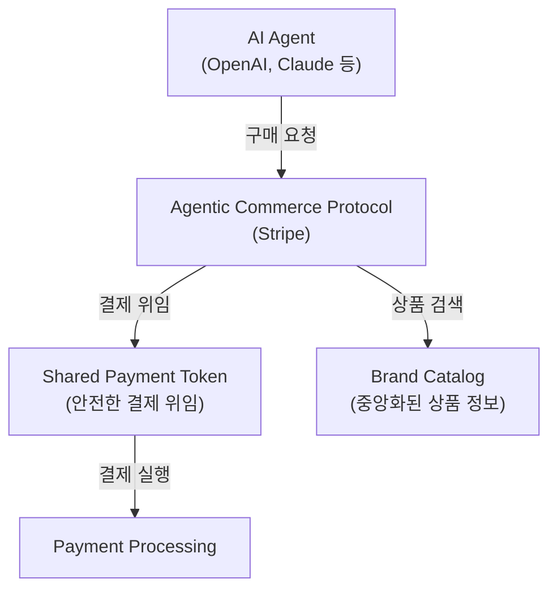
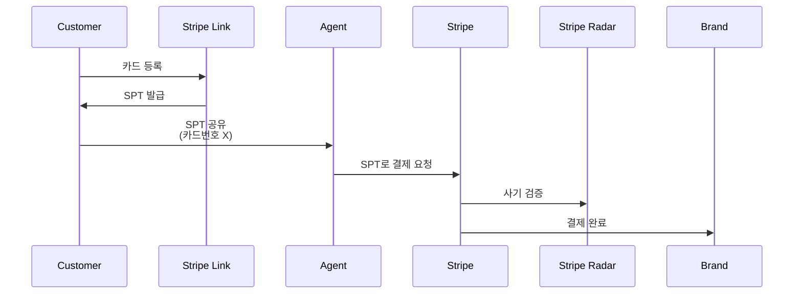
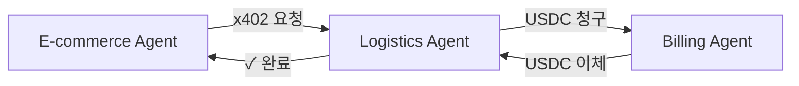

> 원문: [Stripe Blog](https://stripe.com/blog/10-lessons)

## 에이전트 커머스의 첫 세대가 온다

ChatGPT의 등장 이후 AI가 우리의 업무를 돕는 것은 더 이상 새로운 일이 아닙니다. 그런데 이제는 AI 에이전트가 **우리 대신 쇼핑을 하고 결제까지 진행하는 시대**가 열렸습니다.

Stripe는 OpenAI와 함께 지난 6개월간 **Agentic Commerce Protocol(ACP)**를 운영하면서 이런 새로운 경제 생태계가 어떻게 작동하는지를 몸으로 체험했습니다. 디지털 지갑(Link)부터 머신 페이먼트(Machine Payment)까지, 실제 운영 과정에서 얻은 10가지 교훈을 공유합니다.

---

## 핵심: Agentic Commerce의 기술 스택

에이전트가 상점을 돌며 물건을 사기 위해서는 세 가지 핵심 기술이 필요합니다.



### 1. 카탈로그 파편화 문제

**문제**: 각 에이전트가 다른 포맷을 원한다
OpenAI의 에이전트는 JSON을 원하고, Google의 에이전트는 XML을 원합니다. 모든 에이전트마다 별도의 피드(Feed)를 관리해야 한다면 브랜드 입장에서는 악몽입니다.

**해결책**: **Agentic Commerce Suite**로 중앙화
Stripe는 하나의 중앙 카탈로그로부터 여러 에이전트에 맞는 포맷으로 자동 변환하는 기술을 개발했습니다. 브랜드는 한 번만 데이터를 등록하면, 모든 에이전트 플랫폼에 자동으로 배포됩니다.

```yaml
# 브랜드의 중앙 카탈로그
product:
  sku: "DRESS-BLACK-M"
  name: "Classic Black Dress"
  price: 89.99
  sizes: [XS, S, M, L, XL]
  colors: [Black, Navy, White]
  inventory: {update_frequency: "real-time"}

# 자동으로 여러 포맷으로 변환됨
# → OpenAI Agent Format (JSON)
# → Google Shopping Agent Format (XML)
```

### 2. 밀리초 단위의 재고 정확성

**문제**: 에이전트는 극도로 빠릅니다
에이전트가 "검은색 드레스 M 사이즈"를 찾으면 즉시 구매를 시도합니다. 만약 카탈로그와 실제 재고가 다르면 결제 직전에 실패합니다. 고객 경험이 최악입니다.

**교훈**: **실시간 재고 확인이 필수**입니다
단순히 색상별 재고가 아니라, 각 **사이즈/색상 조합(SKU 변형)**의 밀리초 단위 정확도가 필요합니다. Coach, Kate Spade 등의 럭셔리 브랜드는 이를 위해 기존의 배치(Batch) 기반 재고 시스템을 실시간 시스템으로 업그레이드했습니다.

### 3. 프로토콜 진화 관리

**문제**: 표준은 하나가 아니다
Stripe의 ACP가 4번 업데이트되는 동안, Google의 UCP(Universal Commerce Protocol)도 동시에 진화했습니다. 브랜드는 두 가지 프로토콜을 모두 지원해야 합니다.

**해결책**: **프로토콜 독립 계층(Protocol Abstraction Layer)**
실제 카탈로그와 결제 로직은 고정해두고, 앞단의 "어댑터"만 교체하는 방식입니다. 마치 여러 데이터베이스(MySQL, PostgreSQL)를 같은 ORM으로 다루는 것처럼요.

```
┌─────────────────────────────────────┐
│   Brand Catalog & Payment Logic      │ (변하지 않음)
└─────────────────────────────────────┘
         ↑              ↑
    ┌────────────┐ ┌────────────┐
    │ ACP v4.x   │ │ UCP v1.x   │
    │ Adapter    │ │ Adapter    │
    └────────────┘ └────────────┘
```

---

## 결제와 신뢰: SPT와 사기 방지

### 4. Shared Payment Token(SPT): 안전한 위임 결제

**핵심 아이디어**: 에이전트에게 결제 권한을 줄 수는 없을까?

에이전트가 매번 "고객님, 결제해도 될까요?"라고 물어본다면 너무 비효율적입니다. 하지만 에이전트에게 신용카드 번호를 알려줄 수는 없습니다.

**해결책**: Shared Payment Token
- 고객이 한 번 Stripe Link 지갑에 결제 수단을 등록합니다
- Stripe가 **일회용 토큰(SPT)**을 생성합니다
- 에이전트는 고객의 실제 카드 번호를 모르지만, 이 토큰으로 결제를 진행할 수 있습니다
- 모든 거래는 Stripe Radar를 통해 사기 탐지 대상이 됩니다



### 5. 거의 0에 가까운 사기율

**놀라운 데이터**: 운영 6개월간 사기율이 거의 0입니다.

이것이 가능한 이유:
- **네트워크 밀도(Network Effects)**: Stripe Radar는 전 세계 수백만 건의 거래 데이터를 학습합니다. 에이전트 커머스도 이 거대한 네트워크의 일부가 되므로 이상 거래는 즉시 감지됩니다.
- **SPT의 추가 검증 계층**: 토큰은 고객 계정에 묶여 있으므로 탈취된 카드 번호만으로는 사용 불가능합니다.

실제 사례들(Coach, Kate Spade, Ashley Furniture)을 보면 에이전트를 통한 거래가 일반 온라인 구매보다 **더 안전**한 것으로 나타났습니다.

---

## 상품 출시와 시장 전략

### 6. 점진적 SKU 런칭 전략

**URBN(Urban Outfitters)의 사례**:
- 처음에는 드레스와 데님 같은 **단순한 카테고리부터 시작**했습니다
- "이 상품들은 반품률이 낮고, 사이즈/색상 조합이 명확하고, 재고 관리가 쉽습니다"
- 에이전트의 신뢰도가 올라간 후에야 복잡한 상품으로 확대했습니다

**교훈**: 에이전트 커머스는 마라톤입니다. 모든 상품을 한 번에 공개하면 안 됩니다.

### 7. 브랜드 통제의 새로운 패러다임

**문제**: "에이전트가 우리 상품을 어떻게 추천할지 통제할 수 없다"

전통 이커머스에서는 브랜드가 배너, 프로모션, 홈 화면 배치를 통제합니다. 하지만 에이전트는 고객의 요청에 따라 자율적으로 상품을 찾고 추천합니다.

**새로운 전략**:
| 기존 방식 | 에이전트 커머스 |
|---------|-------------|
| SEO 최적화 불필요 | 에이전트 AI가 카탈로그를 검색하므로 메타데이터 중요 |
| 마케팅 채널 한정 | 다양한 에이전트 플랫폼에 동시 노출 |
| 가격 비교 제한 | 에이전트가 즉시 경쟁사와 비교 |

브랜드는 **"에이전트 최적화(Agent SEO)"** 개념을 배워야 합니다. 카탈로그 메타데이터, 상품 설명, 리뷰 신호 등을 더욱 정확하고 풍부하게 만들어야 에이전트가 쉽게 찾고 추천할 수 있습니다.

---

## 결제 신원과 다양한 에이전트 형태

### 8. 고객 신원 인식 갭: 게스트 체크아웃의 해결책

**문제**: 대부분의 에이전트 구매가 **게스트 체크아웃**입니다.

고객은 브랜드 계정을 만들지 않았습니다. 에이전트가 자동으로 구매했으니까요. 그렇다면 구매 후 고객의 신원은 어떻게 알 수 있을까요?

**해결책**: Stripe Link 지갑
Stripe Link는 이메일 주소를 고객 신원의 중심으로 삼습니다. 브랜드 계정이 없어도, 고객의 이메일을 통해 주문 추적, A/S, 리워드 프로그램 등을 연결할 수 있습니다.

```
에이전트 구매 → Stripe Link(이메일) → 브랜드의 CRM 연동
```

### 9. 1st-Party vs 3rd-Party 에이전트

에이전트는 두 가지 유형으로 나뉩니다:

**1st-Party Agent (NikeAI 모델)**
- 브랜드가 직접 만든 에이전트
- 목표: 기존 고객의 **재구매 촉진 및 충성도(Retention)**
- 예시: Nike 고객이 "러닝화 다시 사야 돼"라고 말하면 NikeAI가 구매

**3rd-Party Agent (Etsy 모델)**
- 독립적인 에이전트 플랫폼
- 목표: 새로운 고객 **확보(Acquisition)**
- 예시: ChatGPT가 사용자의 요청에 가장 적합한 상품을 찾아 여러 브랜드에서 구매

**사업 의사 결정**:
- 브랜드 충성도가 높으면 → 1st-Party에 투자
- 신규 고객 확보가 중요하면 → 3rd-Party 플랫폼 활성화

---

## 미래: 머신 페이먼트

### 10. x402 프로토콜과 머신 페이먼트

**새로운 경계**: 이제 에이전트가 다른 에이전트에게 직접 결제합니다.

예시:
- 배송 최적화 에이전트가 재고 관리 에이전트에게 비용을 지불
- 이커머스 에이전트가 물류 파트너 에이전트에게 직접 송금

이를 위해서는:
1. **USDC(USD Coin) 같은 스테이블코인**을 기반으로 한 직접 결제
2. **x402 프로토콜**: "402 Payment Required" HTTP 상태 코드에서 영감을 얻은 프로토콜
3. 스마트 계약과 인스턴트 정산



이것은 B2B, 크라우드소싱, AI 마이크로태스크 같은 완전히 새로운 비즈니스 모델을 열 것입니다.

---

## 결론: 우리가 배운 것들

에이전트 커머스의 첫 6개월은 다음을 가르쳐주었습니다:

| 배운 점 | 의미 |
|--------|------|
| 카탈로그 표준화 | 하나의 소스, 여러 채널 |
| 실시간 재고 | 속도와 정확성은 양립 가능 |
| SPT 안전성 | 편의성과 보안의 균형 |
| 브랜드 신제어 | 메타데이터와 신호가 새로운 마케팅 |
| 게스트 경험 | 계정 없이도 관계 형성 가능 |
| 에이전트 다양성 | 1st-party와 3rd-party는 상호 보완 |
| 머신 페이먼트 | AI는 자동으로 결제한다 |

지금이 **에이전트 커머스의 초기 선택 윈도우**입니다. 지금 참여한 브랜드들(Coach, Urban Outfitters, Ashley Furniture)은 6개월 후 명확한 경쟁 우위를 갖게 될 것입니다.

당신의 브랜드는 준비되셨나요?

---

*이 글은 [Stripe Blog](https://stripe.com/blog/10-lessons)의 내용을 바탕으로 재구성한 해설입니다.*
