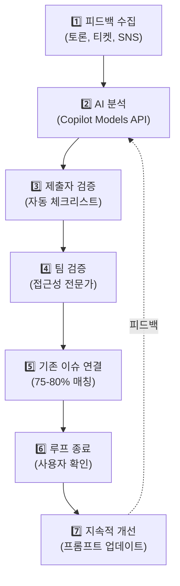

> 원문: [GitHub Blog](https://github.blog/ai-and-ml/github-copilot/continuous-ai-for-accessibility-how-github-transforms-feedback-into-inclusion/)

## 접근성 이슈의 고질적 문제

소프트웨어 개발 과정에서 접근성(Accessibility) 피드백은 종종 흩어져 있습니다. 토론 게시판, 지원 티켓, 소셜 미디어—각기 다른 채널에서 올라오는 피드백들을 수동으로 분류하고 추적하는 것은 시간이 오래 걸리고 실수하기 쉽습니다. 특히 복잡한 접근성 요구사항(WCAG 표준, 스크린 리더 호환성 등)을 이해해야 하므로 업무 부담이 매우 큽니다.

GitHub는 이 문제에 AI를 적용했습니다. **Copilot(코파일럿)과 Actions(액션)를 결합한 7단계 파이프라인**으로 산발적인 피드백을 자동으로 분류하고, 우선순위를 정하며, 추적 가능한 이슈로 변환하는 워크플로우를 만들었습니다. 그 결과는 놀라웠습니다.

---

## 7단계 자동 파이프라인 구조

GitHub의 접근성 피드백 처리 시스템은 다음과 같이 작동합니다:



### 각 단계 상세

**1단계: 피드백 수집 (Intake)**
- 모든 채널에서 접근성 이슈 수집
- 90% 이상이 토론 게시판에서 발생
- 나머지는 지원 티켓, 소셜 미디어 등

**2단계: Copilot AI 자동 분석**
- GitHub Actions가 새로운 피드백을 감지
- Models API를 통해 Copilot 호출
- **40개 이상의 메타데이터 자동 생성** (80% 정확도)
  - 심각도(Severity) 분류
  - WCAG 표준 매핑
  - 영향받는 기능 범위
  - 필요한 재현 단계

**3단계: 제출자 검증 (Submitter Review)**
- AI가 생성한 **자동 체크리스트** 제시
  - "키보드 네비게이션으로 재현 가능했나요?"
  - "대체 텍스트(Alt-text) 누락 확인했나요?"
  - "스크린 리더로 테스트했나요?"
- 사용자가 누락된 정보 입력
- 전문성 없는 사용자도 상세한 보고서 작성 가능

**4단계: 접근성 팀 검증**
- GitHub 접근성 전문가가 AI 분류 검수
- 잘못된 분류 피드백 → 프롬프트 개선 루프
- 정확도 지속적 상향

**5단계: 기존 이슈 연결 (Audit Linking)**
- 75-80%의 보고가 **이미 알려진 문제**와 일치
- 중복 방지, "customer-reported(고객 보고)" 라벨 추가
- 우선순위 재평가

**6단계: 루프 종료 (Closing the Loop)**
- 문제 해결 후 **사용자 확인** 단계
- 실제로 접근성이 개선되었는지 검증
- 사용자 만족도 확보

**7단계: 지속적 개선**
- 정확하지 않은 AI 분류 → PR로 instruction 파일 업데이트
- 매주 자동 스캔으로 빠진 케이스 발굴
- 모델 학습 데이터 증가

---

## 핵심 성과 지표

이 파이프라인 도입으로 GitHub의 접근성 이슈 처리가 획기적으로 개선되었습니다:

| 지표 | 도입 전 | 도입 후 | 개선율 |
|------|--------|--------|--------|
| **90일 내 해결률** | 21% | 89% | +68%p |
| **평균 해결 시간** | 118일 | 45일 | ↓62% |
| **30일 내 해결 건수** | 4건 | 50건 | **+1,150%** |
| **관리 업무 시간** | 100% | 30% | ↓70% |
| **심각도 1(최고) 이슈** | 100% | 50% | ↓50% |

특히 주목할 점은 **관리 업무 시간 70% 감소**입니다. 접근성 팀이 단순 분류와 메타데이터 입력에 들던 시간이 줄어들어, 실제 기술적 해결과 전략 수립에 집중할 수 있게 되었습니다.

---

## Custom Instructions: 파인튜닝 없이 AI 행동 제어

GitHub의 혁신적인 접근 방식 중 하나는 **모델 파인튜닝을 하지 않는 것**입니다. 대신 `.github/copilot-instructions.md` 파일을 사용합니다.

```markdown
# .github/copilot-instructions.md 예시

## 접근성 이슈 분류 지침

### WCAG 매핑 규칙
- 스크린 리더 호환성 문제 → WCAG 2.1 Level A 1.1.1 (텍스트 대체)
- 키보드 네비게이션 → WCAG 2.1 Level A 2.1.1 (키보드 접근성)
- 색상 대비 부족 → WCAG 2.1 Level AA 1.4.3 (명도 대비)

### 심각도 판정
- Severity 1: 완전히 사용 불가능 (모든 사용자에게 영향)
- Severity 2: 주요 기능 장애 (일부 사용자군 영향)
- Severity 3: 사소한 불편함 (보조 기능 영향)

### 자동 체크리스트 생성 규칙
- 스크린 리더 언급 포함? → "스크린 리더 테스트" 체크리스트 추가
- 키보드 문제 언급? → "키보드 네비게이션" 체크리스트 추가
```

**핵심 이점:**
- 모델을 재학습할 필요 없음
- 모든 변경이 **PR(Pull Request)로 추적 가능**
- 팀 전체가 AI의 의사결정 기준을 버전 제어로 관리
- GitHub Actions 워크플로우만 수정하면 즉시 적용

이는 마치 "**프롬프트 엔지니어링을 코드화**"하는 것과 같습니다.

---

## 실제 사례: James의 스크린 리더 문제

이 시스템의 실제 효과를 보여주는 사례가 있습니다.

**James**는 스크린 리더 사용자로 GitHub의 **Copilot CLI** 사용 중 접근성 문제를 발견했습니다:
- 명령어 출력이 스크린 리더에서 제대로 읽히지 않음
- 문제를 GitHub 토론 게시판에 보고

**AI 파이프라인의 자동 처리:**
1. 피드백 수집: James의 보고 접수
2. AI 분석: "스크린 리더 호환성 이슈" 자동 분류, WCAG 1.4.1 매핑
3. 제출자 검증: 자동 체크리스트로 추가 정보 수집
4. 팀 검증: GitHub 접근성 팀이 정확성 확인
5. 기존 이슈 연결: 실은 **이미 해결된 문제** 발견
   - 최근 출시된 `--screen-reader` 모드가 정확히 이 문제 해결
6. 루프 종료: James에게 솔루션 안내 → **수시간 내 해결**

**이전 방식이었다면:** 토론에서 흩어진 피드백이 접근성 팀의 눈에 띌 때까지 며칠 소요.

**AI 파이프라인:** 자동 분류, 기존 솔루션 즉시 매칭, 사용자 문제 해결.

---

## 설계의 핵심 원칙

GitHub의 이 접근성 AI 파이프라인이 성공한 이유는:

1. **자동화보다 검증을 우선**: AI는 80% 정확한 분류를 하지만, 그것을 100%로 만드는 것은 인간의 책임

2. **폐쇄 루프(Closing the Loop)**: 문제 해결 후 사용자 확인 단계를 빠뜨리지 않음

3. **프롬프트 관리의 민주화**: 모델 파인튜닝 대신 Git으로 관리 가능한 instruction 파일 사용

4. **반복적 개선**: 매주 자동 스캔으로 빠진 케이스 발굴, instruction 파일 PR로 업데이트

5. **투명성**: 접근성 팀과 개발팀 모두가 AI의 판단 기준을 이해하고 개선 가능

---

## 결론

GitHub의 "Continuous AI for Accessibility" 사례는 **AI가 단순 자동화가 아니라 지속적 개선 시스템의 일부**가 될 수 있음을 보여줍니다.

- 접근성 팀의 업무 부담을 70% 감소
- 이슈 해결 시간을 62% 단축
- 무엇보다, 접근성에 어려움을 겪는 사용자들이 더 빠르게 도움을 받음

이 모델은 GitHub뿐 아니라 모든 소프트웨어 조직이 참고할 만한 아키텍처입니다. 특히 **Custom Instructions를 통한 프롬프트 버전 관리**는 많은 기업에서 즉시 도입 가능한 실용적 기법입니다.

---

*이 글은 [GitHub Blog](https://github.blog/ai-and-ml/github-copilot/continuous-ai-for-accessibility-how-github-transforms-feedback-into-inclusion/)의 내용을 바탕으로 재구성한 해설입니다.*
