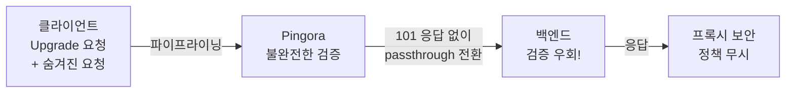
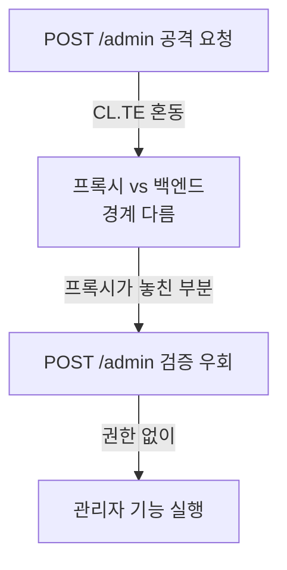
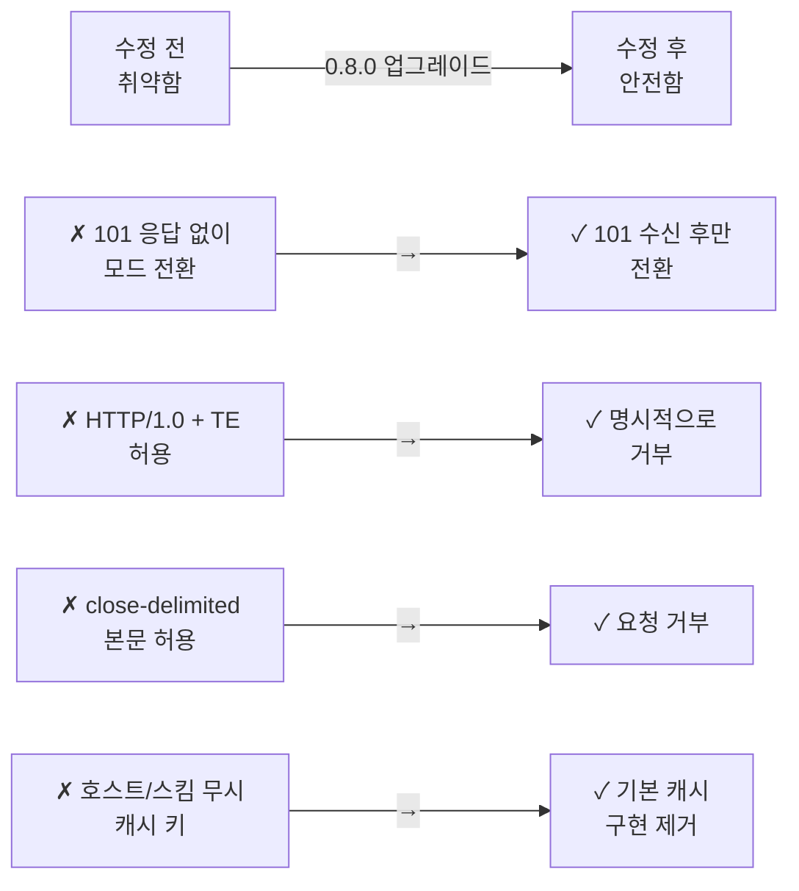

> 원문: [Cloudflare Blog](https://blog.cloudflare.com/pingora-oss-smuggling-vulnerabilities/)

## HTTP 요청 스머글링(Request Smuggling)란?

Cloudflare가 최근 오픈소스 프록시인 Pingora에서 심각한 HTTP 요청 스머글링 취약점 3가지를 발견했습니다. 이를 통해 프록시 보안의 중요성을 다시 한번 생각해보게 됩니다.

먼저 **HTTP 요청 스머글링(HTTP Request Smuggling)**의 개념을 이해해봅시다. 이는 프록시와 백엔드 서버가 HTTP 요청의 경계(프레이밍)를 다르게 해석하는 취약점입니다.

```
클라이언트 → [프록시] → [백엔드 서버]
             ↑           ↑
          해석 A       해석 B (다름!)
```

프록시가 요청 A로 해석한 것이 백엔드에서는 요청 B의 일부로 해석되면, 공격자는 백엔드로 "숨겨진" 악의적 요청을 주입할 수 있습니다. 예를 들어 권한 검증을 우회하거나 다른 사용자의 응답을 탈취할 수 있죠.

## Pingora의 3가지 CVE 분석

### CVE-2026-2833: Upgrade 핸들링의 불완전한 검증

```
HTTP/1.1 101 Switching Protocols 응답 없이도
프로토콜 전환이 가능한 취약점
```

**상황**: 클라이언트가 `Upgrade` 헤더를 보내 프로토콜 전환(예: HTTP/2, WebSocket)을 요청할 때 발생합니다.

```http
GET / HTTP/1.1
Upgrade: h2c
Connection: Upgrade
```

**문제**: Pingora는 백엔드로부터 `101 Switching Protocols` 응답을 받아야만 프록시도 모드를 전환해야 하는데, 이 검증이 불완전했습니다. 공격자는 다음과 같이 두 번째 요청을 파이프라이닝(pipelining)하여 보안을 우회할 수 있었습니다.

```
1. 공격자: "Upgrade 요청" + "숨겨진 요청" 연결로 전송
2. Pingora: 먼저 것은 101 응답 없이 passthrough 모드 진입
3. 숨겨진 요청: 프록시 검증 없이 백엔드로 직접 전달
4. 캐시/보안 정책 무시!
```

**공격 흐름 다이어그램**:



### CVE-2026-2835: Transfer-Encoding 파싱 불일치 (CL.TE 데싱크)

RFC 9112(HTTP/1.1 명세)를 위반하는 여러 문제가 있었습니다.

| 취약점 | 규칙 | Pingora 동작 | 결과 |
|--------|------|-------------|------|
| **HTTP/1.0 + TE** | HTTP/1.0은 chunked 미지원 | 여전히 허용함 | CL.TE 데싱크 가능 |
| **Chunked 검증** | 청크 형식 엄격 검증 필수 | 느슨한 파싱 | 프레이밍 혼동 |
| **Close-delimited 요청** | 요청 본문 길이 확정 필수 | 연결 종료로 경계 설정 | 백엔드는 다르게 해석 |

**가장 흔한 공격: CL.TE (Content-Length vs Transfer-Encoding)**

```http
POST / HTTP/1.1
Content-Length: 13
Transfer-Encoding: chunked

0

POST /admin HTTP/1.1
Host: example.com
```

- **Pingora 해석**: `Content-Length: 13`만 인식 → 13바이트만 읽고 끝
- **백엔드 해석**: `Transfer-Encoding: chunked` 우선 → 청크 크기 읽음 → 다음 요청을 현재 요청의 일부로 해석!



### CVE-2026-2836: 불완전한 캐시 키 구성 (캐시 포이즈닝)

기본 캐시 키 구성이 **URI 경로(path)만** 사용했습니다.

```javascript
// 취약한 캐시 키
cacheKey = request.path  // 예: "/api/user"

// 같은 캐시 키를 반환:
GET http://attacker.com/api/user  → Key: /api/user
GET http://victim.com/api/user    → Key: /api/user  (같음!)
```

**공격 시나리오**:
1. 공격자가 `attacker.com/api/user`로 악의적 응답 요청 → 캐시에 저장됨
2. 희생자가 `victim.com/api/user`로 요청
3. 캐시가 공격자의 악의적 응답을 반환!

| 무시된 정보 | 영향 |
|-----------|------|
| 호스트(Host) | 다른 도메인의 응답 혼동 |
| 스킴(Scheme) | HTTP vs HTTPS 혼동 |
| 포트 | 다른 포트의 응답 혼동 |

이는 **캐시 포이즈닝(Cache Poisoning)** 공격으로 이어집니다.

## Pingora 0.8.0의 수정 사항

2026년 3월 2일 발표된 **Pingora 0.8.0**에서 다음과 같이 수정되었습니다.



### 구체적 수정 내용

1. **Upgrade 처리 강화**
   - 백엔드로부터 `101 Switching Protocols` 응답을 **명시적으로 확인** 후만 passthrough 모드 진입
   - 응답이 없으면 연결 종료

2. **Transfer-Encoding 파싱 엄격화**
   - HTTP/1.0에서 Transfer-Encoding 헤더 완전히 거부
   - 청크 형식 검증 강화
   - 요청의 close-delimited 본문 거부 (RFC 9112 준수)

3. **캐시 정책 변경**
   - 기본 캐시 키 구현 **제거**
   - 사용자가 명시적으로 안전한 캐시 키 정책을 구성하도록 권장

## Cloudflare CDN은 왜 영향이 없을까?

Cloudflare의 상용 CDN은 이 취약점의 영향을 받지 않았습니다. 그 이유는:

```
Cloudflare CDN ← HTTP/1.1 + 엄격한 검증 ← Pingora
  (다운스트림 프로토콜)
```

1. **다운스트림 HTTP/1.1 강제**: CDN이 오리진 서버로 내려보내는 모든 연결을 HTTP/1.1로 표준화
2. **프레이밍 검증**: 이미 엄격한 HTTP 프레이밍 검증 로직 적용
3. **프록시 계층 분리**: 별도의 보안 계층이 추가 검증

따라서 Pingora 기반 셀프 호스팅 배포만이 직접 영향을 받습니다.

## 타임라인

| 날짜 | 이벤트 |
|------|--------|
| 2025-12 | 취약점 보고 |
| 2026-03-02 | Pingora 0.8.0 릴리스 (수정 포함) |
| 2026-03-04 | CVE-2026-2833, 2835, 2836 공개 |

## 요약

HTTP 요청 스머글링은 프록시 수준의 미묘한 버그로 시작되지만, 보안 우회, 캐시 포이즈닝, 권한 상향 등 심각한 결과를 초래합니다. Pingora는 오픈소스의 장점을 활용해 **빠르게 발견하고 수정**했으며, 이는 Cloudflare의 투명한 보안 실천을 보여줍니다.

만약 Pingora를 직접 배포하고 있다면:
- ✅ 즉시 0.8.0 이상으로 업그레이드
- ✅ HTTP 프레이밍 검증 정책 검토
- ✅ 캐시 키 구성 명시적으로 설정

---

*이 글은 [Cloudflare Blog](https://blog.cloudflare.com/pingora-oss-smuggling-vulnerabilities/)의 내용을 바탕으로 재구성한 해설입니다.*
