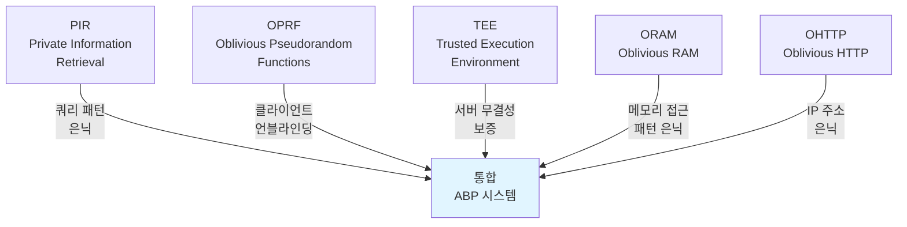
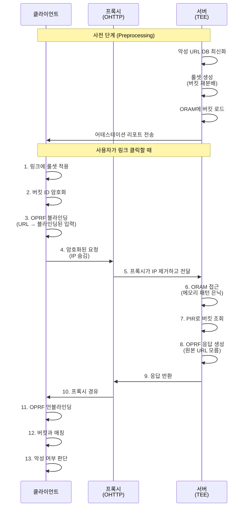

> 원문: [Meta Engineering](https://engineering.fb.com/2026/03/09/security/how-advanced-browsing-protection-works-in-messenger/)

## 도입: E2E 암호화와 악성 링크 탐지의 딜레마

메신저에서 E2E(End-to-End) 암호화는 사용자의 메시지를 보호하는 핵심입니다. 그런데 여기서 흥미로운 문제가 생깁니다. **메시지가 암호화되어 있으면, 서버는 그 안에 악성 링크가 있는지 어떻게 알 수 있을까요?**

만약 서버가 악성 링크를 탐지하려고 메시지를 복호화한다면, E2E 암호화의 의미가 사라집니다. 반대로 아무 검사도 하지 않으면, 사용자들이 피싱 공격이나 멀웨어 배포 링크에 노출됩니다.

Meta는 이 딜레마를 해결하기 위해 **Advanced Browsing Protection(ABP)**라는 시스템을 개발했습니다. 이 시스템은 E2E 암호화를 유지하면서도 사용자가 어떤 링크를 클릭했는지 서버가 알 수 없도록 하면서, 동시에 악성 URL을 탐지합니다.

이것을 가능하게 하는 것이 5가지 암호학적 기술의 조합입니다.

## URL 프리픽스 매칭: 왜 이것이 어려울까?

악성 URL을 탐지하는 것의 첫 번째 문제를 생각해봅시다.

Meta는 악성 도메인 목록을 유지합니다. 예를 들어 `malicious-site.com`이 차단 목록에 있다고 하겠습니다. 이제 사용자가 `malicious-site.com/a/b/index.html`을 클릭했을 때, 이것도 차단해야 합니다.

**URL 프리픽스 매칭(URL Prefix Matching)**의 핵심은 이것입니다:
- 차단 목록: `malicious-site.com` ✓
- 사용자 클릭: `malicious-site.com/a/b/index.html` → "이것도 매칭한다"고 판단해야 함

**하지만 프라이버시 제약이 있습니다:**
- 서버는 "사용자가 정확히 어떤 URL을 클릭했는지" 알면 안 됨
- 서버는 검색 패턴(access pattern)도 알면 안 됨
- 클라이언트는 서버의 전체 악성 URL 목록을 다운로드할 수 없음 (너무 큼)

이를 푸는 것이 Meta ABP의 핵심입니다.

## 5가지 암호학적 프리미티브

Meta는 다음 5가지 기술을 조합해서 이 문제를 풉니다:



### 1. PIR (Private Information Retrieval)

**PIR**은 데이터베이스를 쿼리하면서 서버가 어떤 항목을 조회하는지 전혀 알 수 없게 만드는 기술입니다.

일반적인 데이터베이스 쿼리:
```
클라이언트: "인덱스 5번 항목 줘"
서버: "알겠어, 너는 5번 항목에 관심 있구나"
```

PIR을 사용한 쿼리:
```
클라이언트: "암호화된 쿼리 여러 개 보냄"
서버: "응답 계산하는데... 어떤 항목을 찾는 건지 알 수 없네?"
클라이언트: "응답 복호화 → 원하는 항목 추출"
```

ABP에서 PIR은 클라이언트가 도메인 버킷의 위치를 서버에 공개하지 않고도 쿼리할 수 있게 합니다.

### 2. OPRF (Oblivious Pseudorandom Functions)

**OPRF**는 일방향 함수(pseudorandom function)를 "눈멀게" 만드는 기술입니다.

동작 방식:
1. **클라이언트**: 입력값을 블라인딩(randomness 추가)
2. **서버**: 블라인딩된 입력에 함수 적용
3. **클라이언트**: 응답에서 블라인딩 제거(언블라인딩) → 진정한 함수값 얻음

결과적으로 서버는 원본 입력값을 절대 알 수 없습니다.

ABP에서 OPRF는:
- URL을 클라이언트가 블라인딩
- 서버가 응답 생성 (원본 URL을 모름)
- 클라이언트만 언블라인딩하여 매칭 결과 확인

### 3. TEE (Trusted Execution Environment) - AMD SEV-SNP

**TEE**는 하드웨어 수준의 보호된 실행 환경입니다. Meta는 AMD SEV-SNP(Secure Encrypted Virtualization - Secure Nested Paging)를 사용합니다.

TEE의 특징:
- 서버의 메인 OS도 접근 불가능한 격리 공간
- 해당 영역의 코드/데이터는 암호화 상태로 프로세서에만 평문으로 노출
- **어테스테이션 리포트**: 특정 코드가 정확히 그 하드웨어에서 실행 중임을 증명

ABP에서의 역할:
- 악성 URL 데이터베이스와 검색 알고리즘이 TEE에서만 실행
- 클라이언트는 어테스테이션 리포트로 "이 서버가 정말 우리 코드를 실행 중인가?" 확인 가능

### 4. ORAM (Oblivious RAM) - Path ORAM

**ORAM**은 프로세서가 메모리의 어떤 주소에 접근하는지 외부 관찰자가 알 수 없도록 합니다.

일반적인 메모리 접근 패턴:
```
주소 0x1000 읽기 → [접근 패턴 분석] → "아, 이 주소 자주 쓰네?"
```

ORAM (Path ORAM 변형 사용):
```
메모리를 트리 구조로 구성
접근할 때마다 더미 접근 포함
관찰자: "뭘 하는 건지 전혀 몰라"
```

**효율성**:
- 순수 ORAM은 로그 스케일의 오버헤드가 있음
- Path ORAM으로 몇십 배 최적화
- Meta ABP에서도 여전히 상당한 오버헤드지만 실무에서 견딜 수 있는 수준

### 5. OHTTP (Oblivious HTTP)

**OHTTP**는 HTTP 요청이 프록시를 거쳐가면서 사용자의 IP 주소와 요청 내용이 분리되도록 합니다.

동작:
```
클라이언트
  ↓ (요청 암호화)
프록시 1: IP 주소만 봄, 요청 내용은 암호화 상태
  ↓ (IP 제거)
프록시 2: 요청 내용 봄, 누가 보냈는지는 모름
  ↓
검색 서버
```

ABP에서:
- 클라이언트의 IP 주소가 악성 URL 검색 서버에 직접 노출되지 않음
- 제3자 프록시를 통한 간접화

## 룰셋 기반 버킷 밸런싱

데이터베이스 크기가 매우 크면, 단순히 URL을 도메인별로 그룹화(버킷)해도 불균형이 심합니다.

**문제 시나리오:**
- `bit.ly` (링크 단축 서비스): 수백만 개 악성 URL
- `example.com`: 10개 악성 URL

만약 이들이 다른 버킷에 들어간다면:
- 클라이언트가 `bit.ly` 버킷에 접근 → 서버: "아, 저 사용자는 단축 URL을 클릭했나보네"
- 정보 누출!

**Meta의 해결책: 룰셋 기반 재분배**
```
1단계: 도메인을 K개 그룹으로 초기 분할
2단계: 각 그룹의 버킷 크기 불균형 계산
3단계: 불균형이 큰 그룹의 도메인을 다른 그룹으로 재분배
4단계: 수렴할 때까지 반복

결과: 각 버킷 그룹의 크기가 유사해짐
      접근 패턴으로부터의 정보 누출 최소화
```

| 구분 | 전 | 후 |
|------|-----|-----|
| 최대 버킷 크기 | 2,000,000 | ~50,000 |
| 접근 패턴 정보 누출 | 높음 | 낮음 |
| 계산 오버헤드 | 낮음 | 중간 |

## 전체 쿼리 라이프사이클

이제 이 모든 기술들이 어떻게 함께 작동하는지 봅시다.



**각 단계의 보안 보장:**

| 단계 | 기술 | 보장 사항 |
|------|------|---------|
| 1-3 | 룰셋 + OPRF | 클라이언트가 원본 URL 제어 |
| 4-5 | OHTTP | 서버는 IP 주소 미확인 |
| 6-8 | TEE + ORAM + PIR | 서버도 쿼리 패턴 미확인 |
| 9-13 | 클라이언트 검증 | 결과는 클라이언트만 알 수 있음 |

## 설계 트레이드오프: 프라이버시 vs. 효율성

**세밀한 버킷 (많은 버킷)**
```
장점:
  - 각 쿼리가 적은 데이터만 반환
  - 서버 계산 빠름
  - 대역폭 절감

단점:
  - 버킷 선택 자체가 정보 누출
  - ORAM 오버헤드 증가
  - 어테스테이션 복잡성 증가
```

**넓은 버킷 (적은 버킷)**
```
장점:
  - 버킷 선택으로부터의 정보 누출 최소
  - ORAM 오버헤드 감소
  - 어테스테이션 간단함

단점:
  - 각 쿼리마다 큰 데이터 반환
  - 클라이언트 매칭 시간 증가
  - 대역폭 낭비
```

**Meta의 선택:**
- 룰셋 기반 재분배로 버킷 개수 최적화
- 각 버킷을 충분히 크게 유지 (접근 패턴 은닉)
- 동시에 클라이언트 계산량은 실무적 수준으로 제어

## 마무리

Meta의 Advanced Browsing Protection은 단순한 하나의 기술이 아닙니다. 이것은 **암호학, 하드웨어 보안, 정보 은닉 이론**이 만나는 지점입니다.

- **PIR**: 서버가 쿼리 내용을 모르게
- **OPRF**: 클라이언트만 최종 결과를 알 수 있게
- **TEE**: 서버 코드의 무결성을 보증하게
- **ORAM**: 접근 패턴까지 숨기게
- **OHTTP**: 신원까지 분리하게

이 기술들이 협력하면서, **사용자의 프라이버시와 보안을 동시에 지키는 것**이 가능해집니다.

결국 이것은 "불가능해 보이는 문제를 암호학으로 푸는 예시"입니다. 개인정보 보호와 실질적 보안을 모두 원하는 현대의 요구에 대한 정교한 답변입니다.

---

*이 글은 [Meta Engineering](https://engineering.fb.com/2026/03/09/security/how-advanced-browsing-protection-works-in-messenger/)의 내용을 바탕으로 재구성한 해설입니다.*
