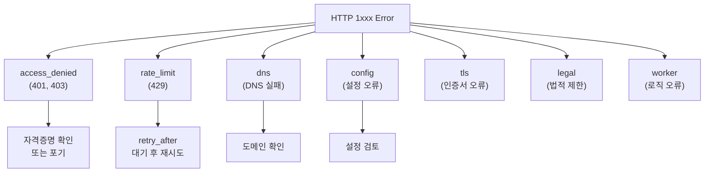

> 원문: [Cloudflare Blog](https://blog.cloudflare.com/rfc-9457-agent-error-pages/)

## AI 에이전트를 위한 에러 응답의 혁신

혹시 이런 상황을 겪어본 적 있으신가요? AI 에이전트가 어떤 API를 호출했을 때, 에러가 발생하면 브라우저용으로 만들어진 거대한 HTML 페이지를 받게 됩니다. 요청이 실패했다는 정보를 얻기 위해 수십 KB의 HTML을 파싱해야 하는 거죠. Cloudflare가 제시한 해결책이 바로 **RFC 9457 (Problem Details for HTTP APIs)** 입니다.

이 표준을 구현한 결과, 에이전트의 토큰 비용이 무려 **98% 감소**했다고 합니다. 토큰 수를 직접 비교해보면 그 차이가 얼마나 극적인지 바로 느껴집니다.

## 토큰 비용: HTML vs 구조화된 응답

일반적인 에러 상황을 가정해봅시다. 사용자가 접근할 수 없는 리소스를 요청했을 때, 브라우저용 HTML 에러 페이지는 대략 이 정도 규모입니다:

| 응답 형식 | 바이트 크기 | 토큰 수 | 비율 |
|----------|-----------|--------|------|
| HTML 에러 페이지 | 46,645 bytes | **14,252 tokens** | 100% |
| Markdown (구조화) | 1,420 bytes | 221 tokens | **1.55%** |
| JSON (구조화) | 1,820 bytes | 256 tokens | **1.79%** |

**64배 이상의 토큰 감소**입니다. 에이전트가 수백 개의 API 요청을 하는 상황이라면, 이 차이는 실제 비용으로 직결됩니다.

### 왜 HTML이 이렇게 클까요?

브라우저는 사람이 읽을 수 있는 UI가 필요합니다:
- 스타일시트, 아이콘, 폰트 임베딩
- 사용자 친화적인 설명문
- 네비게이션 메뉴
- 광고 또는 추천 콘텐츠

하지만 AI 에이전트는 이 모든 것이 불필요합니다. 기계가 파싱할 수 있는 **구조화된 정보**만 필요한 거죠.

## RFC 9457: 구조화된 에러 응답의 표준

Cloudflare가 도입한 RFC 9457은 HTTP API의 에러를 표현하기 위한 국제 표준입니다. 핵심은 **Content Negotiation**입니다. 클라이언트의 `Accept` 헤더에 따라 다른 형식으로 응답합니다:

```
Accept: application/problem+json  → JSON 응답
Accept: text/markdown              → Markdown 응답
Accept: text/html                  → HTML 응답 (기본값)
```

### 구조화된 응답의 구조

RFC 9457을 따르는 에러 응답은 이렇게 생깁니다:

```yaml
error_code: 1000
error_category: access_denied
message: "Authentication required"
retryable: false
retry_after: null
owner_action_required: false
request_id: "abc123def456"
documentation_url: "https://docs.example.com/errors/1000"
```

이 응답이 가진 장점은:

1. **기계 가독성**: 정규식 파싱 대신 구조화된 필드 접근
2. **재시도 로직**: `retryable` 플래그로 자동 재시도 가능 여부 판단
3. **액션 가이드**: `owner_action_required`로 사용자 개입 필요 여부 표시
4. **에러 분류**: `error_category`로 에러 유형 구분

## 에러 카테고리와 에이전트 행동

Cloudflare는 일반적인 에러들을 카테고리화했습니다:



이렇게 카테고리별로 에이전트가 취할 수 있는 액션이 명확해집니다.

## 실제 코드: 에러 처리 패턴

### 기존 방식 (HTML 파싱)

```python
def handle_error_html(response_text):
    """HTML을 정규식으로 파싱하는 취약한 방식"""
    import re

    # "Error Code: 1000" 같은 패턴을 찾기
    match = re.search(r'Error Code: (\d+)', response_text)
    if match:
        error_code = match.group(1)

    # 그 다음은? 더 복잡해짐...
    if "retry" in response_text.lower():
        should_retry = True
    else:
        should_retry = False  # 휴리스틱일 뿐

    return error_code, should_retry
```

문제점:
- HTML 변경되면 파싱 실패
- 휴리스틱에 의존
- 명확한 정보 추출 불가능

### 새로운 방식 (RFC 9457)

```python
def handle_error_rfc9457(response_json):
    """구조화된 응답을 명확하게 처리"""
    error_code = response_json['error_code']
    category = response_json['error_category']
    retryable = response_json['retryable']
    retry_after = response_json.get('retry_after')

    # 명확한 로직
    if category == 'rate_limit' and retryable:
        wait_seconds = retry_after or 60
        print(f"Rate limited. Retrying in {wait_seconds}s")
        return 'retry', wait_seconds

    elif category == 'access_denied':
        print("Authentication failed. Check credentials.")
        return 'fail', None

    elif category == 'config':
        print("Configuration error. Review settings.")
        return 'fail', None

    else:
        print(f"Unknown error: {error_code}")
        return 'fail', None
```

이 방식은:
- 명확한 데이터 구조
- 확장 가능
- 테스트 용이

## Cloudflare의 네트워크 규모 배포

Cloudflare는 자신의 전 지구적 에지(edge) 네트워크에서 이를 자동으로 시행합니다:

- **자동 적용**: 모든 1xxx 에러에 자동으로 RFC 9457 응답 제공
- **별도 설정 불필요**: 각 사이트별 설정 없음
- **콘텐츠 협상**: 클라이언트의 `Accept` 헤더 존중

이는 Cloudflare를 경유하는 모든 에이전트가 자동으로 이점을 누린다는 뜻입니다.

## 왜 이게 중요한가?

```
비용 감소: 14,252 tokens → 256 tokens (-98.2%)
신뢰성 향상: 명확한 구조로 재시도 로직 개선
개발 속도: HTML 파싱 코드 제거, 유지보수 단순화
확장성: 새로운 에러 타입 추가 용이
```

특히 토큰 기반 가격 모델을 사용하는 LLM API의 경우, 이 98% 감소는 **실질적인 비용 절감**입니다.

## 마치며

RFC 9457은 단순해 보이지만, 에이전트 시대의 필수 인프라입니다. 사람과 기계가 같은 API를 사용하는 시대에, 각각에 최적화된 응답 형식을 제공하는 것은 합리적입니다.

앞으로 더 많은 API 제공자들이 이 표준을 채택할 것으로 예상됩니다. 이미 OpenAI, Stripe 등 주요 플랫폼에서도 유사한 구조화된 에러 응답을 지원하고 있습니다.

여러분의 API도 RFC 9457을 지원한다면, 에이전트 사용자들이 더 효율적으로 통합할 수 있을 겁니다.

---

*이 글은 [Cloudflare Blog](https://blog.cloudflare.com/rfc-9457-agent-error-pages/)의 내용을 바탕으로 재구성한 해설입니다.*
