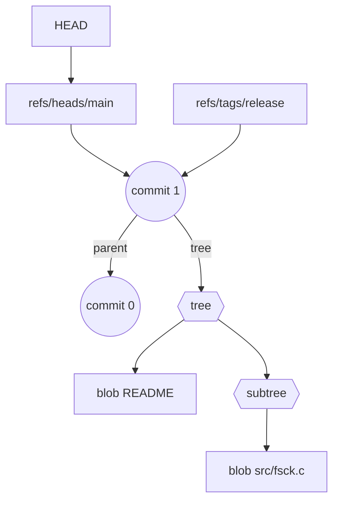

## 들어가며

Git을 쓰다 보면 언젠가 한 번쯤은 `git fsck`가 토해 내는 경고 메시지를 마주한다. 대부분은 "dangling commit" 정도로 끝나지만, 레퍼런스나 객체가 대량으로 깨지면 저장소 전체를 복원해야 하는 진짜 사고로 번진다. 이번 해체분석기는 `fsck`가 내부에서 실제로 무엇을 검사하는지, 객체 그래프를 어떻게 걷고(dfs) 표시(mark)한 뒤 dangling과 unreachable을 구분하는지, 그리고 최근 Git 버전에서 추가된 참조 검증 및 메시지 튜닝 옵션을 어떻게 활용해야 하는지를 심층적으로 다룬다. 단순 사용법이 아니라 **소스 코드 레벨에서 fsck 엔진이 어떻게 동작하는지를 해체**해 보는 것이 목표다.

## 객체 그래프 리프레셔: 왜 reachability가 전부인가

Git 저장소의 무결성은 결국 "모든 참조 가능한 객체가 온전한가"라는 질문으로 환원된다. commit은 부모 commit과 tree를 가리키고, tree는 다른 tree 혹은 blob을 가리키며, tag는 임의의 객체를 감싼다. 이 구조를 시각적으로 정리하면 다음과 같다.



이 그래프에서 "reachability"란 어떤 루트(HEAD, 다른 refs, reflog 등)에서 간선을 따라가 도달할 수 있는 모든 객체 집합을 의미한다. Git은 객체가 내용 기반 SHA-1/2로 식별되므로 해시가 바뀌면 전혀 다른 객체가 되고, 그래프 단위로 유효성을 확인해야 한다. `fsck`는 바로 이 reachability를 기준으로 두 단계 검증을 수행한다.

1. **구조적 검증**: 각 객체가 자체 포맷에 맞게 직렬화되어 있는지, 필수 헤더(예: commit의 `tree`, `author`)가 있는지, tree 엔트리의 모드가 합법적인지 등을 파싱하면서 확인한다.
2. **연결성 검증**: refs에서 시작해 그래프를 걷고, 표시되지 않은 객체를 "unreachable"로 분류한다. 그중에서도 부모나 트리로부터 역참조가 전혀 없는 tip 객체는 "dangling"으로 더 좁게 지칭한다.

이 두 검증이 결합되어야만 Git 저장소의 무결성이 보장된다.

## fsck 엔진의 파이프라인

`git fsck` 소스(`builtin/fsck.c`)를 뜯어보면 크게 세 단계 파이프라인이 있다.[^git-fsck-doc]

1. **루트 수집**: `for_each_ref()`, `for_each_reflog()` 등으로 모든 참조를 훑어 `pending` 큐에 담는다. `--cache`, `--index`, `--lost-found` 같은 옵션에 따라 index와 lost-found 디렉터리도 루트로 취급된다.
2. **그래프 순회**: `traverse_reachable()`가 pending 큐를 하나씩 꺼내 `fsck_walk()`를 호출하고, 객체 타입별 검증 콜백을 실행한다. walk는 depth-first와 breadth-first를 혼용하며, progress 상태를 출력한다.
3. **잔여 스캔**: 모든 루트가 소진되면 느슨한 객체(`for_each_loose_object`)와 팩 객체(`for_each_packed_object`)를 전수 조사해 도달하지 않은 객체를 `dangling` 혹은 `unreachable`로 기록한다.

이 과정은 마치 mark-and-sweep 가비지 컬렉터와 유사하다. `USED`/`REACHABLE` 플래그는 마킹 단계이며, 잔여 스캔은 sweep 단계에 해당한다.

## traverse_reachable: 마킹 루프 해부

실제 구현을 보면 `traverse_reachable()` 함수가 pending 큐를 비우면서 각 객체를 순회하고, 필요 시 `fsck_walk()`를 통해 하위 객체를 재귀적으로 확인한다. Git 2.45 기준 코드를 요약하면 다음과 같다.[^fsck-source]

```c
static int traverse_reachable(void)
{
    struct progress *progress = NULL;
    unsigned int nr = 0;
    int result = 0;
    if (show_progress)
        progress = start_delayed_progress(_("Checking connectivity"), 0);
    while (pending.nr) {
        result |= traverse_one_object(object_array_pop(&pending));
        display_progress(progress, ++nr);
    }
    stop_progress(&progress);
    return !!result;
}
```

이 루프는 **object_array** 큐를 pop하면서 각 객체에 대해 `traverse_one_object()`를 호출한다. 내부에서는 타입별로 `fsck_commit`, `fsck_tree`, `fsck_blob`, `fsck_tag` 콜백이 실행되고, 문제가 감지되면 메시지 ID에 매핑된 severity에 따라 경보를 띄운다. `show_progress`가 참이면 상대적으로 큰 저장소에서도 사용자가 현재 어느 정도까지 검사가 진행됐는지 알 수 있도록 지연(progress) 바를 운용한다.

흥미로운 부분은 `mark_unreachable_referents()`이다. 이는 일반 순회에서 방문되지 않았더라도 loose/pk 객체에서 발견한 푸터(예: 태그가 가리키는 객체)를 다시 한 번 walk에 태워 참조 무결성을 확인한다. 특히 `--dangling`이 켜져 있을 때, dangled 객체의 전후 사슬을 따라가면서 최소한의 컨텍스트를 확보한다.

## dangling vs unreachable: 정의와 출력 전략

- **Unreachable**: 루트에서 도달할 수 없는 모든 객체. 부모 체인이 잘려 있거나 참조가 사라진 commit, orphan tree, blob 모두 포함된다.
- **Dangling**: unreachable 중에서도 "더 이상 다른 객체가 참조하지 않는 tip". 쉽게 말해 그래프에서 외따로 떨어진 마지막 노드다. `git fsck`는 기본적으로 dangling을 보고하지만, `--no-dangling`으로 끌 수 있다.[^git-fsck-doc]

두 개념을 체감하려면 작은 실험을 해보자.

```sh
# 1. 새로운 브랜치에서 commit 생성 후 브랜치 삭제
$ git checkout -b tmp-fsck
$ echo a > demo.txt && git add demo.txt && git commit -m "tmp"
$ git checkout main && git branch -D tmp-fsck

# 2. reflog까지 만료시키면 해당 commit은 어떤 ref에서도 가리키지 않음
$ git reflog expire --expire=now --all && git gc --prune=now

# 3. 이제 fsck를 돌려보면
$ git fsck --unreachable
unreachable commit 127d32351bcfee463d893ff2f2470192553f5fb8
$ git fsck
... (중략)
dangling commit 127d32351bcfee463d893ff2f2470192553f5fb8
```

`--unreachable`은 체인 전체를 출력하지만 기본 모드에서는 tip을 "dangling"으로 축약해 준다. 만약 중간 커밋이 여러 개 있다면 `unreachable` 출력에는 모두 나타나지만, `dangling` 목록에서는 가장 끝단 커밋 하나만 보게 된다. 이 차이를 이해하면 로그 복구 전략을 짤 때 훨씬 수월하다.

## 오류 메시지와 복구 전략 매트릭스

`fsck`가 보고하는 메시지는 크게 네 갈래로 나뉜다.

1. **파싱 오류**: 객체 헤더/본문이 깨졌거나 zlib 압축이 풀리지 않는 경우. (예: `error: object <sha> missing`). 복구는 백업이나 다른 클론에서 동일 객체를 가져와야 한다. 혹은 지속적으로 손상된다면 디스크 불량을 의심해야 한다.
2. **참조 무결성 오류**: `missingTree`, `missingTag` 등. 상위 객체가 존재하지만 하위 객체가 사라진 상태다. 이런 경우 상위 객체를 checkout하면 즉시 오류가 발생하므로, dangling보다 훨씬 심각하다.
3. **정책 위반**: `fsck.strict` 모드에서만 경고가 뜨는 "legacy filemode"나 "zeroPad" 같은 메시지. 실제 손상은 아니지만 보안/이식성 문제를 미리 알려 준다.
4. **참조 계층 오류 (Git 2.48+)**: `git refs verify`가 통합되면서 refs 자체의 포맷, 심볼릭 링크 사용 여부 등을 `fsck`가 함께 보고한다.[^git-248]

아래 표는 대표 메시지와 대응 전략을 요약한 것이다.

| 메시지 ID | 의미 | 대응 |
| --- | --- | --- |
| `missingTree` | commit이 가리키는 tree가 없음 | 다른 클론에서 tree 객체를 `git cat-file`로 추출해 `git hash-object -w --stdin`으로 삽입 |
| `zeroPaddedFilemode` | tree 엔트리 모드가 6자리가 아님 | `git update-index --chmod=+x/-x`로 수정 후 재커밋 | 
| `badEmail` | commit/tag author 라인 이메일 형식 오류 | `git filter-repo` 혹은 `git rebase -i`로 수정 |
| `symbolicRefSymlink` (2.48+) | 심볼릭 ref가 symlink 파일로 구현됨 | `.git/refs` 구조를 정규 파일로 복원 후 `git fsck --full` 재실행 |

이때 severity는 `fsck.<msg-id>` 설정으로 제어할 수 있다. 예를 들어 레거시 파일 모드는 경고로만 보고 싶다면 다음과 같이 설정한다.

```ini
[fsck]
    zeroPaddedFilemode = warn
    missingTag = error
```

이렇게 하면 fetch/receive 시 자동으로 동일한 정책이 적용되어, 서버가 손상된 객체를 아예 받아들이지 않도록 할 수 있다.[^git-fsck-doc]

## 잃어버린 객체 되살리기: 실무용 레시피

dangling commit을 복구하는 대표적인 방법은 `git show`로 패치를 추출한 뒤 새 브랜치에 적용하는 것이다.

```sh
# 1. dangling 커밋을 새 브랜치 TIP으로 세움
$ git branch rescue 127d32351bcfee463d893ff2f2470192553f5fb8
$ git checkout rescue

# 2. 혹은 직접 commit tree를 다시 빌드할 수도 있다
$ git show 127d32351b --pretty=raw
$ git commit-tree <tree-sha> -p <parent-sha> -m "Recovered"
```

blob이 dangling인 경우 `git cat-file -p <blob>`으로 내용을 덤프하고 필요한 위치에 다시 저장하면 끝이다. tree가 dangling이면 경로 구조 전체를 재구성해야 하므로 복잡하지만, `git cat-file -p <tree>` 출력에서 모드·타입·SHA·경로를 그대로 복제하면 된다.

`--lost-found` 옵션을 켜면 fsck가 자동으로 `.git/lost-found/commit/` 혹은 `.../other/` 아래에 복제본을 만들어 준다. 다만 이 과정에서 blob 파일명은 SHA로 설정되므로 실제 컨텍스트를 복원하려면 수동 분석이 필요하다.

## 퍼포먼스와 옵션 튜닝

대규모 저장소를 점검할 때는 검사 범위를 의도적으로 줄이는 것이 중요하다.

- `--connectivity-only`: commit/tree/tag 연결성만 검사하고 blob 압축을 해제하지 않는다. CI에서 빠른 "연결성 연기" 용도로 유용하다.
- `--no-reflogs`: reflog를 루트로 취급하지 않으므로, 최근에 버린 브랜치가 빠르게 dangling으로 승격된다. 실험 중 생성된 잡 데이터를 빨리 정리하고 싶을 때 쓴다.
- `--max-missing=<N>`: 일정 개수 이상 손상이 발견되면 즉시 중단해 디스크 thrash를 피한다.
- `--progress`/`--no-progress`: CI 로그를 깔끔하게 유지하거나 긴 실행에서 사용자 피드백을 제공하는 데 사용한다.

또한 `fsck.skipList`에 SHA 목록을 넣어 특정 메시지를 무시할 수도 있다. 이 기능은 오래된 release 태그가 항상 같은 경고를 발생시키는 경우에 흔히 쓰인다. skipList 파일은 다음과 같은 단순 텍스트다.

```
# allow legacy vmware metadata
c1b2d3f4...
fe98ab76...
```

## 팩 파일과 bitmap 기반 최적화

대형 저장소에서 `fsck`가 느린 가장 큰 이유는 모든 팩 파일을 전수 스캔해야 하기 때문이다. Git은 이를 완화하기 위해 두 가지 최적화를 적용한다.[^fsck-source]

1. **팩-리스트 프롤로그**: `prepare_pack_packed_git()` 단계에서 모든 팩을 열어 헤더, 파일 사이즈, fan-out 테이블을 한 번만 읽고, 이후에는 메모리 매핑된 구조를 재사용한다. 덕분에 `fsck`가 여러 번 `for_each_packed_object()`를 호출하더라도 추가 I/O가 거의 없다.
2. **bitmap 탐색**: 저장소에 `*.bitmap` 파일이 있으면 `prepare_bitmap_walk(&bitmap)`을 시도하고, 성공 시 commit 그래프의 reachability 정보를 비트 수준에서 계산한다. Bitset은 팩 오프셋 순서로 정렬되어 있으므로, 마킹 루프에서 `object->flags |= SEEN`을 반복적으로 수행하는 대신 단일 `bitmap_or()`로 빠르게 합집합을 구할 수 있다.

`mark_packed_unreachable_referents()` 함수는 바로 이 bitmap 데이터를 활용해 팩 안에만 존재하는 객체를 한 번 더 점검한다. 느슨한 객체와 달리 팩 객체는 헤더를 부분적으로만 읽을 수 있어, fsck 옵션에 따라 zlib inflate를 건너뛰거나 blob 본문을 생략할 수 있다. 이는 SSD가 아닌 NAS 위에서 fsck를 돌릴 때 체감 차이가 크다.

또한 멀티팩 인덱스(MIDX)가 있을 경우, fsck는 먼저 MIDX에서 오브젝트 목록을 얻은 뒤 각 팩에 분배된 객체 수를 비교하여 기형적인 팩(예: 동일 SHA가 두 번 들어간 팩)을 빠르게 감지한다. 즉, fsck는 단순한 무결성 검사기를 넘어 팩 레이아웃을 감사하는 도구이기도 하다.

## 최근 Git 2.48~2.49에서 달라진 점

Git 2.48에서는 `git refs verify`를 `git fsck` 내부에서 호출해 **레퍼런스 계층 검증**을 기본 루틴으로 흡수했다.[^git-248] 그 결과 다음과 같은 시나리오까지 한 번에 잡아낼 수 있다.

- 심볼릭 ref가 실제 symlink 파일로 구현되어 있는 경우 (`symbolicRefSymlink`).
- ref 파일 안의 SHA가 존재하지 않거나 잘못된 형식인 경우 (`invalidRefContent`).
- ref가 또 다른 ref를 가리키지만, 그 ref가 존재하지 않는 경우 (`brokenRefLoop`).

Git 2.49에서는 bundle-uri 전송 경로에서도 `fsck` 메시지 필터를 공유하도록 개선되어, fetch 과정의 어느 단계에서 손상이 발생했는지 일관되게 보고할 수 있게 되었다.[^git-248]

이러한 변화는 "객체 풀" 중심의 전통적 fsck 범위를 넘어, 저장소 메타데이터 전체를 한 번에 감사할 수 있도록 진화하고 있음을 보여 준다.

## CI 파이프라인에서의 활용 패턴

대규모 모노레포를 운영한다면 `git fsck`를 주기적으로 돌리는 것만으로는 부족하다. 다음과 같은 단계적 검증을 구성해 보자.

1. **pre-receive 훅**: `git fsck --strict --connectivity-only`를 실행해 최소한 참조된 객체가 모두 업로드되었는지 확인한다.
2. **배경 감사 작업**: 야간 크론에서 `git fsck --full --dangling --lost-found`를 돌려 느슨한 객체까지 포함한 전체 검사를 수행하고, 결과 로그를 아티팩트로 보관한다.
3. **복구 테스트**: dangling 객체가 대량으로 쌓이지 않도록 `git gc --prune=<window>`를 정기 실행하고, prune 전에 `fsck` 보고서를 비교해 어떤 객체가 사라질지 사전 검토한다.
4. **알림**: `fsck` 출력이 특정 패턴(예: `missingBlob`)과 매칭되면 즉시 Slack/메일 알람을 보낸다.

이런 파이프라인에서는 `fsck.<msg-id>` 설정과 skipList가 사실상 정책 언어 역할을 한다. 예를 들어 레거시 패치 세트 때문에 항상 `badAuthorEmail`이 발생한다면, CI에서는 `warn`으로 낮추고 나중에 별도 작업으로 정리할 수 있다.

## 흔히 놓치는 edge case

- **대규모 LFS 저장소**: LFS 포인터 blob은 작지만 실제 객체는 다른 서버에 있다. `fsck`는 포인터 blob만 검사하므로, LFS 서버 무결성은 별도 도구가 필요하다.
- **partial clone / promisor remote**: `is_promisor_object()` 가 true인 객체는 로컬에 없어도 오류로 취급하지 않는다. 따라서 partial clone 환경에서 발생하는 missing blob 오류는 대부분 promisor ref 구성이 잘못된 것이다.
- **alternates**: `.git/objects/info/alternates`에 등록된 외부 객체 디렉토리는 `--full`일 때만 탐색한다. CI 컨테이너에서 alternates를 사용하는 경우 `--no-full`이 디폴트로 바뀌지 않았는지 확인해야 한다.
- **bundle 검증**: `git bundle verify`도 내부적으로 fsck 메시지 테이블을 공유하지만, `fsck.skipList`는 적용되지 않는다. bundle을 통한 전달 경로에서는 별도로 `bundle.*` 설정을 사용해야 한다.

## 전송 경로에서의 fsck 메시지 흐름

저장소 하나만 점검한다고 끝나지 않는다. Git 프로토콜은 fetch/push 시에도 객체 무결성 확인을 위해 `fsck` 엔진을 재사용한다. 클라이언트는 `fetch.fsckObjects=true`, 서버는 `receive.fsckObjects=true` 혹은 `transfer.fsckObjects=true` 같은 설정으로 해당 기능을 활성화한다.[^git-fsck-doc] 이렇게 하면 다음과 같은 체인이 형성된다.

1. **송신 측**: `upload-pack`이 팩을 생성할 때 내부적으로 `fsck_msg_type` 테이블을 로드하고, allowlist에 없는 메시지는 즉시 전송을 중단한다.
2. **전송 중**: 프로토콜 v2에서는 서버가 `filter`나 `promisor` 기능을 켜더라도 `fsck` severity가 함께 따라간다. 덕분에 partial clone 환경에서도 동일한 기준을 강제할 수 있다.
3. **수신 측**: `index-pack`이 팩을 임시 디렉터리에 풀어 쓰면서 `verify_pack()`을 호출하고, 여기서도 `fsck_walk`가 반복 실행된다. `receive.fsck.skipList`로 허용한 객체는 이 시점에서 제외된다.

CI에서 이를 더 엄격히 하고 싶다면 간단한 pre-receive 훅으로 감싸면 된다.

```sh
#!/bin/sh
tmpdir=$(mktemp -d)
git unpack-stdin --strict --max-input-size=2g -r "$tmpdir"
GIT_OBJECT_DIRECTORY="$tmpdir/objects" git fsck --strict --connectivity-only
rm -rf "$tmpdir"
exit 0
```

훅은 푸시가 들어올 때 팩을 임시 위치에 풀고, 본 저장소에 객체를 기록하기 전에 `fsck`를 수행한다. 검사에 실패하면 표준 오류에 메시지를 출력하고 exit code 1로 푸시를 거절할 수 있다.

## 메시지 튜닝과 "정책으로서의 fsck"

대규모 조직은 저장소마다 다른 정책을 운영한다. 이를 코드 수준으로 고정하려면 `config`뿐 아니라 정책 파일을 저장소에 버전 관리하면 좋다. 예를 들어 다음과 같은 YAML을 정의해 devcontainer에서 자동으로 `.git/config`를 패치하도록 만들 수 있다.

```yaml
fsck:
  zeroPaddedFilemode: warn
  missingTree: error
  badAuthorEmail: error
  deprecatedSha1: warn
skipList:
  - policies/allowlist.sha
```

그리고 부트스트랩 스크립트에서 이 YAML을 읽어 `git config`를 자동 주입한다. 이렇게 하면 새 개발자가 저장소를 클론하는 순간부터 동일한 무결성 룰이 적용된다. 정책 변경도 코드 리뷰 절차를 거치게 되므로, 장애를 유발할 수 있는 설정 완화가 일방적으로 적용되는 일을 방지할 수 있다.

## 마치며

`git fsck`는 그저 "dangling이 있습니다"를 알려주는 도구가 아니라, Git 객체 그래프 전체를 마킹하고 참조 계층까지 감사하는 작은 런타임이다. 내부 구조를 이해하면 경고 메시지가 가리키는 위치를 정확히 추적할 수 있고, `fsck.<msg-id>`나 새로운 ref 검증 통합 기능 덕분에 조직 정책에 맞춘 무결성 게이트를 설계할 수 있다. 특히 최근 버전에서 레퍼런스 자체까지 검사 범위가 확장되었으므로, 이제 `fsck` 보고서를 CI 파이프라인의 필수 산출물로 다루는 것이 좋다. dangling과 unreachable의 차이를 이해하고, 객체 복구 레시피를 익혀 두면 "불의의 삭제"가 실제 사고로 번지는 것을 대부분 막을 수 있을 것이다.

[^git-fsck-doc]: `git fsck` 매뉴얼, <https://git-scm.com/docs/git-fsck>
[^fsck-source]: Git 2.45 `builtin/fsck.c`, <https://raw.githubusercontent.com/git/git/v2.45.0/builtin/fsck.c>
[^git-248]: Git 2.48 릴리스 노트 (GitLab 블로그), <https://about.gitlab.com/blog/whats-new-in-git-2-48-0/>
