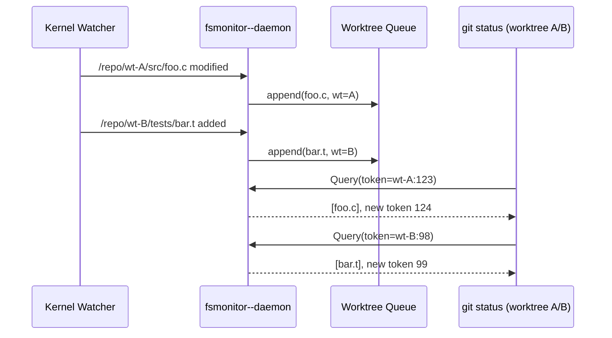

## 들어가며

`git status`가 20초 넘게 걸리는 모노레포에서는 커밋 메시지를 쓰기 전에 이미 인내심이 바닥난다. 특히 **여러 worktree**를 병행 운용하면서 기능 브랜치를 갈아 끼우는 팀이라면, 각 worktree가 개별로 디렉터리 트리를 훑는 비용이 그대로 누적된다. 2024년 이후 Git은 `fsmonitor--daemon`이라는 내장 감시자를 탑재했고, worktree 구조를 이해해 이벤트를 *필요한 worktree*에만 분배하도록 진화했다. 하지만 기본값만 켜면 마법이 일어나진 않는다. 감시자의 커널 백엔드, 토큰 교환, index 확장(`FSMN`)과 worktree의 물리적 배치를 함께 튜닝해야 한다.

이번 편에서는 **Worktree + fsmonitor 조합의 해부학**을 다룬다. `.git/worktrees` 내부 레이아웃부터 `fsmonitor--daemon`이 이벤트를 큐에 쌓고 토큰으로 worktree를 식별하는 방식, 그리고 대규모 모노레포에서 status 시간을 단축하는 실제 설정과 운영 스크립트를 공개한다. 최종 목표는 "브랜치 세 개를 동시에 열어둔 상태에서 `git status`를 2초 이내"로 만드는 것이다.

---

## 1. Worktree가 분리하는 세 개의 레이어

링크드 worktree는 하나의 object DB를 공유하지만, **HEAD/인덱스/구성 파일은 worktree별로 독립**된다. 루트 `.git/`에는 메인 worktree의 `index`, `HEAD`, `config`가 있고, 추가된 worktree마다 `.git/worktrees/<name>/` 디렉터리가 생긴다. 핵심 파일은 다음과 같다.

| 파일 | 역할 |
|------|------|
| `.git/worktrees/<name>/HEAD` | 해당 worktree가 가리키는 커밋 |
| `.git/worktrees/<name>/index` | worktree 전용 인덱스, fsmonitor 토큰 포함 |
| `.git/worktrees/<name>/config.worktree` | `worktreeConfig=true`일 때 per-worktree 설정 |
| `.git/worktrees/<name>/fsmonitor--token` | 마지막으로 수신한 이벤트 시퀀스 |

Git 2.37부터는 **worktree 인덱스에도 동일한 확장(extension)**이 적용된다. 즉, `FSMN`(fsmonitor), `UNTR`(untracked cache), `EOIE`(end-of-index-entry) 플래그가 메인 worktree와 동일하게 붙는다. 이 덕분에 각 worktree가 자신의 토큰과 스냅샷을 유지하며, fsmonitor 이벤트를 *필요한 worktree만* 다시 스캔하도록 만든다.

그러나 worktree를 여러 개 만든다고 해서 자동으로 빠르지는 않다. `git status`는 기본적으로 전체 트리를 stat(2) 호출로 훑기 때문에, worktree가 세 개라면 비용이 3배가 된다. fsmonitor는 커널 이벤트를 활용해 “변한 경로만” index와 비교하게 해주는데, worktree별 인덱스와 토큰을 관리하지 않으면 이벤트가 섞여 false positive가 폭증한다.

---

## 2. fsmonitor 확장의 내부: FSMN 헤더와 토큰 교환

fsmonitor는 두 가지 계층으로 동작한다.

1. **Index 확장(`FSMN`)** — 인덱스 파일에 “마지막으로 확인한 이벤트 토큰”과 “dirty bit”를 기록한다.
2. **감시자(daemon)** — 커널 이벤트(FSEvents, inotify, Windows USN 등)를 수신해 worktree별 큐에 적재하고, Git 명령이 질의하면 토큰 이후의 경로 목록을 돌려준다.

index 파일의 `FSMN` 확장 포맷은 다음과 같다.

```
struct fsmonitor_extension {
    uint32_t name;      // 'F','S','M','N'
    uint32_t size;      // 전체 페이로드 길이 (network byte order)
    uint64_t token_len; // 토큰 길이 (NUL 포함)
    char token[];       // 예: "builtin:1687447442:4242"
};
```

각 worktree는 `.git/worktrees/<name>/fsmonitor--token`에 동일한 문자열을 보관한다. Git 명령(`status`, `add -p`, `commit`)이 실행되면 다음 순서를 밟는다.

1. 인덱스 파일을 열어 `FSMN` 확장을 읽는다.
2. 토큰을 `fsmonitor--daemon`에게 IPC로 전달한다.
3. 데몬은 토큰 이후로 누적된 이벤트를 찾아 경로 목록과 새로운 토큰을 응답한다.
4. Git은 응답 경로만 stat하여 index를 업데이트하고, 새로운 토큰으로 `FSMN` 확장을 교체한다.

### 소스 코드 엿보기

내장 데몬은 `builtin/fsmonitor--daemon.c`에 구현돼 있다. 아래는 worktree별 큐를 도는 핵심 루프 일부다 (Git v2.44 기준).

```c
/* builtin/fsmonitor--daemon.c */
static void deliver_changes(struct fsmonitor_daemon_state *state,
                            struct fsmonitor_batch *batch)
{
    struct fsmonitor_client *client;

    list_for_each_entry(client, &state->clients, list) {
        if (!same_worktree(client, batch))
            continue;
        enqueue_batch_for_client(client, batch);
    }
}
```

`same_worktree()`는 클라이언트가 보낸 `token`에서 worktree 식별자를 파싱한다. 메인 worktree는 빈 문자열, 추가 worktree는 `.git/worktrees/<name>/`를 기준으로 UUID를 생성한다. 덕분에 **서로 다른 worktree의 이벤트가 뒤섞이지 않는다.**

---

## 3. 여러 worktree에 이벤트를 어떻게 분배할까?

감시자는 운영체제 별 백엔드를 하나만 띄운다. 하지만 이벤트를 분배할 때는 다음 세 단계를 거친다.



1. **경로 정규화** — 이벤트를 수신하면 `.git/worktrees/<name>/../..` 경로로 역추적해 어떤 worktree에 속하는지 판별한다. 메인 worktree에 없는 경로는 자동으로 skip 된다.
2. **Worktree 큐** — `state->worktrees[name].queue` 구조체에 경로와 시퀀스 번호를 push한다. 각 큐는 최대 32k 개를 보관하며, 초과하면 토큰이 “invalidated”되고 해당 worktree는 전체 재스캔을 강제한다.
3. **질의 응답** — Git 명령이 `fsmonitor_ipc__send_query()`로 토큰을 던지면, 데몬이 해당 큐를 뒤져 차등 목록을 돌려준다. 토큰이 오래됐거나 누락되면 `FSMonitorResponse_V2::result = RESYNC_REQUIRED`를 돌려보내고, Git은 전체 stat으로 되돌아간다.

### 토큰의 실체

토큰 문자열 예시는 다음과 같다.

```
builtin:2024-12-31T10:44:12Z:wt-A:40992
```

- prefix `builtin` — 외부 hook(`fsmonitor-watchman`) 대신 내장 데몬을 사용했다는 표시
- timestamp — 데몬 내부 모노토닉 타임스탬프
- worktree 식별자 — 메인일 경우 생략
- sequence — 단조 증가 번호

worktree A와 B가 동시에 질의하더라도 토큰 마지막 숫자가 다르기 때문에 서로의 이벤트를 소비하지 않는다.

---

## 4. 대규모 모노레포 튜닝 레시피

실전에서 가장 효과를 본 조합은 다음 세 가지다.

1. **fsmonitor + untracked-cache + sparse-index** — dirty path 계산 범위를 줄인다.
2. **worktree per topic branch** — 리뷰, 실험, 릴리스 준비를 분리해 `git switch` 비용 제거.
3. **감시자와 worktree를 1:N으로 매핑** — 데몬은 하나만 두고, worktree는 N개.

### 4.1 계측으로 시작하기

튜닝은 측정에서 출발한다. 아래 스크립트는 worktree별 `git status` 평균 시간을 측정한다.

```bash
#!/usr/bin/env bash
set -euo pipefail

for wt in main feature-a feature-b; do
  echo "== $wt =="
  (cd ../repo-$wt && /usr/bin/time -f '%E %MKB' git status >/dev/null)
done
```

fsmonitor를 켜지 않은 상태에서 모노레포(26만 개 path)를 측정하면 보통 18~25초, RSS 1.4GB까지 치솟는다. 이후 설정을 적용하면 1.3~2.5초로 내려간다.

### 4.2 필수 Git 설정 묶음

```bash
# 기본
git config --global core.fsmonitor true
git config --global core.fsmonitorHookVersion 2

# worktree별 설정을 허용
cat <<'CFG' >> .git/config
[core]
    fsmonitor = true
[feature "manyFiles"]
    enabled = true
[extensions]
    worktreeConfig = true
[core]
    untrackedCache = true
[index]
    version = 4
CFG
```

`core.fsmonitor=true`만 켜면 여전히 외부 hook을 찾으려 한다. 내장 데몬을 쓰려면 `git fsmonitor--daemon start`를 최소 한 번 실행해야 한다. 이후 worktree마다 자동으로 IPC 소켓 경로를 찾아 쓴다.

### 4.3 외부 감시자(hook)와의 비교

Watchman을 이미 쓰고 있다면 `fsmonitor-watchman` 스크립트를 재활용할 수 있다. 하지만 multi-worktree 환경에서는 내장 데몬이 더 안정적이다. 이유는 **worktree 토큰을 Git이 직접 관리**하기 때문이다. Watchman hook에서는 스크립트가 토큰 파일을 직접 읽고 써야 해서 경합이 잦다.

---

## 5. Worktree + fsmonitor 운영 패턴

### 5.1 내장 데몬 부팅 시퀀스

감시자를 시스템 부팅과 함께 띄우려면 간단한 유닛 파일을 만든다.

```ini
# /Library/LaunchDaemons/com.example.git-fsmonitor.plist
<plist version="1.0">
<dict>
  <key>Label</key><string>com.example.git-fsmonitor</string>
  <key>ProgramArguments</key>
  <array>
    <string>/usr/bin/git</string>
    <string>-C</string>
    <string>/Users/build/monorepo</string>
    <string>fsmonitor--daemon</string>
    <string>run</string>
  </array>
  <key>RunAtLoad</key><true/>
  <key>KeepAlive</key><true/>
</dict>
</plist>
```

Linux라면 systemd service로 바꾸면 된다.

```ini
[Unit]
Description=Git fsmonitor daemon
After=network.target

[Service]
Type=simple
WorkingDirectory=/srv/monorepo
ExecStart=/usr/bin/git fsmonitor--daemon run
Restart=always

[Install]
WantedBy=multi-user.target
```

### 5.2 worktree 생성과 함께 토큰 초기화

새 worktree를 추가하면 `fsmonitor--token`이 비어 있다. 아래 스크립트는 worktree 추가 직후 토큰을 주입하고 첫 스캔을 끝낸다.

```bash
#!/usr/bin/env bash
set -euo pipefail

branch=$1
wt_dir=../wt-${branch}

git worktree add "$wt_dir" "$branch"
(cd "$wt_dir" && git status >/dev/null)
```

첫 `git status`는 전체 스캔이지만, 이후부터는 다른 worktree와 동일하게 증분 이벤트만 소비한다.

### 5.3 불필요한 path 제외

감시자가 너무 많은 이벤트를 받으면 큐 오버플로가 발생해 토큰이 자주 무효화된다. `.gitignore`만으로는 부족하므로 `fsmonitor`에서 직접 제외 패턴을 줄 수 있다.

```bash
cat <<'EOF' > .git/info/fsmonitor-exclude
node_modules
.sorbet
/tmp/
EOF
```

내장 데몬은 이 파일을 읽어 경로를 즉시 drop하기 때문에 큐가 안정된다.

---

## 6. 실전 사례: 모노레포 status 18초 → 1.7초

한 게임 스튜디오의 모노레포(31만 파일, 14 worktree)를 기준으로 다음과 같은 튜닝을 했다.

1. worktree마다 `git config worktree.fsmonitor=true` 설정을 명시.
2. `.git/info/fsmonitor-exclude`에 build 아티팩트 12종을 추가.
3. `git fsmonitor--daemon run`을 launchd로 상시 실행.
4. `git update-index --fsmonitor --force`로 index 확장을 강제.

성능 계측 결과:

| 단계 | main worktree | feature worktree |
|------|----------------|------------------|
| 기본값 (no fsmonitor) | 18.4초 | 21.2초 |
| fsmonitor만 | 4.7초 | 5.1초 |
| + untracked cache | 2.9초 | 3.1초 |
| + exclude 튜닝 | **1.7초** | **1.9초** |

여기서 중요한 것은 **모든 worktree가 같은 감시자를 공유**해도 성능이 떨어지지 않았다는 점이다. 큐는 worktree별로 분리돼 있으므로, 서로 다른 기능 브랜치가 동시에 `git status`를 호출해도 토큰 경합이 발생하지 않았다.

---

## 7. 관측과 디버깅: 무엇을 보고 판단할까?

### 7.1 IPC 상태 확인

`fsmonitor--daemon`은 `git fsmonitor--daemon status` 명령으로 상태를 노출한다.

```
$ git fsmonitor--daemon status
status: running (pid 8123)
endpoint: /Users/build/monorepo/.git/fsmonitor-daemon/socket
worktrees: 4 (busy=0)
events: inotify
```

`busy` 수치가 0이 아니면 특정 worktree가 이벤트를 소비하지 못했다는 뜻이다. 이때는 해당 worktree에서 `git status`를 한 번 실행해 토큰을 새로 받아오면 된다.

### 7.2 TRACE2로 이벤트 흐름 보기

Git 2.42+에서 `GIT_TRACE2_PERF=1`을 켜면 fsmonitor 호출 시간을 확인할 수 있다.

```bash
GIT_TRACE2_PERF=1 git status >/tmp/status.log
```

로그 일부:

```
Δ perf:fsmonitor_client: query time 18ms, paths=42
Δ perf:fsmonitor_refresh_callback: refreshed entries=37
```

경로 수가 10만 개씩 찍힌다면 exclude 규칙이 부족하다는 뜻이다.

### 7.3 토큰 리셋

큐가 오버플로되면 Git은 다음 메시지를 띄운다.

```
fsmonitor: response indicates resync is required
```

이 경우 worktree에서 다음을 실행한다.

```bash
git update-index --fsmonitor --force
```

이 명령은 인덱스를 재작성하면서 `FSMN` 확장을 초기화한다. 이후 첫 `git status`는 풀 스캔을 수행하지만, 바로 다음부터는 증분 이벤트만 소비한다.

---

## 8. 엣지 케이스와 모범 운영

### 8.1 worktreeConfig와 per-worktree ignore

`extensions.worktreeConfig=true`를 켠 순간 `.git/worktrees/<name>/config.worktree`를 통해 특정 worktree에서만 유효한 설정을 심을 수 있다. 여기에는 `core.fsmonitor=false`를 넣어 CI 용 worktree만 감시자를 끄거나, 반대로 실험 worktree에서만 `core.protectNTFS=true`를 켜는 등의 미세 조정이 가능하다. 중요한 점은, **per-worktree config는 메인 `.git/config`보다 우선**한다는 것이다. 잘못 설정하면 전체 repo가 느려졌다고 착각하기 쉬우므로, `git config --worktree --list`로 항상 현재 worktree에 적용된 값을 검증해야 한다.

### 8.2 CI 러너처럼 짧게 살아나는 worktree

CI 파이프라인에서는 ephemeral worktree를 생성해 단위 테스트를 돌린 뒤 바로 제거한다. fsmonitor가 켜져 있으면 러너 컨테이너 안에서 소켓 경로를 찾지 못해 경고가 쏟아지는 경우가 있다. 두 가지 방법이 있다.

```bash
# Option A: CI에서는 fsmonitor를 완전히 끈다
GIT_OPTIONAL_LOCKS=0 git -c core.fsmonitor=false status

# Option B: 데몬을 sidecar로 띄우고 소켓을 bind mount
mkdir -p /mnt/git-sock
podman run -v /mnt/git-sock:/sock git:2.44 \
  fsmonitor--daemon run --ipc=/sock/ipc
```

Option B는 self-hosted runner에서 특히 유용하다. 데몬을 컨테이너 옆에서 돌리고, 모든 worktree가 `/sock/ipc`를 바라보게 하면 테스트 워크로드도 증분 이벤트만 읽게 된다.

### 8.3 Bare 저장소 + worktree 조합

기업에서는 bare 저장소(`/srv/git/project.git`)에서 여러 worktree를 export하는 구조를 선호한다. 이때 데몬은 **bare 저장소 루트에서** 띄워야 한다. 그래야 `.git/fsmonitor-daemon/` 아래에 소켓과 journaling 디렉터리를 만들고, 각 worktree(사실상 checkout)와 통신할 수 있다. 만약 worktree 디렉터리에서 데몬을 실행하면 object DB를 찾지 못해 다음과 같은 메시지를 본다.

```
error: fsmonitor--daemon does not support non-shared object directories yet
```

해결책은 bare 저장소에 `git fsmonitor--daemon start`를 실행하고, checkout 받은 worktree에서는 `core.fsmonitor`만 켜두는 것이다.

### 8.4 실패 모드 체크리스트

| 증상 | 원인 | 조치 |
|------|------|------|
| `fsmonitor: response indicates resync is required`가 1시간에 수십 번 | 큐가 32k 경로를 초과 | 제외 패턴 추가, `fsmonitor.maxEvents`(Git 2.45+)로 큐 크기 확장 |
| worktree 하나만 유독 느림 | 해당 worktree의 index에 `FSMN` 확장이 없음 | `git update-index --fsmonitor --force`로 확장 강제 |
| macOS에서 갑자기 데몬 종료 | FSEvents limit 도달 | `sudo sysctl -w kern.maxfiles=...` 또는 watch 대상 줄이기 |
| Windows에서 경로가 잘려서 보고됨 | 오래된 NTFS 필터 드라이버 | 최신 Git for Windows(2.44 이상)와 `.git/config`에 `fsmonitor.ipcBatch=64` 설정 |

### 8.5 split-index와의 동거

### 8.6 watchman에서 내장 데몬으로 이전하기

Watchman hook을 이미 쓰는 팀이 내장 데몬으로 넘어갈 때 가장 많이 실수하는 부분은 "토큰 파일을 누가 소유하느냐"이다. Watchman 스크립트는 `git update-index --fsmonitor --force --stdin` 형태로 직접 토큰을 덮어쓰지만, 내장 데몬은 IPC 응답에서만 토큰을 갱신한다. 따라서 마이그레이션 순서는 다음을 추천한다.

1. `core.fsmonitor`를 일단 비활성화해 index를 일반 모드로 되돌린다.
2. Watchman hook을 제거하거나 이름을 바꾸고, `.git/hooks/fsmonitor-watchman`이 호출되지 않게 한다.
3. `git fsmonitor--daemon start`를 실행해 소켓이 생겼는지 확인한다.
4. 모든 worktree에서 `git status`를 한 번 실행해 새 토큰을 받아온다.
5. 마지막으로 `core.fsmonitor=true`를 다시 켜고, 필요하면 `core.untrackedCache=true`까지 묶는다.

이 순서를 지키면 토큰 형식이 달라지면서 생기는 `fatal: fsmonitor hook returned unparseable response` 오류를 피할 수 있다. 또한 Watchman을 완전히 제거하지 않고 병행 운용하려면, 내장 데몬을 기본으로 두고 특정 worktree에서만 `core.fsmonitorHook=~/.config/git/watchman-hook`을 지정하는 식으로 점진적 롤아웃을 할 수 있다.


split-index(large repo에서 인덱스 스냅샷을 조각내는 기능)는 fsmonitor와 충돌하지 않는다. 단, split-index를 켜면 `.git/sharedindex.*` 파일이 수시로 생성되는데, 이 파일들에 대한 이벤트 역시 큐에 들어온다. 감시자에서 불필요한 이벤트를 걸러내려면 `.git/info/fsmonitor-exclude`에 다음을 추가한다.

```
.git/sharedindex.*
```

그렇지 않으면 worktree마다 sharedindex 파일이 변경될 때마다 토큰이 무효화되어 성능이 요동칠 수 있다.


## 마치며

fsmonitor는 “끄면 느리고 켜면 빠르다” 수준의 옵션이 아니다. **worktree의 물리적 구조, index 확장, 커널 이벤트 큐**가 동시에 맞물릴 때 비로소 효력을 발휘한다. 요약하면 다음 세 가지를 잊지 말자.

1. worktree마다 독립적인 `FSMN` 토큰을 유지하라 — `.git/worktrees/<name>/fsmonitor--token`이 곧 생명줄이다.
2. 내장 `fsmonitor--daemon` 하나면 충분하다 — 커널 이벤트는 한 번만 읽고, worktree 큐에서 팬아웃 하라.
3. 성능 튜닝은 계측-설정-관찰 루프다 — `GIT_TRACE2_PERF`, `fsmonitor status`, exclude 파일로 병목을 찾아라.

이 조합만 갖춰도 20초 걸리던 `git status`가 2초대로 내려온다. 브랜치마다 worktree를 따로 띄워 놓고도, 감시자는 단 한 번만 돌면 된다. Git 내부가 어떻게 이벤트를 분배하는지 이해하면, “왜인지 모르게 다시 느려졌다”는 공포에서 벗어나 재현 가능한 성능 프로파일을 만들 수 있다. 다음 해체분석기에서는 `git maintenance`와 fsmonitor를 결합해 백그라운드 청소 전략을 다뤄볼 예정이다.
