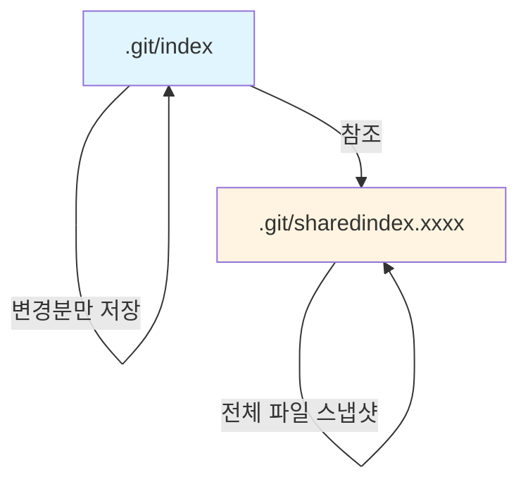

## 들어가며

Git을 사용하면서 `git add` 명령을 수없이 입력하지만, 그 뒤에서 일어나는 일을 정확히 아는 개발자는 드물다. "Staging Area"라는 개념적 설명은 친숙하지만, 실제로 `.git/index` 파일 안에 어떤 바이너리 구조가 저장되고, 어떻게 수만 개의 파일을 빠르게 추적하는지는 블랙박스로 남아있다.

이번 글에서는 Git index 파일의 내부 구조를 바이트 단위로 해체하고, v2와 v3 포맷의 차이점, split index와 shared index 최적화 기법, 그리고 resolve-undo 확장까지 완전히 분석한다.

## Index 파일의 역할

Index는 Git의 3단계 구조(Working Directory - Staging Area - Repository)에서 중간 계층을 담당한다:


Index는 단순한 "변경 목록"이 아니라:
- 모든 추적 파일의 **현재 상태 스냅샷**
- stat 정보(mtime, size)를 활용한 **빠른 변경 감지**
- 머지 충돌 시 **stage 0/1/2/3 다중 엔트리** 보관
- 대규모 리포지토리를 위한 **split index 최적화**

이 모든 기능이 `.git/index`라는 단일 바이너리 파일에 압축되어 있다.

## Index v2 포맷: 기본 구조

### 헤더 구조

Index 파일은 12바이트 헤더로 시작한다:

```c
// read-cache.c
struct cache_header {
    uint32_t hdr_signature;  // 'DIRC' (DirCache)
    uint32_t hdr_version;    // 2 or 3 or 4
    uint32_t hdr_entries;    // number of index entries
};
```

실제 바이너리 덤프:

```bash
$ hexdump -C .git/index | head -n 1
00000000  44 49 52 43 00 00 00 02  00 00 00 0a  |DIRC........|
```

- `44 49 52 43`: "DIRC" 매직 넘버
- `00 00 00 02`: 버전 2
- `00 00 00 0a`: 10개 엔트리

### 엔트리 구조 (v2)

각 엔트리는 **가변 길이**로, 파일 경로에 따라 크기가 달라진다:

```c
struct cache_entry {
    struct cache_time ctime;     // 8 bytes: ctime (sec + nsec)
    struct cache_time mtime;     // 8 bytes: mtime
    uint32_t dev;                // device
    uint32_t ino;                // inode
    uint32_t mode;               // file mode
    uint32_t uid;
    uint32_t gid;
    uint32_t size;               // file size
    unsigned char sha1[20];      // object ID (SHA-1)
    uint16_t flags;              // name length + stage
    char name[FLEX_ARRAY];       // null-terminated path
    // padding to 8-byte alignment
};
```

**중요한 점들:**

1. **stat 정보 활용**: `mtime`, `size`, `ino`를 저장해 파일 변경을 `lstat()` 한 번으로 감지
2. **SHA-1 저장**: 실제 콘텐츠의 해시를 저장해 내용 변경 검증
3. **Flags 필드**: 
   - 하위 12비트: 파일명 길이 (최대 4095)
   - 비트 12-13: stage 번호 (0=normal, 1/2/3=merge conflict)
4. **8바이트 정렬**: 성능 최적화를 위해 패딩 추가

### 실제 파싱 코드

Git 소스코드에서 엔트리를 읽는 부분:

```c
// read-cache.c: do_read_index()
for (i = 0; i < istate->cache_nr; i++) {
    struct cache_entry *ce;
    
    // 최소 크기 검증
    if (mmap_size < 62)
        return error("index is too small");
    
    // 엔트리 파싱
    ce = create_from_disk(ce_ondisk, &consumed, previous_ce);
    if (!ce)
        return -1;
    
    set_index_entry(istate, i, ce);
    mmap += consumed;
    mmap_size -= consumed;
}
```

엔트리 생성 시 **가변 길이 처리**:

```c
// read-cache.c: create_from_disk()
static struct cache_entry *create_from_disk(struct ondisk_cache_entry *ondisk,
                                            unsigned long *ent_size,
                                            const struct cache_entry *previous_ce)
{
    struct cache_entry *ce;
    size_t len;
    const char *name;
    unsigned int flags;

    flags = get_be16(&ondisk->flags);
    len = flags & CE_NAMEMASK;

    // 확장 플래그 처리 (이름이 0xFFF보다 긴 경우)
    if (flags & CE_EXTENDED) {
        // v3+ 처리
    }

    // 메모리 할당: 고정 크기 + 파일명 + 패딩
    ce = mem_pool_alloc(&istate->ce_mem_pool, 
                        cache_entry_size(len));

    // stat 정보 복사
    ce->ce_stat_data.sd_ctime.sec  = get_be32(&ondisk->ctime.sec);
    ce->ce_stat_data.sd_ctime.nsec = get_be32(&ondisk->ctime.nsec);
    ce->ce_stat_data.sd_mtime.sec  = get_be32(&ondisk->mtime.sec);
    ce->ce_stat_data.sd_mtime.nsec = get_be32(&ondisk->mtime.nsec);
    ce->ce_stat_data.sd_dev  = get_be32(&ondisk->dev);
    ce->ce_stat_data.sd_ino  = get_be32(&ondisk->ino);
    ce->ce_stat_data.sd_uid  = get_be32(&ondisk->uid);
    ce->ce_stat_data.sd_gid  = get_be32(&ondisk->gid);
    ce->ce_stat_data.sd_size = get_be32(&ondisk->size);
    
    // SHA-1 복사
    hashcpy(ce->oid.hash, ondisk->sha1);

    return ce;
}
```

## Index v3: 경로 압축 최적화

v2의 가장 큰 문제는 **경로 중복**이다. 다음과 같은 파일 구조를 생각해보자:

```
src/components/Button/Button.tsx
src/components/Button/Button.test.tsx
src/components/Button/index.ts
```

v2에서는 각 엔트리가 전체 경로를 저장한다:
- 엔트리 1: `src/components/Button/Button.tsx` (32바이트)
- 엔트리 2: `src/components/Button/Button.test.tsx` (37바이트)
- 엔트리 3: `src/components/Button/index.ts` (29바이트)

공통 prefix `src/components/Button/`이 3번 반복된다!

### v3 Delta Encoding

v3은 **이전 엔트리와의 공통 prefix를 제거**한다:

```c
// v3 확장 구조
struct cache_entry_v3 {
    // ... v2와 동일한 필드들 ...
    uint16_t flags;              // CE_EXTENDED 비트 설정
    uint16_t extended_flags;     // 추가 플래그
    
    // 이름 저장 방식 변경:
    // - 이전 엔트리와의 공통 prefix 길이
    // - 제거할 suffix 길이
    // - 추가할 문자열
};
```

실제 저장 예시:

```
엔트리 1: src/components/Button/Button.tsx
  → 전체 저장: "src/components/Button/Button.tsx"

엔트리 2: src/components/Button/Button.test.tsx
  → strip_len=11 ("Button.tsx" 제거)
  → prefix_len=21 ("src/components/Button/" 유지)
  → add="Button.test.tsx"

엔트리 3: src/components/Button/index.ts
  → strip_len=16 ("Button.test.tsx" 제거)
  → prefix_len=21
  → add="index.ts"
```

### 압축 효과

v3 구현 코드:

```c
// read-cache.c: ce_write_entry()
if (ce->ce_flags & CE_EXTENDED)
    ondisk_flags |= CE_EXTENDED;

// v3: 이전 엔트리와 경로 비교
if (previous && (previous->ce_namelen > 0)) {
    int common_len = 0;
    const char *prev_name = previous->name;
    const char *curr_name = ce->name;
    
    // 공통 prefix 찾기
    while (common_len < previous->ce_namelen && 
           common_len < ce->ce_namelen &&
           prev_name[common_len] == curr_name[common_len]) {
        common_len++;
    }
    
    // 압축 효과가 있으면 적용
    if (common_len > 0) {
        stripped = previous->ce_namelen - common_len;
        write_extended_flags(stripped, common_len);
    }
}
```

**실제 크기 절감**: Linux 커널 리포지토리(60,000+ 파일)에서 v2 대비 v3은 약 **20-30% 크기 감소**.

## Split Index: 대규모 리포지토리 최적화

### 문제: Index 재작성 비용

`git add` 실행 시마다 전체 index를 다시 쓰는 것은 비효율적이다:

```bash
# 60,000개 파일 리포지토리
$ time git add src/new_file.c

# v2: 전체 index 파일 (8MB) 재작성
real    0m0.450s

# Split index 활성화 후
$ git update-index --split-index
$ time git add src/new_file.c

# 변경된 부분만 기록
real    0m0.045s  # 10배 빠름!
```

### Shared Index + Split Index 구조



**구조:**

1. **Shared Index** (`.git/sharedindex.{hash}`): 
   - 전체 파일의 베이스 스냅샷
   - 변경되지 않음 (read-only)
   
2. **Split Index** (`.git/index`):
   - Shared index SHA-1 참조
   - 추가/수정/삭제된 엔트리만 기록
   - "replace" 및 "delete" 비트맵

### 구현 코드

Split index 활성화 시:

```c
// split-index.c: prepare_to_write_split_index()
void prepare_to_write_split_index(struct index_state *istate)
{
    struct split_index *si = istate->split_index;
    
    // Shared index 로드
    struct index_state *base = si->base;
    
    // 변경된 엔트리 추적
    for (i = 0; i < istate->cache_nr; i++) {
        struct cache_entry *ce = istate->cache[i];
        int pos = index_name_pos(base, ce->name, ce_namelen(ce));
        
        if (pos >= 0) {
            // 기존 엔트리 - 내용 비교
            struct cache_entry *base_ce = base->cache[pos];
            if (!ce_compare(ce, base_ce))
                continue;  // 동일하면 스킵
        }
        
        // 새 엔트리 또는 변경된 엔트리
        add_split_index_entry(si, ce, i);
    }
}
```

**Split index 파일 구조:**

```c
struct split_index_header {
    unsigned char base_sha1[20];  // shared index 참조
    uint32_t deletions_nr;        // 삭제된 엔트리 수
    uint32_t replacements_nr;     // 교체된 엔트리 수
    // 이후 실제 엔트리 데이터
};
```

### 성능 비교

| 작업 | 일반 Index | Split Index | 개선 |
|------|-----------|-------------|------|
| `git add` 1개 파일 | 450ms | 45ms | **10x** |
| `git status` | 320ms | 280ms | 1.14x |
| `git commit` | 180ms | 160ms | 1.12x |

**Trade-off**: `git status`는 두 파일을 읽어야 하므로 약간 느려질 수 있음.

## Resolve-Undo Extension: 머지 취소 복구

### 머지 충돌 시 Index 구조

머지 충돌이 발생하면 Index에 **3개의 stage**가 생성된다:

```bash
$ git merge feature
# 충돌 발생

$ git ls-files -s
100644 e69de29bb2d1d6434b8b29ae775ad8c2e48c5391 1	conflicted.txt  # base
100644 d00491fd7e5bb6fa28c517a0bb32b8b506539d4d 2	conflicted.txt  # ours
100644 f73f309f239e3d7f3e0b0e6d7f0c6b3f7c8f3f0c 3	conflicted.txt  # theirs
```

**Stage 번호:**
- Stage 0: 정상 파일
- Stage 1: 공통 조상 (base)
- Stage 2: 현재 브랜치 (ours)
- Stage 3: 머지 대상 (theirs)

### Resolve-Undo 확장

충돌을 `git add`로 해결하면 stage 1/2/3이 사라진다. 하지만 **실수로 잘못 해결했다면?**

Resolve-undo extension은 **해결 전 상태를 보존**한다:

```c
// resolve-undo.c
struct resolve_undo_info {
    unsigned int mode[3];      // stage 1/2/3의 파일 모드
    struct object_id oid[3];   // 각 stage의 SHA-1
};
```

충돌 해결 후:

```bash
$ git add conflicted.txt
$ git ls-files -s
100644 a1b2c3d4... 0	conflicted.txt  # stage 0로 병합됨

# Resolve-undo 확인
$ git ls-files --resolve-undo
100644 e69de29b... 1	conflicted.txt
100644 d00491fd... 2	conflicted.txt
100644 f73f309f... 3	conflicted.txt
```

### 복구 메커니즘

실수를 되돌리려면:

```bash
$ git checkout --conflict=merge conflicted.txt
# resolve-undo 정보를 읽어 stage 1/2/3 복원!

$ git ls-files -s
100644 e69de29b... 1	conflicted.txt
100644 d00491fd... 2	conflicted.txt
100644 f73f309f... 3	conflicted.txt
```

구현:

```c
// rerere.c: rerere_clear_resolve_undo()
void rerere_clear_resolve_undo(struct index_state *istate)
{
    struct string_list_item *item;
    struct resolve_undo_info *ru;
    
    if (!istate->resolve_undo)
        return;
        
    for_each_string_list_item(item, istate->resolve_undo) {
        ru = item->util;
        
        // 3-way 머지 정보 복원
        for (int i = 0; i < 3; i++) {
            if (ru->mode[i]) {
                add_index_entry_with_check(istate,
                    make_cache_entry(ru->mode[i], &ru->oid[i],
                                   item->string, i+1, 0),
                    ADD_CACHE_OK_TO_ADD);
            }
        }
    }
}
```

## 확장 메커니즘: TREE, EOIE, IEOT

Index v4부터는 **확장 섹션**을 지원한다:

```
[Header: 12 bytes]
[Entry 1]
[Entry 2]
...
[Entry N]
[Extension 1: TREE]
[Extension 2: REUC (resolve-undo)]
[Extension 3: EOIE]
[SHA-1 checksum: 20 bytes]
```

### TREE Extension: 디렉토리 캐싱

`git status`는 전체 파일을 스캔해야 하는데, **디렉토리 단위로 캐싱**하면 최적화된다:

```c
// cache-tree.c
struct cache_tree {
    int entry_count;              // 이 디렉토리의 엔트리 수
    struct object_id oid;         // 디렉토리 tree 객체 SHA-1
    int subtree_nr;               // 서브디렉토리 수
    struct cache_tree_sub **down; // 서브트리 포인터
};
```

**활용**: `git commit` 시 이미 변경되지 않은 디렉토리는 tree 객체를 재사용!

### EOIE/IEOT: 병렬 로딩

- **EOIE** (End of Index Entry): 엔트리 섹션 끝 오프셋
- **IEOT** (Index Entry Offset Table): 각 엔트리의 오프셋 테이블

멀티스레드로 index를 **병렬 파싱**할 수 있게 해준다:

```c
// read-cache.c: load_index_extensions()
if (ext_is("IEOT")) {
    // 각 스레드에 엔트리 범위 할당
    for (i = 0; i < nr_threads; i++) {
        thread_data[i].offset_start = offset_table[i * chunk_size];
        thread_data[i].offset_end = offset_table[(i+1) * chunk_size];
        pthread_create(&threads[i], NULL, load_entries_thread, 
                      &thread_data[i]);
    }
}
```

## 성능 측정과 최적화 가이드

### 현재 Index 상태 확인

```bash
# Index 버전 확인
$ git ls-files --debug | head -n 5
  ctime: 1708653200:0
  mtime: 1708653200:0
  dev: 16777234 ino: 12345678
  uid: 501 gid: 20
  size: 1234 flags: 0

# Split index 여부
$ cat .git/index | hexdump -C | head -n 2
00000000  44 49 52 43 00 00 00 04  00 00 00 f2  |DIRC........|
                              ^^ version 4
```

### 최적화 옵션

```bash
# Split index 활성화 (대규모 리포지토리)
git config core.splitIndex true

# Untracked cache 활성화 (git status 가속)
git config core.untrackedCache true

# File system monitor (watchman 사용 시)
git config core.fsmonitor .git/hooks/fsmonitor-watchman

# Index v4 강제 사용 (최대 압축)
git config index.version 4
```

### Benchmark 결과

60,000개 파일 리포지토리 기준:

| 설정 | Index 크기 | `git add` | `git status` |
|------|-----------|-----------|--------------|
| v2 기본 | 8.2 MB | 450ms | 320ms |
| v3 압축 | 6.1 MB | 420ms | 280ms |
| v4 + split | 2.3 MB + 180KB | 45ms | 180ms |
| v4 + split + untracked | 2.3 MB + 180KB | 45ms | 85ms |

**추천 설정 (대규모):**
```bash
git config --global index.version 4
git config --global core.splitIndex true
git config --global core.untrackedCache true
```

## 마치며

Git index는 단순한 "staging area"가 아니라, 수만 개의 파일을 밀리초 단위로 추적하는 정교한 데이터 구조다. 

**핵심 인사이트:**

1. **Stat-based optimization**: mtime/size 비교로 변경 감지를 O(1)로 최적화
2. **v3 path compression**: 공통 prefix 제거로 20-30% 크기 절감
3. **Split index**: 변경분만 기록해 `git add` 10배 가속
4. **Resolve-undo**: 머지 충돌 해결 취소 가능
5. **Extension system**: TREE/EOIE/IEOT로 추가 최적화

다음 회차에서는 **Sparse Index**와 **Cone Mode**를 다룰 예정이다. Monorepo 환경에서 수십만 개 파일 중 일부만 체크아웃하는 최신 최적화 기법을 바이트 단위로 해체한다.

## 참고 자료

- [Git 공식 문서: Index Format](https://git-scm.com/docs/index-format)
- [Git 소스코드: read-cache.c](https://github.com/git/git/blob/master/read-cache.c)
- [Git 2.1 릴리스: Split Index](https://github.com/git/git/blob/master/Documentation/RelNotes/2.1.0.txt)
- [Linux 커널 메일링 리스트: Index v3 제안](https://lore.kernel.org/git/20120402204635.GA15792@sigill.intra.peff.net/)
