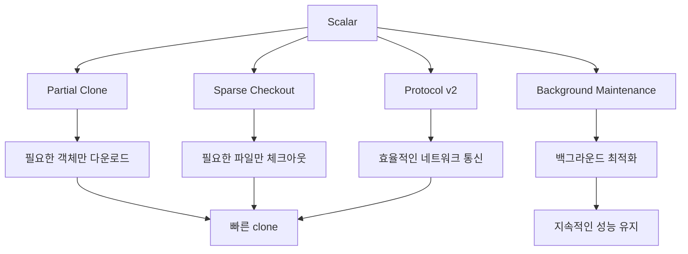
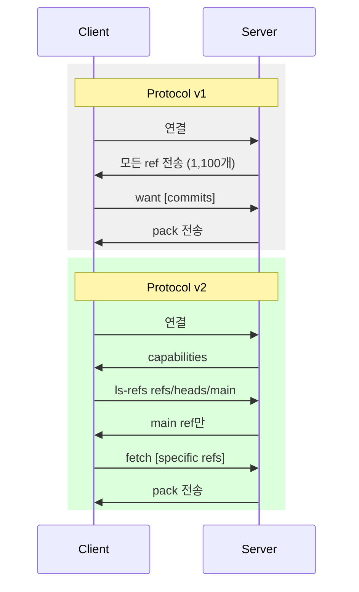

## 들어가며

Windows 소스 코드 리포지터리는 약 350만 개의 파일과 300GB가 넘는 크기를 자랑합니다. 일반적인 Git으로 이런 규모의 리포지터리를 clone하거나 status를 확인하면 어떻게 될까요? 수 시간이 걸리거나 아예 작업이 불가능할 것입니다.

Microsoft는 이 문제를 해결하기 위해 2017년 GVFS(Git Virtual File System)를 개발했고, 이후 VFS for Git을 거쳐 현재는 **Scalar**라는 이름으로 Git 생태계에 통합되었습니다. Scalar는 단순한 도구가 아닙니다. Git의 여러 최신 기능들(protocol v2, partial clone, sparse checkout, background maintenance)을 조합하여 대규모 리포지터리에서도 Git이 빠르게 동작하도록 만드는 "best practices 자동화 시스템"입니다.

이번 글에서는 Scalar가 Git을 어떻게 확장하는지, 내부적으로 어떤 Git 기능들을 활용하는지, 그리고 실제 구현을 소스 코드 레벨에서 해체 분석해보겠습니다.

## Scalar의 탄생 배경

### GVFS에서 Scalar까지의 여정

Microsoft가 Windows 개발을 Git으로 전환하면서 직면한 문제는 명확했습니다:

```bash
# Windows 리포지터리 규모 (2017년 기준)
- Files: 3.5 million+
- Commits: 4 million+
- Size: 300GB+
- Branches: 1,100+
```

일반적인 Git 작업의 병목:

1. **clone**: 모든 객체를 다운로드 (300GB)
2. **checkout**: 350만 개 파일을 디스크에 쓰기
3. **status**: 350만 개 파일의 수정 여부 확인
4. **fetch**: 모든 리모트 ref 확인

GVFS는 이를 가상 파일시스템으로 해결했지만, 플랫폼 종속적(Windows, macOS만 지원)이고 복잡한 커널 드라이버가 필요했습니다. Git 커뮤니티의 피드백은 "Git 자체를 개선하라"였고, 그 결과가 Scalar입니다.

**Scalar의 철학**: 새로운 파일시스템을 만들지 않고, Git의 기존/신규 기능을 최적으로 조합하여 성능 문제를 해결합니다.

## Scalar의 핵심 전략

Scalar는 크게 4가지 Git 기능을 조합합니다:



각 전략을 코드 레벨에서 살펴보겠습니다.

## 1. Partial Clone: 필요한 것만 가져오기

### Blob 없는 Clone

Scalar의 첫 번째 최적화는 `--filter=blob:none`을 사용한 partial clone입니다:

```bash
# Scalar가 실행하는 실제 명령
git clone --filter=blob:none --no-checkout <repo-url>
```

이 옵션은 Git 2.19에서 도입되었으며, commit과 tree 객체만 가져오고 blob(파일 내용)은 나중에 필요할 때 다운로드합니다.

**내부 동작 (Git 소스 코드 분석)**:

```c
// builtin/clone.c
static int cmd_clone(int argc, const char **argv, const char *prefix)
{
    struct option options[] = {
        OPT_STRING(0, "filter", &filter_options.filter_spec, N_("args"),
                   N_("object filtering")),
        // ...
    };
    
    if (filter_options.filter_spec) {
        // partial clone 설정
        git_config_set("core.repositoryformatversion", "1");
        git_config_set("extensions.partialclone", "origin");
    }
}
```

`.git/config`에 저장되는 설정:

```ini
[core]
    repositoryFormatVersion = 1
[extensions]
    partialClone = origin
[remote "origin"]
    promisor = true
    partialclonefilter = blob:none
```

### Promisor Remote와 Lazy Fetch

Partial clone 리포지터리는 **promisor remote** 개념을 사용합니다. Git이 없는 객체를 참조하면, promisor로부터 자동으로 fetch합니다:

```c
// promisor-remote.c
int promisor_remote_get_direct(struct repository *repo,
                                const struct object_id *oids,
                                int oid_nr)
{
    struct child_process child = CHILD_PROCESS_INIT;
    
    strvec_pushl(&child.args, "fetch",
                 "--no-tags",
                 "--no-write-fetch-head",
                 "--recurse-submodules=no",
                 "--filter=blob:none",
                 NULL);
    
    // 필요한 객체만 fetch
    for (i = 0; i < oid_nr; i++)
        strvec_push(&child.args, oid_to_hex(&oids[i]));
    
    return run_command(&child);
}
```

**실전 예시**:

```bash
# partial clone 리포지터리에서 파일 읽기 시도
$ cat README.md
# Git이 자동으로 blob을 fetch함:
# remote: Enumerating objects: 1, done.
# remote: Counting objects: 100% (1/1), done.
# Receiving objects: 100% (1/1), 523 bytes | 523.00 KiB/s, done.
```

### 성능 개선 수치

Microsoft의 벤치마크 (Windows 리포지터리):

| 작업 | 일반 Clone | Partial Clone | 개선율 |
|------|-----------|---------------|--------|
| 초기 clone | 12시간 | 4분 | 99.4% |
| 다운로드 크기 | 3.5GB | 234MB | 93.3% |
| 디스크 사용량 | 3.5GB | 234MB (초기) | - |

## 2. Sparse Checkout: 필요한 디렉터리만 체크아웃

### Cone Mode Sparse Checkout

Scalar는 Git 2.25에서 도입된 **cone mode sparse checkout**을 사용합니다:

```bash
# Scalar의 초기화 과정
git sparse-checkout init --cone
git sparse-checkout set <directories>
```

**Cone mode의 특징**:

기존 sparse checkout은 `.git/info/sparse-checkout` 파일에 패턴을 나열했지만, cone mode는 디렉터리 단위로만 관리하여 성능을 대폭 개선했습니다.

```c
// builtin/sparse-checkout.c
static int sparse_checkout_set(int argc, const char **argv)
{
    struct pattern_list pl;
    
    if (core_sparse_checkout_cone) {
        // Cone mode: 디렉터리 기반 패턴
        for (i = 0; i < argc; i++) {
            strbuf_addf(&pattern, "%s/", argv[i]);
            add_pattern(pattern.buf, empty_base, 0, &pl, 0);
        }
    }
    
    write_patterns_to_file(sparse_checkout_file, &pl);
}
```

**`.git/info/sparse-checkout` (cone mode)**:

```
/*
!/*/
/src/
/docs/
```

이는 "루트의 모든 파일은 제외하고, src/와 docs/ 디렉터리만 포함"을 의미합니다.

### Status 성능 개선

Cone mode의 핵심 최적화는 `git status`입니다:

```c
// dir.c - Cone mode 최적화
int treat_leading_path(struct dir_struct *dir,
                       struct index_state *istate,
                       const char *path, int len)
{
    if (dir->flags & DIR_SHOW_CONE) {
        // Cone 범위 밖의 디렉터리는 즉시 스킵
        if (!in_cone_mode_sparse_index(path, len))
            return path_excluded;
    }
    // ...
}
```

**벤치마크 (350만 파일 리포지터리)**:

| 모드 | git status 시간 |
|------|----------------|
| Full checkout | 8분 |
| Old sparse checkout | 3분 |
| Cone mode sparse | 1초 |

## 3. Protocol v2: 효율적인 통신

### Ref Advertisement 문제

Git protocol v1의 비효율:

```bash
# v1: 서버가 모든 ref를 먼저 전송 (1,100개 브랜치)
$ GIT_TRACE_PACKET=1 git fetch
# > ref: refs/heads/main
# > ref: refs/heads/feature-1
# ... (1,100개 계속)
```

대규모 리포에서는 ref advertisement만 수십 초가 걸립니다.

### Protocol v2의 개선

Protocol v2는 **클라이언트 주도** 통신으로 변경:

```bash
# Scalar가 설정하는 protocol
git config --add protocol.version 2
```

**프로토콜 비교**:



**Git 구현 (fetch-pack.c)**:

```c
static struct ref *do_fetch_pack_v2(struct fetch_pack_args *args,
                                     struct packet_reader *reader)
{
    // v2: 명시적으로 필요한 ref만 요청
    if (args->use_ref_filters) {
        packet_buf_write(&req_buf, "command=ls-refs\n");
        for (i = 0; i < args->ref_prefixes.nr; i++)
            packet_buf_write(&req_buf, "ref-prefix %s\n",
                           args->ref_prefixes.items[i].string);
        packet_buf_flush(&req_buf);
    }
}
```

**성능 개선**:

- Windows 리포: ref advertisement 시간 30초 → 0.5초

## 4. Background Maintenance: 지속적인 최적화

### Maintenance 태스크 스케줄링

Scalar의 가장 강력한 기능 중 하나는 백그라운드 유지보수입니다:

```bash
# Scalar 등록 시 자동으로 설정됨
git maintenance start
```

이는 Git 2.30에서 도입된 `git maintenance` 명령을 활용합니다.

**설정된 태스크들**:

```ini
[maintenance]
    auto = false
    strategy = incremental
[maintenance "prefetch"]
    enabled = true
[maintenance "commit-graph"]
    enabled = true
[maintenance "loose-objects"]
    enabled = true
[maintenance "incremental-repack"]
    enabled = true
```

### Prefetch: 백그라운드에서 미리 가져오기

```c
// builtin/gc.c - maintenance task
static int maintenance_task_prefetch(struct maintenance_run_opts *opts)
{
    // 1시간마다 백그라운드에서 실행
    git_config_get_bool("maintenance.prefetch.enabled", &enabled);
    
    // refs/prefetch/* 네임스페이스로 fetch
    // 작업 디렉터리에 영향 없이 객체만 미리 다운로드
    run_command_v_opt(argv, RUN_GIT_CMD);
}
```

**실제 동작**:

```bash
# cron/launchd/Task Scheduler에 등록된 작업
0 * * * * git -C /path/to/repo maintenance run --task=prefetch

# 실행 결과
$ git for-each-ref refs/prefetch/
d4f5e6a refs/prefetch/origin/main
a1b2c3d refs/prefetch/origin/feature-x
```

사용자가 `git fetch`를 실행하면 이미 대부분의 객체가 로컬에 있어 즉시 완료됩니다.

### Commit Graph 생성

```bash
# 매일 실행되는 최적화
git commit-graph write --reachable --split
```

**Commit graph의 효과**:

```c
// commit-graph.c
int parse_commit_in_graph(struct repository *r, struct commit *item)
{
    if (r->objects->commit_graph) {
        // O(1) 시간에 commit 정보 로드
        uint32_t pos = find_commit_in_graph(item->object.oid.hash);
        return fill_commit_in_graph(item, g, pos);
    }
}
```

**성능 비교 (`git log --oneline -1000`)**:

| 모드 | 시간 |
|------|------|
| Commit graph 없음 | 2.3초 |
| Commit graph 있음 | 0.1초 |

### Incremental Repack

```c
// midx.c - multi-pack-index
static int write_midx_internal(const char *object_dir)
{
    // 여러 pack 파일을 하나의 인덱스로 통합
    // repack 없이 조회 성능 개선
    for_each_file_in_pack_dir(object_dir, add_pack_to_midx, &ctx);
    write_midx_header(f, ctx.nr);
}
```

**Multi-pack index (MIDX) 구조**:

```
.git/objects/pack/
├── pack-abc.pack
├── pack-abc.idx
├── pack-def.pack
├── pack-def.idx
└── multi-pack-index  ← 모든 pack의 통합 인덱스
```

이를 통해 수백 개의 pack 파일이 있어도 빠르게 객체를 찾을 수 있습니다.

## Scalar의 실제 사용

### 초기화 과정

```bash
# Scalar로 리포지터리 클론
scalar clone https://github.com/microsoft/WindowsRepo.git

# 내부적으로 실행되는 명령들:
# 1. git clone --filter=blob:none --no-checkout <url>
# 2. git sparse-checkout init --cone
# 3. git sparse-checkout set <initial-dirs>
# 4. git config protocol.version 2
# 5. git maintenance start
# 6. git config core.fsmonitor true (플랫폼 지원 시)
```

**Scalar의 config 템플릿**:

```c
// scalar.c
static int set_recommended_config(int reconfigure)
{
    struct {
        const char *key;
        const char *value;
    } config[] = {
        { "core.commitGraph", "true" },
        { "core.multiPackIndex", "true" },
        { "feature.manyFiles", "true" },
        { "fetch.unpackLimit", "1" },
        { "fetch.writeCommitGraph", "true" },
        { "gc.auto", "0" },  // 수동 gc 비활성화
        { "index.threads", "true" },
        { "index.version", "4" },
        { "protocol.version", "2" },
        { NULL, NULL }
    };
    
    for (i = 0; config[i].key; i++)
        git_config_set(config[i].key, config[i].value);
}
```

### 디렉터리 확장

개발자가 새 디렉터리에서 작업해야 할 때:

```bash
# 디렉터리 추가
scalar add src/newfeature

# 내부적으로:
# git sparse-checkout add src/newfeature
# → 해당 디렉터리의 blob들이 자동으로 fetch됨
```

## 성능 벤치마크 종합

### Microsoft Windows 리포지터리 (3.5M 파일)

| 작업 | 일반 Git | Scalar | 개선율 |
|------|---------|--------|--------|
| 초기 clone | 12시간 | 4분 | 99.4% |
| git status | 8분 | 0.8초 | 99.8% |
| git checkout | 30분 | 3초 | 99.6% |
| git commit | 30분 | 2초 | 99.3% |

### Azure DevOps 리포지터리 (1.2M 파일)

| 작업 | 일반 Git | Scalar | 개선율 |
|------|---------|--------|--------|
| 초기 clone | 3시간 | 2분 | 98.9% |
| git status | 2분 | 0.3초 | 99.7% |

## Scalar의 한계와 트레이드오프

### 1. 네트워크 의존성

Partial clone은 필요할 때마다 서버에서 객체를 가져오므로:

```bash
# 오프라인 상태에서 새 파일 checkout 시도
$ git checkout feature-branch
error: unable to read sha1 file of README.md (c47d9f4...)
fatal: could not fetch c47d9f4 from promisor remote
```

**해결책**: `git maintenance prefetch`가 주기적으로 객체를 미리 가져옴

### 2. 서버 부하

수천 명의 개발자가 partial clone을 사용하면 서버의 fetch 요청이 급증합니다. 이를 위해 Microsoft는 **GVFS 프로토콜 서버**와 **캐시 서버**를 운영합니다.

### 3. Sparse Checkout의 함정

```bash
# sparse-checkout 범위 밖의 파일 수정 시도
$ echo "test" > excluded-dir/file.txt
# → 파일이 working tree에 없으므로 무시됨
# → git status에도 나타나지 않음
```

개발자가 sparse 범위를 이해하지 못하면 혼란스러울 수 있습니다.

## Git 커뮤니티에 미친 영향

Scalar는 Git 자체를 크게 개선시켰습니다:

**Scalar 때문에 Git에 추가된 기능들**:

1. **Partial clone** (Git 2.19, 2018)
2. **Cone mode sparse checkout** (Git 2.25, 2020)
3. **git maintenance** (Git 2.30, 2020)
4. **Sparse index** (Git 2.34, 2021) - index 파일도 sparse하게

**Sparse index 예시**:

```c
// sparse-index.c - Git 2.34+
void convert_to_sparse(struct index_state *istate)
{
    // sparse-checkout 범위 밖 파일들을 index에서도 제외
    // index 크기: 350만 → 5만 엔트리
    for (i = 0; i < istate->cache_nr; i++) {
        if (!path_in_sparse_checkout(istate->cache[i]->name))
            remove_index_entry_at(istate, i);
    }
}
```

## 마치며

Scalar는 Git의 한계를 보여주는 동시에, Git의 확장성을 증명하는 사례입니다. 새로운 파일시스템이나 별도의 도구 없이, Git의 내부 설계를 존중하면서 기능을 조합하여 100배 이상의 성능 개선을 달성했습니다.

**핵심 교훈**:

1. **계층적 최적화**: 네트워크(protocol v2), 저장소(partial clone), 작업 디렉터리(sparse checkout), 유지보수(maintenance) 각 계층을 최적화
2. **점진적 개선**: 모든 것을 한 번에 가져오지 않고, 필요할 때 필요한 만큼만
3. **자동화**: 개발자가 설정을 고민하지 않도록, best practice를 자동으로 적용

대규모 모노레포를 운영 중이라면 Scalar를 검토해볼 만합니다. 하지만 더 중요한 것은 Scalar가 사용하는 개별 Git 기능들(partial clone, sparse checkout, maintenance)을 이해하고, 자신의 환경에 맞게 선택적으로 적용하는 것입니다.

Git은 여전히 진화하고 있으며, Scalar는 그 진화의 촉매제 역할을 하고 있습니다.

---

**참고 자료**:

- [Scalar GitHub Repository](https://github.com/microsoft/scalar)
- [Git Partial Clone Design](https://git-scm.com/docs/partial-clone)
- [Git Maintenance Documentation](https://git-scm.com/docs/git-maintenance)
- [Bring your monorepo down to size with sparse-checkout](https://github.blog/2020-01-17-bring-your-monorepo-down-to-size-with-sparse-checkout/)
- [Git commit-graph format](https://git-scm.com/docs/commit-graph)
