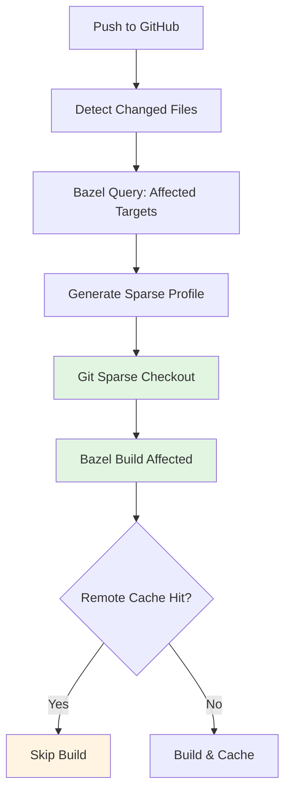

## 들어가며

모노레포가 커질수록 CI 파이프라인의 성능 문제는 피할 수 없는 숙제가 됩니다. 수천 개의 마이크로서비스와 수백만 줄의 코드가 하나의 레포에 있을 때, 매 빌드마다 전체 레포를 클론하는 것은 엄청난 시간과 비용 낭비입니다.

Google, Meta, Microsoft 같은 대규모 조직들은 이 문제를 어떻게 해결할까요? 답은 **sparse-checkout**과 지능적인 프로필 관리에 있습니다. 이번 글에서는 Git의 sparse-checkout을 CI 환경에 통합하는 방법과, GitHub Actions + Bazel 조합을 통한 실전 구현 사례를 살펴보겠습니다.

## Sparse-checkout이 CI에서 중요한 이유

### 문제의 규모

실제 사례를 보겠습니다. 가상의 대규모 모노레포 구조:

```
megarepo/
├── services/           # 500+ microservices
│   ├── api-gateway/
│   ├── auth-service/
│   └── ...
├── libs/              # 200+ shared libraries
├── tools/             # Build & dev tools
├── docs/              # Documentation (1GB+)
└── assets/            # Design assets (5GB+)
```

전체 레포 크기: **30GB**  
평균 클론 시간: **15분** (GitHub hosted runner 기준)  
하루 평균 빌드 횟수: **1,000회**

계산해보면:
- 하루 낭비 시간: **250시간** (15분 × 1,000)
- 월간 네트워크 전송량: **900TB** (30GB × 1,000 × 30)
- GitHub Actions 비용 증가: 클론 시간도 빌드 시간에 포함

### Sparse-checkout의 효과

`auth-service`만 체크아웃하면:

```bash
# 필요한 파일만 체크아웃
services/auth-service/     # 50MB
libs/auth-common/          # 10MB
libs/database/             # 15MB
BUILD.bazel, WORKSPACE     # 1MB
# Total: ~76MB (99.7% 감소)
```

클론 시간: **15분 → 20초**  
월간 비용 절감: **$5,000+** (GitHub Actions 기준)

## Sparse 프로필 설계 철학

### 1. 서비스별 프로필 vs 팀별 프로필

두 가지 접근 방식이 있습니다:

**서비스별 프로필 (Service-based)**
```
# profiles/service-auth.txt
services/auth-service/
libs/auth-common/
libs/database/
libs/logging/
```

장점:
- 정확한 의존성 관리
- 최소한의 체크아웃

단점:
- 프로필 개수 폭증 (서비스 수만큼)
- 의존성 변경 시 프로필 업데이트 필요

**팀별 프로필 (Team-based)**
```
# profiles/team-platform.txt
services/api-gateway/
services/auth-service/
services/user-service/
libs/platform-common/
libs/*/  # 모든 공유 라이브러리
```

장점:
- 관리 용이 (프로필 수 적음)
- 팀 간 협업 고려

단점:
- 불필요한 파일 포함 가능

### 2. 동적 프로필 생성

**최신 접근: 빌드 그래프 기반 자동 생성**

Bazel, Buck2 같은 빌드 시스템은 의존성 그래프를 정확히 알고 있습니다. 이를 활용하면:

```python
# tools/generate-sparse-profile.py
def generate_profile_for_target(target: str) -> list[str]:
    """Bazel query를 사용해 필요한 파일만 추출"""
    
    # 1. 타겟의 모든 의존성 조회
    deps = bazel_query(f"deps({target})")
    
    # 2. 의존성을 파일 경로로 변환
    paths = []
    for dep in deps:
        # //services/auth:main -> services/auth/
        path = dep_to_path(dep)
        paths.append(path)
    
    # 3. 공통 필수 파일 추가
    paths.extend([
        "WORKSPACE",
        "BUILD.bazel",
        ".bazelrc",
        "tools/bazel/",  # Bazel 설정
    ])
    
    return deduplicate(paths)

# 사용
profile = generate_profile_for_target("//services/auth:deploy")
# -> services/auth/, libs/database/, tools/bazel/, ...
```

이 방식의 장점:
- **정확성**: 빌드 시스템이 보장하는 의존성
- **자동화**: 코드 변경 시 자동 업데이트
- **검증 가능**: 빌드 성공 = 프로필 정확성 증명

## GitHub Actions에서 Sparse-checkout 구현

### 기본 통합

GitHub Actions는 `actions/checkout@v4`에서 sparse-checkout을 지원합니다:

```yaml
name: Build Auth Service

on:
  push:
    paths:
      - 'services/auth-service/**'
      - 'libs/auth-common/**'

jobs:
  build:
    runs-on: ubuntu-latest
    steps:
      - name: Checkout code (sparse)
        uses: actions/checkout@v4
        with:
          sparse-checkout: |
            services/auth-service
            libs/auth-common
            libs/database
            tools/bazel
          sparse-checkout-cone-mode: true
```

`cone-mode`의 의미:
- **Cone mode**: 디렉토리 단위로만 체크아웃 (권장)
- **Non-cone mode**: 개별 파일 패턴 가능 (느림)

### 동적 프로필 적용

변경된 파일을 분석해 필요한 서비스만 빌드:

```yaml
name: Smart Monorepo CI

on: [push, pull_request]

jobs:
  detect-changes:
    runs-on: ubuntu-latest
    outputs:
      affected-services: ${{ steps.detect.outputs.services }}
      sparse-paths: ${{ steps.profile.outputs.paths }}
    steps:
      - uses: actions/checkout@v4
        with:
          fetch-depth: 0  # 변경 분석을 위해 히스토리 필요
      
      - name: Detect affected services
        id: detect
        run: |
          # 변경된 파일에서 영향받은 서비스 추출
          CHANGED_FILES=$(git diff --name-only ${{ github.event.before }} ${{ github.sha }})
          
          # Bazel query로 영향받은 타겟 찾기
          AFFECTED=$(echo "$CHANGED_FILES" | xargs -I {} \
            bazel query "rdeps(//..., {})" 2>/dev/null | \
            grep "^//services" | cut -d: -f1 | sort -u)
          
          echo "services=$AFFECTED" >> $GITHUB_OUTPUT
      
      - name: Generate sparse profile
        id: profile
        run: |
          # 영향받은 서비스의 의존성을 sparse 프로필로 변환
          SPARSE_PATHS=$(echo "${{ steps.detect.outputs.services }}" | \
            python3 tools/generate-sparse-profile.py)
          
          echo "paths=$SPARSE_PATHS" >> $GITHUB_OUTPUT

  build:
    needs: detect-changes
    runs-on: ubuntu-latest
    strategy:
      matrix:
        service: ${{ fromJson(needs.detect-changes.outputs.affected-services) }}
    steps:
      - name: Sparse checkout
        uses: actions/checkout@v4
        with:
          sparse-checkout: ${{ needs.detect-changes.outputs.sparse-paths }}
          sparse-checkout-cone-mode: true
      
      - name: Build service
        run: |
          bazel build ${{ matrix.service }}:deploy
```

### 프로필 캐싱 전략

프로필 생성도 비용이 듭니다. 캐싱으로 최적화:

```yaml
- name: Cache sparse profiles
  uses: actions/cache@v3
  with:
    path: .git-sparse-profiles/
    key: sparse-profile-${{ hashFiles('WORKSPACE', '**/*.bazel', '**/*.bzl') }}
    restore-keys: |
      sparse-profile-

- name: Generate or load profile
  run: |
    PROFILE_KEY="${{ matrix.service }}"
    PROFILE_PATH=".git-sparse-profiles/$PROFILE_KEY.txt"
    
    if [ ! -f "$PROFILE_PATH" ]; then
      echo "Generating sparse profile for $PROFILE_KEY..."
      python3 tools/generate-sparse-profile.py \
        --target="//services/${{ matrix.service }}:all" \
        --output="$PROFILE_PATH"
    fi
    
    echo "Using cached profile: $PROFILE_PATH"
```

## Bazel과의 시너지

Bazel은 자체적으로 "필요한 것만 빌드"하는 철학을 가지고 있습니다. Sparse-checkout과 결합하면:



### Remote Build Cache 활용

```python
# .bazelrc
build --remote_cache=https://bazel-cache.company.com
build --experimental_remote_cache_compression

# sparse checkout으로 로컬 디스크 절약
# remote cache로 빌드 시간 절약
```

실제 효과:
1. **첫 빌드**: sparse로 클론 시간 95% 단축
2. **재빌드**: remote cache로 빌드 시간 80% 단축
3. **조합 효과**: 전체 CI 시간 **90%+ 단축**

### Bazel을 통한 프로필 검증

```python
# tools/verify-sparse-profile.sh
#!/bin/bash

# sparse 프로필로 체크아웃한 상태에서 빌드가 성공하는지 검증

SERVICE=$1
PROFILE_PATH=".git-sparse-profiles/${SERVICE}.txt"

# 1. Clean workspace
git checkout --sparse $PROFILE_PATH

# 2. Bazel 빌드 시도
if bazel build //services/${SERVICE}:all; then
    echo "✅ Sparse profile is valid for ${SERVICE}"
    exit 0
else
    echo "❌ Sparse profile missing dependencies!"
    echo "Analyzing missing files..."
    
    # 3. 누락된 의존성 찾기
    bazel build //services/${SERVICE}:all 2>&1 | \
        grep "no such file" | \
        tee missing-deps.log
    
    exit 1
fi
```

이를 CI에 통합:

```yaml
- name: Verify sparse profile
  run: |
    # PR에서 프로필 변경 시 검증
    if git diff --name-only origin/main | grep -q "profiles/"; then
      for profile in profiles/*.txt; do
        ./tools/verify-sparse-profile.sh $(basename $profile .txt)
      done
    fi
```

## 고급 패턴: 멀티 워크트리 CI

하나의 러너에서 여러 서비스를 병렬 빌드할 때:

```yaml
jobs:
  parallel-build:
    runs-on: ubuntu-latest
    steps:
      - name: Setup main worktree
        uses: actions/checkout@v4
        with:
          path: main
          sparse-checkout: |
            WORKSPACE
            BUILD.bazel
            tools/
      
      - name: Create service worktrees
        run: |
          cd main
          
          # 각 서비스별 worktree 생성
          for service in auth user payment; do
            git worktree add ../worktree-$service
            
            cd ../worktree-$service
            git sparse-checkout set \
              services/$service \
              libs/${service}-common \
              tools/bazel
            
            cd ../main
          done
      
      - name: Parallel build
        run: |
          # GNU parallel로 동시 빌드
          parallel --jobs 3 \
            'cd worktree-{} && bazel build //services/{}:all' \
            ::: auth user payment
```

워크트리별 독립적인 sparse 설정:
- **worktree-auth**: auth 관련 파일만
- **worktree-user**: user 관련 파일만
- **worktree-payment**: payment 관련 파일만

`.git` 디렉토리는 공유되므로 디스크 효율적!

## 프로필 관리 및 배포

### 1. 프로필 레포지토리 구조

```
.git-sparse-profiles/
├── README.md
├── services/
│   ├── auth.txt
│   ├── user.txt
│   └── ...
├── teams/
│   ├── platform.txt
│   ├── data.txt
│   └── ...
├── generated/          # 자동 생성된 프로필
│   └── .gitignore      # Git에 커밋하지 않음
└── tools/
    ├── generate.py
    └── validate.py
```

### 2. 프로필 업데이트 워크플로

```yaml
# .github/workflows/update-sparse-profiles.yml
name: Update Sparse Profiles

on:
  schedule:
    - cron: '0 2 * * *'  # 매일 새벽 2시
  workflow_dispatch:

jobs:
  update:
    runs-on: ubuntu-latest
    steps:
      - uses: actions/checkout@v4
      
      - name: Generate profiles for all services
        run: |
          for service_dir in services/*/; do
            service=$(basename $service_dir)
            
            python3 tools/generate-sparse-profile.py \
              --target="//services/${service}:all" \
              --output=".git-sparse-profiles/services/${service}.txt"
          done
      
      - name: Validate generated profiles
        run: |
          python3 tools/validate-all-profiles.py
      
      - name: Create PR if changed
        uses: peter-evans/create-pull-request@v5
        with:
          commit-message: "chore: update sparse checkout profiles"
          title: "Auto-update sparse profiles"
          body: |
            Automated profile update based on latest dependency graph.
            
            Please review changes to ensure no critical paths are missed.
          branch: auto/update-sparse-profiles
```

### 3. 팀별 커스텀 프로필

```yaml
# profiles/teams/platform.yml
name: Platform Team
description: Full access to platform services and infrastructure

include:
  - services/api-gateway/
  - services/auth-service/
  - services/service-mesh/
  - libs/platform-common/
  - libs/observability/
  - tools/
  - infrastructure/

exclude:
  - "**/*.md"      # 문서 제외
  - "**/test/**"   # 로컬 개발 시에만 필요
  - docs/

# 이를 .txt로 변환
$ python3 tools/compile-profile.py profiles/teams/platform.yml \
    > .git-sparse-profiles/teams/platform.txt
```

## 트러블슈팅

### 1. "File not found" 에러

빌드 중 파일이 없다고 나오면:

```bash
# 1. 현재 체크아웃된 파일 확인
git ls-files | head -20

# 2. sparse 프로필 확인
git sparse-checkout list

# 3. 누락된 파일 찾기
bazel build //services/auth:all 2>&1 | grep "no such file"

# 4. 프로필에 추가
echo "libs/missing-lib/" >> .git/info/sparse-checkout
git sparse-checkout reapply
```

### 2. 프로필 변경이 적용 안 됨

```bash
# Sparse 설정 리셋
git sparse-checkout disable
git sparse-checkout init --cone
git sparse-checkout set services/auth libs/common

# 또는 완전 초기화
rm -rf .git/info/sparse-checkout
git read-tree -mu HEAD
```

### 3. CI에서 간헐적 실패

원인: 프로필과 실제 의존성 불일치

해결:
```yaml
# 안전 모드: 빌드 실패 시 full checkout으로 재시도
- name: Build with sparse checkout
  id: sparse-build
  continue-on-error: true
  run: bazel build //services/${{ matrix.service }}:all

- name: Fallback to full checkout
  if: steps.sparse-build.outcome == 'failure'
  run: |
    echo "⚠️ Sparse build failed, trying full checkout..."
    git sparse-checkout disable
    bazel clean
    bazel build //services/${{ matrix.service }}:all
    
    # 실패 원인 분석을 위해 이슈 생성
    gh issue create \
      --title "Sparse profile outdated: ${{ matrix.service }}" \
      --body "Sparse build failed but full build succeeded. Profile needs update."
```

## 성능 벤치마크

실제 모노레포 사례 (가상):

| 시나리오 | Full Checkout | Sparse (서비스별) | Sparse (팀별) |
|---------|---------------|-------------------|---------------|
| 체크아웃 시간 | 15분 | 20초 | 1분 30초 |
| 디스크 사용량 | 30GB | 80MB | 1.2GB |
| 빌드 시간* | 12분 | 3분 | 4분 |
| 총 CI 시간 | 27분 | 3분 20초 | 5분 30초 |

*Bazel remote cache 활용 시

**ROI 계산 (월간)**:
- 하루 빌드 1,000회 기준
- 시간 절감: 250시간 → 55시간 (**78% 감소**)
- GitHub Actions 비용: $8,000 → $2,000 (**$6,000 절감**)
- 개발자 대기 시간 절감: 무형의 가치

## 마치며

Sparse-checkout은 단순히 "클론 속도를 높이는 트릭"이 아닙니다. 대규모 모노레포 환경에서 CI/CD 파이프라인을 지속 가능하게 만드는 **필수 전략**입니다.

핵심 포인트:

1. **동적 프로필 생성**: 빌드 시스템(Bazel)과 통합해 자동으로 정확한 프로필 생성
2. **계층적 접근**: 서비스별/팀별 프로필을 상황에 맞게 선택
3. **검증 자동화**: CI에서 프로필 정확성을 지속적으로 검증
4. **점진적 도입**: 전체 전환보다 핵심 서비스부터 시작

Google이 Piper(내부 모노레포 시스템)에서, Meta가 Mercurial에서 사용하는 원리가 바로 이것입니다. 규모에 따라 도구는 다르지만, **"필요한 것만 체크아웃"**하는 철학은 동일합니다.

다음 편에서는 Git의 `partial clone`과 `shallow clone`을 조합한 더 극단적인 최적화 기법을 다뤄보겠습니다. 수십 테라바이트 규모의 레포에서 어떻게 Git을 사용할 수 있을까요?

---

**참고 자료**:
- [Git sparse-checkout documentation](https://git-scm.com/docs/git-sparse-checkout)
- [GitHub Actions checkout action](https://github.com/actions/checkout)
- [Bazel query guide](https://bazel.build/query/guide)
- [Scaling Git at Microsoft](https://devblogs.microsoft.com/devops/scaling-git-and-some-back-story/)
